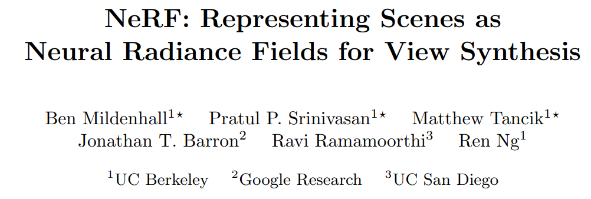
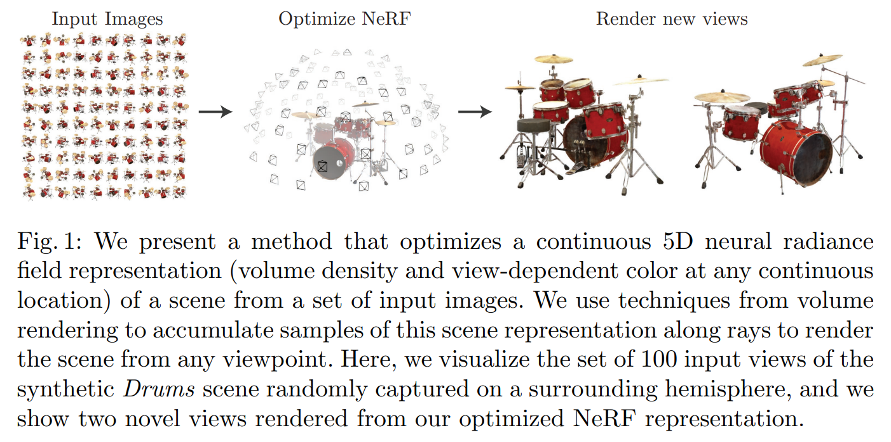
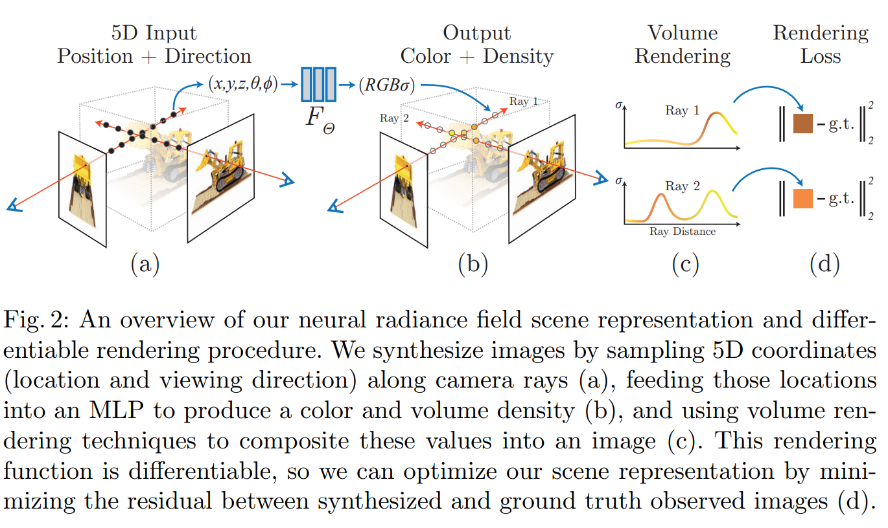
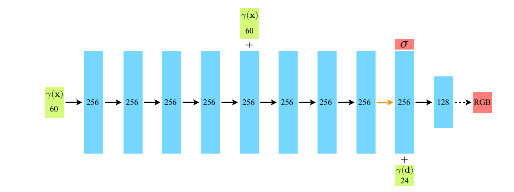

# NeRF-ECCV2020

---

[1] NeRF: Representing Scenes as Neural Radiance Fields for View Synthesis

- Title：NeRF：将场景表示为用于视图合成的神经辐射场

- Category：视图合成

- Project: https://www.matthewtancik.com/nerf

- Code: https://github.com/bmild/nerf

- Paper: https://arxiv.org/pdf/2003.08934.pdf

- Abstract：

  > *We present a method that achieves state-of-the-art results for synthesizing novel views of complex scenes by optimizing an underlying continuous volumetric scene function using a sparse set of input views. Our algorithm represents a scene using a fully-connected (non-convolutional) deep network, whose input is a single continuous 5D coordinate (spatial location (x,y,z) and viewing direction (θ,ϕ)) and whose output is the volume density and view-dependent emitted radiance at that spatial location. We synthesize views by querying 5D coordinates along camera rays and use classic volume rendering techniques to project the output colors and densities into an image. Because volume rendering is naturally differentiable, the only input required to optimize our representation is a set of images with known camera poses. We describe how to effectively optimize neural radiance fields to render photorealistic novel views of scenes with complicated geometry and appearance, and demonstrate results that outperform prior work on neural rendering and view synthesis. View synthesis results are best viewed as videos, so we urge readers to view our supplementary video for convincing comparisons.*

- Figure：

