# NeRFs-CVPR2021

> - 当前论文数：7
> - 收集来源：[CVPR 2021 open access](https://openaccess.thecvf.com/CVPR2021?day=all)

---

[1] Stereo Radiance Fields (SRF): Learning View Synthesis for Sparse Views of Novel Scenes

- 题目：立体辐射场 (SRF)：学习新场景稀疏视图的视图合成

- 分类：稀疏视图

- Project: https://virtualhumans.mpi-inf.mpg.de/srf/

- Code: https://github.com/jchibane/srf

- Paper: https://arxiv.org/pdf/2104.06935.pdf

- 摘要：

  > *Recent neural view synthesis methods have achieved impressive quality and realism, surpassing classical pipelines which rely on multi-view reconstruction. State-of-the-Art methods, such as NeRF, are designed to learn a single scene with a neural network and require dense multi-view inputs. Testing on a new scene requires re-training from scratch, which takes 2-3 days. In this work, we introduce Stereo Radiance Fields (SRF), a neural view synthesis approach that is trained end-to-end, generalizes to new scenes, and requires only sparse views at test time. The core idea is a neural architecture inspired by classical multi-view stereo methods, which estimates surface points by finding similar image regions in stereo images. In SRF, we predict color and density for each 3D point given an encoding of its stereo correspondence in the input images. The encoding is implicitly learned by an ensemble of pair-wise similarities -- emulating classical stereo. Experiments show that SRF learns structure instead of overfitting on a scene. We train on multiple scenes of the DTU dataset and generalize to new ones without re-training, requiring only 10 sparse and spread-out views as input. We show that 10-15 minutes of fine-tuning further improve the results, achieving significantly sharper, more detailed results than scene-specific models. The code, model, and videos are available at [this https URL](https://virtualhumans.mpi-inf.mpg.de/srf/).*

- 图示：

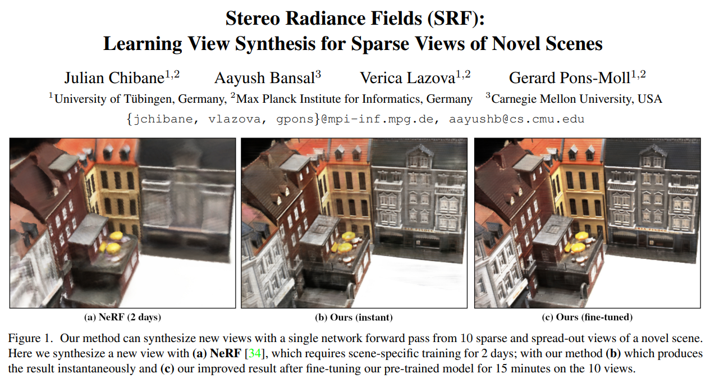

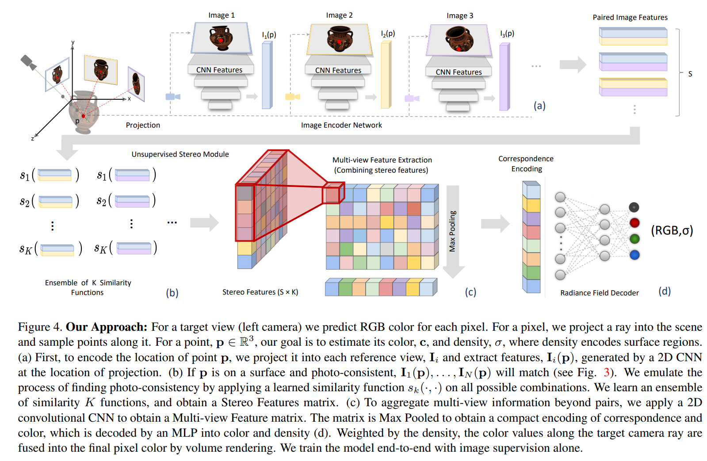

---

[2] pixelNeRF: Neural Radiance Fields from One or Few Images

- 题目：pixelNeRF：一张或几张图片的神经辐射场

- 分类：稀疏视图

- Project: https://alexyu.net/pixelnerf/

- Code: https://github.com/sxyu/pixel-nerf

- Paper: https://arxiv.org/pdf/2012.02190.pdf

- 摘要：

  > *We propose pixelNeRF, a learning framework that predicts a continuous neural scene representation conditioned on one or few input images. The existing approach for constructing neural radiance fields involves optimizing the representation to every scene independently, requiring many calibrated views and significant compute time. We take a step towards resolving these shortcomings by introducing an architecture that conditions a NeRF on image inputs in a fully convolutional manner. This allows the network to be trained across multiple scenes to learn a scene prior, enabling it to perform novel view synthesis in a feed-forward manner from a sparse set of views (as few as one). Leveraging the volume rendering approach of NeRF, our model can be trained directly from images with no explicit 3D supervision. We conduct extensive experiments on ShapeNet benchmarks for single image novel view synthesis tasks with held-out objects as well as entire unseen categories. We further demonstrate the flexibility of pixelNeRF by demonstrating it on multi-object ShapeNet scenes and real scenes from the DTU dataset. In all cases, pixelNeRF outperforms current state-of-the-art baselines for novel view synthesis and single image 3D reconstruction. For the video and code, please visit the project website: [this https URL](https://alexyu.net/pixelnerf)*

- 图示：

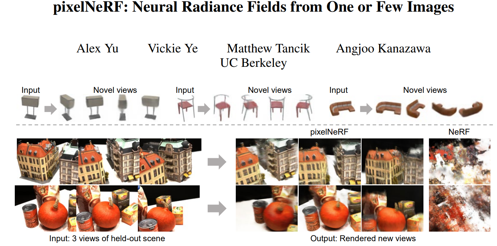

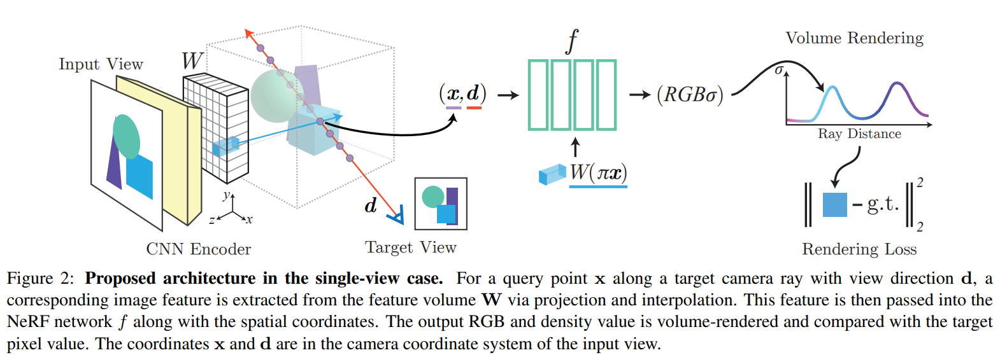

---

[3] Learning Compositional Radiance Fields of Dynamic Human Heads

- 题目：学习动态人体头部的合成辐射场

- 分类：动态场景,人脸建模

- Project: https://ziyanw1.github.io/hybrid_nerf/

- Code: none

- Paper: https://arxiv.org/pdf/2012.09955.pdf

- 摘要：

  > *Photorealistic rendering of dynamic humans is an important ability for telepresence systems, virtual shopping, synthetic data generation, and more. Recently, neural rendering methods, which combine techniques from computer graphics and machine learning, have created high-fidelity models of humans and objects. Some of these methods do not produce results with high-enough fidelity for driveable human models (Neural Volumes) whereas others have extremely long rendering times (NeRF). We propose a novel compositional 3D representation that combines the best of previous methods to produce both higher-resolution and faster results. Our representation bridges the gap between discrete and continuous volumetric representations by combining a coarse 3D-structure-aware grid of animation codes with a continuous learned scene function that maps every position and its corresponding local animation code to its view-dependent emitted radiance and local volume density. Differentiable volume rendering is employed to compute photo-realistic novel views of the human head and upper body as well as to train our novel representation end-to-end using only 2D supervision. In addition, we show that the learned dynamic radiance field can be used to synthesize novel unseen expressions based on a global animation code. Our approach achieves state-of-the-art results for synthesizing novel views of dynamic human heads and the upper body.*

- 图示：

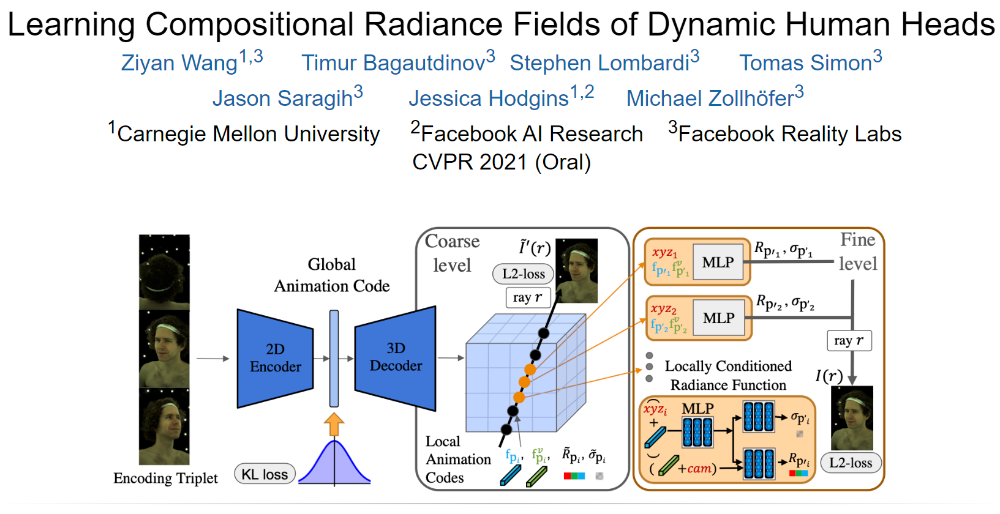

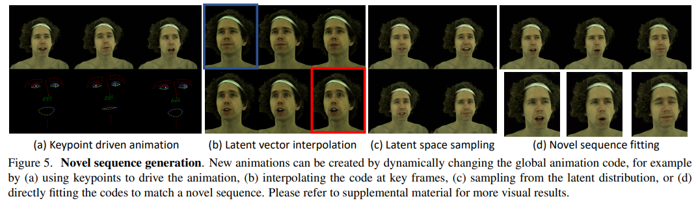

---

[4] Dynamic Neural Radiance Fields for Monocular 4D Facial Avatar Reconstruction

- 题目：用于单眼4D面部化身重建的动态神经辐射场

- 分类：人脸建模

- Project: https://gafniguy.github.io/4D-Facial-Avatars/

- Code: https://github.com/gafniguy/4D-Facial-Avatars

- Paper: https://arxiv.org/pdf/2012.03065.pdf

- 摘要：

  > *We present dynamic neural radiance fields for modeling the appearance and dynamics of a human face. Digitally modeling and reconstructing a talking human is a key building-block for a variety of applications. Especially, for telepresence applications in AR or VR, a faithful reproduction of the appearance including novel viewpoints or head-poses is required. In contrast to state-of-the-art approaches that model the geometry and material properties explicitly, or are purely image-based, we introduce an implicit representation of the head based on scene representation networks. To handle the dynamics of the face, we combine our scene representation network with a low-dimensional morphable model which provides explicit control over pose and expressions. We use volumetric rendering to generate images from this hybrid representation and demonstrate that such a dynamic neural scene representation can be learned from monocular input data only, without the need of a specialized capture setup. In our experiments, we show that this learned volumetric representation allows for photo-realistic image generation that surpasses the quality of state-of-the-art video-based reenactment methods.*

- 图示：

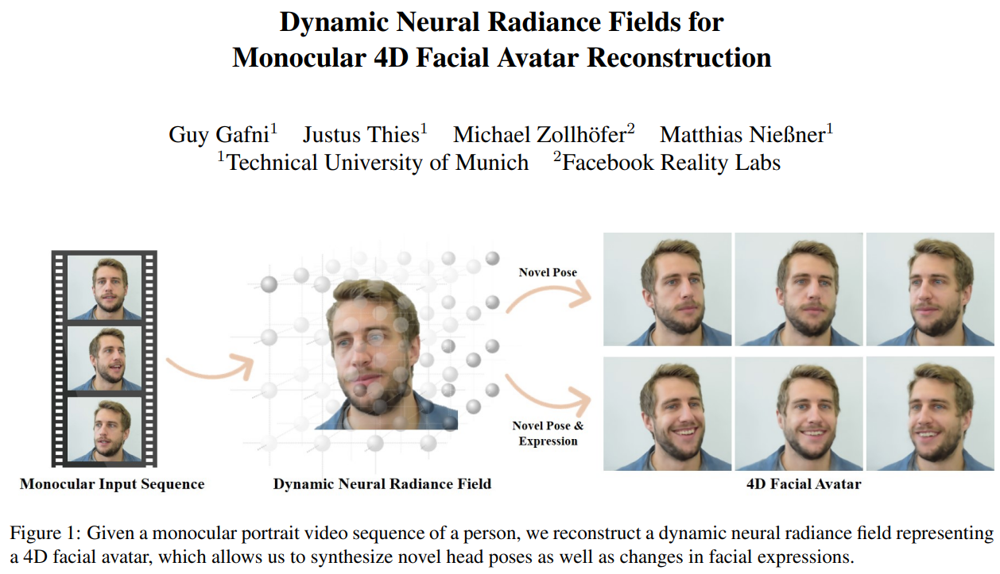

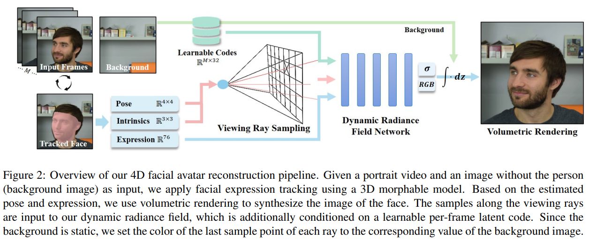

---

[5] NeRF in the Wild: Neural Radiance Fields for Unconstrained Photo Collections

- 题目：野外的NeRF：无约束照片集的神经辐射场

- 分类：室外场景

- Project: https://nerf-w.github.io/

- Code: https://github.com/kwea123/nerf_pl/tree/nerfw

- Paper: https://arxiv.org/pdf/2008.02268.pdf

- 摘要：

  > *We present a learning-based method for synthesizing novel views of complex scenes using only unstructured collections of in-the-wild photographs. We build on Neural Radiance Fields (NeRF), which uses the weights of a multilayer perceptron to model the density and color of a scene as a function of 3D coordinates. While NeRF works well on images of static subjects captured under controlled settings, it is incapable of modeling many ubiquitous, real-world phenomena in uncontrolled images, such as variable illumination or transient occluders. We introduce a series of extensions to NeRF to address these issues, thereby enabling accurate reconstructions from unstructured image collections taken from the internet. We apply our system, dubbed NeRF-W, to internet photo collections of famous landmarks, and demonstrate temporally consistent novel view renderings that are significantly closer to photorealism than the prior state of the art.*

- 图示：

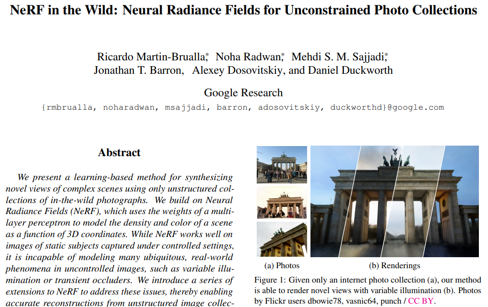

---

[6] DeRF: Decomposed Radiance Fields

- 题目：DeRF：分解辐射场

- 分类：快速渲染,逼真合成

- Project: https://ubc-vision.github.io/derf/

- Code: https://github.com/ubc-vision/derf/

- Paper: https://arxiv.org/pdf/2011.12490.pdf

- 摘要：

  > *With the advent of Neural Radiance Fields (NeRF), neural networks can now render novel views of a 3D scene with quality that fools the human eye. Yet, generating these images is very computationally intensive, limiting their applicability in practical scenarios. In this paper, we propose a technique based on spatial decomposition capable of mitigating this issue. Our key observation is that there are diminishing returns in employing larger (deeper and/or wider) networks. Hence, we propose to spatially decompose a scene and dedicate smaller networks for each decomposed part. When working together, these networks can render the whole scene. This allows us near-constant inference time regardless of the number of decomposed parts. Moreover, we show that a Voronoi spatial decomposition is preferable for this purpose, as it is provably compatible with the Painter's Algorithm for efficient and GPU-friendly rendering. Our experiments show that for real-world scenes, our method provides up to 3x more efficient inference than NeRF (with the same rendering quality), or an improvement of up to 1.0~dB in PSNR (for the same inference cost).*

- 图示：

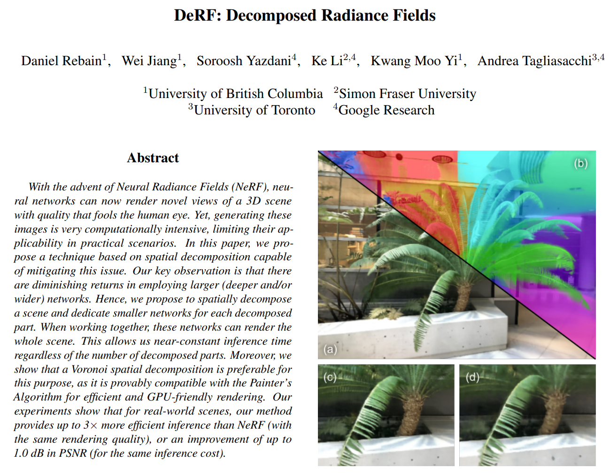

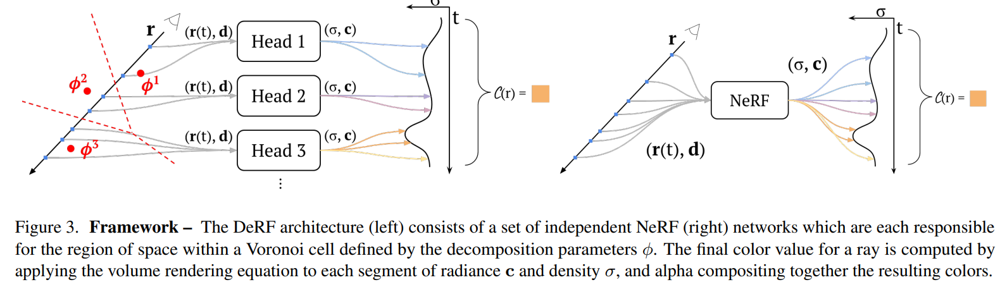

---

[7] D-NeRF: Neural Radiance Fields for Dynamic Scenes

- 题目：D-NeRF：动态场景的神经辐射场

- 分类：动态场景

- Project: https://www.albertpumarola.com/research/D-NeRF/index.html

- Code: https://github.com/albertpumarola/D-NeRF

- Paper: https://arxiv.org/pdf/2011.13961.pdf

- 摘要：

  > *Neural rendering techniques combining machine learning with geometric reasoning have arisen as one of the most promising approaches for synthesizing novel views of a scene from a sparse set of images. Among these, stands out the Neural radiance fields (NeRF), which trains a deep network to map 5D input coordinates (representing spatial location and viewing direction) into a volume density and view-dependent emitted radiance. However, despite achieving an unprecedented level of photorealism on the generated images, NeRF is only applicable to static scenes, where the same spatial location can be queried from different images. In this paper we introduce D-NeRF, a method that extends neural radiance fields to a dynamic domain, allowing to reconstruct and render novel images of objects under rigid and non-rigid motions from a \emph{single} camera moving around the scene. For this purpose we consider time as an additional input to the system, and split the learning process in two main stages: one that encodes the scene into a canonical space and another that maps this canonical representation into the deformed scene at a particular time. Both mappings are simultaneously learned using fully-connected networks. Once the networks are trained, D-NeRF can render novel images, controlling both the camera view and the time variable, and thus, the object movement. We demonstrate the effectiveness of our approach on scenes with objects under rigid, articulated and non-rigid motions. Code, model weights and the dynamic scenes dataset will be released.*

- 图示：

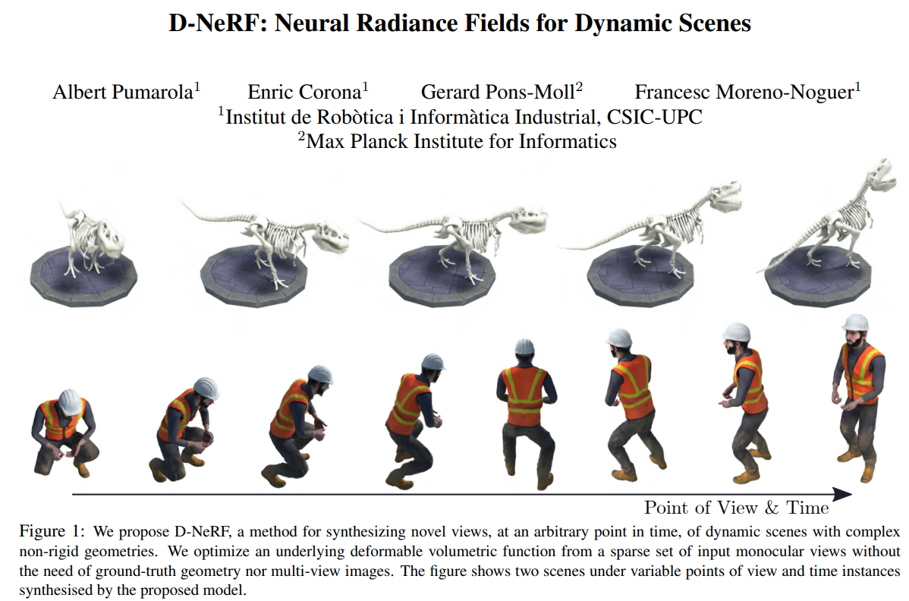

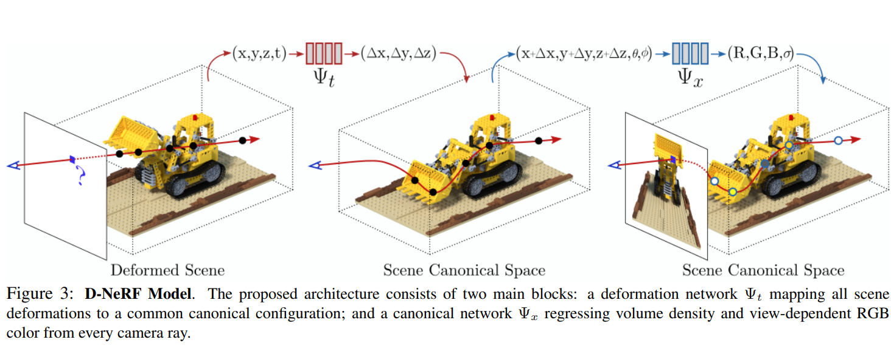

