# NeRFs-CVPR2022

> - 当前论文数：37
> - 收集来源：[CVPR 2022 open access](https://openaccess.thecvf.com/CVPR2022?day=all)  注：搜索词(“nerf” OR “radiance”)

---

[1] GeoNeRF: Generalizing NeRF with Geometry Priors

- Title：GeoNeRF：用几何先验泛化NeRF

- Category：可泛化

- Project: https://www.idiap.ch/paper/geonerf/

- Code: https://github.com/idiap/GeoNeRF

- Paper: https://arxiv.org/pdf/2111.13539.pdfa

- Abstract：

  > *We present GeoNeRF, a generalizable photorealistic novel view synthesis method based on neural radiance fields. Our approach consists of two main stages: a geometry reasoner and a renderer. To render a novel view, the geometry reasoner first constructs cascaded cost volumes for each nearby source view. Then, using a Transformer-based attention mechanism and the cascaded cost volumes, the renderer infers geometry and appearance, and renders detailed images via classical volume rendering techniques. This architecture, in particular, allows sophisticated occlusion reasoning, gathering information from consistent source views. Moreover, our method can easily be fine-tuned on a single scene, and renders competitive results with per-scene optimized neural rendering methods with a fraction of computational cost. Experiments show that GeoNeRF outperforms state-of-the-art generalizable neural rendering models on various synthetic and real datasets. Lastly, with a slight modification to the geometry reasoner, we also propose an alternative model that adapts to RGBD images. This model directly exploits the depth information often available thanks to depth sensors. The implementation code is available at [this https URL](https://www.idiap.ch/paper/geonerf).*

- Figure：

---

[2] NeRF-Editing: Geometry Editing of Neural Radiance Fields

- Title：NeRF编辑：神经辐射场的几何编辑

- Category：几何编辑

- Project: none

- Code: https://github.com/IGLICT/NeRF-Editing

- Paper: https://arxiv.org/pdf/2205.04978.pdf

- Abstract：

  > *Implicit neural rendering, especially Neural Radiance Field (NeRF), has shown great potential in novel view synthesis of a scene. However, current NeRF-based methods cannot enable users to perform user-controlled shape deformation in the scene. While existing works have proposed some approaches to modify the radiance field according to the user's constraints, the modification is limited to color editing or object translation and rotation. In this paper, we propose a method that allows users to perform controllable shape deformation on the implicit representation of the scene, and synthesizes the novel view images of the edited scene without re-training the network. Specifically, we establish a correspondence between the extracted explicit mesh representation and the implicit neural representation of the target scene. Users can first utilize well-developed mesh-based deformation methods to deform the mesh representation of the scene. Our method then utilizes user edits from the mesh representation to bend the camera rays by introducing a tetrahedra mesh as a proxy, obtaining the rendering results of the edited scene. Extensive experiments demonstrate that our framework can achieve ideal editing results not only on synthetic data, but also on real scenes captured by users.*

- Figure：

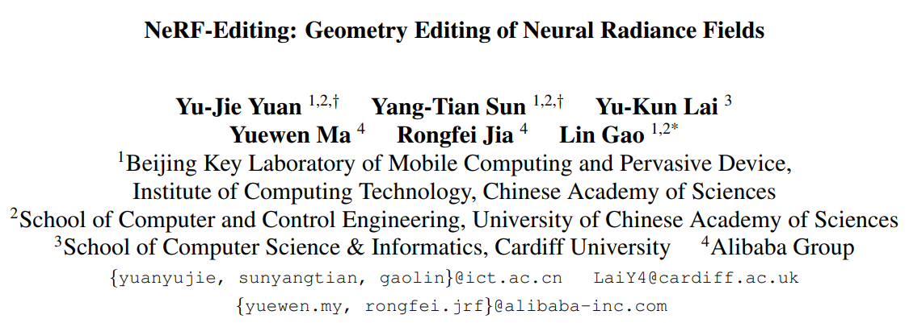

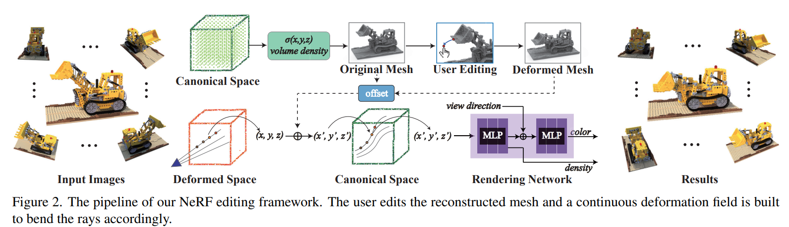

---

[3] Mip-NeRF 360: Unbounded Anti-Aliased Neural Radiance Fields

- Title：Mip-NeRF 360：无限抗锯齿神经辐射场

- Category：室外场景,抗锯齿

- Project: https://jonbarron.info/mipnerf360/

- Code: https://github.com/google-research/multinerf

- Paper: https://arxiv.org/pdf/2111.12077.pdf

- Abstract：

  > *Though neural radiance fields (NeRF) have demonstrated impressive view synthesis results on objects and small bounded regions of space, they struggle on "unbounded" scenes, where the camera may point in any direction and content may exist at any distance. In this setting, existing NeRF-like models often produce blurry or low-resolution renderings (due to the unbalanced detail and scale of nearby and distant objects), are slow to train, and may exhibit artifacts due to the inherent ambiguity of the task of reconstructing a large scene from a small set of images. We present an extension of mip-NeRF (a NeRF variant that addresses sampling and aliasing) that uses a non-linear scene parameterization, online distillation, and a novel distortion-based regularizer to overcome the challenges presented by unbounded scenes. Our model, which we dub "mip-NeRF 360" as we target scenes in which the camera rotates 360 degrees around a point, reduces mean-squared error by 57% compared to mip-NeRF, and is able to produce realistic synthesized views and detailed depth maps for highly intricate, unbounded real-world scenes.*

- Figure：

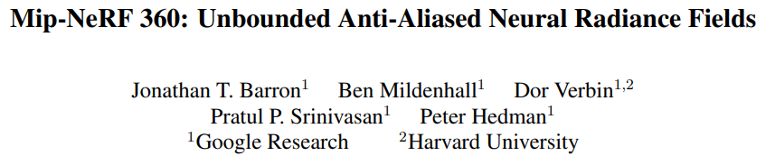

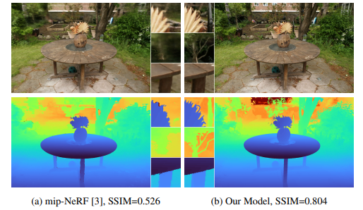

---

[4] Block-NeRF: Scalable Large Scene Neural View Synthesis

- Title：Block-NeRF：可扩展的大场景神经视图合成

- Category：大规模场景,室外街景

- Project: https://waymo.com/intl/zh-cn/research/block-nerf/

- Code: none

- Paper: https://arxiv.org/pdf/2202.05263.pdf

- Abstract：

  > *We present Block-NeRF, a variant of Neural Radiance Fields that can represent large-scale environments. Specifically, we demonstrate that when scaling NeRF to render city-scale scenes spanning multiple blocks, it is vital to decompose the scene into individually trained NeRFs. This decomposition decouples rendering time from scene size, enables rendering to scale to arbitrarily large environments, and allows per-block updates of the environment. We adopt several architectural changes to make NeRF robust to data captured over months under different environmental conditions. We add appearance embeddings, learned pose refinement, and controllable exposure to each individual NeRF, and introduce a procedure for aligning appearance between adjacent NeRFs so that they can be seamlessly combined. We build a grid of Block-NeRFs from 2.8 million images to create the largest neural scene representation to date, capable of rendering an entire neighborhood of San Francisco.*

- Figure：

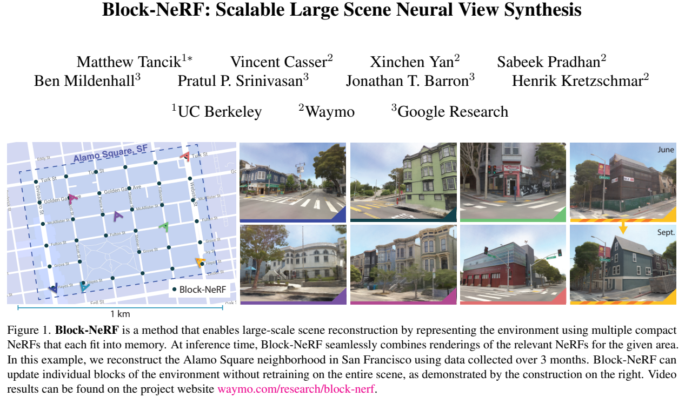

---

[5] CLIP-NeRF: Text-and-Image Driven Manipulation of Neural Radiance Fields

- Title：CLIP-NeRF：神经辐射场的文本和图像驱动操作

- Category：NeRF-CLIP

- Project: https://cassiepython.github.io/clipnerf/

- Code: https://github.com/cassiePython/CLIPNeRF

- Paper: https://arxiv.org/pdf/2112.05139.pdf

- Abstract：

  > *We present CLIP-NeRF, a multi-modal 3D object manipulation method for neural radiance fields (NeRF). By leveraging the joint language-image embedding space of the recent Contrastive Language-Image Pre-Training (CLIP) model, we propose a unified framework that allows manipulating NeRF in a user-friendly way, using either a short text prompt or an exemplar image. Specifically, to combine the novel view synthesis capability of NeRF and the controllable manipulation ability of latent representations from generative models, we introduce a disentangled conditional NeRF architecture that allows individual control over both shape and appearance. This is achieved by performing the shape conditioning via applying a learned deformation field to the positional encoding and deferring color conditioning to the volumetric rendering stage. To bridge this disentangled latent representation to the CLIP embedding, we design two code mappers that take a CLIP embedding as input and update the latent codes to reflect the targeted editing. The mappers are trained with a CLIP-based matching loss to ensure the manipulation accuracy. Furthermore, we propose an inverse optimization method that accurately projects an input image to the latent codes for manipulation to enable editing on real images. We evaluate our approach by extensive experiments on a variety of text prompts and exemplar images and also provide an intuitive interface for interactive editing. Our implementation is available at [this https URL](https://cassiepython.github.io/clipnerf/)*

- Figure：

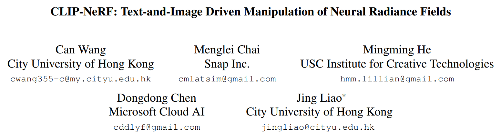

---

[6] Ref-NeRF: Structured View-Dependent Appearance for Neural Radiance Fields

- Title：Ref-NeRF：神经辐射场的结构化视图依赖外观

- Category：真实渲染

- Project: https://dorverbin.github.io/refnerf/

- Code: https://github.com/google-research/multinerf

- Paper: https://arxiv.org/pdf/2112.03907.pdf

- Abstract：

  > *Neural Radiance Fields (NeRF) is a popular view synthesis technique that represents a scene as a continuous volumetric function, parameterized by multilayer perceptrons that provide the volume density and view-dependent emitted radiance at each location. While NeRF-based techniques excel at representing fine geometric structures with smoothly varying view-dependent appearance, they often fail to accurately capture and reproduce the appearance of glossy surfaces. We address this limitation by introducing Ref-NeRF, which replaces NeRF's parameterization of view-dependent outgoing radiance with a representation of reflected radiance and structures this function using a collection of spatially-varying scene properties. We show that together with a regularizer on normal vectors, our model significantly improves the realism and accuracy of specular reflections. Furthermore, we show that our model's internal representation of outgoing radiance is interpretable and useful for scene editing.*

- Figure：

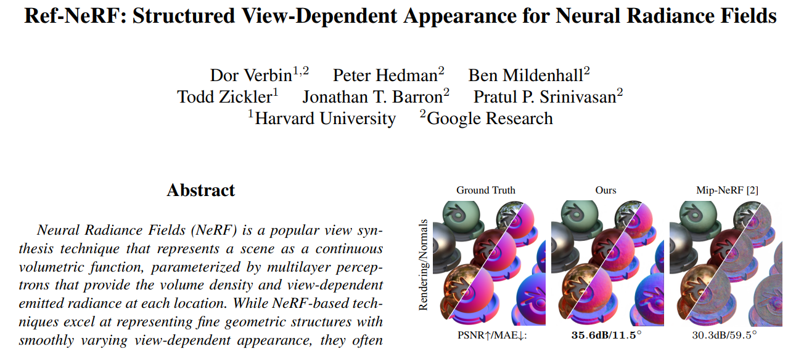

---

[7] Deblur-NeRF: Neural Radiance Fields from Blurry Images

- Title：Deblur-NeRF：来自模糊图像的神经辐射场

- Category：去模糊

- Project: https://limacv.github.io/deblurnerf/

- Code: https://github.com/limacv/Deblur-NeRF

- Paper: https://arxiv.org/pdf/2111.14292.pdf

- Abstract：

  > *Neural Radiance Field (NeRF) has gained considerable attention recently for 3D scene reconstruction and novel view synthesis due to its remarkable synthesis quality. However, image blurriness caused by defocus or motion, which often occurs when capturing scenes in the wild, significantly degrades its reconstruction quality. To address this problem, We propose Deblur-NeRF, the first method that can recover a sharp NeRF from blurry input. We adopt an analysis-by-synthesis approach that reconstructs blurry views by simulating the blurring process, thus making NeRF robust to blurry inputs. The core of this simulation is a novel Deformable Sparse Kernel (DSK) module that models spatially-varying blur kernels by deforming a canonical sparse kernel at each spatial location. The ray origin of each kernel point is jointly optimized, inspired by the physical blurring process. This module is parameterized as an MLP that has the ability to be generalized to various blur types. Jointly optimizing the NeRF and the DSK module allows us to restore a sharp NeRF. We demonstrate that our method can be used on both camera motion blur and defocus blur: the two most common types of blur in real scenes. Evaluation results on both synthetic and real-world data show that our method outperforms several baselines. The synthetic and real datasets along with the source code is publicly available at [this https URL](https://limacv.github.io/deblurnerf/)*

- Figure：

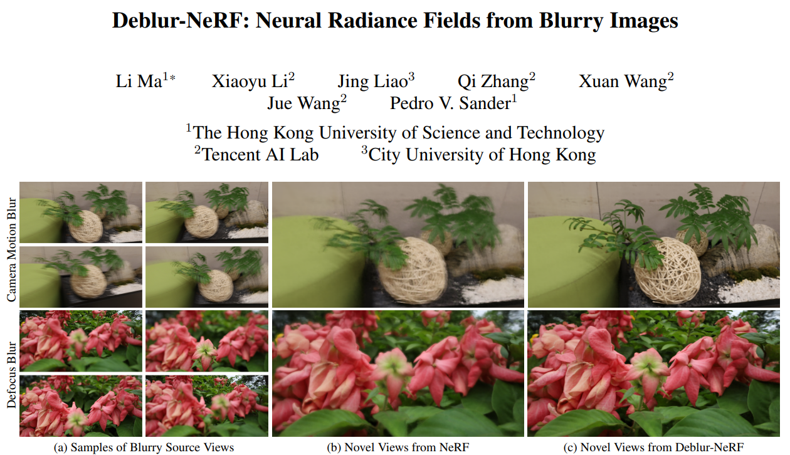

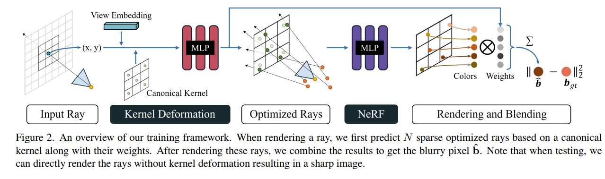

---

[8] HeadNeRF: A Real-time NeRF-based Parametric Head Model

- Title：HeadNeRF：基于实时NeRF的参数化头部模型

- Category：人脸建模

- Project: https://hy1995.top/HeadNeRF-Project/

- Code: https://github.com/CrisHY1995/headnerf

- Paper: https://arxiv.org/pdf/2112.05637.pdf

- Abstract：

  > *In this paper, we propose HeadNeRF, a novel NeRF-based parametric head model that integrates the neural radiance field to the parametric representation of the human head. It can render high fidelity head images in real-time on modern GPUs, and supports directly controlling the generated images' rendering pose and various semantic attributes. Different from existing related parametric models, we use the neural radiance fields as a novel 3D proxy instead of the traditional 3D textured mesh, which makes that HeadNeRF is able to generate high fidelity images. However, the computationally expensive rendering process of the original NeRF hinders the construction of the parametric NeRF model. To address this issue, we adopt the strategy of integrating 2D neural rendering to the rendering process of NeRF and design novel loss terms. As a result, the rendering speed of HeadNeRF can be significantly accelerated, and the rendering time of one frame is reduced from 5s to 25ms. The well designed loss terms also improve the rendering accuracy, and the fine-level details of the human head, such as the gaps between teeth, wrinkles, and beards, can be represented and synthesized by HeadNeRF. Extensive experimental results and several applications demonstrate its effectiveness. The trained parametric model is available at [this https URL](https://github.com/CrisHY1995/headnerf).*

- Figure：

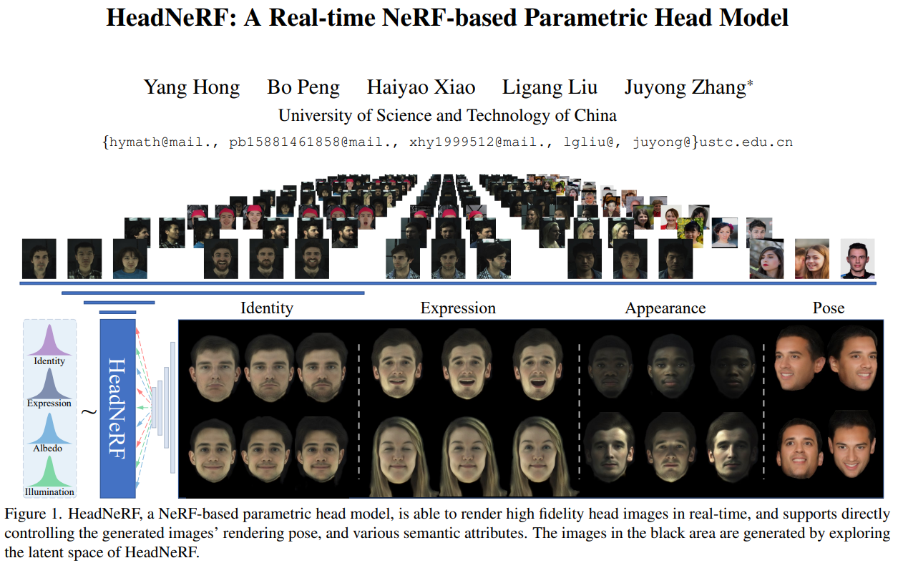

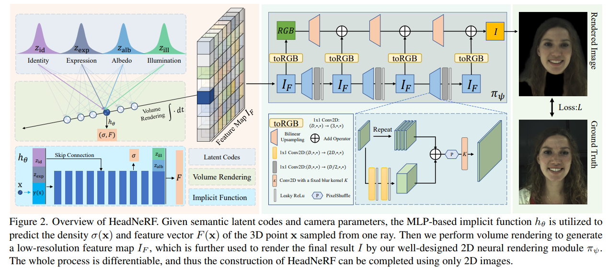

---

[9] Depth-supervised NeRF: Fewer Views and Faster Training for Free

- Title：深度监督的 NeRF：更少的视图和更快的训练

- Category：深度监督,稀疏视图

- Project: http://www.cs.cmu.edu/~dsnerf/

- Code: https://github.com/dunbar12138/DSNeRF

- Paper: https://arxiv.org/pdf/2107.02791.pdf

- Abstract：

  > *A commonly observed failure mode of Neural Radiance Field (NeRF) is fitting incorrect geometries when given an insufficient number of input views. One potential reason is that standard volumetric rendering does not enforce the constraint that most of a scene's geometry consist of empty space and opaque surfaces. We formalize the above assumption through DS-NeRF (Depth-supervised Neural Radiance Fields), a loss for learning radiance fields that takes advantage of readily-available depth supervision. We leverage the fact that current NeRF pipelines require images with known camera poses that are typically estimated by running structure-from-motion (SFM). Crucially, SFM also produces sparse 3D points that can be used as "free" depth supervision during training: we add a loss to encourage the distribution of a ray's terminating depth matches a given 3D keypoint, incorporating depth uncertainty. DS-NeRF can render better images given fewer training views while training 2-3x faster. Further, we show that our loss is compatible with other recently proposed NeRF methods, demonstrating that depth is a cheap and easily digestible supervisory signal. And finally, we find that DS-NeRF can support other types of depth supervision such as scanned depth sensors and RGB-D reconstruction outputs.*

- Figure：

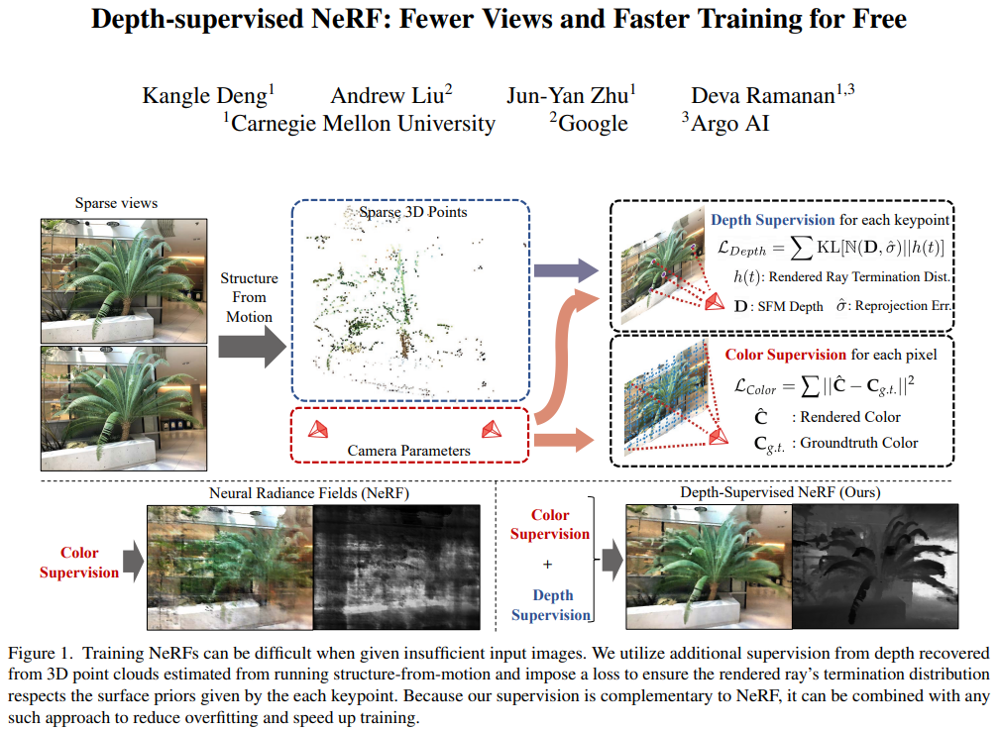

---

[10] StylizedNeRF: Consistent 3D Scene Stylization as Stylized NeRF via 2D-3D Mutual Learning

- Title：StylizedNeRF：通过2D-3D相互学习将3D场景风格化为风格化NeRF

- Category：3D场景风格化

- Project: http://geometrylearning.com/StylizedNeRF/

- Code: https://github.com/IGLICT/StylizedNeRF

- Paper: https://arxiv.org/pdf/2205.12183.pdf

- Abstract：

  > *3D scene stylization aims at generating stylized images of the scene from arbitrary novel views following a given set of style examples, while ensuring consistency when rendered from different views. Directly applying methods for image or video stylization to 3D scenes cannot achieve such consistency. Thanks to recently proposed neural radiance fields (NeRF), we are able to represent a 3D scene in a consistent way. Consistent 3D scene stylization can be effectively achieved by stylizing the corresponding NeRF. However, there is a significant domain gap between style examples which are 2D images and NeRF which is an implicit volumetric representation. To address this problem, we propose a novel mutual learning framework for 3D scene stylization that combines a 2D image stylization network and NeRF to fuse the stylization ability of 2D stylization network with the 3D consistency of NeRF. We first pre-train a standard NeRF of the 3D scene to be stylized and replace its color prediction module with a style network to obtain a stylized NeRF. It is followed by distilling the prior knowledge of spatial consistency from NeRF to the 2D stylization network through an introduced consistency loss. We also introduce a mimic loss to supervise the mutual learning of the NeRF style module and fine-tune the 2D stylization decoder. In order to further make our model handle ambiguities of 2D stylization results, we introduce learnable latent codes that obey the probability distributions conditioned on the style. They are attached to training samples as conditional inputs to better learn the style module in our novel stylized NeRF. Experimental results demonstrate that our method is superior to existing approaches in both visual quality and long-range consistency.*

- Figure：

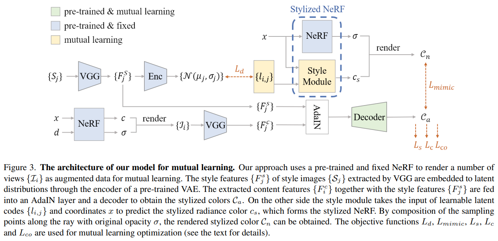

---

[11] Mega-NeRF: Scalable Construction of Large-Scale NeRFs for Virtual Fly-Throughs

- Title：Mega-NeRF：用于虚拟飞越的大规模NeRF的可扩展构造

- Category：大规模场景

- Project: https://meganerf.cmusatyalab.org/

- Code: https://github.com/cmusatyalab/mega-nerf

- Paper: https://arxiv.org/pdf/2112.10703.pdf

- Abstract：

  > *We use neural radiance fields (NeRFs) to build interactive 3D environments from large-scale visual captures spanning buildings or even multiple city blocks collected primarily from drones. In contrast to single object scenes (on which NeRFs are traditionally evaluated), our scale poses multiple challenges including (1) the need to model thousands of images with varying lighting conditions, each of which capture only a small subset of the scene, (2) prohibitively large model capacities that make it infeasible to train on a single GPU, and (3) significant challenges for fast rendering that would enable interactive fly-throughs.
  > To address these challenges, we begin by analyzing visibility statistics for large-scale scenes, motivating a sparse network structure where parameters are specialized to different regions of the scene. We introduce a simple geometric clustering algorithm for data parallelism that partitions training images (or rather pixels) into different NeRF submodules that can be trained in parallel.
  > We evaluate our approach on existing datasets (Quad 6k and UrbanScene3D) as well as against our own drone footage, improving training speed by 3x and PSNR by 12%. We also evaluate recent NeRF fast renderers on top of Mega-NeRF and introduce a novel method that exploits temporal coherence. Our technique achieves a 40x speedup over conventional NeRF rendering while remaining within 0.8 db in PSNR quality, exceeding the fidelity of existing fast renderers.*

- Figure：

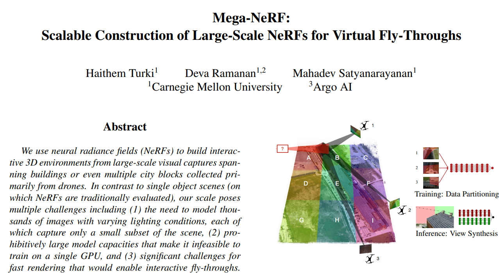

---

[12] HDR-NeRF: High Dynamic Range Neural Radiance Fields

- Title：HDR-NeRF：高动态范围神经辐射场

- Category：高动态光照渲染(HDR)

- Project: https://shsf0817.github.io/hdr-nerf/

- Code: https://github.com/shsf0817/hdr-nerf/

- Paper: https://arxiv.org/pdf/2111.14451.pdf

- Abstract：

  > *We present High Dynamic Range Neural Radiance Fields (HDR-NeRF) to recover an HDR radiance field from a set of low dynamic range (LDR) views with different exposures. Using the HDR-NeRF, we are able to generate both novel HDR views and novel LDR views under different exposures. The key to our method is to model the physical imaging process, which dictates that the radiance of a scene point transforms to a pixel value in the LDR image with two implicit functions: a radiance field and a tone mapper. The radiance field encodes the scene radiance (values vary from 0 to +infty), which outputs the density and radiance of a ray by giving corresponding ray origin and ray direction. The tone mapper models the mapping process that a ray hitting on the camera sensor becomes a pixel value. The color of the ray is predicted by feeding the radiance and the corresponding exposure time into the tone mapper. We use the classic volume rendering technique to project the output radiance, colors, and densities into HDR and LDR images, while only the input LDR images are used as the supervision. We collect a new forward-facing HDR dataset to evaluate the proposed method. Experimental results on synthetic and real-world scenes validate that our method can not only accurately control the exposures of synthesized views but also render views with a high dynamic range.*

- Figure：

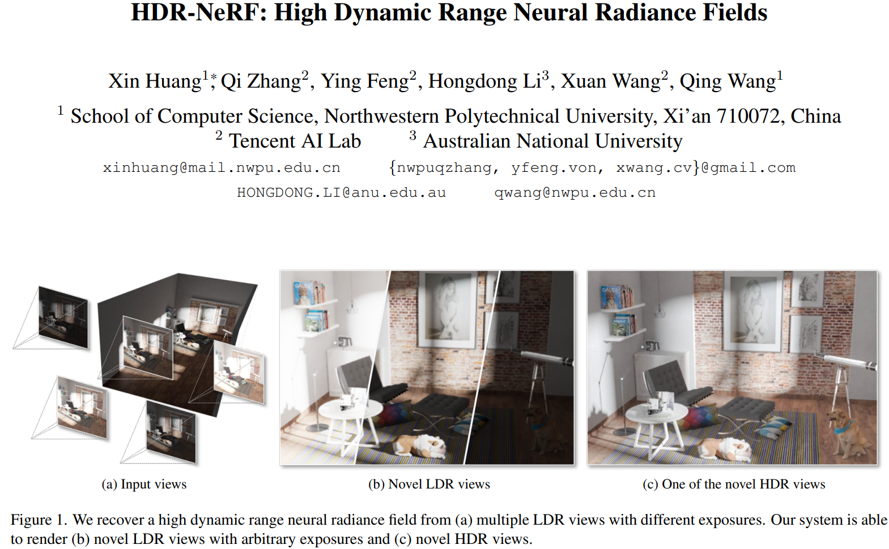

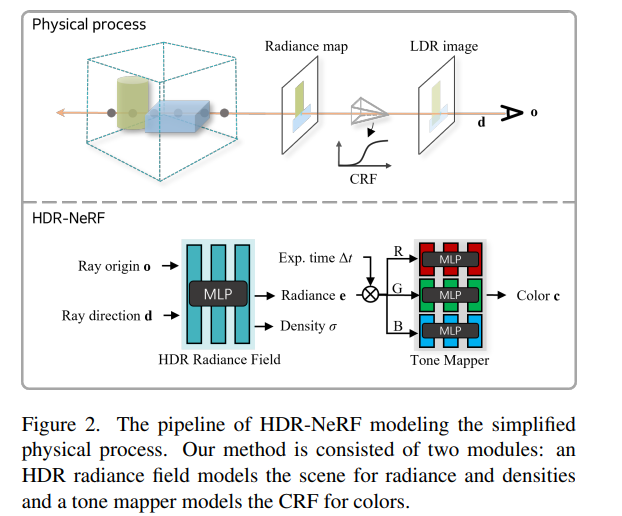

---

[13] AR-NeRF: Unsupervised Learning of Depth and Defocus Effects From Natural Images With Aperture Rendering Neural Radiance Fields

- Title：AR-NeRF：从具有孔径渲染神经辐射场的自然图像中无监督地学习深度和散焦效应

- Category：NeRF-GAN

- Project: https://www.kecl.ntt.co.jp/people/kaneko.takuhiro/projects/ar-nerf/index.html

- Code: none

- Paper: [pdf](https://openaccess.thecvf.com/content/CVPR2022/papers/Kaneko_AR-NeRF_Unsupervised_Learning_of_Depth_and_Defocus_Effects_From_Natural_CVPR_2022_paper.pdf)

- Abstract：

  > *Fully unsupervised 3D representation learning has gained attention owing to its advantages in data collection. A successful approach involves a viewpoint-aware approach that learns an image distribution based on generative models (e.g., generative adversarial networks (GANs)) while generating various view images based on 3D-aware models (e.g., neural radiance fields (NeRFs)). However, they require images with various views for training, and consequently, their application to datasets with few or limited viewpoints remains a challenge. As a complementary approach, an aperture rendering GAN (AR-GAN) that employs a defocus cue was proposed. However, an AR-GAN is a CNN-based model and represents a defocus independently from a viewpoint change despite its high correlation, which is one of the reasons for its performance. As an alternative to an AR-GAN, we propose an aperture rendering NeRF (AR-NeRF), which can utilize viewpoint and defocus cues in a unified manner by representing both factors in a common ray-tracing framework. Moreover, to learn defocusaware and defocus-independent representations in a disentangled manner, we propose aperture randomized training, for which we learn to generate images while randomizing the aperture size and latent codes independently. During our experiments, we applied AR-NeRF to various natural image datasets, including flower, bird, and face images, the results of which demonstrate the utility of AR-NeRF for unsupervised learning of the depth and defocus effects.*

- Figure：

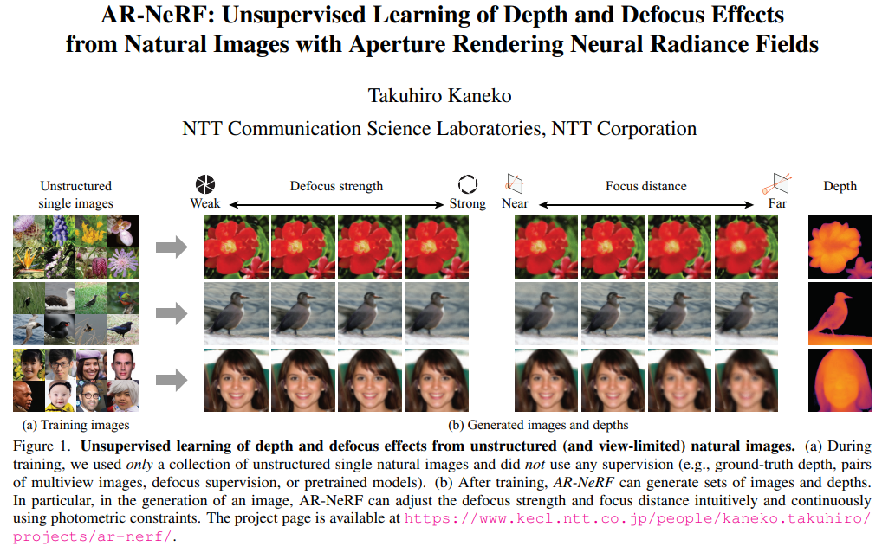

---

[14] Point-NeRF: Point-based Neural Radiance Fields

- Title：Point-NeRF：基于点云的神经辐射场

- Category：点云渲染,快速渲染

- Project: https://xharlie.github.io/projects/project_sites/pointnerf/

- Code: https://github.com/Xharlie/pointnerf

- Paper: https://arxiv.org/pdf/2201.08845.pdf

- Abstract：

  > *Volumetric neural rendering methods like NeRF generate high-quality view synthesis results but are optimized per-scene leading to prohibitive reconstruction time. On the other hand, deep multi-view stereo methods can quickly reconstruct scene geometry via direct network inference. Point-NeRF combines the advantages of these two approaches by using neural 3D point clouds, with associated neural features, to model a radiance field. Point-NeRF can be rendered efficiently by aggregating neural point features near scene surfaces, in a ray marching-based rendering pipeline. Moreover, Point-NeRF can be initialized via direct inference of a pre-trained deep network to produce a neural point cloud; this point cloud can be finetuned to surpass the visual quality of NeRF with 30X faster training time. Point-NeRF can be combined with other 3D reconstruction methods and handles the errors and outliers in such methods via a novel pruning and growing mechanism. The experiments on the DTU, the NeRF Synthetics , the ScanNet and the Tanks and Temples datasets demonstrate Point-NeRF can surpass the existing methods and achieve the state-of-the-art results.*

- Figure：

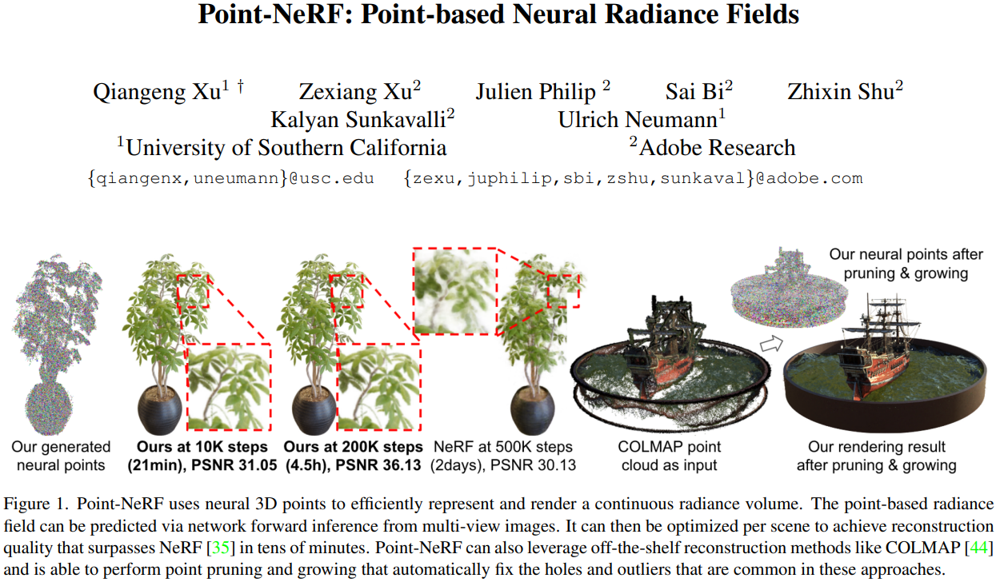

---

[15] NeRF in the Dark: High Dynamic Range View Synthesis from Noisy Raw Images

- Title：暗环境中的NeRF：从嘈杂的原始图像合成高动态范围视图

- Category：弱光照,HDR

- Project: https://bmild.github.io/rawnerf/

- Code: https://github.com/google-research/multinerf

- Paper: https://arxiv.org/pdf/2111.13679.pdf

- Abstract：

  > *Neural Radiance Fields (NeRF) is a technique for high quality novel view synthesis from a collection of posed input images. Like most view synthesis methods, NeRF uses tonemapped low dynamic range (LDR) as input; these images have been processed by a lossy camera pipeline that smooths detail, clips highlights, and distorts the simple noise distribution of raw sensor data. We modify NeRF to instead train directly on linear raw images, preserving the scene's full dynamic range. By rendering raw output images from the resulting NeRF, we can perform novel high dynamic range (HDR) view synthesis tasks. In addition to changing the camera viewpoint, we can manipulate focus, exposure, and tonemapping after the fact. Although a single raw image appears significantly more noisy than a postprocessed one, we show that NeRF is highly robust to the zero-mean distribution of raw noise. When optimized over many noisy raw inputs (25-200), NeRF produces a scene representation so accurate that its rendered novel views outperform dedicated single and multi-image deep raw denoisers run on the same wide baseline input images. As a result, our method, which we call RawNeRF, can reconstruct scenes from extremely noisy images captured in near-darkness.*

- Figure：

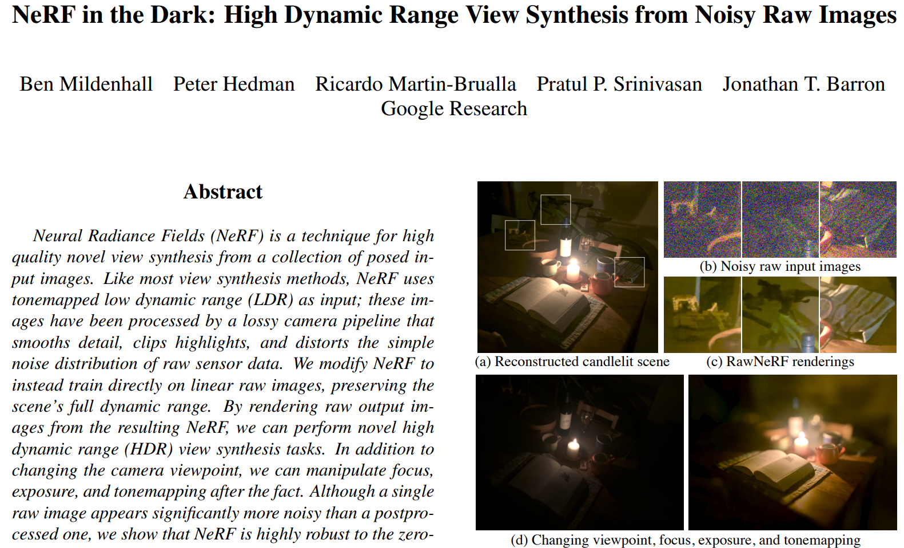

---

[16] Aug-NeRF: Training Stronger Neural Radiance Fields with Triple-Level Physically-Grounded Augmentations

- Title：Aug-NeRF：使用三级物理接地增强训练更强的神经辐射场

- Category：真实渲染

- Project: none

- Code: https://github.com/VITA-Group/Aug-NeRF

- Paper: https://arxiv.org/pdf/2207.01164.pdf

- Abstract：

  > *Neural Radiance Field (NeRF) regresses a neural parameterized scene by differentially rendering multi-view images with ground-truth supervision. However, when interpolating novel views, NeRF often yields inconsistent and visually non-smooth geometric results, which we consider as a generalization gap between seen and unseen views. Recent advances in convolutional neural networks have demonstrated the promise of advanced robust data augmentations, either random or learned, in enhancing both in-distribution and out-of-distribution generalization. Inspired by that, we propose Augmented NeRF (Aug-NeRF), which for the first time brings the power of robust data augmentations into regularizing the NeRF training. Particularly, our proposal learns to seamlessly blend worst-case perturbations into three distinct levels of the NeRF pipeline with physical grounds, including (1) the input coordinates, to simulate imprecise camera parameters at image capture; (2) intermediate features, to smoothen the intrinsic feature manifold; and (3) pre-rendering output, to account for the potential degradation factors in the multi-view image supervision. Extensive results demonstrate that Aug-NeRF effectively boosts NeRF performance in both novel view synthesis (up to 1.5dB PSNR gain) and underlying geometry reconstruction. Furthermore, thanks to the implicit smooth prior injected by the triple-level augmentations, Aug-NeRF can even recover scenes from heavily corrupted images, a highly challenging setting untackled before. Our codes are available in [this https URL](https://github.com/VITA-Group/Aug-NeRF).*

- Figure：

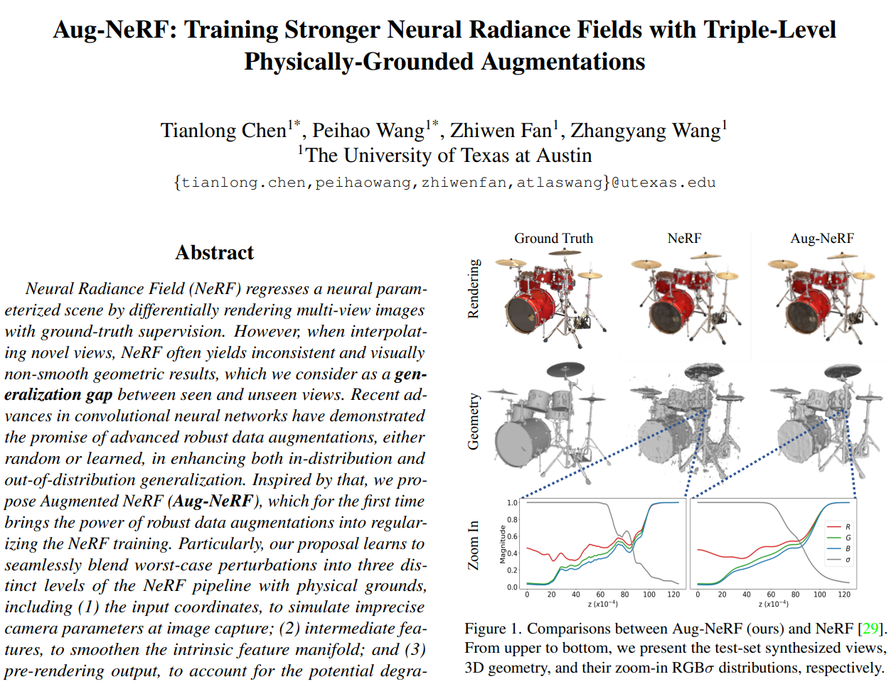

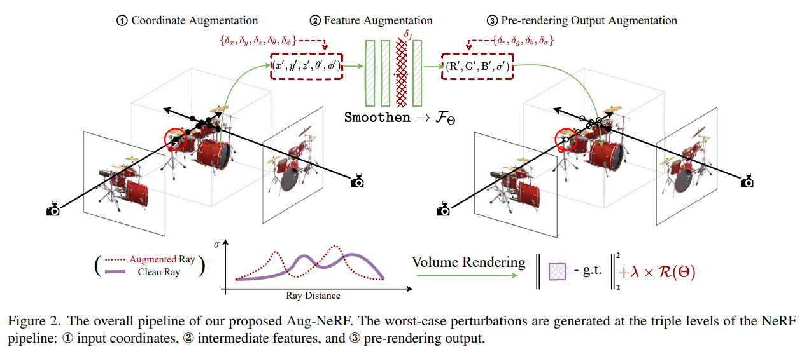

---

[17] EfficientNeRF: Efficient Neural Radiance Fields

- Title：EfficientNeRF：高效神经辐射场

- Category：快速渲染

- Project: none

- Code: https://github.com/dvlab-research/EfficientNeRF

- Paper: https://arxiv.org/pdf/2206.00878.pdf

- Abstract：

  > *Neural Radiance Fields (NeRF) has been wildly applied to various tasks for its high-quality representation of 3D scenes. It takes long per-scene training time and per-image testing time. In this paper, we present EfficientNeRF as an efficient NeRF-based method to represent 3D scene and synthesize novel-view images. Although several ways exist to accelerate the training or testing process, it is still difficult to much reduce time for both phases simultaneously. We analyze the density and weight distribution of the sampled points then propose valid and pivotal sampling at the coarse and fine stage, respectively, to significantly improve sampling efficiency. In addition, we design a novel data structure to cache the whole scene during testing to accelerate the rendering speed. Overall, our method can reduce over 88\% of training time, reach rendering speed of over 200 FPS, while still achieving competitive accuracy. Experiments prove that our method promotes the practicality of NeRF in the real world and enables many applications.*

- Figure：

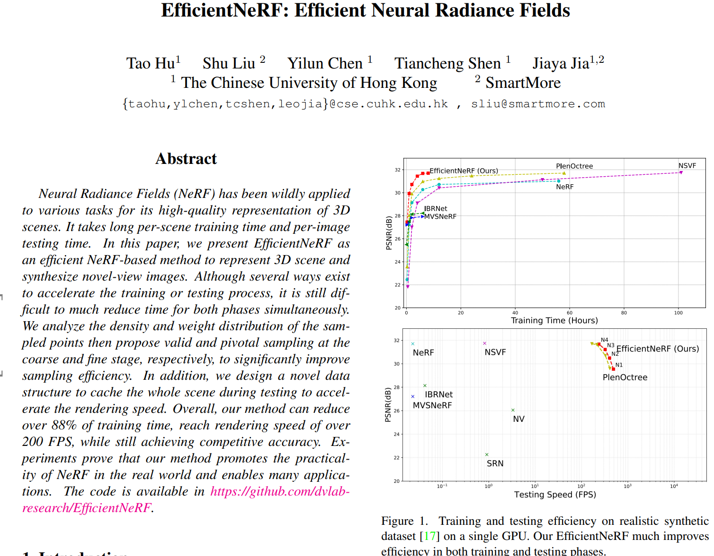

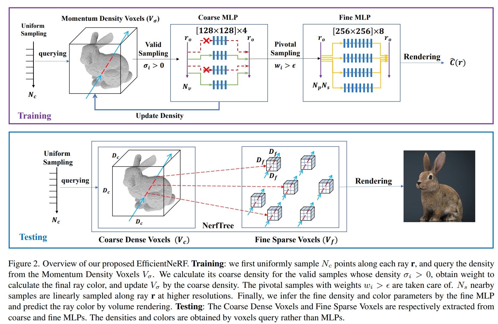

---

[18] FENeRF: Face Editing in Neural Radiance Fields

- Title：FENeRF：神经辐射场中的面部编辑

- Category：NeRF-GAN,面部编辑

- Project: https://mrtornado24.github.io/FENeRF/

- Code: https://github.com/MrTornado24/FENeRF

- Paper: https://arxiv.org/pdf/2111.15490.pdf

- Abstract：

  > *Previous portrait image generation methods roughly fall into two categories: 2D GANs and 3D-aware GANs. 2D GANs can generate high fidelity portraits but with low view consistency. 3D-aware GAN methods can maintain view consistency but their generated images are not locally editable. To overcome these limitations, we propose FENeRF, a 3D-aware generator that can produce view-consistent and locally-editable portrait images. Our method uses two decoupled latent codes to generate corresponding facial semantics and texture in a spatial aligned 3D volume with shared geometry. Benefiting from such underlying 3D representation, FENeRF can jointly render the boundary-aligned image and semantic mask and use the semantic mask to edit the 3D volume via GAN inversion. We further show such 3D representation can be learned from widely available monocular image and semantic mask pairs. Moreover, we reveal that joint learning semantics and texture helps to generate finer geometry. Our experiments demonstrate that FENeRF outperforms state-of-the-art methods in various face editing tasks.*

- Figure：

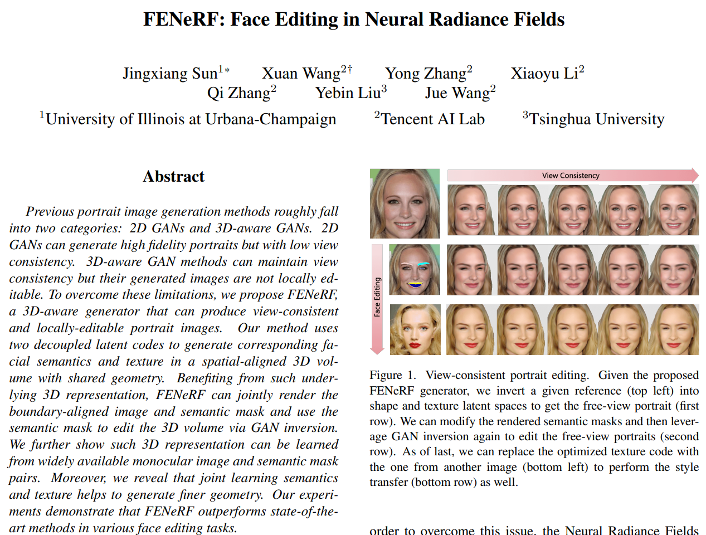

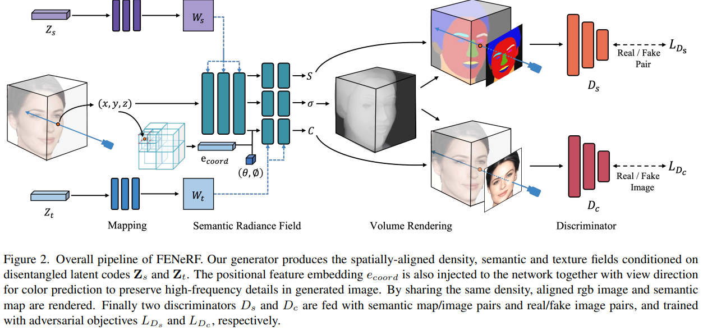

---

[19] CoNeRF: Controllable Neural Radiance Fields

- Title：CoNeRF：可控神经辐射场

- Category：人脸建模,可编辑

- Project: https://conerf.github.io/

- Code: https://github.com/kacperkan/conerf

- Paper: https://arxiv.org/pdf/2112.01983.pdf

- Abstract：

  > *We extend neural 3D representations to allow for intuitive and interpretable user control beyond novel view rendering (i.e. camera control). We allow the user to annotate which part of the scene one wishes to control with just a small number of mask annotations in the training images. Our key idea is to treat the attributes as latent variables that are regressed by the neural network given the scene encoding. This leads to a few-shot learning framework, where attributes are discovered automatically by the framework, when annotations are not provided. We apply our method to various scenes with different types of controllable attributes (e.g. expression control on human faces, or state control in movement of inanimate objects). Overall, we demonstrate, to the best of our knowledge, for the first time novel view and novel attribute re-rendering of scenes from a single video.*

- Figure：

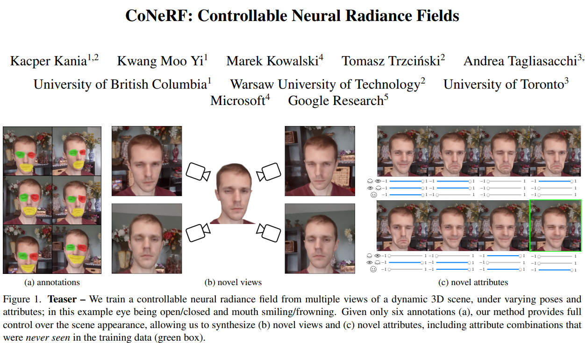

---

[20] Surface-Aligned Neural Radiance Fields for Controllable 3D Human Synthesis

- Title：用于可控3D人体合成的表面对齐神经辐射场

- Category：人体建模

- Project: https://pfnet-research.github.io/surface-aligned-nerf/

- Code: https://github.com/pfnet-research/surface-aligned-nerf

- Paper: https://arxiv.org/pdf/2201.01683.pdf

- Abstract：

  > *We propose a new method for reconstructing controllable implicit 3D human models from sparse multi-view RGB videos. Our method defines the neural scene representation on the mesh surface points and signed distances from the surface of a human body mesh. We identify an indistinguishability issue that arises when a point in 3D space is mapped to its nearest surface point on a mesh for learning surface-aligned neural scene representation. To address this issue, we propose projecting a point onto a mesh surface using a barycentric interpolation with modified vertex normals. Experiments with the ZJU-MoCap and Human3.6M datasets show that our approach achieves a higher quality in a novel-view and novel-pose synthesis than existing methods. We also demonstrate that our method easily supports the control of body shape and clothes. Project page: [this https URL](https://pfnet-research.github.io/surface-aligned-nerf/).*

- Figure：

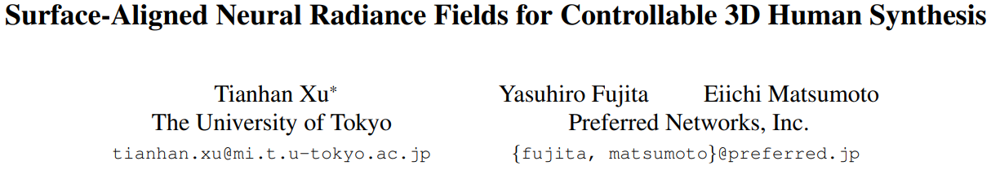

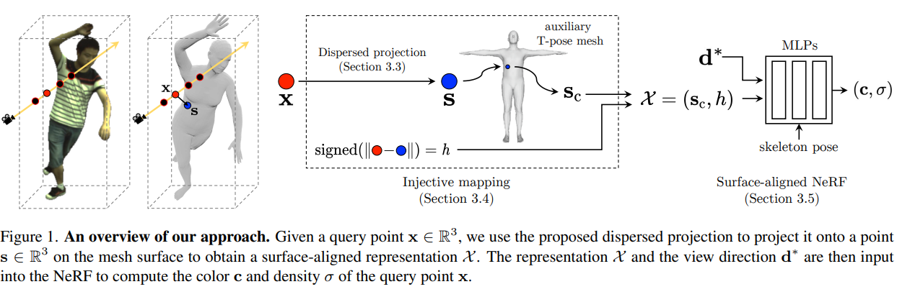

---

[21] Ha-NeRF😆: Hallucinated Neural Radiance Fields in the Wild

- Title：Ha-NeRF😆: 野外的幻觉神经辐射场

- Category：室外场景

- Project: https://rover-xingyu.github.io/Ha-NeRF/

- Code: https://github.com/rover-xingyu/Ha-NeRF

- Paper: https://arxiv.org/pdf/2111.15246.pdf

- Abstract：

  > *Neural Radiance Fields (NeRF) has recently gained popularity for its impressive novel view synthesis ability. This paper studies the problem of hallucinated NeRF: i.e., recovering a realistic NeRF at a different time of day from a group of tourism images. Existing solutions adopt NeRF with a controllable appearance embedding to render novel views under various conditions, but they cannot render view-consistent images with an unseen appearance. To solve this problem, we present an end-to-end framework for constructing a hallucinated NeRF, dubbed as Ha-NeRF. Specifically, we propose an appearance hallucination module to handle time-varying appearances and transfer them to novel views. Considering the complex occlusions of tourism images, we introduce an anti-occlusion module to decompose the static subjects for visibility accurately. Experimental results on synthetic data and real tourism photo collections demonstrate that our method can hallucinate the desired appearances and render occlusion-free images from different views. The project and supplementary materials are available at [this https URL](https://rover-xingyu.github.io/Ha-NeRF/).*

- Figure：

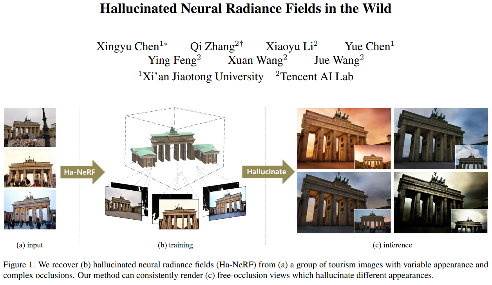

---

[22] DoubleField: Bridging the Neural Surface and Radiance Fields for High-fidelity Human Reconstruction and Rendering

- Title：DoubleField：桥接神经表面和辐射场以实现高保真人体重建和渲染

- Category：人体建模

- Project: http://www.liuyebin.com/dbfield/dbfield.html

- Code: https://github.com/DSaurus/DoubleField

- Paper: https://arxiv.org/pdf/2106.03798.pdf

- Abstract：

  > *We introduce DoubleField, a novel framework combining the merits of both surface field and radiance field for high-fidelity human reconstruction and rendering. Within DoubleField, the surface field and radiance field are associated together by a shared feature embedding and a surface-guided sampling strategy. Moreover, a view-to-view transformer is introduced to fuse multi-view features and learn view-dependent features directly from high-resolution inputs. With the modeling power of DoubleField and the view-to-view transformer, our method significantly improves the reconstruction quality of both geometry and appearance, while supporting direct inference, scene-specific high-resolution finetuning, and fast rendering. The efficacy of DoubleField is validated by the quantitative evaluations on several datasets and the qualitative results in a real-world sparse multi-view system, showing its superior capability for high-quality human model reconstruction and photo-realistic free-viewpoint human rendering. Data and source code will be made public for the research purpose. Please refer to our project page: [this http URL](http://www.liuyebin.com/dbfield/dbfield.html).*

- Figure：

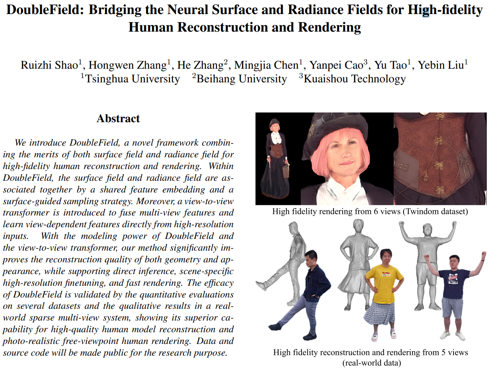

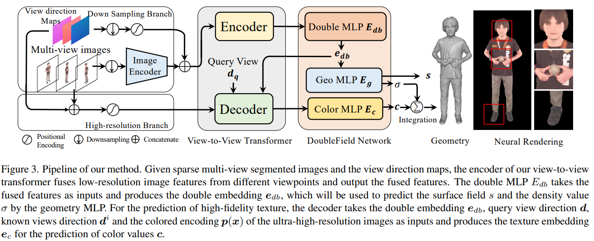

---

[23] NeRFReN: Neural Radiance Fields with Reflections

- Title：NeRFReN：具有反射的神经辐射场

- Category：光照反射

- Project: https://bennyguo.github.io/nerfren/

- Code: https://github.com/bennyguo/nerfren

- Paper: https://arxiv.org/pdf/2111.15234.pdf

- Abstract：

  > *Neural Radiance Fields (NeRF) has achieved unprecedented view synthesis quality using coordinate-based neural scene representations. However, NeRF's view dependency can only handle simple reflections like highlights but cannot deal with complex reflections such as those from glass and mirrors. In these scenarios, NeRF models the virtual image as real geometries which leads to inaccurate depth estimation, and produces blurry renderings when the multi-view consistency is violated as the reflected objects may only be seen under some of the viewpoints. To overcome these issues, we introduce NeRFReN, which is built upon NeRF to model scenes with reflections. Specifically, we propose to split a scene into transmitted and reflected components, and model the two components with separate neural radiance fields. Considering that this decomposition is highly under-constrained, we exploit geometric priors and apply carefully-designed training strategies to achieve reasonable decomposition results. Experiments on various self-captured scenes show that our method achieves high-quality novel view synthesis and physically sound depth estimation results while enabling scene editing applications.*

- Figure：

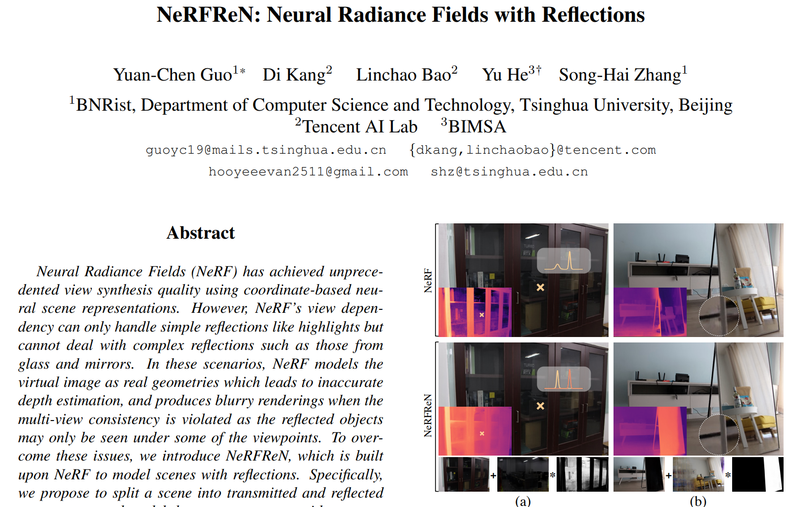

---

[24] Direct Voxel Grid Optimization: Super-fast Convergence for Radiance Fields Reconstruction

- Title：直接体素网格优化(DVGO)：辐射场重建的超快速收敛

- Category：混合表示,体素网格,快速渲染

- Project: https://sunset1995.github.io/dvgo/

- Code: https://github.com/sunset1995/DirectVoxGO

- Paper: https://arxiv.org/pdf/2111.11215.pdf

- Abstract：

  > *We present a super-fast convergence approach to reconstructing the per-scene radiance field from a set of images that capture the scene with known poses. This task, which is often applied to novel view synthesis, is recently revolutionized by Neural Radiance Field (NeRF) for its state-of-the-art quality and flexibility. However, NeRF and its variants require a lengthy training time ranging from hours to days for a single scene. In contrast, our approach achieves NeRF-comparable quality and converges rapidly from scratch in less than 15 minutes with a single GPU. We adopt a representation consisting of a density voxel grid for scene geometry and a feature voxel grid with a shallow network for complex view-dependent appearance. Modeling with explicit and discretized volume representations is not new, but we propose two simple yet non-trivial techniques that contribute to fast convergence speed and high-quality output. First, we introduce the post-activation interpolation on voxel density, which is capable of producing sharp surfaces in lower grid resolution. Second, direct voxel density optimization is prone to suboptimal geometry solutions, so we robustify the optimization process by imposing several priors. Finally, evaluation on five inward-facing benchmarks shows that our method matches, if not surpasses, NeRF's quality, yet it only takes about 15 minutes to train from scratch for a new scene.*

- Figure：

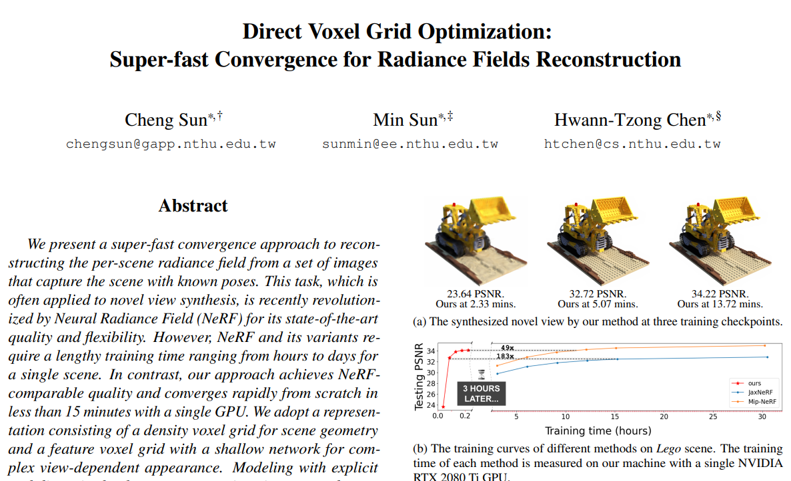

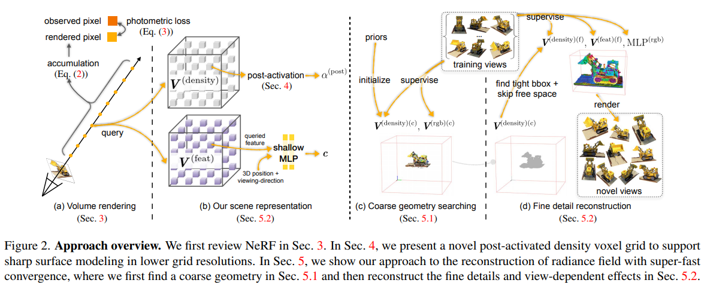

---

[25] Pix2NeRF: Unsupervised Conditional $\pi-GAN$ for Single Image to Neural Radiance Fields Translation

- Title：Pix2NeRF：用于单图像到神经辐射场转换的无监督条件$\pi$-GAN

- Category：NeRF-GAN,单视图

- Project: [deepai](https://deepai.org/publication/pix2nerf-unsupervised-conditional-p-gan-for-single-image-to-neural-radiance-fields-translation)

- Code: https://github.com/HexagonPrime/Pix2NeRF

- Paper: [pdf](https://openaccess.thecvf.com/content/CVPR2022/papers/Cai_Pix2NeRF_Unsupervised_Conditional_p-GAN_for_Single_Image_to_Neural_Radiance_CVPR_2022_paper.pdf)

- Abstract：

  > **We propose a pipeline to generate Neural Radiance Fields (NeRF) of an object or a scene of a specific class, conditioned on a single input image. This is a challenging task, as training NeRF requires multiple views of the same scene, coupled with corresponding poses, which are hard to obtain. Our method is based on π-GAN, a generative model for unconditional 3D-aware image synthesis, which maps random latent codes to radiance fields of a class of objects. We jointly optimize (1) the π-GAN objective to utilize its high-fidelity 3D-aware generation and (2) a carefully designed reconstruction objective. The latter includes an encoder coupled with π-GAN generator to form an auto-encoder. Unlike previous few-shot NeRF approaches, our pipeline is unsupervised, capable of being trained with independent images without 3D, multi-view, or pose supervision. Applications of our pipeline include 3d avatar generation, object-centric novel view synthesis with a single input image, and 3d-aware super-resolution, to name a few.**

- Figure：

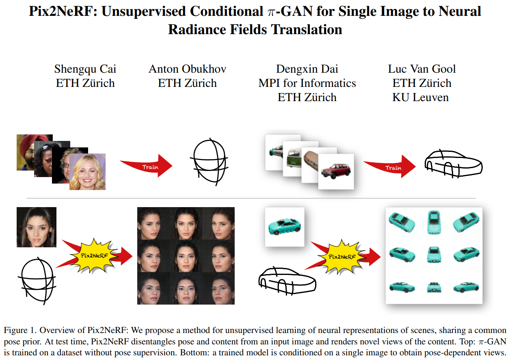

---

[26] Dense Depth Priors for Neural Radiance Fields from Sparse Input Views

- Title：来自稀疏输入视图的神经辐射场的密集深度先验

- Category：深度监督,稀疏视图

- Project: https://barbararoessle.github.io/dense_depth_priors_nerf/

- Code: https://github.com/barbararoessle/dense_depth_priors_nerf

- Paper: https://arxiv.org/pdf/2112.03288.pdf

- Abstract：

  > *Neural radiance fields (NeRF) encode a scene into a neural representation that enables photo-realistic rendering of novel views. However, a successful reconstruction from RGB images requires a large number of input views taken under static conditions - typically up to a few hundred images for room-size scenes. Our method aims to synthesize novel views of whole rooms from an order of magnitude fewer images. To this end, we leverage dense depth priors in order to constrain the NeRF optimization. First, we take advantage of the sparse depth data that is freely available from the structure from motion (SfM) preprocessing step used to estimate camera poses. Second, we use depth completion to convert these sparse points into dense depth maps and uncertainty estimates, which are used to guide NeRF optimization. Our method enables data-efficient novel view synthesis on challenging indoor scenes, using as few as 18 images for an entire scene.*

- Figure：

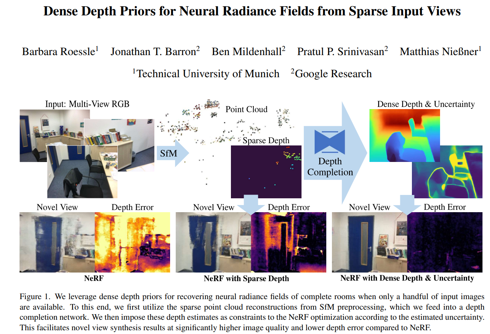

---

[27] Plenoxels: Radiance Fields without Neural Networks

- Title：Plenoxels：没有神经网络的辐射场

- Category：快速渲染,体素网格

- Project: https://alexyu.net/plenoxels/

- Code: https://github.com/sxyu/svox2

- Paper: https://arxiv.org/pdf/2112.05131.pdf

- Abstract：

  > *We introduce Plenoxels (plenoptic voxels), a system for photorealistic view synthesis. Plenoxels represent a scene as a sparse 3D grid with spherical harmonics. This representation can be optimized from calibrated images via gradient methods and regularization without any neural components. On standard, benchmark tasks, Plenoxels are optimized two orders of magnitude faster than Neural Radiance Fields with no loss in visual quality.*

- Figure：

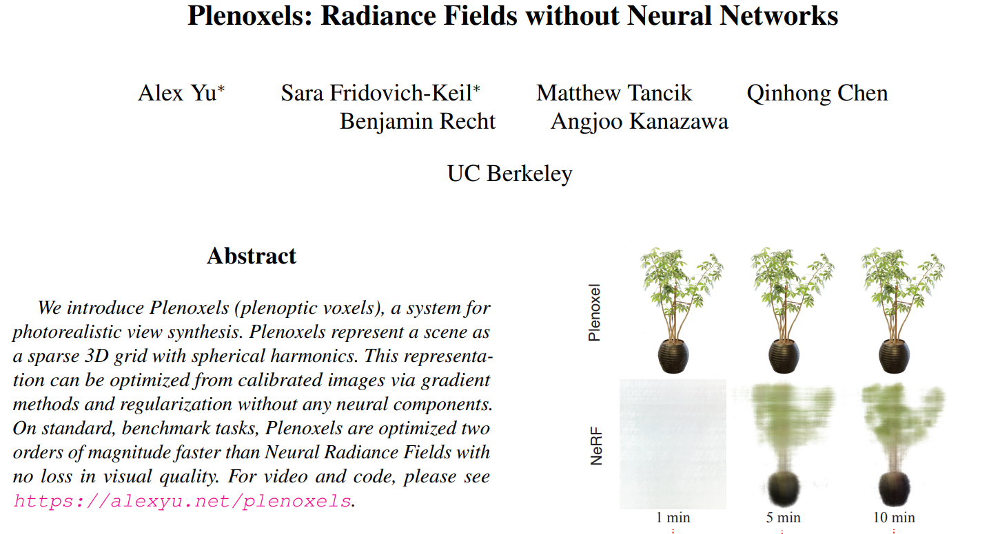

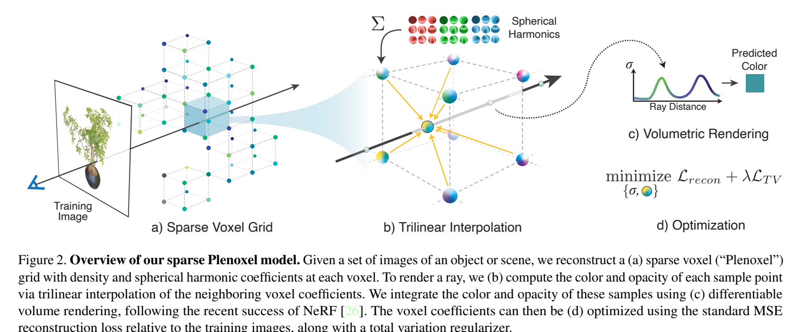

---

[28] NeRFusion: Fusing Radiance Fields for Large-Scale Scene Reconstruction

- Title：NeRFusion：融合辐射场进行大规模场景重建

- Category：大规模场景,室内场景

- Project: https://jetd1.github.io/NeRFusion-Web/

- Code: https://github.com/jetd1/NeRFusion

- Paper: https://arxiv.org/pdf/2203.11283.pdf

- Abstract：

  > *While NeRF has shown great success for neural reconstruction and rendering, its limited MLP capacity and long per-scene optimization times make it challenging to model large-scale indoor scenes. In contrast, classical 3D reconstruction methods can handle large-scale scenes but do not produce realistic renderings. We propose NeRFusion, a method that combines the advantages of NeRF and TSDF-based fusion techniques to achieve efficient large-scale reconstruction and photo-realistic rendering. We process the input image sequence to predict per-frame local radiance fields via direct network inference. These are then fused using a novel recurrent neural network that incrementally reconstructs a global, sparse scene representation in real-time at 22 fps. This global volume can be further fine-tuned to boost rendering quality. We demonstrate that NeRFusion achieves state-of-the-art quality on both large-scale indoor and small-scale object scenes, with substantially faster reconstruction than NeRF and other recent methods.*

- Figure：

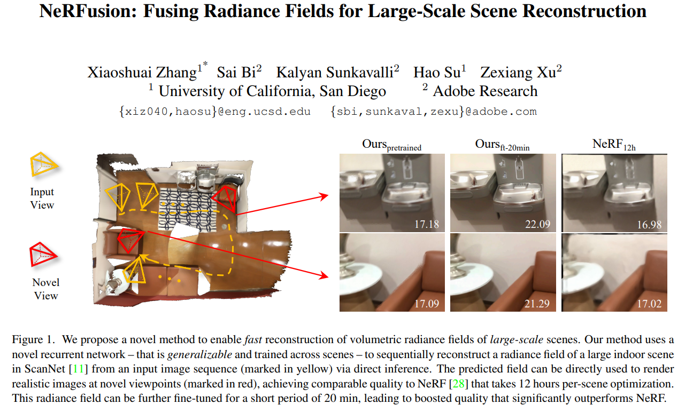

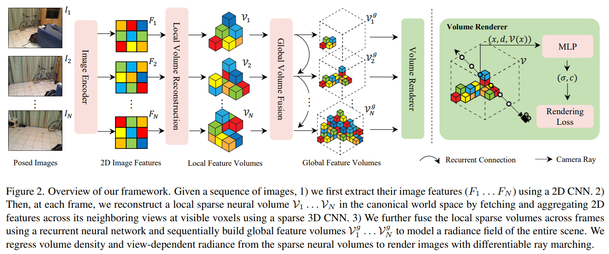

---

[29] Urban Radiance Fields

- Title：城市辐射场

- Category：城市街景,大规模场景,室外场景,lidar

- Project: https://urban-radiance-fields.github.io/

- Code: none

- Paper: https://arxiv.org/pdf/2111.14643.pdf

- Abstract：

  > *he goal of this work is to perform 3D reconstruction and novel view synthesis from data captured by scanning platforms commonly deployed for world mapping in urban outdoor environments (e.g., Street View). Given a sequence of posed RGB images and lidar sweeps acquired by cameras and scanners moving through an outdoor scene, we produce a model from which 3D surfaces can be extracted and novel RGB images can be synthesized. Our approach extends Neural Radiance Fields, which has been demonstrated to synthesize realistic novel images for small scenes in controlled settings, with new methods for leveraging asynchronously captured lidar data, for addressing exposure variation between captured images, and for leveraging predicted image segmentations to supervise densities on rays pointing at the sky. Each of these three extensions provides significant performance improvements in experiments on Street View data. Our system produces state-of-the-art 3D surface reconstructions and synthesizes higher quality novel views in comparison to both traditional methods (e.g.~COLMAP) and recent neural representations (e.g.~Mip-NeRF).*

- Figure：

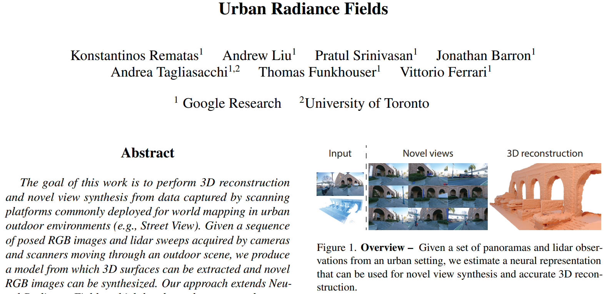

---

[30] GRAM: Generative Radiance Manifolds for 3D-Aware Image Generatio

- Title：GRAM：用于3D感知图像生成的生成辐射流形

- Category：NeRF-GAN

- Project: https://yudeng.github.io/GRAM/

- Code: https://github.com/microsoft/GRAM

- Paper: https://arxiv.org/pdf/2112.08867.pdf

- Abstract：

  > *3D-aware image generative modeling aims to generate 3D-consistent images with explicitly controllable camera poses. Recent works have shown promising results by training neural radiance field (NeRF) generators on unstructured 2D images, but still can not generate highly-realistic images with fine details. A critical reason is that the high memory and computation cost of volumetric representation learning greatly restricts the number of point samples for radiance integration during training. Deficient sampling not only limits the expressive power of the generator to handle fine details but also impedes effective GAN training due to the noise caused by unstable Monte Carlo sampling. We propose a novel approach that regulates point sampling and radiance field learning on 2D manifolds, embodied as a set of learned implicit surfaces in the 3D volume. For each viewing ray, we calculate ray-surface intersections and accumulate their radiance generated by the network. By training and rendering such radiance manifolds, our generator can produce high quality images with realistic fine details and strong visual 3D consistency.*

- Figure：

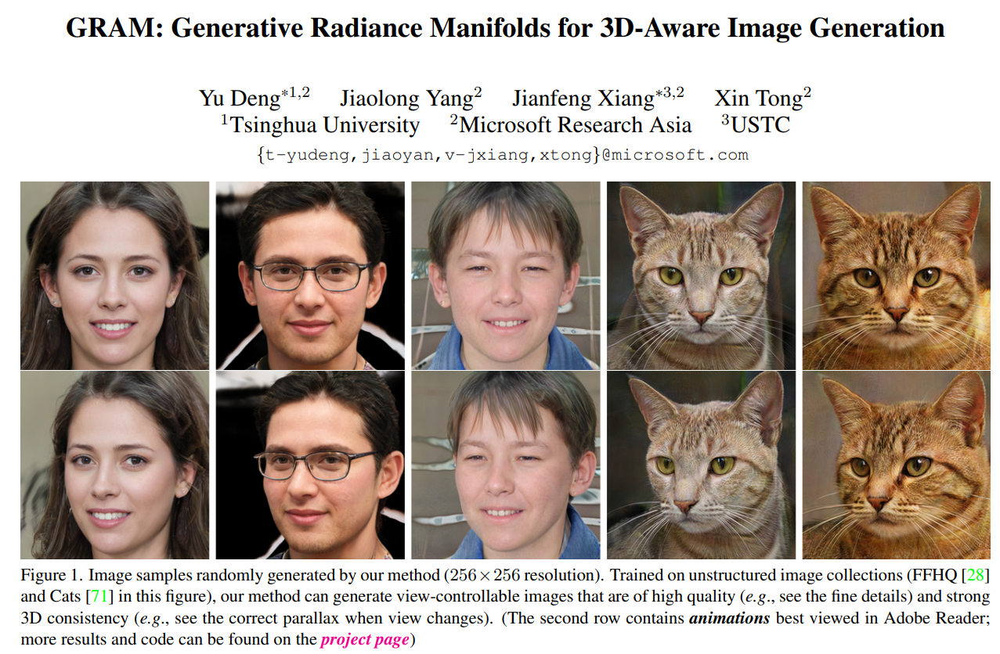

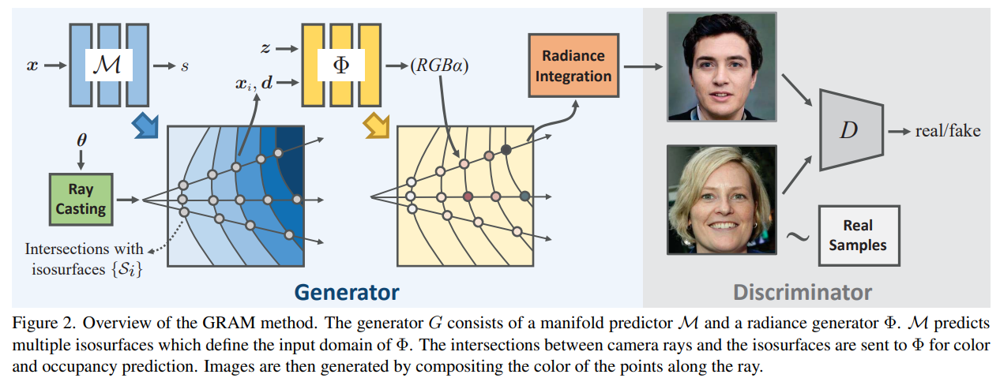

---

[31] Ray Priors through Reprojection: Improving Neural Radiance Fields for Novel View Extrapolation

- Title：通过重投影的射线先验：改进神经辐射场以进行新的视图外推

- Category：视角稀疏

- Project: none

- Code: none

- Paper: https://arxiv.org/pdf/2205.05922.pdf

- Abstract：

  > *Neural Radiance Fields (NeRF) have emerged as a potent paradigm for representing scenes and synthesizing photo-realistic images. A main limitation of conventional NeRFs is that they often fail to produce high-quality renderings under novel viewpoints that are significantly different from the training viewpoints. In this paper, instead of exploiting few-shot image synthesis, we study the novel view extrapolation setting that (1) the training images can well describe an object, and (2) there is a notable discrepancy between the training and test viewpoints' distributions. We present RapNeRF (RAy Priors) as a solution. Our insight is that the inherent appearances of a 3D surface's arbitrary visible projections should be consistent. We thus propose a random ray casting policy that allows training unseen views using seen views. Furthermore, we show that a ray atlas pre-computed from the observed rays' viewing directions could further enhance the rendering quality for extrapolated views. A main limitation is that RapNeRF would remove the strong view-dependent effects because it leverages the multi-view consistency property.*

- Figure：

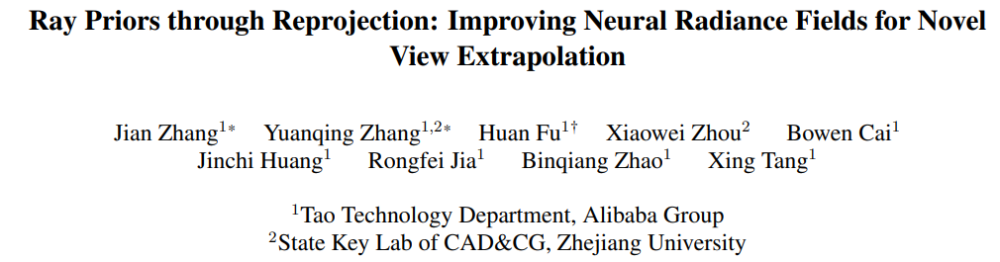

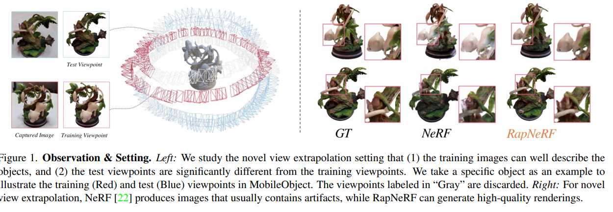

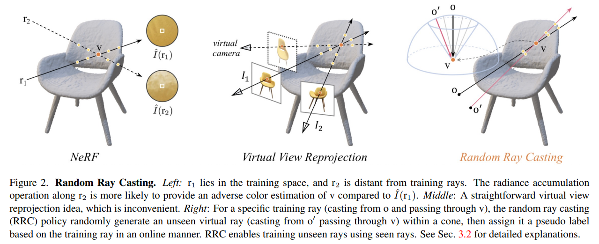

---

[32] Structured Local Radiance Fields for Human Avatar Modeling

- Title：用于人体化身建模的结构化局部辐射场

- Category：人体建模

- Project: https://liuyebin.com/slrf/slrf.html

- Group: https://zhengzerong.github.io/

- Code: none

- Paper: https://arxiv.org/pdf/2203.14478.pdf

- Abstract：

  > *It is extremely challenging to create an animatable clothed human avatar from RGB videos, especially for loose clothes due to the difficulties in motion modeling. To address this problem, we introduce a novel representation on the basis of recent neural scene rendering techniques. The core of our representation is a set of structured local radiance fields, which are anchored to the pre-defined nodes sampled on a statistical human body template. These local radiance fields not only leverage the flexibility of implicit representation in shape and appearance modeling, but also factorize cloth deformations into skeleton motions, node residual translations and the dynamic detail variations inside each individual radiance field. To learn our representation from RGB data and facilitate pose generalization, we propose to learn the node translations and the detail variations in a conditional generative latent space. Overall, our method enables automatic construction of animatable human avatars for various types of clothes without the need for scanning subject-specific templates, and can generate realistic images with dynamic details for novel poses. Experiment show that our method outperforms state-of-the-art methods both qualitatively and quantitatively.*

- Figure：

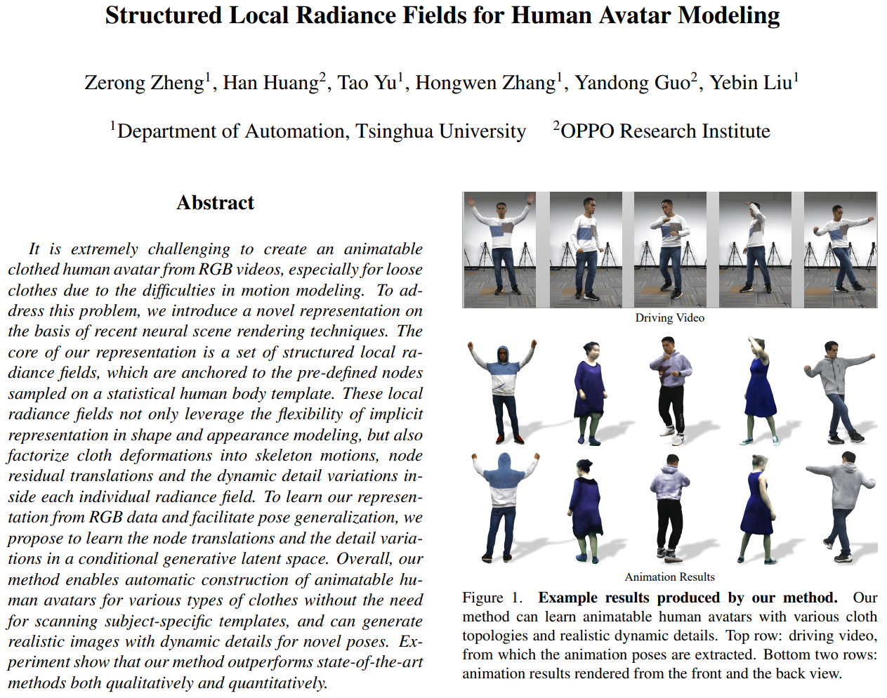

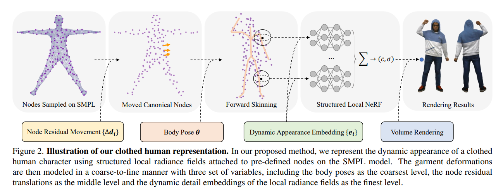

---

[32] RegNeRF: Regularizing Neural Radiance Fields for View Synthesis from Sparse Inputs

- Title：RegNeRF：正则化神经辐射场以从稀疏输入进行视图合成

- Category：稀疏视图

- Project: https://m-niemeyer.github.io/regnerf/index.html

- Code: https://github.com/google-research/google-research/tree/master/regnerf

- Paper: https://arxiv.org/pdf/2112.00724.pdf

- Abstract：

  > *Neural Radiance Fields (NeRF) have emerged as a powerful representation for the task of novel view synthesis due to their simplicity and state-of-the-art performance. Though NeRF can produce photorealistic renderings of unseen viewpoints when many input views are available, its performance drops significantly when this number is reduced. We observe that the majority of artifacts in sparse input scenarios are caused by errors in the estimated scene geometry, and by divergent behavior at the start of training. We address this by regularizing the geometry and appearance of patches rendered from unobserved viewpoints, and annealing the ray sampling space during training. We additionally use a normalizing flow model to regularize the color of unobserved viewpoints. Our model outperforms not only other methods that optimize over a single scene, but in many cases also conditional models that are extensively pre-trained on large multi-view datasets.*

- Figure：

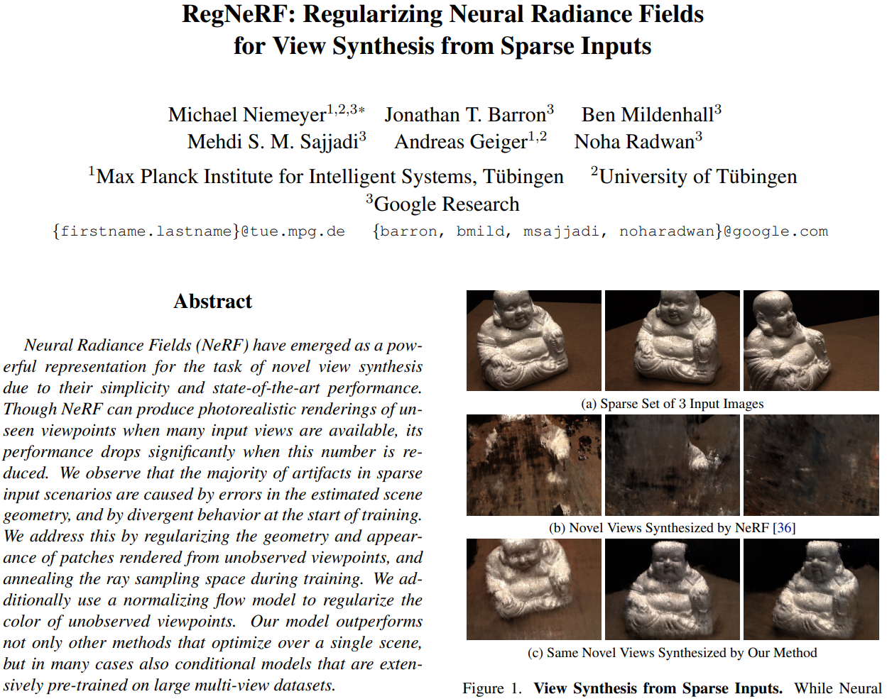

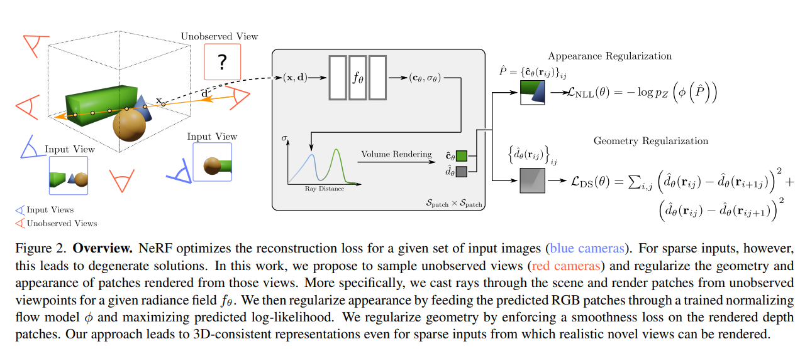

---

[33] AutoRF: Learning 3D Object Radiance Fields from Single View Observations

- Title：AutoRF：从单视图观察中学习3D物体辐射场

- Category：单视图,目标检测,全景分割

- Project: https://sirwyver.github.io/AutoRF/

- Code: https://github.com/uprestel/AutoNeRF

- Paper: [pdf](https://openaccess.thecvf.com/content/CVPR2022/papers/Muller_AutoRF_Learning_3D_Object_Radiance_Fields_From_Single_View_Observations_CVPR_2022_paper.pdf)

- Abstract：

  > *We introduce AutoRF – a new approach for learning neural 3D object representations where each object in the training set is observed by only a single view. This setting is in stark contrast to the majority of existing works that leverage multiple views of the same object, employ explicit priors during training, or require pixel-perfect annotations. To address this challenging setting, we propose to learn a normalized, object-centric representation whose embedding describes and disentangles shape, appearance, and pose. Each encoding provides well-generalizable, compact information about the object of interest, which is decoded in a single-shot into a new target view, thus enabling novel view synthesis. We further improve the reconstruction quality by optimizing shape and appearance codes at test time by fitting the representation tightly to the input image. In a series of experiments, we show that our method generalizes well to unseen objects, even across different datasets of challenging real-world street scenes such as nuScenes, KITTI, and Mapillary Metropolis. Additional results can be found on our project page https://sirwyver.github.io/AutoRF/.*

- Figure：

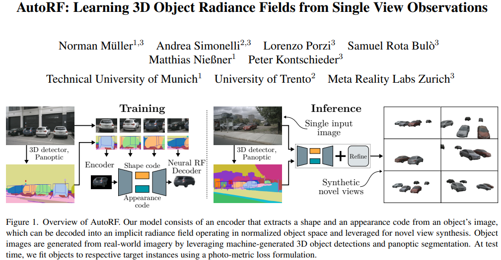

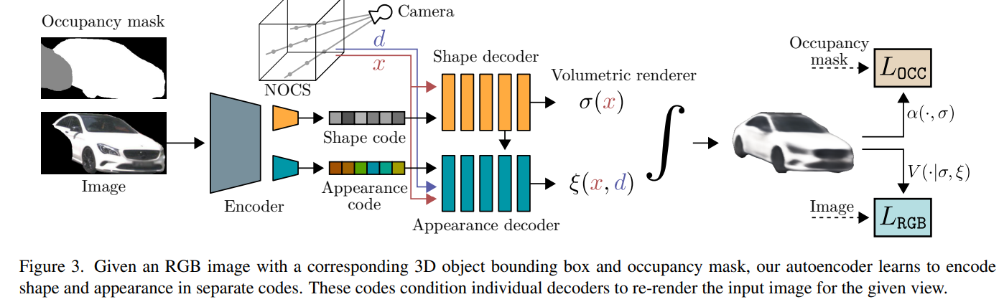

---

[34] Fourier PlenOctrees for Dynamic Radiance Field Rendering in Real-time

- Title：用于实时动态辐射场渲染的Fourier PlenOctrees

- Category：实时渲染,动态场景

- Project: https://aoliao12138.github.io/FPO/

- Code: https://github.com/aoliao12138/FPO

- Paper: https://arxiv.org/pdf/2202.08614.pdf

- Abstract：

  > *Implicit neural representations such as Neural Radiance Field (NeRF) have focused mainly on modeling static objects captured under multi-view settings where real-time rendering can be achieved with smart data structures, e.g., PlenOctree. In this paper, we present a novel Fourier PlenOctree (FPO) technique to tackle efficient neural modeling and real-time rendering of dynamic scenes captured under the free-view video (FVV) setting. The key idea in our FPO is a novel combination of generalized NeRF, PlenOctree representation, volumetric fusion and Fourier transform. To accelerate FPO construction, we present a novel coarse-to-fine fusion scheme that leverages the generalizable NeRF technique to generate the tree via spatial blending. To tackle dynamic scenes, we tailor the implicit network to model the Fourier coefficients of timevarying density and color attributes. Finally, we construct the FPO and train the Fourier coefficients directly on the leaves of a union PlenOctree structure of the dynamic sequence. We show that the resulting FPO enables compact memory overload to handle dynamic objects and supports efficient fine-tuning. Extensive experiments show that the proposed method is 3000 times faster than the original NeRF and achieves over an order of magnitude acceleration over SOTA while preserving high visual quality for the free-viewpoint rendering of unseen dynamic scenes.*

- Figure：

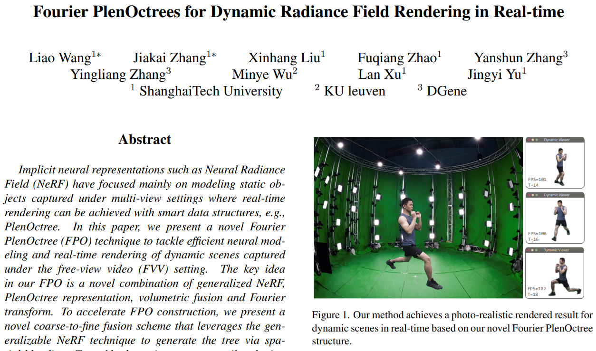

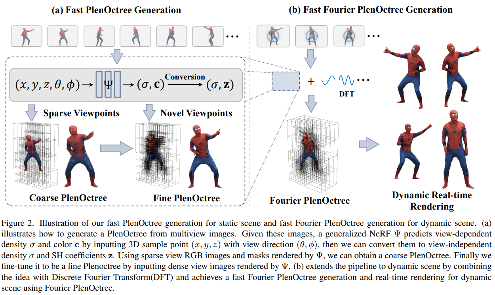

---

[35] HumanNeRF: Efficiently Generated Human Radiance Field from Sparse Inputs

- Title：HumanNeRF：从稀疏输入中高效生成人体辐射场

- Category：稀疏视图,人体建模

- Project: https://zhaofuq.github.io/humannerf/

- Code: https://github.com/zhaofuq/HumanNeRF

- Paper: https://arxiv.org/pdf/2112.02789.pdf

- Abstract：

  > *Recent neural human representations can produce high-quality multi-view rendering but require using dense multi-view inputs and costly training. They are hence largely limited to static models as training each frame is infeasible. We present HumanNeRF - a generalizable neural representation - for high-fidelity free-view synthesis of dynamic humans. Analogous to how IBRNet assists NeRF by avoiding per-scene training, HumanNeRF employs an aggregated pixel-alignment feature across multi-view inputs along with a pose embedded non-rigid deformation field for tackling dynamic motions. The raw HumanNeRF can already produce reasonable rendering on sparse video inputs of unseen subjects and camera settings. To further improve the rendering quality, we augment our solution with an appearance blending module for combining the benefits of both neural volumetric rendering and neural texture blending. Extensive experiments on various multi-view dynamic human datasets demonstrate the generalizability and effectiveness of our approach in synthesizing photo-realistic free-view humans under challenging motions and with very sparse camera view inputs.*

- Figure：

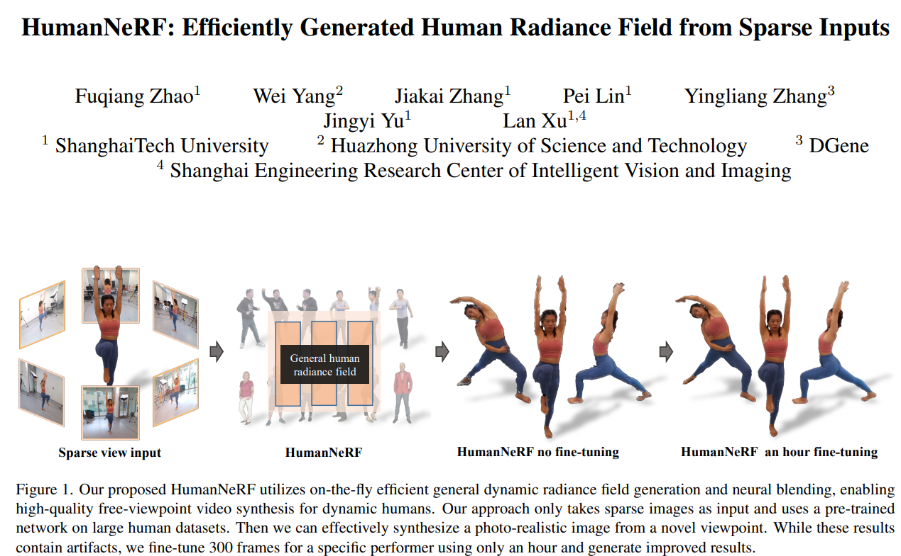

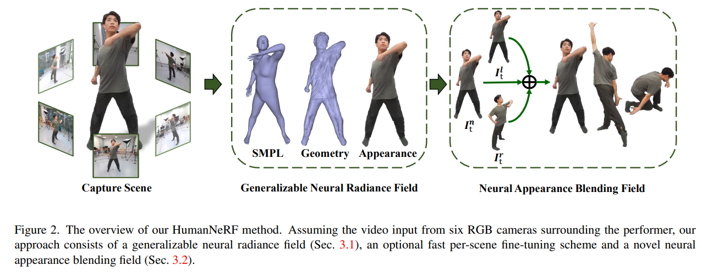

---

[36] DIVeR: Real-time and Accurate Neural Radiance Fields with Deterministic Integration for Volume Rendering

- Title：DIVeR：实时和准确的神经辐射场，具有用于体积渲染的确定性集成

- Category：实时,体素网格,混合表示

- Project: none

- Code: https://github.com/lwwu2/diver-rt

- Paper: https://arxiv.org/pdf/2111.10427.pdf

- Abstract：

  > *DIVeR builds on the key ideas of NeRF and its variants -- density models and volume rendering -- to learn 3D object models that can be rendered realistically from small numbers of images. In contrast to all previous NeRF methods, DIVeR uses deterministic rather than stochastic estimates of the volume rendering integral. DIVeR's representation is a voxel based field of features. To compute the volume rendering integral, a ray is broken into intervals, one per voxel; components of the volume rendering integral are estimated from the features for each interval using an MLP, and the components are aggregated. As a result, DIVeR can render thin translucent structures that are missed by other integrators. Furthermore, DIVeR's representation has semantics that is relatively exposed compared to other such methods -- moving feature vectors around in the voxel space results in natural edits. Extensive qualitative and quantitative comparisons to current state-of-the-art methods show that DIVeR produces models that (1) render at or above state-of-the-art quality, (2) are very small without being baked, (3) render very fast without being baked, and (4) can be edited in natural ways.*

- Figure：

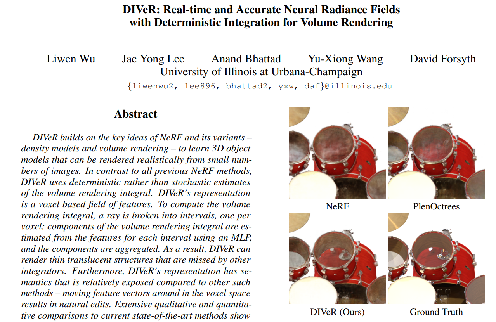

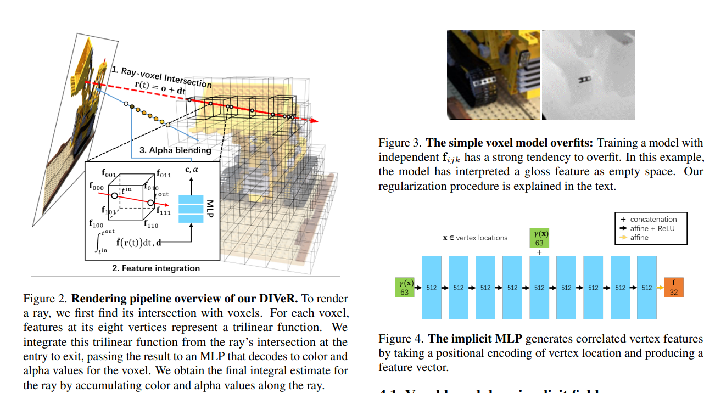

---

[37] NICE-SLAM: Neural Implicit Scalable Encoding for SLAM

- Title：NICE-SLAM：SLAM的神经隐式可扩展编码

- Category：NeRF-SLAM

- Project: https://pengsongyou.github.io/nice-slam

- Code: https://github.com/cvg/nice-slam

- Paper: https://arxiv.org/pdf/2112.12130.pdf

- Abstract：

  > *Neural implicit representations have recently shown encouraging results in various domains, including promising progress in simultaneous localization and mapping (SLAM). Nevertheless, existing methods produce over-smoothed scene reconstructions and have difficulty scaling up to large scenes. These limitations are mainly due to their simple fully-connected network architecture that does not incorporate local information in the observations. In this paper, we present NICE-SLAM, a dense SLAM system that incorporates multi-level local information by introducing a hierarchical scene representation. Optimizing this representation with pre-trained geometric priors enables detailed reconstruction on large indoor scenes. Compared to recent neural implicit SLAM systems, our approach is more scalable, efficient, and robust. Experiments on five challenging datasets demonstrate competitive results of NICE-SLAM in both mapping and tracking quality. Project page: [this https URL](https://pengsongyou.github.io/nice-slam)*

- Figure：

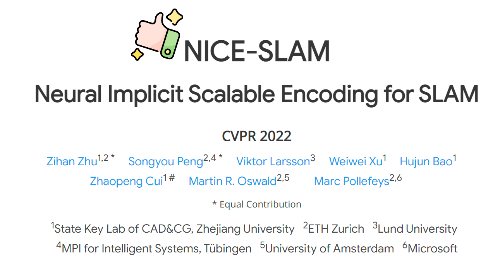

---

[38] 

- Title：

- Category：

- Project: 

- Code: 

- Paper: 

- Abstract：

  > **

- Figure：

