# NeRFs-CVPR2023

> - 注：本来以为就60多篇，所以没有按照类别整理。现在有116篇，之后会按照类别重新整理1遍:smile:
> - 当前论文数：116
> - 收集来源：[CVPR 2023 Accepted Papers](https://cvpr2023.thecvf.com/Conferences/2023/AcceptedPapers)

---

[1] NeRF-RPN: A general framework for object detection in NeRFs

- 题目：NeRF-RPN：NeRF中对象检测的通用框架

- 分类：目标检测

- Code: https://github.com/lyclyc52/NeRF_RPN

- Paper: https://arxiv.org/abs/2211.11646

- 摘要：

  > *This paper presents the first significant object detection framework, NeRF-RPN, which directly operates on NeRF. Given a pre-trained NeRF model, NeRF-RPN aims to detect all bounding boxes of objects in a scene. By exploiting a novel voxel representation that incorporates multi-scale 3D neural volumetric features, we demonstrate it is possible to regress the 3D bounding boxes of objects in NeRF directly without rendering the NeRF at any viewpoint. NeRF-RPN is a general framework and can be applied to detect objects without class labels. We experimented NeRF-RPN with various backbone architectures, RPN head designs and loss functions. All of them can be trained in an end-to-end manner to estimate high quality 3D bounding boxes. To facilitate future research in object detection for NeRF, we built a new benchmark dataset which consists of both synthetic and real-world data with careful labeling and clean up. Code and dataset are available at [this https URL](https://github.com/lyclyc52/NeRF_RPN).*

- 图示：

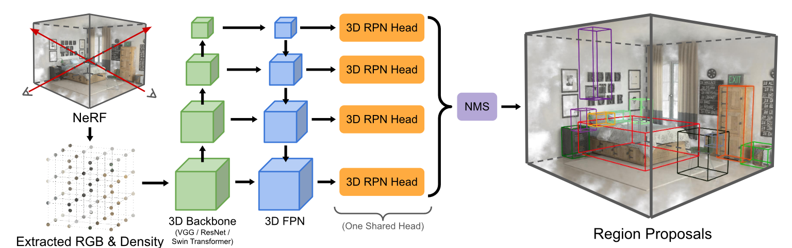

---

[2] SCADE: NeRFs from Space Carving with Ambiguity-Aware Depth Estimates

- 题目：SCADE：来自具有歧义感知深度估计的空间雕刻的NeRF
- 分类：深度监督,稀疏视图
- Project: https://scade-spacecarving-nerfs.github.io/
- Code: soon
- Paper: https://arxiv.org/pdf/2303.13582.pdf
- 摘要： 

> *Neural radiance fields (NeRFs) have enabled high fidelity 3D reconstruction from multiple 2D input views. However, a well-known drawback of NeRFs is the less-than-ideal performance under a small number of views, due to insufficient constraints enforced by volumetric rendering. To address this issue, we introduce SCADE, a novel technique that improves NeRF reconstruction quality on sparse, unconstrained input views for in-the-wild indoor scenes. To constrain NeRF reconstruction, we leverage geometric priors in the form of per-view depth estimates produced with state-of-the-art monocular depth estimation models, which can generalize across scenes. A key challenge is that monocular depth estimation is an ill-posed problem, with inherent ambiguities. To handle this issue, we propose a new method that learns to predict, for each view, a continuous, multimodal distribution of depth estimates using conditional Implicit Maximum Likelihood Estimation (cIMLE). In order to disambiguate exploiting multiple views, we introduce an original space carving loss that guides the NeRF representation to fuse multiple hypothesized depth maps from each view and distill from them a common geometry that is consistent with all views. Experiments show that our approach enables higher fidelity novel view synthesis from sparse views. Our project page can be found at scade-spacecarving-nerfs.github.io.*

- 图示：

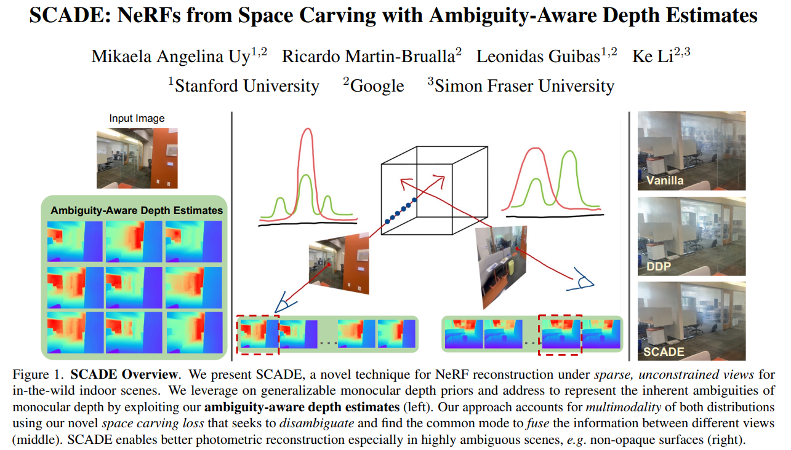

---

[3] 3D-Aware Multi-Class Image-to-Image Translation with NeRFs

- 题目：使用 NeRF 进行3D感知的多类图像到图像转换
- 分类：3D风格迁移
- Code: https://github.com/sen-mao/3di2i-translation
- Paper: https://arxiv.org/pdf/2303.15012.pdf
- 摘要： 

> *Recent advances in 3D-aware generative models (3D-aware GANs) combined with Neural Radiance Fields (NeRF) have achieved impressive results for novel view synthesis. However no prior works investigate 3D-aware GANs for 3D consistent multi-class image-to-image (3D-aware I2I) translation. Naively using 2D-I2I translation methods suffers from unrealistic shape/identity change. To perform 3D-aware multi-class I2I translation, we decouple this learning process into a multi-class 3D-aware GAN step and a 3D-aware I2I translation step. In the first step, we propose two novel techniques: a new conditional architecture and a effective training strategy. In the second step, based on the well-trained multi-class 3D-aware GAN architecture that preserves view-consistency, we construct a 3D-aware I2I translation system. To further reduce the view-consistency problems, we propose several new techniques, including a U-net-like adaptor network design, a hierarchical representation constrain and a relative regularization loss. In extensive experiments on two datasets, quantitative and qualitative results demonstrate that we successfully perform 3D-aware I2I translation with multi-view consistency.*

- 图示：

---

[4] StyleRF: Zero-shot 3D Style Transfer of Neural Radiance Fields

- 题目：StyleRF：神经辐射场的零样本 3D 风格迁移
- 分类：3D风格迁移
- Project: https://kunhao-liu.github.io/StyleRF/
- Code: https://github.com/Kunhao-Liu/StyleRF
- Paper: https://arxiv.org/pdf/2303.10598.pdf
- 摘要： 

> *3D style transfer aims to render stylized novel views of a 3D scene with multi-view consistency. However, most existing work suffers from a three-way dilemma over accurate geometry reconstruction, high-quality stylization, and being generalizable to arbitrary new styles. We propose StyleRF (Style Radiance Fields), an innovative 3D style transfer technique that resolves the three-way dilemma by performing style transformation within the feature space of a radiance field. StyleRF employs an explicit grid of high-level features to represent 3D scenes, with which high-fidelity geometry can be reliably restored via volume rendering. In addition, it transforms the grid features according to the reference style which directly leads to high-quality zero-shot style transfer. StyleRF consists of two innovative designs. The first is sampling-invariant content transformation that makes the transformation invariant to the holistic statistics of the sampled 3D points and accordingly ensures multi-view consistency. The second is deferred style transformation of 2D feature maps which is equivalent to the transformation of 3D points but greatly reduces memory footprint without degrading multi-view consistency. Extensive experiments show that StyleRF achieves superior 3D stylization quality with precise geometry reconstruction and it can generalize to various new styles in a zero-shot manner.*

- 图示：

---

[5] NeuFace: Realistic 3D Neural Face Rendering from Multi-view Images

- 题目：NeuFace：来自多视图图像的逼真3D人脸神经渲染
- 分类：人脸渲染
- Code: https://github.com/aejion/NeuFace
- Paper: https://arxiv.org/pdf/2303.14092.pdf
- 摘要： 

> *Realistic face rendering from multi-view images is beneficial to various computer vision and graphics applications. Due to the complex spatially-varying reflectance properties and geometry characteristics of faces, however, it remains challenging to recover 3D facial representations both faithfully and efficiently in the current studies. This paper presents a novel 3D face rendering model, namely NeuFace, to learn accurate and physically-meaningful underlying 3D representations by neural rendering techniques. It naturally incorporates the neural BRDFs into physically based rendering, capturing sophisticated facial geometry and appearance clues in a collaborative manner. Specifically, we introduce an approximated BRDF integration and a simple yet new low-rank prior, which effectively lower the ambiguities and boost the performance of the facial BRDFs. Extensive experiments demonstrate the superiority of NeuFace in human face rendering, along with a decent generalization ability to common objects.*

- 图示：

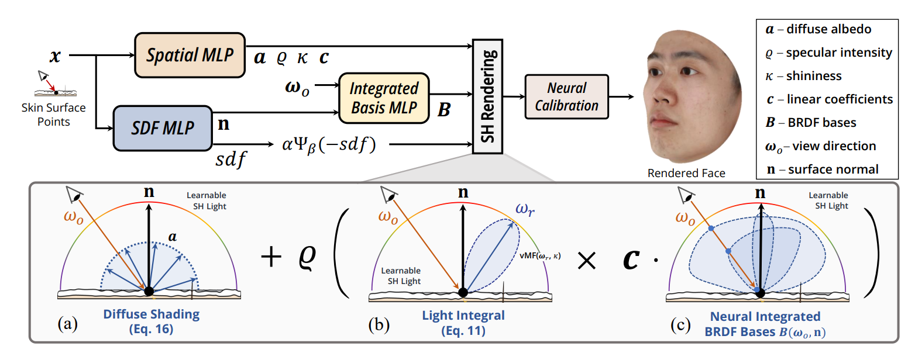

---

[6] BundleSDF: Neural 6-DoF Tracking and 3D Reconstruction of Unknown Objects

- 题目：BundleSDF：未知对象的神经6-DoF跟踪和3D重建
- 分类：RGBD实时跟踪与3D重建
- Project: https://bundlesdf.github.io/
- Code:  Soon
- Paper: https://arxiv.org/abs/2303.14158 
- 摘要： 

> *We present a near real-time method for 6-DoF tracking of an unknown object from a monocular RGBD video sequence, while simultaneously performing neural 3D reconstruction of the object. Our method works for arbitrary rigid objects, even when visual texture is largely absent. The object is assumed to be segmented in the first frame only. No additional information is required, and no assumption is made about the interaction agent. Key to our method is a Neural Object Field that is learned concurrently with a pose graph optimization process in order to robustly accumulate information into a consistent 3D representation capturing both geometry and appearance. A dynamic pool of posed memory frames is automatically maintained to facilitate communication between these threads. Our approach handles challenging sequences with large pose changes, partial and full occlusion, untextured surfaces, and specular highlights. We show results on HO3D, YCBInEOAT, and BEHAVE datasets, demonstrating that our method significantly outperforms existing approaches. Project page: [this https URL](https://bundlesdf.github.io/)*

- 图示：

---

[7] Seeing Through the Glass: Neural 3D Reconstruction of Object Inside a Transparent Container

- 题目：透明容器内物体的神经3D重建
- 分类：3D重建,光照反射
- Code: https://github.com/hirotong/ReNeuS
- Paper: https://arxiv.org/pdf/2303.13805.pdf
- 摘要： 

> *In this paper, we define a new problem of recovering the 3D geometry of an object confined in a transparent enclosure. We also propose a novel method for solving this challenging problem. Transparent enclosures pose challenges of multiple light reflections and refractions at the interface between different propagation media e.g. air or glass. These multiple reflections and refractions cause serious image distortions which invalidate the single viewpoint assumption. Hence the 3D geometry of such objects cannot be reliably reconstructed using existing methods, such as traditional structure from motion or modern neural reconstruction methods. We solve this problem by explicitly modeling the scene as two distinct sub-spaces, inside and outside the transparent enclosure. We use an existing neural reconstruction method (NeuS) that implicitly represents the geometry and appearance of the inner subspace. In order to account for complex light interactions, we develop a hybrid rendering strategy that combines volume rendering with ray tracing. We then recover the underlying geometry and appearance of the model by minimizing the difference between the real and hybrid rendered images. We evaluate our method on both synthetic and real data. Experiment results show that our method outperforms the state-of-the-art (SOTA) methods. Codes and data will be available at [this https URL](https://github.com/hirotong/ReNeuS)*

- 图示：

---

[8] HexPlane: A Fast Representation for Dynamic Scenes

- 题目：HexPlane：动态场景的快速表示
- 分类：动态场景重建
- Project: https://caoang327.github.io/HexPlane/
- Code: https://github.com/Caoang327/HexPlane
- Paper: https://arxiv.org/pdf/2301.09632.pdf
- 摘要： 

> *Modeling and re-rendering dynamic 3D scenes is a challenging task in 3D vision. Prior approaches build on NeRF and rely on implicit representations. This is slow since it requires many MLP evaluations, constraining real-world applications. We show that dynamic 3D scenes can be explicitly represented by six planes of learned features, leading to an elegant solution we call HexPlane. A HexPlane computes features for points in spacetime by fusing vectors extracted from each plane, which is highly efficient. Pairing a HexPlane with a tiny MLP to regress output colors and training via volume rendering gives impressive results for novel view synthesis on dynamic scenes, matching the image quality of prior work but reducing training time by more than 100×. Extensive ablations confirm our HexPlane design and show that it is robust to different feature fusion mechanisms, coordinate systems, and decoding mechanisms. HexPlane is a simple and effective solution for representing 4D volumes, and we hope they can broadly contribute to modeling spacetime for dynamic 3D scenes.*

- 图示：

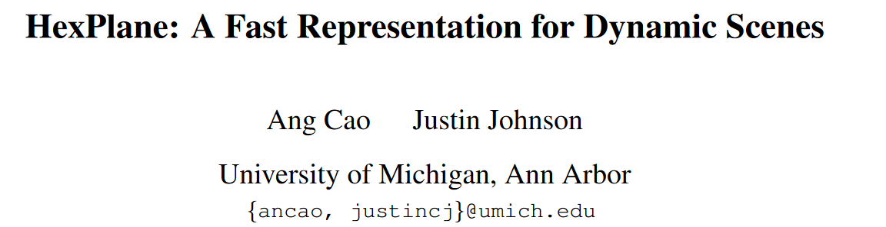

---

[9] Transforming Radiance Field with Lipschitz Network for Photorealistic 3D Scene Stylization

- 题目：使用Lipschitz网络转换辐射场以实现逼真的3D场景风格化
- 分类：3D风格迁移
- Code: none
- Paper: https://arxiv.org/pdf/2303.13232.pdf
- 摘要： 

> *Recent advances in 3D scene representation and novel view synthesis have witnessed the rise of Neural Radiance Fields (NeRFs). Nevertheless, it is not trivial to exploit NeRF for the photorealistic 3D scene stylization task, which aims to generate visually consistent and photorealistic stylized scenes from novel views. Simply coupling NeRF with photorealistic style transfer (PST) will result in cross-view inconsistency and degradation of stylized view syntheses. Through a thorough analysis, we demonstrate that this non-trivial task can be simplified in a new light: When transforming the appearance representation of a pre-trained NeRF with Lipschitz mapping, the consistency and photorealism across source views will be seamlessly encoded into the syntheses. That motivates us to build a concise and flexible learning framework namely LipRF, which upgrades arbitrary 2D PST methods with Lipschitz mapping tailored for the 3D scene. Technically, LipRF first pre-trains a radiance field to reconstruct the 3D scene, and then emulates the style on each view by 2D PST as the prior to learn a Lipschitz network to stylize the pre-trained appearance. In view of that Lipschitz condition highly impacts the expressivity of the neural network, we devise an adaptive regularization to balance the reconstruction and stylization. A gradual gradient aggregation strategy is further introduced to optimize LipRF in a cost-efficient manner. We conduct extensive experiments to show the high quality and robust performance of LipRF on both photorealistic 3D stylization and object appearance editing.*

- 图示：

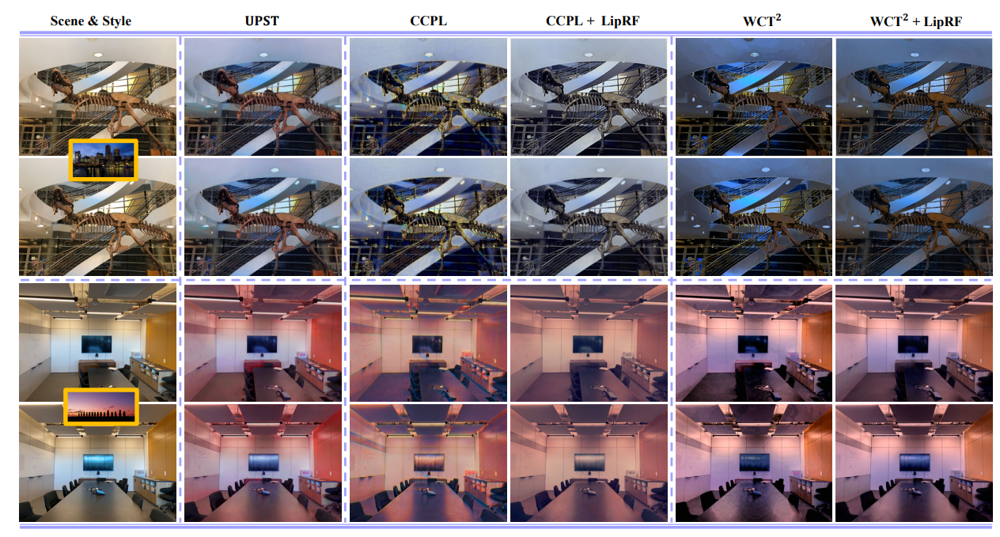

---

[10] PartNeRF: Generating Part-Aware Editable 3D Shapes without 3D Supervision

- 题目：PartNeRF：在没有3D监督的情况下生成部分感知可编辑的3D形状
- 分类：部分可编辑
- Project: https://ktertikas.github.io/part_nerf
- Code: https://github.com/ktertikas/part_nerf
- Paper: https://arxiv.org/pdf/2303.09554.pdf
- 摘要： 

> *Impressive progress in generative models and implicit representations gave rise to methods that can generate 3D shapes of high quality. However, being able to locally control and edit shapes is another essential property that can unlock several content creation applications. Local control can be achieved with part-aware models, but existing methods require 3D supervision and cannot produce textures. In this work, we devise PartNeRF, a novel part-aware generative model for editable 3D shape synthesis that does not require any explicit 3D supervision. Our model generates objects as a set of locally defined NeRFs, augmented with an affine transformation. This enables several editing operations such as applying transformations on parts, mixing parts from different objects etc. To ensure distinct, manipulable parts we enforce a hard assignment of rays to parts that makes sure that the color of each ray is only determined by a single NeRF. As a result, altering one part does not affect the appearance of the others. Evaluations on various ShapeNet categories demonstrate the ability of our model to generate editable 3D objects of improved fidelity, compared to previous part-based generative approaches that require 3D supervision or models relying on NeRFs.*

- 图示：

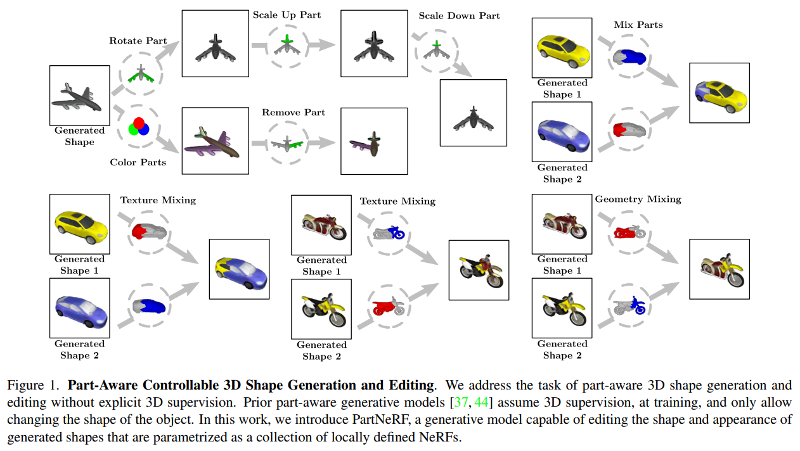

---

[11] Masked Wavelet Representation for Compact Neural Radiance Fields

- 题目：紧凑型神经辐射场的掩码小波表示
- 分类：节省内存
- Project: https://daniel03c1.github.io/masked_wavelet_nerf/
- Code: https://github.com/daniel03c1/masked_wavelet_nerf
- Paper: https://arxiv.org/pdf/2212.09069.pdf
- 摘要： 

> *Neural radiance fields (NeRF) have demonstrated the potential of coordinate-based neural representation (neural fields or implicit neural representation) in neural rendering. However, using a multi-layer perceptron (MLP) to represent a 3D scene or object requires enormous computational resources and time. There have been recent studies on how to reduce these computational inefficiencies by using additional data structures, such as grids or trees. Despite the promising performance, the explicit data structure necessitates a substantial amount of memory. In this work, we present a method to reduce the size without compromising the advantages of having additional data structures. In detail, we propose using the wavelet transform on grid-based neural fields. Grid-based neural fields are for fast convergence, and the wavelet transform, whose efficiency has been demonstrated in high-performance standard codecs, is to improve the parameter efficiency of grids. Furthermore, in order to achieve a higher sparsity of grid coefficients while maintaining reconstruction quality, we present a novel trainable masking approach. Experimental results demonstrate that non-spatial grid coefficients, such as wavelet coefficients, are capable of attaining a higher level of sparsity than spatial grid coefficients, resulting in a more compact representation. With our proposed mask and compression pipeline, we achieved state-of-the-art performance within a memory budget of 2 MB. Our code is available at [this https URL](https://github.com/daniel03c1/masked_wavelet_nerf).*

- 图示：

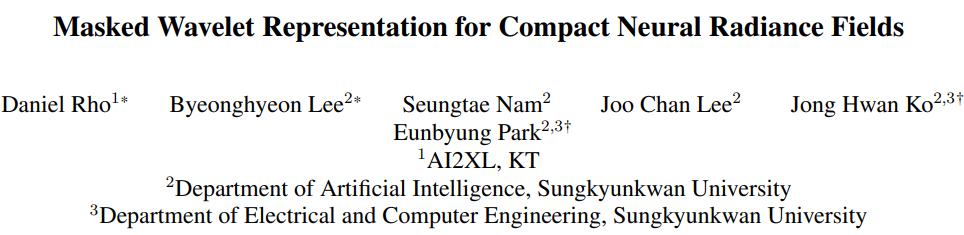

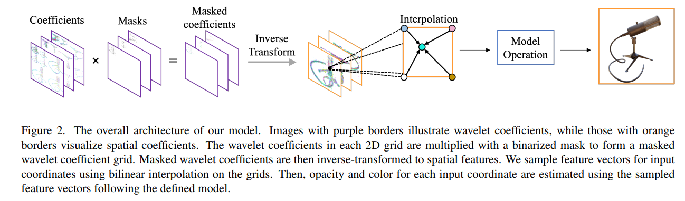

---

[12] Shape, Pose, and Appearance from a Single Image via Bootstrapped Radiance Field Inversion

- 题目：通过自举辐射场反演从单个图像中获取形状、姿势和外观
- 分类：单图3D重建
- Code: https://github.com/google-research/nerf-from-image
- Paper: https://arxiv.org/pdf/2211.11674.pdf
- 摘要： 

> *Neural Radiance Fields (NeRF) coupled with GANs represent a promising direction in the area of 3D reconstruction from a single view, owing to their ability to efficiently model arbitrary topologies. Recent work in this area, however, has mostly focused on synthetic datasets where exact ground-truth poses are known, and has overlooked pose estimation, which is important for certain downstream applications such as augmented reality (AR) and robotics. We introduce a principled end-to-end reconstruction framework for natural images, where accurate ground-truth poses are not available. Our approach recovers an SDF-parameterized 3D shape, pose, and appearance from a single image of an object, without exploiting multiple views during training. More specifically, we leverage an unconditional 3D-aware generator, to which we apply a hybrid inversion scheme where a model produces a first guess of the solution which is then refined via optimization. Our framework can de-render an image in as few as 10 steps, enabling its use in practical scenarios. We demonstrate state-of-the-art results on a variety of real and synthetic benchmarks.*

- 图示：

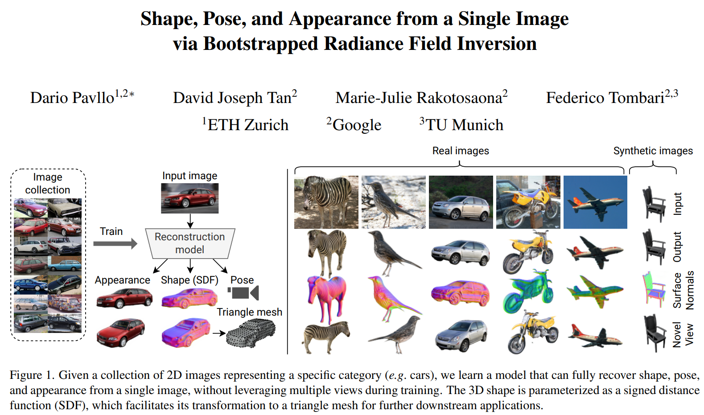

---

[13] NEF: Neural Edge Fields for 3D Parametric Curve Reconstruction from Multi-view Images

- 题目：NEF：用于从多视图图像重建3D参数曲线的神经边缘场
- 分类：3D边缘重建
- Project: https://yunfan1202.github.io/NEF/
- Code: https://github.com/yunfan1202/NEF_code
- Paper: https://arxiv.org/pdf/2303.07653.pdf
- 摘要： 

> *We study the problem of reconstructing 3D feature curves of an object from a set of calibrated multi-view images. To do so, we learn a neural implicit field representing the density distribution of 3D edges which we refer to as Neural Edge Field (NEF). Inspired by NeRF, NEF is optimized with a view-based rendering loss where a 2D edge map is rendered at a given view and is compared to the ground-truth edge map extracted from the image of that view. The rendering-based differentiable optimization of NEF fully exploits 2D edge detection, without needing a supervision of 3D edges, a 3D geometric operator or cross-view edge correspondence. Several technical designs are devised to ensure learning a range-limited and view-independent NEF for robust edge extraction. The final parametric 3D curves are extracted from NEF with an iterative optimization method. On our benchmark with synthetic data, we demonstrate that NEF outperforms existing state-of-the-art methods on all metrics. Project page: [this https URL](https://yunfan1202.github.io/NEF/).*

- 图示：

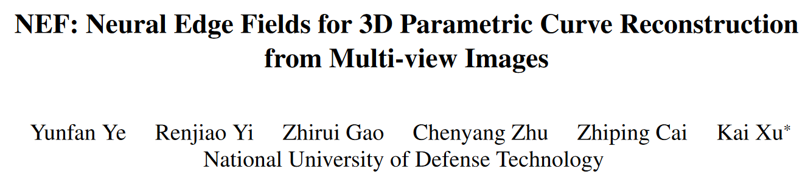

---

[14] NeuDA: Neural Deformable Anchor for High-Fidelity Implicit Surface Reconstruction

- 题目：NeuDA：用于高保真隐式表面重建的神经可变形锚
- 分类：保真表面重建
- Project: https://3d-front-future.github.io/neuda/
- Code: https://github.com/3D-FRONT-FUTURE/NeuDA
- Paper: https://arxiv.org/pdf/2303.02375.pdf
- 摘要： 

> *This paper studies implicit surface reconstruction leveraging differentiable ray casting. Previous works such as IDR and NeuS overlook the spatial context in 3D space when predicting and rendering the surface, thereby may fail to capture sharp local topologies such as small holes and structures. To mitigate the limitation, we propose a flexible neural implicit representation leveraging hierarchical voxel grids, namely Neural Deformable Anchor (NeuDA), for high-fidelity surface reconstruction. NeuDA maintains the hierarchical anchor grids where each vertex stores a 3D position (or anchor) instead of the direct embedding (or feature). We optimize the anchor grids such that different local geometry structures can be adaptively encoded. Besides, we dig into the frequency encoding strategies and introduce a simple hierarchical positional encoding method for the hierarchical anchor structure to flexibly exploit the properties of high-frequency and low-frequency geometry and appearance. Experiments on both the DTU and BlendedMVS datasets demonstrate that NeuDA can produce promising mesh surfaces.*

- 图示：

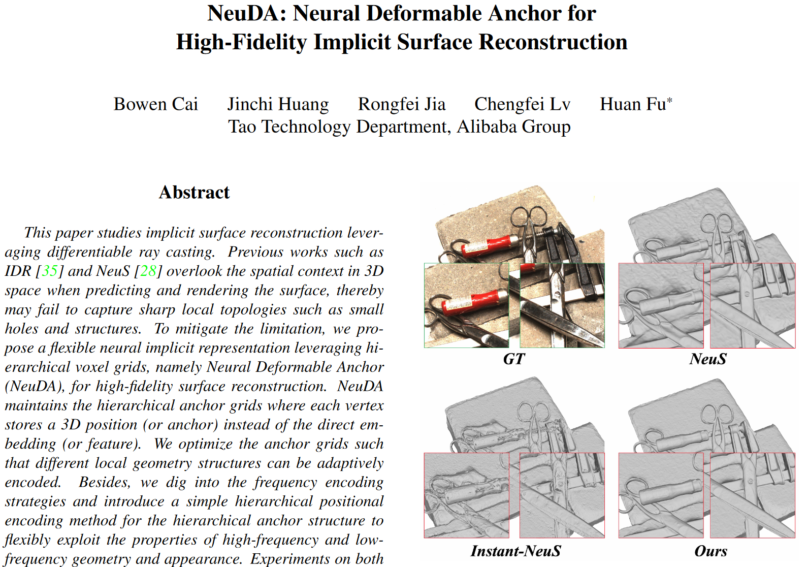

---

[15] FlexNeRF: Photorealistic Free-viewpoint Rendering of Moving Humans from Sparse Views

- 题目：FlexNeRF：从稀疏视图中移动人体的逼真自由视点渲染
- 分类：稀疏视图,人体建模
- Project: https://flex-nerf.github.io/
- Code: none
- Paper: https://arxiv.org/pdf/2303.14368.pdf
- 摘要： 

> *We present FlexNeRF, a method for photorealistic freeviewpoint rendering of humans in motion from monocular videos. Our approach works well with sparse views, which is a challenging scenario when the subject is exhibiting fast/complex motions. We propose a novel approach which jointly optimizes a canonical time and pose configuration, with a pose-dependent motion field and pose-independent temporal deformations complementing each other. Thanks to our novel temporal and cyclic consistency constraints along with additional losses on intermediate representation such as segmentation, our approach provides high quality outputs as the observed views become sparser. We empirically demonstrate that our method significantly outperforms the state-of-the-art on public benchmark datasets as well as a self-captured fashion dataset. The project page is available at: [this https URL](https://flex-nerf.github.io/)*

- 图示：

---

[16] DyLiN: Making Light Field Networks Dynamic

- 题目：DyLiN：使光场网络动态化
- 分类：动态场景
- Project: https://dylin2023.github.io/
- Code: https://github.com/Heng14/DyLiN
- Paper: https://arxiv.org/pdf/2303.14243.pdf
- 摘要： 

> *Light Field Networks, the re-formulations of radiance fields to oriented rays, are magnitudes faster than their coordinate network counterparts, and provide higher fidelity with respect to representing 3D structures from 2D observations. They would be well suited for generic scene representation and manipulation, but suffer from one problem: they are limited to holistic and static scenes. In this paper, we propose the Dynamic Light Field Network (DyLiN) method that can handle non-rigid deformations, including topological changes. We learn a deformation field from input rays to canonical rays, and lift them into a higher dimensional space to handle discontinuities. We further introduce CoDyLiN, which augments DyLiN with controllable attribute inputs. We train both models via knowledge distillation from pretrained dynamic radiance fields. We evaluated DyLiN using both synthetic and real world datasets that include various non-rigid deformations. DyLiN qualitatively outperformed and quantitatively matched state-of-the-art methods in terms of visual fidelity, while being 25 - 71x computationally faster. We also tested CoDyLiN on attribute annotated data and it surpassed its teacher model. Project page: [this https URL](https://dylin2023.github.io/) .*

- 图示：

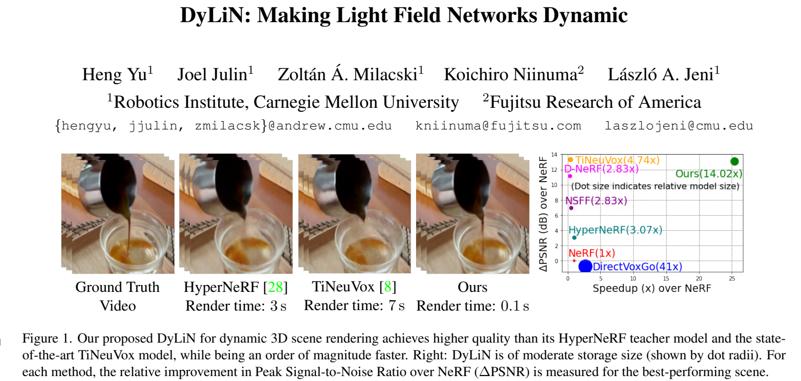

---

[17] DiffRF: Rendering-Guided 3D Radiance Field Diffusion

- 题目：DiffRF：渲染引导的3D辐射场扩散
- 分类：扩散模型
- Project: https://sirwyver.github.io/DiffRF/
- Code: none
- Paper: https://arxiv.org/pdf/2212.01206.pdf
- 摘要： 

> *We introduce DiffRF, a novel approach for 3D radiance field synthesis based on denoising diffusion probabilistic models. While existing diffusion-based methods operate on images, latent codes, or point cloud data, we are the first to directly generate volumetric radiance fields. To this end, we propose a 3D denoising model which directly operates on an explicit voxel grid representation. However, as radiance fields generated from a set of posed images can be ambiguous and contain artifacts, obtaining ground truth radiance field samples is non-trivial. We address this challenge by pairing the denoising formulation with a rendering loss, enabling our model to learn a deviated prior that favours good image quality instead of trying to replicate fitting errors like floating artifacts. In contrast to 2D-diffusion models, our model learns multi-view consistent priors, enabling free-view synthesis and accurate shape generation. Compared to 3D GANs, our diffusion-based approach naturally enables conditional generation such as masked completion or single-view 3D synthesis at inference time.*

- 图示：

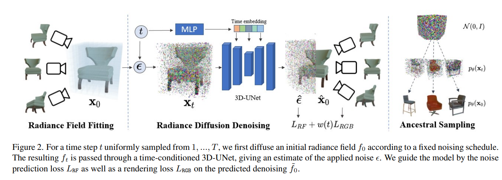

---

[18] JAWS: Just A Wild Shot for Cinematic Transfer in Neural Radiance Fields

- 题目：JAWS：只是神经辐射场中电影传输的疯狂镜头
- 分类：电影剪辑
- Project: https://www.lix.polytechnique.fr/vista/projects/2023_cvpr_wang/
- Code: https://github.com/robincourant/jaws
- Paper: https://arxiv.org/pdf/2303.15427.pdf
- 摘要： 

> *This paper presents JAWS, an optimization-driven approach that achieves the robust transfer of visual cinematic features from a reference in-the-wild video clip to a newly generated clip. To this end, we rely on an implicit-neural-representation (INR) in a way to compute a clip that shares the same cinematic features as the reference clip. We propose a general formulation of a camera optimization problem in an INR that computes extrinsic and intrinsic camera parameters as well as timing. By leveraging the differentiability of neural representations, we can back-propagate our designed cinematic losses measured on proxy estimators through a NeRF network to the proposed cinematic parameters directly. We also introduce specific enhancements such as guidance maps to improve the overall quality and efficiency. Results display the capacity of our system to replicate well known camera sequences from movies, adapting the framing, camera parameters and timing of the generated video clip to maximize the similarity with the reference clip.*

- 图示：

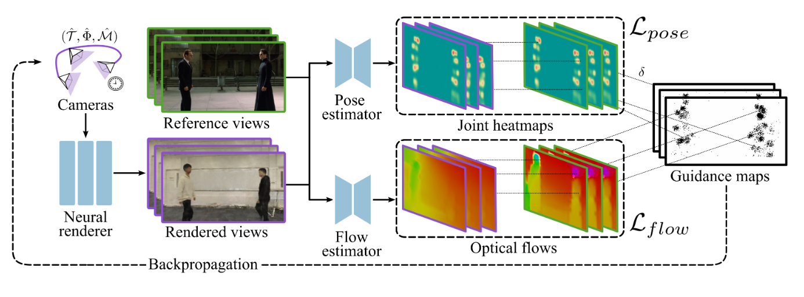

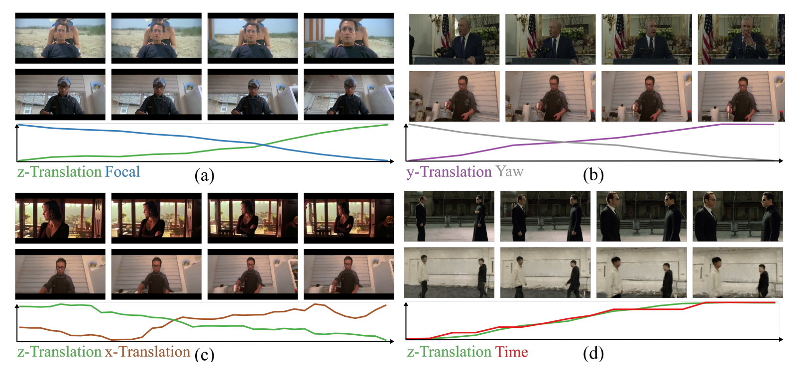

---

[19] Magic3D: High-Resolution Text-to-3D Content Creation

- 题目：Magic3D：高分辨率文本到3D内容创建
- 分类：Text-to-3D
- Project: https://research.nvidia.com/labs/dir/magic3d/
- Code: none
- Paper: https://arxiv.org/pdf/2211.10440.pdf
- 摘要： 

> *DreamFusion has recently demonstrated the utility of a pre-trained text-to-image diffusion model to optimize Neural Radiance Fields (NeRF), achieving remarkable text-to-3D synthesis results. However, the method has two inherent limitations: (a) extremely slow optimization of NeRF and (b) low-resolution image space supervision on NeRF, leading to low-quality 3D models with a long processing time. In this paper, we address these limitations by utilizing a two-stage optimization framework. First, we obtain a coarse model using a low-resolution diffusion prior and accelerate with a sparse 3D hash grid structure. Using the coarse representation as the initialization, we further optimize a textured 3D mesh model with an efficient differentiable renderer interacting with a high-resolution latent diffusion model. Our method, dubbed Magic3D, can create high quality 3D mesh models in 40 minutes, which is 2x faster than DreamFusion (reportedly taking 1.5 hours on average), while also achieving higher resolution. User studies show 61.7% raters to prefer our approach over DreamFusion. Together with the image-conditioned generation capabilities, we provide users with new ways to control 3D synthesis, opening up new avenues to various creative applications.*

- 图示：

---

[20] SUDS: Scalable Urban Dynamic Scenes

- 题目：SUDS：可扩展的城市动态场景
- 分类：城市动态场景
- Project: https://haithemturki.com/suds/
- Code: https://github.com/hturki/suds
- Paper: https://arxiv.org/pdf/2303.14536.pdf
- 摘要： 

> *We extend neural radiance fields (NeRFs) to dynamic large-scale urban scenes. Prior work tends to reconstruct single video clips of short durations (up to 10 seconds). Two reasons are that such methods (a) tend to scale linearly with the number of moving objects and input videos because a separate model is built for each and (b) tend to require supervision via 3D bounding boxes and panoptic labels, obtained manually or via category-specific models. As a step towards truly open-world reconstructions of dynamic cities, we introduce two key innovations: (a) we factorize the scene into three separate hash table data structures to efficiently encode static, dynamic, and far-field radiance fields, and (b) we make use of unlabeled target signals consisting of RGB images, sparse LiDAR, off-the-shelf self-supervised 2D descriptors, and most importantly, 2D optical flow.
> Operationalizing such inputs via photometric, geometric, and feature-metric reconstruction losses enables SUDS to decompose dynamic scenes into the static background, individual objects, and their motions. When combined with our multi-branch table representation, such reconstructions can be scaled to tens of thousands of objects across 1.2 million frames from 1700 videos spanning geospatial footprints of hundreds of kilometers, (to our knowledge) the largest dynamic NeRF built to date.
> We present qualitative initial results on a variety of tasks enabled by our representations, including novel-view synthesis of dynamic urban scenes, unsupervised 3D instance segmentation, and unsupervised 3D cuboid detection. To compare to prior work, we also evaluate on KITTI and Virtual KITTI 2, surpassing state-of-the-art methods that rely on ground truth 3D bounding box annotations while being 10x quicker to train.*

- 图示：

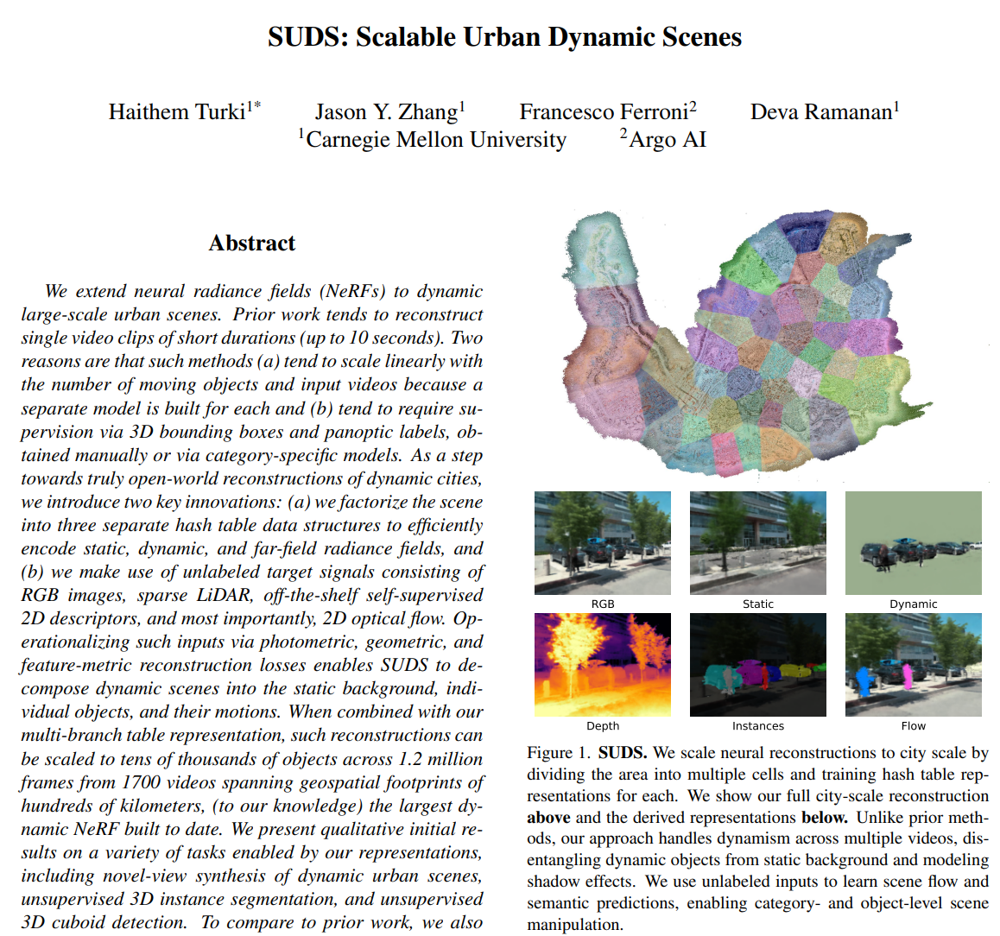

---

[21] NeRF-DS: Neural Radiance Fields for Dynamic Specular Objects

- 题目：NeRF-DS：动态镜面物体的神经辐射场
- 分类：动态场景,光照反射
- Code: https://github.com/JokerYan/NeRF-DS
- Paper: https://arxiv.org/pdf/2303.14435.pdf
- 摘要： 

> *Dynamic Neural Radiance Field (NeRF) is a powerful algorithm capable of rendering photo-realistic novel view images from a monocular RGB video of a dynamic scene. Although it warps moving points across frames from the observation spaces to a common canonical space for rendering, dynamic NeRF does not model the change of the reflected color during the warping. As a result, this approach often fails drastically on challenging specular objects in motion. We address this limitation by reformulating the neural radiance field function to be conditioned on surface position and orientation in the observation space. This allows the specular surface at different poses to keep the different reflected colors when mapped to the common canonical space. Additionally, we add the mask of moving objects to guide the deformation field. As the specular surface changes color during motion, the mask mitigates the problem of failure to find temporal correspondences with only RGB supervision. We evaluate our model based on the novel view synthesis quality with a self-collected dataset of different moving specular objects in realistic environments. The experimental results demonstrate that our method significantly improves the reconstruction quality of moving specular objects from monocular RGB videos compared to the existing NeRF models. Our code and data are available at the project website [this https URL](https://github.com/JokerYan/NeRF-DS).*

- 图示：

---

[22] Ref-NPR: Reference-Based Non-Photorealistic Radiance Fields for Controllable Scene Stylization

- 题目：Ref-NPR：用于可控场景风格化的基于参考的非真实感辐射场
- 分类：3D场景风格化
- Project: https://ref-npr.github.io/
- Code: https://github.com/dvlab-research/Ref-NPR
- Paper: https://arxiv.org/pdf/2212.02766.pdf
- 摘要： 

> *Current 3D scene stylization methods transfer textures and colors as styles using arbitrary style references, lacking meaningful semantic correspondences. We introduce Reference-Based Non-Photorealistic Radiance Fields (Ref-NPR) to address this limitation. This controllable method stylizes a 3D scene using radiance fields with a single stylized 2D view as a reference. We propose a ray registration process based on the stylized reference view to obtain pseudo-ray supervision in novel views. Then we exploit semantic correspondences in content images to fill occluded regions with perceptually similar styles, resulting in non-photorealistic and continuous novel view sequences. Our experimental results demonstrate that Ref-NPR outperforms existing scene and video stylization methods regarding visual quality and semantic correspondence. The code and data are publicly available on the project page at [this https URL](https://ref-npr.github.io/).*

- 图示：

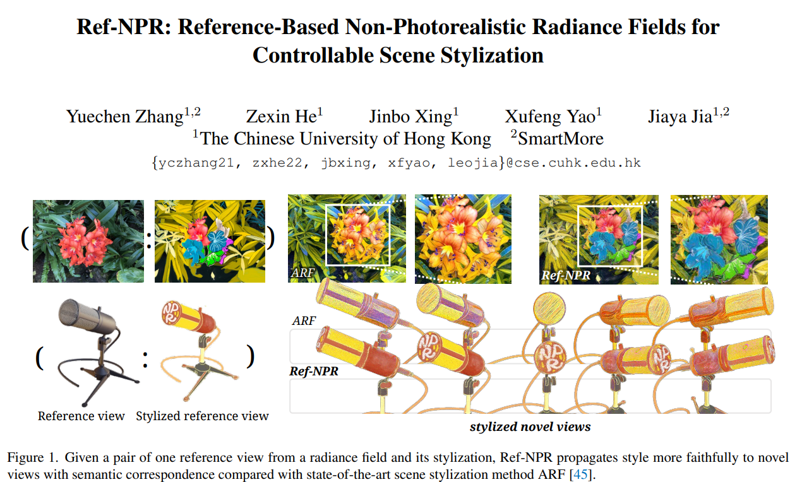

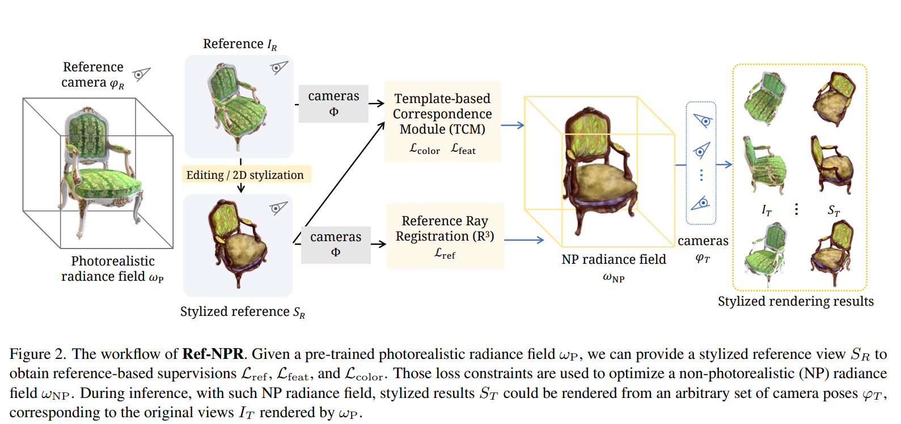

---

[23] Interactive Segmentation of Radiance Fields

- 题目：辐射场的交互式分割
- 分类：交互式场景分割
- Project: https://rahul-goel.github.io/isrf/
- Code: https://github.com/rahul-goel/isrf_code
- Paper: https://arxiv.org/pdf/2212.13545.pdf
- 摘要： 

> *Radiance Fields (RF) are popular to represent casually-captured scenes for new view synthesis and several applications beyond it. Mixed reality on personal spaces needs understanding and manipulating scenes represented as RFs, with semantic segmentation of objects as an important step. Prior segmentation efforts show promise but don't scale to complex objects with diverse appearance. We present the ISRF method to interactively segment objects with fine structure and appearance. Nearest neighbor feature matching using distilled semantic features identifies high-confidence seed regions. Bilateral search in a joint spatio-semantic space grows the region to recover accurate segmentation. We show state-of-the-art results of segmenting objects from RFs and compositing them to another scene, changing appearance, etc., and an interactive segmentation tool that others can use.
> Project Page: [this https URL](https://rahul-goel.github.io/isrf/)*

- 图示：

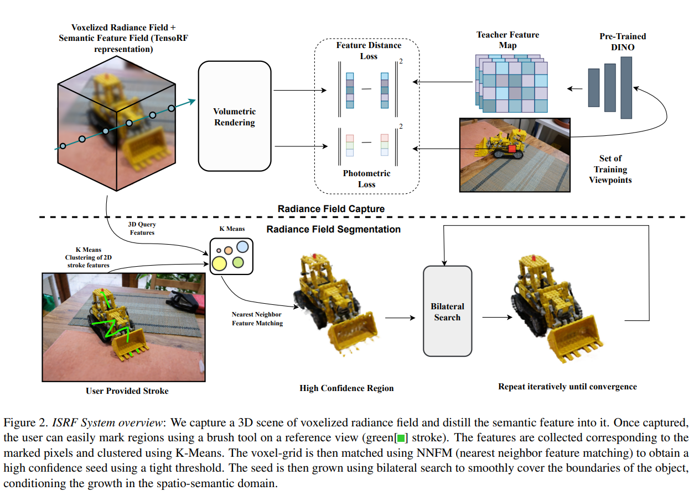

---

[24] GM-NeRF: Learning Generalizable Model-based Neural Radiance Fields from Multi-view Images

- 题目：GM-NeRF：从多视图图像中学习可泛化的基于模型的神经辐射场
- 分类：人体重建,可泛化
- Code: https://github.com/JanaldoChen/GM-NeRF
- Paper: https://arxiv.org/pdf/2303.13777.pdf
- 摘要： 

> *In this work, we focus on synthesizing high-fidelity novel view images.for arbitrary human performers, given a set of sparse multi-view images. It is a challenging task due to the large variation among articulated body poses and heavy self-occlusions. To alleviate this, we introduce an effective generalizable framework Generalizable Model-based Neural Radiance Fields (GM-NeRF) to synthesize free-viewpoint images. Specifically, we propose a geometry-guided attention mechanism to register the appearance code from multi-view 2D images to a geometry proxy which can alleviate the misalignment between inaccurate geometry prior and pixel space. On top of that, we further conduct neural rendering and partial gradient backpropagation for efficient perceptual supervision and improvement of the perceptual quality of synthesis. To evaluate our method, we conduct experiments on synthesized datasets THuman2.0 and Multi-garment, and real-world datasets Genebody and ZJUMocap. The results demonstrate that our approach outperforms state-of-the-art methods in terms of novel view synthesis and geometric reconstruction.*

- 图示：

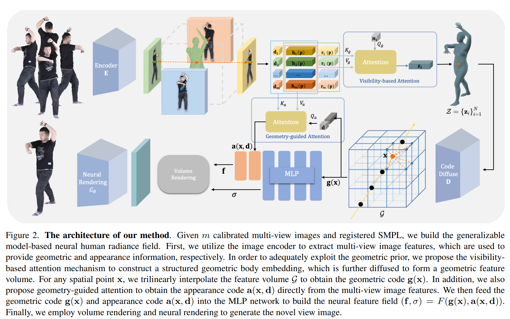

---

[25] Progressively Optimized Local Radiance Fields for Robust View Synthesis

- 题目：渐进优化的局部辐射场，用于稳健的视图合成
- 分类：增量重建，联合估计位姿，室内室外
- Project: https://localrf.github.io/
- Code: https://github.com/facebookresearch/localrf
- Paper: https://arxiv.org/pdf/2303.13791.pdf
- 摘要： 

> *We present an algorithm for reconstructing the radiance field of a large-scale scene from a single casually captured video. The task poses two core challenges. First, most existing radiance field reconstruction approaches rely on accurate pre-estimated camera poses from Structure-from-Motion algorithms, which frequently fail on in-the-wild videos. Second, using a single, global radiance field with finite representational capacity does not scale to longer trajectories in an unbounded scene. For handling unknown poses, we jointly estimate the camera poses with radiance field in a progressive manner. We show that progressive optimization significantly improves the robustness of the reconstruction. For handling large unbounded scenes, we dynamically allocate new local radiance fields trained with frames within a temporal window. This further improves robustness (e.g., performs well even under moderate pose drifts) and allows us to scale to large scenes. Our extensive evaluation on the Tanks and Temples dataset and our collected outdoor dataset, Static Hikes, show that our approach compares favorably with the state-of-the-art.*

- 图示：

---

[26] ABLE-NeRF: Attention-Based Rendering with Learnable Embeddings for Neural Radiance Field

- 题目：ABLE-NeRF：基于注意力的神经辐射场可学习嵌入渲染
- 分类：注意力机制
- Code: https://github.com/TangZJ/able-nerf
- Paper: https://arxiv.org/pdf/2303.13817.pdf
- 摘要： 

> *Neural Radiance Field (NeRF) is a popular method in representing 3D scenes by optimising a continuous volumetric scene function. Its large success which lies in applying volumetric rendering (VR) is also its Achilles' heel in producing view-dependent effects. As a consequence, glossy and transparent surfaces often appear murky. A remedy to reduce these artefacts is to constrain this VR equation by excluding volumes with back-facing normal. While this approach has some success in rendering glossy surfaces, translucent objects are still poorly represented. In this paper, we present an alternative to the physics-based VR approach by introducing a self-attention-based framework on volumes along a ray. In addition, inspired by modern game engines which utilise Light Probes to store local lighting passing through the scene, we incorporate Learnable Embeddings to capture view dependent effects within the scene. Our method, which we call ABLE-NeRF, significantly reduces `blurry' glossy surfaces in rendering and produces realistic translucent surfaces which lack in prior art. In the Blender dataset, ABLE-NeRF achieves SOTA results and surpasses Ref-NeRF in all 3 image quality metrics PSNR, SSIM, LPIPS.*

- 图示：

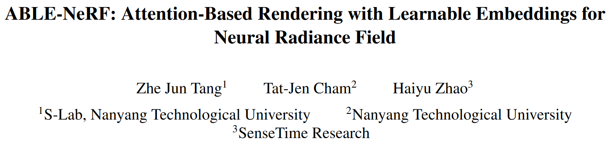

---

[27] SINE: Semantic-driven Image-based NeRF Editing with Prior-guided Editing Field

- 题目：SINE：语义驱动的基于图像的NeRF编辑，具有先验引导编辑字段
- 分类：可编辑
- Project: https://zju3dv.github.io/sine/
- Code: https://github.com/zju3dv/SINE
- Paper: https://arxiv.org/pdf/2303.13277.pdf
- 摘要： 

> *Despite the great success in 2D editing using user-friendly tools, such as Photoshop, semantic strokes, or even text prompts, similar capabilities in 3D areas are still limited, either relying on 3D modeling skills or allowing editing within only a few categories. In this paper, we present a novel semantic-driven NeRF editing approach, which enables users to edit a neural radiance field with a single image, and faithfully delivers edited novel views with high fidelity and multi-view consistency. To achieve this goal, we propose a prior-guided editing field to encode fine-grained geometric and texture editing in 3D space, and develop a series of techniques to aid the editing process, including cyclic constraints with a proxy mesh to facilitate geometric supervision, a color compositing mechanism to stabilize semantic-driven texture editing, and a feature-cluster-based regularization to preserve the irrelevant content unchanged. Extensive experiments and editing examples on both real-world and synthetic data demonstrate that our method achieves photo-realistic 3D editing using only a single edited image, pushing the bound of semantic-driven editing in 3D real-world scenes. Our project webpage: [this https URL](https://zju3dv.github.io/sine/).*

- 图示：

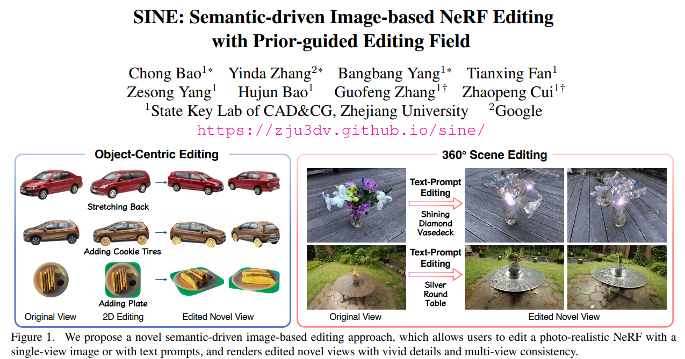

---

[28] RUST: Latent Neural Scene Representations from Unposed Imagery

- 题目：RUST：来自未处理图像的潜在神经场景表征
- 分类：没有位姿 NeRF without pose
- Project: https://rust-paper.github.io/
- Code: none
- Paper: https://arxiv.org/pdf/2211.14306.pdf
- 摘要： 

> *Inferring the structure of 3D scenes from 2D observations is a fundamental challenge in computer vision. Recently popularized approaches based on neural scene representations have achieved tremendous impact and have been applied across a variety of applications. One of the major remaining challenges in this space is training a single model which can provide latent representations which effectively generalize beyond a single scene. Scene Representation Transformer (SRT) has shown promise in this direction, but scaling it to a larger set of diverse scenes is challenging and necessitates accurately posed ground truth data. To address this problem, we propose RUST (Really Unposed Scene representation Transformer), a pose-free approach to novel view synthesis trained on RGB images alone. Our main insight is that one can train a Pose Encoder that peeks at the target image and learns a latent pose embedding which is used by the decoder for view synthesis. We perform an empirical investigation into the learned latent pose structure and show that it allows meaningful test-time camera transformations and accurate explicit pose readouts. Perhaps surprisingly, RUST achieves similar quality as methods which have access to perfect camera pose, thereby unlocking the potential for large-scale training of amortized neural scene representations.*

- 图示：

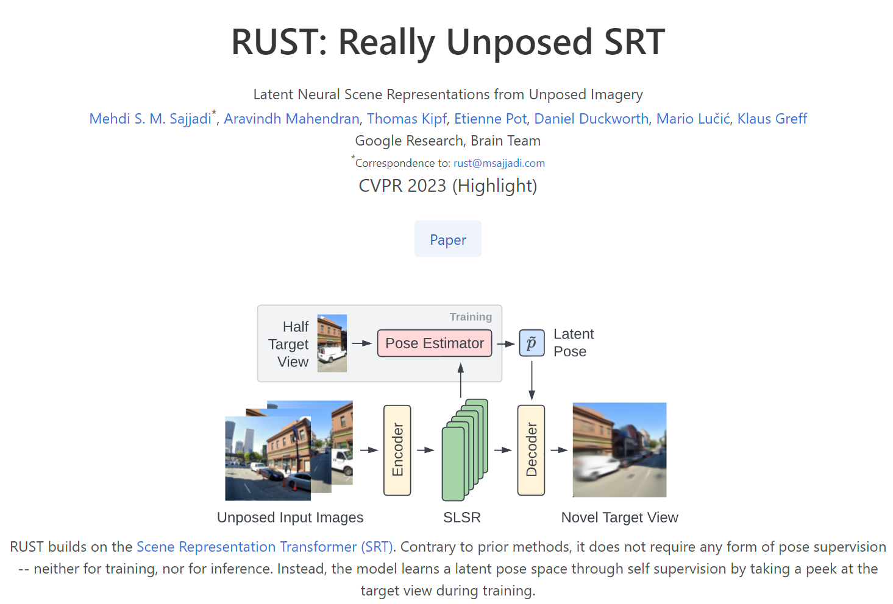

---

[29] SPARF: Neural Radiance Fields from Sparse and Noisy Poses

- 题目：SPARF：来自稀疏和噪声位姿的神经辐射场
- 分类：稀疏视图，位姿不准
- Project: http://prunetruong.com/sparf.github.io/
- Code: None
- Paper: https://arxiv.org/pdf/2211.11738.pdf
- 摘要： 

> *Neural Radiance Field (NeRF) has recently emerged as a powerful representation to synthesize photorealistic novel views. While showing impressive performance, it relies on the availability of dense input views with highly accurate camera poses, thus limiting its application in real-world scenarios. In this work, we introduce Sparse Pose Adjusting Radiance Field (SPARF), to address the challenge of novel-view synthesis given only few wide-baseline input images (as low as 3) with noisy camera poses. Our approach exploits multi-view geometry constraints in order to jointly learn the NeRF and refine the camera poses. By relying on pixel matches extracted between the input views, our multi-view correspondence objective enforces the optimized scene and camera poses to converge to a global and geometrically accurate solution. Our depth consistency loss further encourages the reconstructed scene to be consistent from any viewpoint. Our approach sets a new state of the art in the sparse-view regime on multiple challenging datasets.*

- 图示：

---

[30] EventNeRF: Neural Radiance Fields from a Single Colour Event Camera

- 题目：EventNeRF：单色事件相机的神经辐射场
- 分类：事件相机
- Project: https://4dqv.mpi-inf.mpg.de/EventNeRF/
- Code: https://github.com/r00tman/EventNeRF
- Paper: https://arxiv.org/pdf/2206.11896.pdf
- 摘要： 

> *Asynchronously operating event cameras find many applications due to their high dynamic range, vanishingly low motion blur, low latency and low data bandwidth. The field saw remarkable progress during the last few years, and existing event-based 3D reconstruction approaches recover sparse point clouds of the scene. However, such sparsity is a limiting factor in many cases, especially in computer vision and graphics, that has not been addressed satisfactorily so far. Accordingly, this paper proposes the first approach for 3D-consistent, dense and photorealistic novel view synthesis using just a single colour event stream as input. At its core is a neural radiance field trained entirely in a self-supervised manner from events while preserving the original resolution of the colour event channels. Next, our ray sampling strategy is tailored to events and allows for data-efficient training. At test, our method produces results in the RGB space at unprecedented quality. We evaluate our method qualitatively and numerically on several challenging synthetic and real scenes and show that it produces significantly denser and more visually appealing renderings than the existing methods. We also demonstrate robustness in challenging scenarios with fast motion and under low lighting conditions. We release the newly recorded dataset and our source code to facilitate the research field, see [this https URL](https://4dqv.mpi-inf.mpg.de/EventNeRF).*

- 图示：

---

[31] Grid-guided Neural Radiance Fields for Large Urban Scenes

- 题目：基于网格引导的神经辐射场的大型城市场景重建
- 分类：大规模街景重建
- Project: https://city-super.github.io/gridnerf/
- Code: None
- Paper: https://arxiv.org/pdf/2303.14001.pdf
- 摘要： 

> *Purely MLP-based neural radiance fields (NeRF-based methods) often suffer from underfitting with blurred renderings on large-scale scenes due to limited model capacity. Recent approaches propose to geographically divide the scene and adopt multiple sub-NeRFs to model each region individually, leading to linear scale-up in training costs and the number of sub-NeRFs as the scene expands. An alternative solution is to use a feature grid representation, which is computationally efficient and can naturally scale to a large scene with increased grid resolutions. However, the feature grid tends to be less constrained and often reaches suboptimal solutions, producing noisy artifacts in renderings, especially in regions with complex geometry and texture. In this work, we present a new framework that realizes high-fidelity rendering on large urban scenes while being computationally efficient. We propose to use a compact multiresolution ground feature plane representation to coarsely capture the scene, and complement it with positional encoding inputs through another NeRF branch for rendering in a joint learning fashion. We show that such an integration can utilize the advantages of two alternative solutions: a light-weighted NeRF is sufficient, under the guidance of the feature grid representation, to render photorealistic novel views with fine details; and the jointly optimized ground feature planes, can meanwhile gain further refinements, forming a more accurate and compact feature space and output much more natural rendering results.*

- 图示：

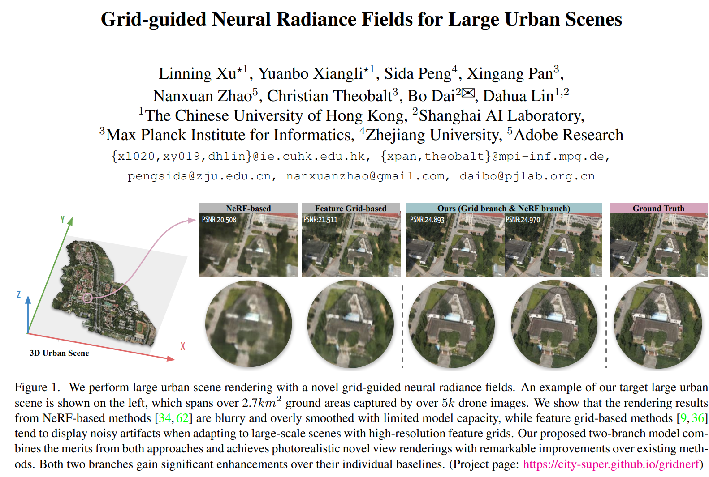

---

[32] HandNeRF: Neural Radiance Fields for Animatable Interacting Hands

- 题目：HandNeRF：可动画交互手的神经辐射场
- 分类：手部重建
- Code: none
- Paper: https://arxiv.org/pdf/2303.13825.pdf
- 摘要： 

> *We propose a novel framework to reconstruct accurate appearance and geometry with neural radiance fields (NeRF) for interacting hands, enabling the rendering of photo-realistic images and videos for gesture animation from arbitrary views. Given multi-view images of a single hand or interacting hands, an off-the-shelf skeleton estimator is first employed to parameterize the hand poses. Then we design a pose-driven deformation field to establish correspondence from those different poses to a shared canonical space, where a pose-disentangled NeRF for one hand is optimized. Such unified modeling efficiently complements the geometry and texture cues in rarely-observed areas for both hands. Meanwhile, we further leverage the pose priors to generate pseudo depth maps as guidance for occlusion-aware density learning. Moreover, a neural feature distillation method is proposed to achieve cross-domain alignment for color optimization. We conduct extensive experiments to verify the merits of our proposed HandNeRF and report a series of state-of-the-art results both qualitatively and quantitatively on the large-scale InterHand2.6M dataset.*

- 图示：

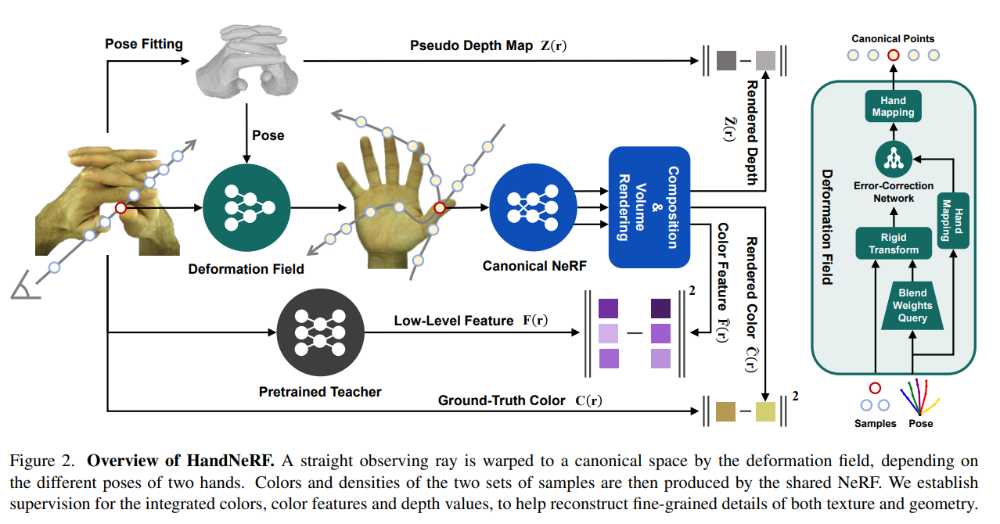

---

[33] Robust Dynamic Radiance Fields

- 题目：鲁棒动态辐射场
- 分类：动态场景
- Code: https://robust-dynrf.github.io/
- Paper: https://robust-dynrf.github.io/
- 摘要： 

> *Dynamic radiance field reconstruction methods aim to model the time-varying structure and appearance of a dynamic scene. Existing methods, however, assume that accurate camera poses can be reliably estimated by Structure from Motion (SfM) algorithms. These methods, thus, are unreliable as SfM algorithms often fail or produce erroneous poses on challenging videos with highly dynamic objects, poorly textured surfaces, and rotating camera motion. We address this robustness issue by jointly estimating the static and dynamic radiance fields along with the camera parameters (poses and focal length). We demonstrate the robustness of our approach via extensive quantitative and qualitative experiments. Our results show favorable performance over the state-of-the-art dynamic view synthesis methods.*

- 图示：

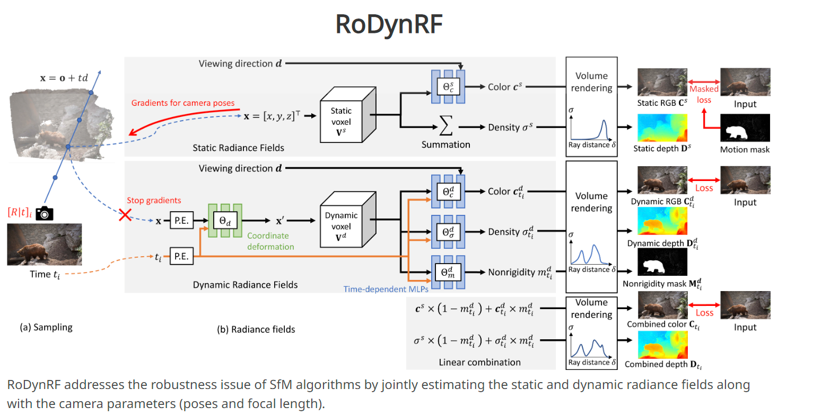

---

[34] MobileNeRF: Exploiting the Polygon Rasterization Pipeline for Efficient Neural Field Rendering on Mobile Architectures

- 题目：MobileNeRF：利用多边形光栅化管线在移动架构上实现高效的神经场渲染
- 分类：移动设备,快速渲染
- Project: https://mobile-nerf.github.io/
- Code: https://github.com/google-research/jax3d/tree/main/jax3d/projects/mobilenerf
- Paper: https://arxiv.org/pdf/2208.00277.pdf
- 摘要： 

> *Neural Radiance Fields (NeRFs) have demonstrated amazing ability to synthesize images of 3D scenes from novel views. However, they rely upon specialized volumetric rendering algorithms based on ray marching that are mismatched to the capabilities of widely deployed graphics hardware. This paper introduces a new NeRF representation based on textured polygons that can synthesize novel images efficiently with standard rendering pipelines. The NeRF is represented as a set of polygons with textures representing binary opacities and feature vectors. Traditional rendering of the polygons with a z-buffer yields an image with features at every pixel, which are interpreted by a small, view-dependent MLP running in a fragment shader to produce a final pixel color. This approach enables NeRFs to be rendered with the traditional polygon rasterization pipeline, which provides massive pixel-level parallelism, achieving interactive frame rates on a wide range of compute platforms, including mobile phones.*

- 图示：

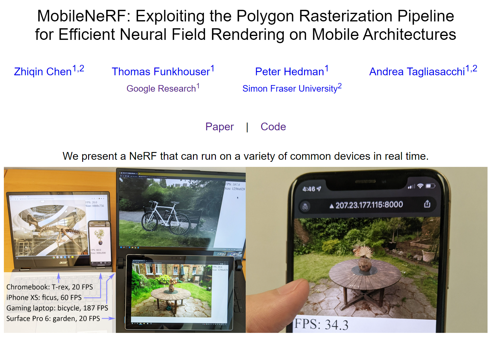

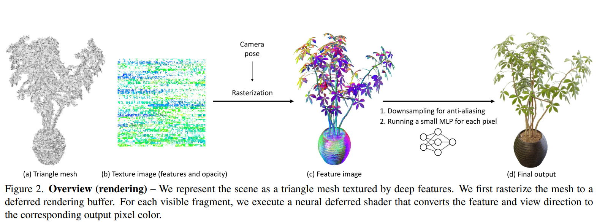

---

[35] Semantic Ray: Learning a Generalizable Semantic Field with Cross-Reprojection Attention

- 题目：语义射线：学习具有交叉重投影注意的可泛化语义场
- 分类：可泛化语义分割
- Project: https://liuff19.github.io/S-Ray/
- Code: https://github.com/liuff19/Semantic-Ray
- Paper: https://arxiv.org/pdf/2303.13014.pdf
- 摘要： 

> *In this paper, we aim to learn a semantic radiance field from multiple scenes that is accurate, efficient and generalizable. While most existing NeRFs target at the tasks of neural scene rendering, image synthesis and multi-view reconstruction, there are a few attempts such as Semantic-NeRF that explore to learn high-level semantic understanding with the NeRF structure. However, Semantic-NeRF simultaneously learns color and semantic label from a single ray with multiple heads, where the single ray fails to provide rich semantic information. As a result, Semantic NeRF relies on positional encoding and needs to train one specific model for each scene. To address this, we propose Semantic Ray (S-Ray) to fully exploit semantic information along the ray direction from its multi-view reprojections. As directly performing dense attention over multi-view reprojected rays would suffer from heavy computational cost, we design a Cross-Reprojection Attention module with consecutive intra-view radial and cross-view sparse attentions, which decomposes contextual information along reprojected rays and cross multiple views and then collects dense connections by stacking the modules. Experiments show that our S-Ray is able to learn from multiple scenes, and it presents strong generalization ability to adapt to unseen scenes.*

- 图示：

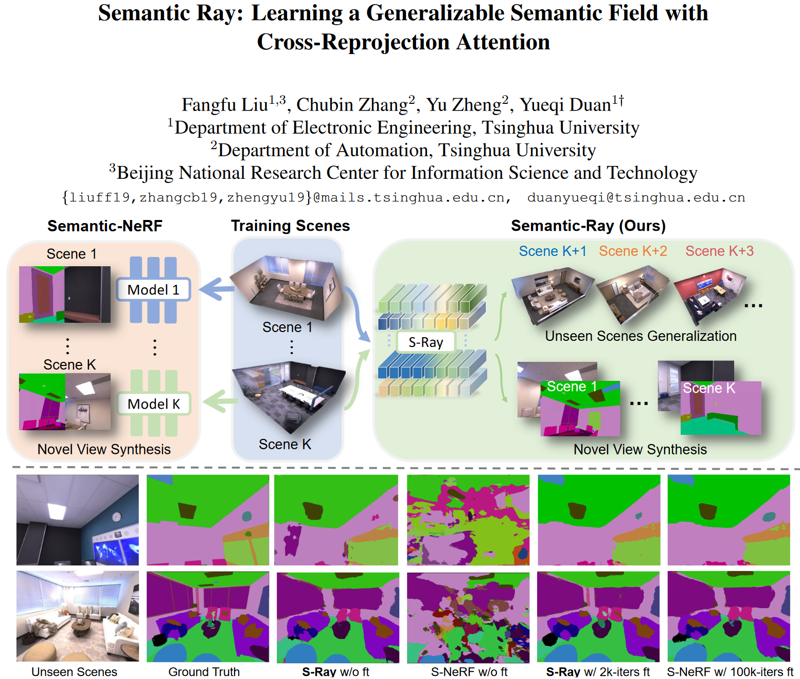

---

[36] Balanced Spherical Grid for Egocentric View Synthesis

- 题目：用于以自我为中心的视图合成的平衡球形网格
- 分类：自拍VR
- Project: https://changwoon.info/publications/EgoNeRF
- Code: https://github.com/changwoonchoi/EgoNeRF
- Paper: https://arxiv.org/pdf/2303.12408.pdf
- 摘要： 

> *We present EgoNeRF, a practical solution to reconstruct large-scale real-world environments for VR assets. Given a few seconds of casually captured 360 video, EgoNeRF can efficiently build neural radiance fields which enable high-quality rendering from novel viewpoints. Motivated by the recent acceleration of NeRF using feature grids, we adopt spherical coordinate instead of conventional Cartesian coordinate. Cartesian feature grid is inefficient to represent large-scale unbounded scenes because it has a spatially uniform resolution, regardless of distance from viewers. The spherical parameterization better aligns with the rays of egocentric images, and yet enables factorization for performance enhancement. However, the naïve spherical grid suffers from irregularities at two poles, and also cannot represent unbounded scenes. To avoid singularities near poles, we combine two balanced grids, which results in a quasi-uniform angular grid. We also partition the radial grid exponentially and place an environment map at infinity to represent unbounded scenes. Furthermore, with our resampling technique for grid-based methods, we can increase the number of valid samples to train NeRF volume. We extensively evaluate our method in our newly introduced synthetic and real-world egocentric 360 video datasets, and it consistently achieves state-of-the-art performance.*

- 图示：

---

[37] ShadowNeuS: Neural SDF Reconstruction by Shadow Ray Supervision

- 题目：ShadowNeuS： 通过阴影射线监督进行神经SDF重建
- 分类：阴影射线监督
- Project: https://gerwang.github.io/shadowneus/
- Code: https://github.com/gerwang/ShadowNeuS
- Paper: https://arxiv.org/pdf/2211.14086.pdf
- 摘要： 

> *By supervising camera rays between a scene and multi-view image planes, NeRF reconstructs a neural scene representation for the task of novel view synthesis. On the other hand, shadow rays between the light source and the scene have yet to be considered. Therefore, we propose a novel shadow ray supervision scheme that optimizes both the samples along the ray and the ray location. By supervising shadow rays, we successfully reconstruct a neural SDF of the scene from single-view images under multiple lighting conditions. Given single-view binary shadows, we train a neural network to reconstruct a complete scene not limited by the camera's line of sight. By further modeling the correlation between the image colors and the shadow rays, our technique can also be effectively extended to RGB inputs. We compare our method with previous works on challenging tasks of shape reconstruction from single-view binary shadow or RGB images and observe significant improvements. The code and data are available at [this https URL](https://github.com/gerwang/ShadowNeuS).*

- 图示：

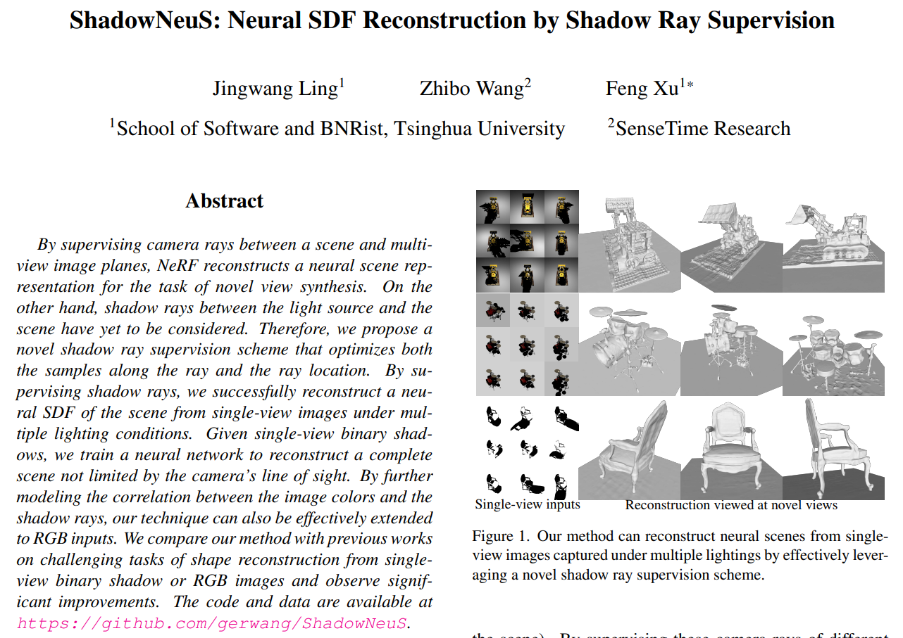

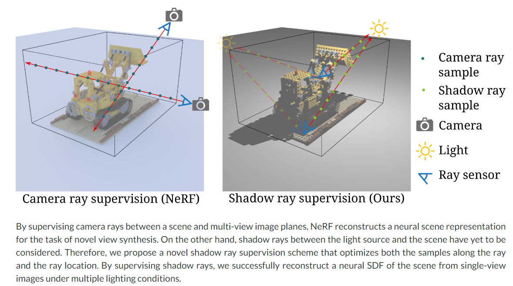

---

[38] SPIn-NeRF: Multiview Segmentation and Perceptual Inpainting with Neural Radiance Fields

- 题目：SPIn-NeRF：用神经辐射场进行多视角分割和知觉绘画
- 分类：可编辑(三维绘画)，移除物体
- Project: https://spinnerf3d.github.io/
- Code: none
- Paper: https://arxiv.org/pdf/2211.12254.pdf
- 摘要： 

> *Neural Radiance Fields (NeRFs) have emerged as a popular approach for novel view synthesis. While NeRFs are quickly being adapted for a wider set of applications, intuitively editing NeRF scenes is still an open challenge. One important editing task is the removal of unwanted objects from a 3D scene, such that the replaced region is visually plausible and consistent with its context. We refer to this task as 3D inpainting. In 3D, solutions must be both consistent across multiple views and geometrically valid. In this paper, we propose a novel 3D inpainting method that addresses these challenges. Given a small set of posed images and sparse annotations in a single input image, our framework first rapidly obtains a 3D segmentation mask for a target object. Using the mask, a perceptual optimizationbased approach is then introduced that leverages learned 2D image inpainters, distilling their information into 3D space, while ensuring view consistency. We also address the lack of a diverse benchmark for evaluating 3D scene inpainting methods by introducing a dataset comprised of challenging real-world scenes. In particular, our dataset contains views of the same scene with and without a target object, enabling more principled benchmarking of the 3D inpainting task. We first demonstrate the superiority of our approach on multiview segmentation, comparing to NeRFbased methods and 2D segmentation approaches. We then evaluate on the task of 3D inpainting, establishing state-ofthe-art performance against other NeRF manipulation algorithms, as well as a strong 2D image inpainter baseline. Project Page: [this https URL](https://spinnerf3d.github.io/)*

- 图示：

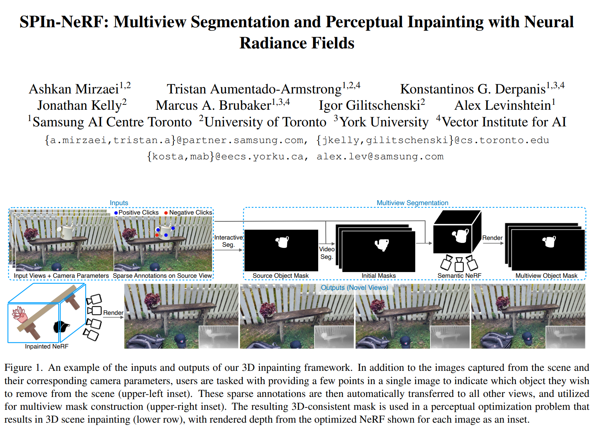

---

[39] DP-NeRF: Deblurred Neural Radiance Field with Physical Scene Priors

- 题目：DP-NeRF：带有物理场景先验的去模糊的神经辐射场
- 分类：去模糊
- Project: https://dogyoonlee.github.io/dpnerf/
- Code: https://github.com/dogyoonlee/DP-NeRF
- Paper: https://arxiv.org/pdf/2211.12046.pdf
- 摘要： 

> *Neural Radiance Field (NeRF) has exhibited outstanding three-dimensional (3D) reconstruction quality via the novel view synthesis from multi-view images and paired calibrated camera parameters. However, previous NeRF-based systems have been demonstrated under strictly controlled settings, with little attention paid to less ideal scenarios, including with the presence of noise such as exposure, illumination changes, and blur. In particular, though blur frequently occurs in real situations, NeRF that can handle blurred images has received little attention. The few studies that have investigated NeRF for blurred images have not considered geometric and appearance consistency in 3D space, which is one of the most important factors in 3D reconstruction. This leads to inconsistency and the degradation of the perceptual quality of the constructed scene. Hence, this paper proposes a DP-NeRF, a novel clean NeRF framework for blurred images, which is constrained with two physical priors. These priors are derived from the actual blurring process during image acquisition by the camera. DP-NeRF proposes rigid blurring kernel to impose 3D consistency utilizing the physical priors and adaptive weight proposal to refine the color composition error in consideration of the relationship between depth and blur. We present extensive experimental results for synthetic and real scenes with two types of blur: camera motion blur and defocus blur. The results demonstrate that DP-NeRF successfully improves the perceptual quality of the constructed NeRF ensuring 3D geometric and appearance consistency. We further demonstrate the effectiveness of our model with comprehensive ablation analysis.*

- 图示：

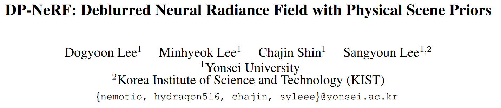

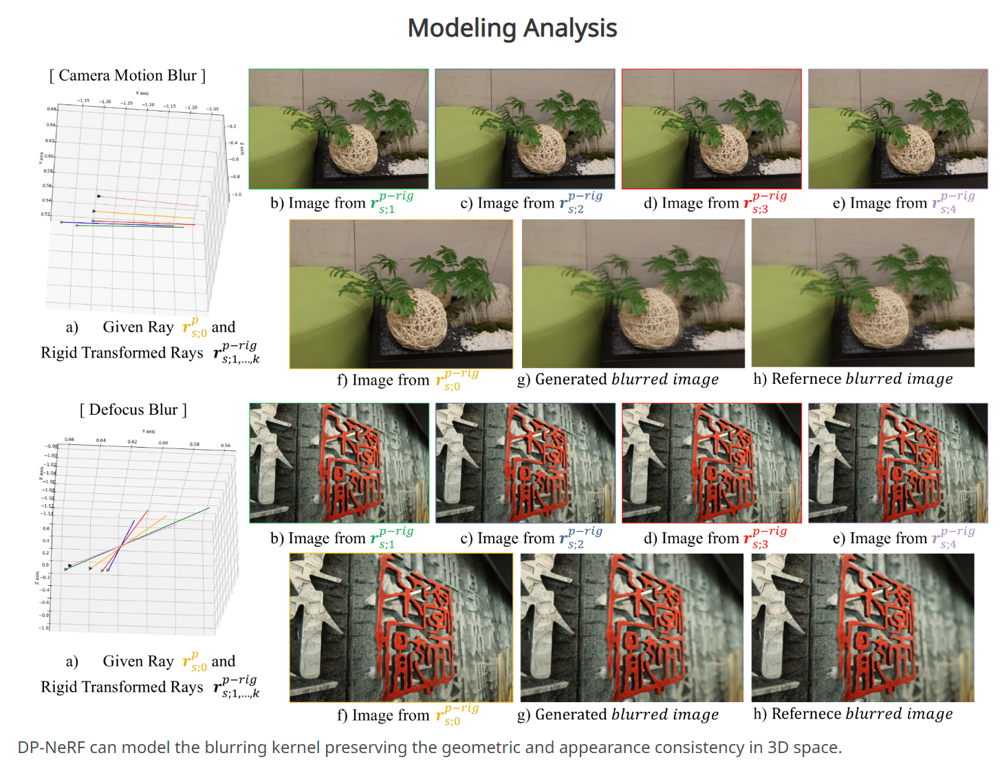

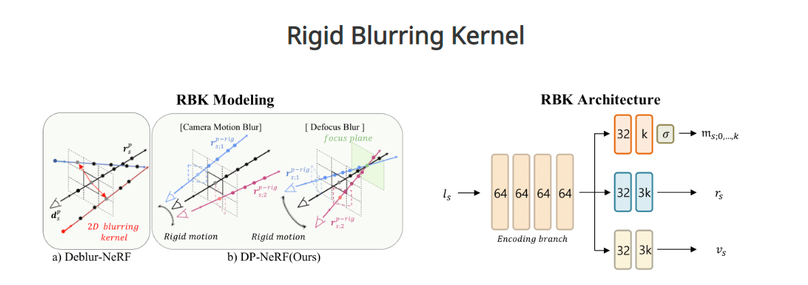

---

[40] L2G-NeRF: Local-to-Global Registration for Bundle-Adjusting Neural Radiance Fields

- 题目：L2G-NeRF: 捆绑调整的神经辐射场的局部到整体注册
- 分类：Bundle-Adjusting
- Project: https://rover-xingyu.github.io/L2G-NeRF/
- Code: https://github.com/rover-xingyu/L2G-NeRF
- Paper: https://arxiv.org/pdf/2211.11505.pdf
- 摘要： 

> *Neural Radiance Fields (NeRF) have achieved photorealistic novel views synthesis; however, the requirement of accurate camera poses limits its application. Despite analysis-by-synthesis extensions for jointly learning neural 3D representations and registering camera frames exist, they are susceptible to suboptimal solutions if poorly initialized. We propose L2G-NeRF, a Local-to-Global registration method for bundle-adjusting Neural Radiance Fields: first, a pixel-wise flexible alignment, followed by a frame-wise constrained parametric alignment. Pixel-wise local alignment is learned in an unsupervised way via a deep network which optimizes photometric reconstruction errors. Frame-wise global alignment is performed using differentiable parameter estimation solvers on the pixel-wise correspondences to find a global transformation. Experiments on synthetic and real-world data show that our method outperforms the current state-of-the-art in terms of high-fidelity reconstruction and resolving large camera pose misalignment. Our module is an easy-to-use plugin that can be applied to NeRF variants and other neural field applications. The Code and supplementary materials are available at [this https URL](https://rover-xingyu.github.io/L2G-NeRF/).*

- 图示：

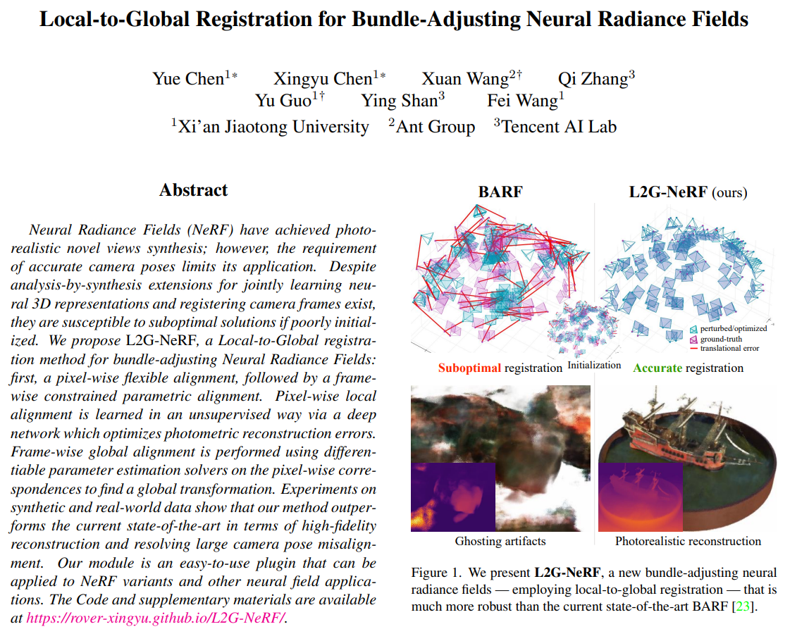

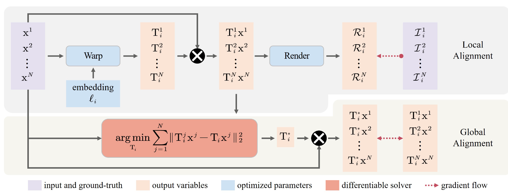

---

[41] Nerflets: Local Radiance Fields for Efficient Structure-Aware 3D Scene Representation from 2D Supervision

- 题目：Nerflets： 用于高效结构感知的三维场景的二维监督的局部辐射场
- 分类：高效和结构感知的三维场景表示, 大规模，室内室外，场景编辑，全景分割
- Project: https://jetd1.github.io/nerflets-web/
- Code: none
- Paper: https://arxiv.org/pdf/2303.03361.pdf
- 摘要： 

> *We address efficient and structure-aware 3D scene representation from images. Nerflets are our key contribution -- a set of local neural radiance fields that together represent a scene. Each nerflet maintains its own spatial position, orientation, and extent, within which it contributes to panoptic, density, and radiance reconstructions. By leveraging only photometric and inferred panoptic image supervision, we can directly and jointly optimize the parameters of a set of nerflets so as to form a decomposed representation of the scene, where each object instance is represented by a group of nerflets. During experiments with indoor and outdoor environments, we find that nerflets: (1) fit and approximate the scene more efficiently than traditional global NeRFs, (2) allow the extraction of panoptic and photometric renderings from arbitrary views, and (3) enable tasks rare for NeRFs, such as 3D panoptic segmentation and interactive editing.*

- 图示：

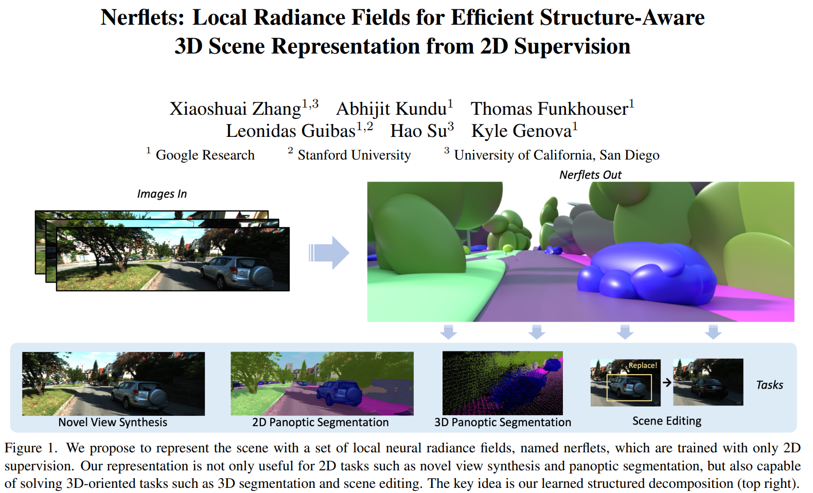

---

[42] Learning Detailed Radiance Manifolds for High-Fidelity and 3D-Consistent Portrait Synthesis from Monocular Image

- 题目：从单目图像中获取高保真和三维一致的人像合成的可学习细节辐射流形
- 分类：单视图人像合成
- Project: https://yudeng.github.io/GRAMInverter/
- Code: soon
- Paper: https://arxiv.org/pdf/2211.13901.pdf
- 摘要： 

> *A key challenge for novel view synthesis of monocular portrait images is 3D consistency under continuous pose variations. Most existing methods rely on 2D generative models which often leads to obvious 3D inconsistency artifacts. We present a 3D-consistent novel view synthesis approach for monocular portrait images based on a recent proposed 3D-aware GAN, namely Generative Radiance Manifolds (GRAM), which has shown strong 3D consistency at multiview image generation of virtual subjects via the radiance manifolds representation. However, simply learning an encoder to map a real image into the latent space of GRAM can only reconstruct coarse radiance manifolds without faithful fine details, while improving the reconstruction fidelity via instance-specific optimization is time-consuming. We introduce a novel detail manifolds reconstructor to learn 3D-consistent fine details on the radiance manifolds from monocular images, and combine them with the coarse radiance manifolds for high-fidelity reconstruction. The 3D priors derived from the coarse radiance manifolds are used to regulate the learned details to ensure reasonable synthesized results at novel views. Trained on in-the-wild 2D images, our method achieves high-fidelity and 3D-consistent portrait synthesis largely outperforming the prior art.*

- 图示：

---

[43] $I^2$-SDF: Intrinsic Indoor Scene Reconstruction and Editing via Raytracing in Neural SDFs

- 题目：I2-SDF： 通过神经SDF中的光线追踪进行内在的室内场景重建和编辑
- 分类：室内重建,可编辑,重光照
- Project: https://jingsenzhu.github.io/i2-sdf/
- Code: https://github.com/jingsenzhu/i2-sdf
- Paper: https://arxiv.org/pdf/2303.07634.pdf
- 摘要： 

> *In this work, we present I2-SDF, a new method for intrinsic indoor scene reconstruction and editing using differentiable Monte Carlo raytracing on neural signed distance fields (SDFs). Our holistic neural SDF-based framework jointly recovers the underlying shapes, incident radiance and materials from multi-view images. We introduce a novel bubble loss for fine-grained small objects and error-guided adaptive sampling scheme to largely improve the reconstruction quality on large-scale indoor scenes. Further, we propose to decompose the neural radiance field into spatially-varying material of the scene as a neural field through surface-based, differentiable Monte Carlo raytracing and emitter semantic segmentations, which enables physically based and photorealistic scene relighting and editing applications. Through a number of qualitative and quantitative experiments, we demonstrate the superior quality of our method on indoor scene reconstruction, novel view synthesis, and scene editing compared to state-of-the-art baselines.*

- 图示：

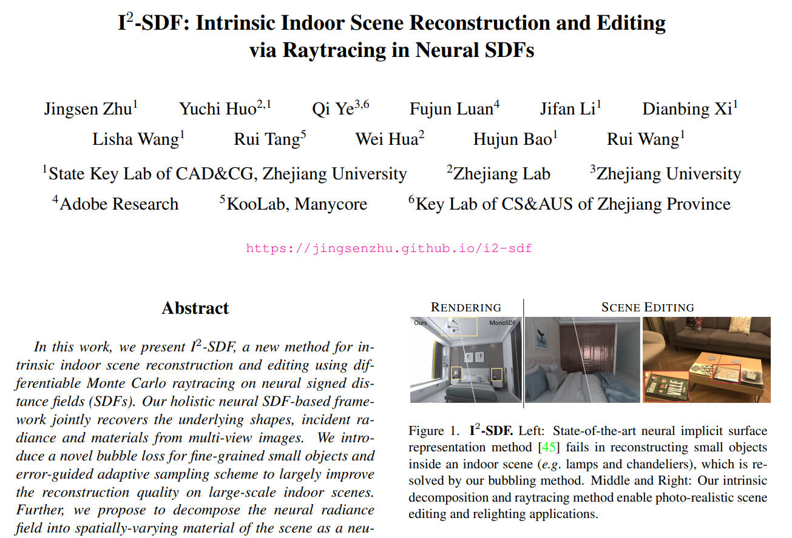

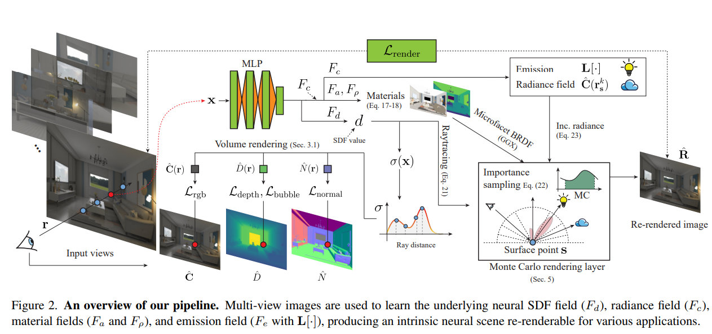

---

[44] NoPe-NeRF: Optimising Neural Radiance Field with No Pose Prior

- 题目：NoPe-NeRF：优化无位姿先验的神经辐射场
- 分类：无位姿
- Project: https://nope-nerf.active.vision/
- Code: soon
- Paper: https://arxiv.org/pdf/2212.07388.pdf
- 摘要： 

> *Training a Neural Radiance Field (NeRF) without pre-computed camera poses is challenging. Recent advances in this direction demonstrate the possibility of jointly optimising a NeRF and camera poses in forward-facing scenes. However, these methods still face difficulties during dramatic camera movement. We tackle this challenging problem by incorporating undistorted monocular depth priors. These priors are generated by correcting scale and shift parameters during training, with which we are then able to constrain the relative poses between consecutive frames. This constraint is achieved using our proposed novel loss functions. Experiments on real-world indoor and outdoor scenes show that our method can handle challenging camera trajectories and outperforms existing methods in terms of novel view rendering quality and pose estimation accuracy. Our project page is https://nope-nerf.active.vision.*

- 图示：

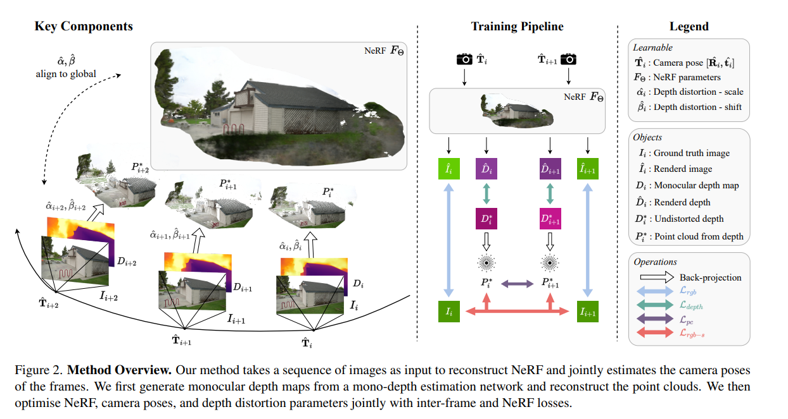

---

[45] Latent-NeRF for Shape-Guided Generation of 3D Shapes and Textures

- 题目：用于形状引导的三维形状和纹理生成的Latent-NeRF
- 分类：Text-to-3D
- Code: https://github.com/eladrich/latent-nerf
- Paper: https://arxiv.org/pdf/2211.07600.pdf
- 摘要： 

> *Text-guided image generation has progressed rapidly in recent years, inspiring major breakthroughs in text-guided shape generation. Recently, it has been shown that using score distillation, one can successfully text-guide a NeRF model to generate a 3D object. We adapt the score distillation to the publicly available, and computationally efficient, Latent Diffusion Models, which apply the entire diffusion process in a compact latent space of a pretrained autoencoder. As NeRFs operate in image space, a naive solution for guiding them with latent score distillation would require encoding to the latent space at each guidance step. Instead, we propose to bring the NeRF to the latent space, resulting in a Latent-NeRF. Analyzing our Latent-NeRF, we show that while Text-to-3D models can generate impressive results, they are inherently unconstrained and may lack the ability to guide or enforce a specific 3D structure. To assist and direct the 3D generation, we propose to guide our Latent-NeRF using a Sketch-Shape: an abstract geometry that defines the coarse structure of the desired object. Then, we present means to integrate such a constraint directly into a Latent-NeRF. This unique combination of text and shape guidance allows for increased control over the generation process. We also show that latent score distillation can be successfully applied directly on 3D meshes. This allows for generating high-quality textures on a given geometry. Our experiments validate the power of our different forms of guidance and the efficiency of using latent rendering. Implementation is available at [this https URL](https://github.com/eladrich/latent-nerf)*

- 图示：

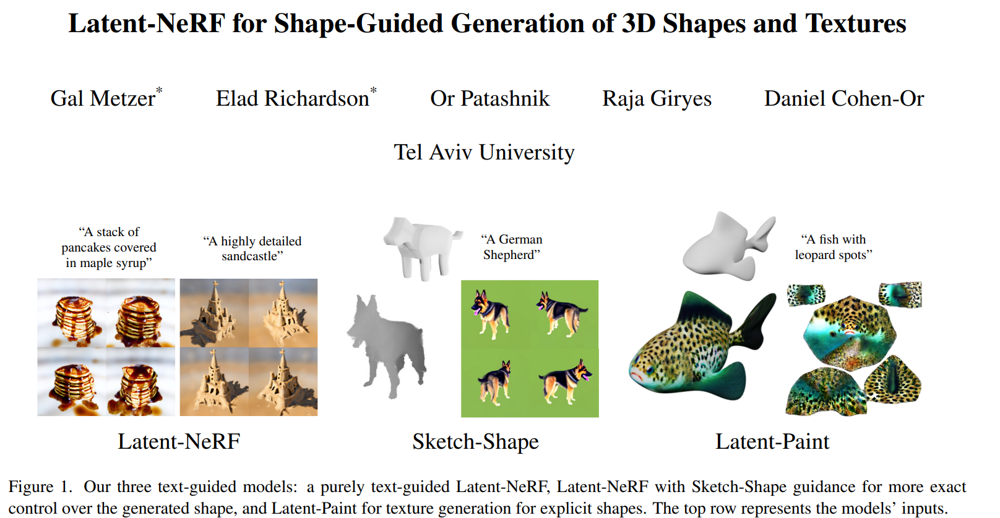

---

[46] Real-Time Neural Light Field on Mobile Devices

- 题目：移动设备上的实时神经光场
- 分类：移动设备,实时
- Project: https://snap-research.github.io/MobileR2L/
- Code: https://github.com/snap-research/MobileR2L
- Paper: https://arxiv.org/pdf/2212.08057.pdf
- 摘要： 

> *Recent efforts in Neural Rendering Fields (NeRF) have shown impressive results on novel view synthesis by utilizing implicit neural representation to represent 3D scenes. Due to the process of volumetric rendering, the inference speed for NeRF is extremely slow, limiting the application scenarios of utilizing NeRF on resource-constrained hardware, such as mobile devices. Many works have been conducted to reduce the latency of running NeRF models. However, most of them still require high-end GPU for acceleration or extra storage memory, which is all unavailable on mobile devices. Another emerging direction utilizes the neural light field (NeLF) for speedup, as only one forward pass is performed on a ray to predict the pixel color. Nevertheless, to reach a similar rendering quality as NeRF, the network in NeLF is designed with intensive computation, which is not mobile-friendly. In this work, we propose an efficient network that runs in real-time on mobile devices for neural rendering. We follow the setting of NeLF to train our network. Unlike existing works, we introduce a novel network architecture that runs efficiently on mobile devices with low latency and small size, i.e., saving 15×∼24× storage compared with MobileNeRF. Our model achieves high-resolution generation while maintaining real-time inference for both synthetic and real-world scenes on mobile devices, e.g., 18.04ms (iPhone 13) for rendering one 1008×756 image of real 3D scenes. Additionally, we achieve similar image quality as NeRF and better quality than MobileNeRF (PSNR 26.15 vs. 25.91 on the real-world forward-facing dataset).*

- 图示：

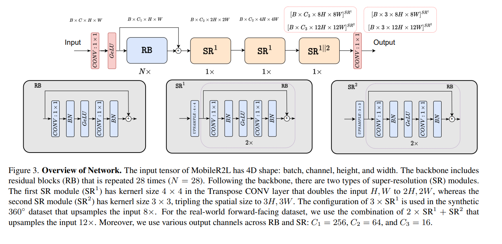

---

[47] Renderable Neural Radiance Map for Visual Navigation

- 题目：用于视觉导航的可渲染神经辐射图
- 分类：视觉导航
- Project: https://rllab-snu.github.io/projects/RNR-Map/
- Code: https://github.com/rllab-snu/RNR-Map
- Paper: https://arxiv.org/pdf/2303.00304.pdf
- 摘要： 

> *We propose a novel type of map for visual navigation, a renderable neural radiance map (RNR-Map), which is designed to contain the overall visual information of a 3D environment. The RNR-Map has a grid form and consists of latent codes at each pixel. These latent codes are embedded from image observations, and can be converted to the neural radiance field which enables image rendering given a camera pose. The recorded latent codes implicitly contain visual information about the environment, which makes the RNR-Map visually descriptive. This visual information in RNR-Map can be a useful guideline for visual localization and navigation. We develop localization and navigation frameworks that can effectively utilize the RNR-Map. We evaluate the proposed frameworks on camera tracking, visual localization, and image-goal navigation. Experimental results show that the RNR-Map-based localization framework can find the target location based on a single query image with fast speed and competitive accuracy compared to other baselines. Also, this localization framework is robust to environmental changes, and even finds the most visually similar places when a query image from a different environment is given. The proposed navigation framework outperforms the existing image-goal navigation methods in difficult scenarios, under odometry and actuation noises. The navigation framework shows 65.7% success rate in curved scenarios of the NRNS dataset, which is an improvement of 18.6% over the current state-of-the-art. Project page: [this https URL](https://rllab-snu.github.io/projects/RNR-Map/)*

- 图示：

----

[48] NeRF-Gaze: A Head-Eye Redirection Parametric Model for Gaze Estimation

- 题目：NeRF-Gaze： 一个用于凝视估计的头眼重定向参数模型
- 分类：人脸建模,视线重定向
- Project: none
- Code: none
- Paper: https://arxiv.org/pdf/2212.14710.pdf
- 摘要： 

> *Gaze estimation is the fundamental basis for many visual tasks. Yet, the high cost of acquiring gaze datasets with 3D annotations hinders the optimization and application of gaze estimation models. In this work, we propose a novel Head-Eye redirection parametric model based on Neural Radiance Field, which allows dense gaze data generation with view consistency and accurate gaze direction. Moreover, our head-eye redirection parametric model can decouple the face and eyes for separate neural rendering, so it can achieve the purpose of separately controlling the attributes of the face, identity, illumination, and eye gaze direction. Thus diverse 3D-aware gaze datasets could be obtained by manipulating the latent code belonging to different face attributions in an unsupervised manner. Extensive experiments on several benchmarks demonstrate the effectiveness of our method in domain generalization and domain adaptation for gaze estimation tasks.*

- 图示：

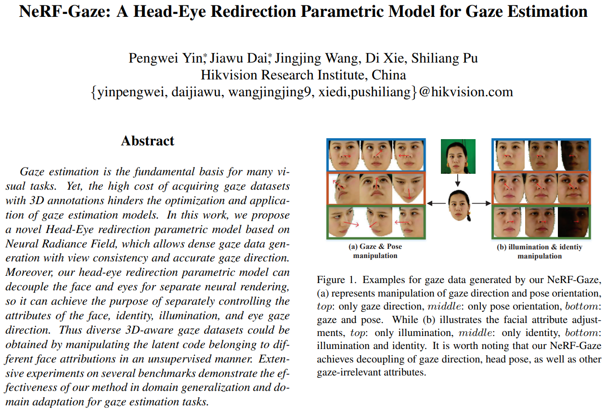

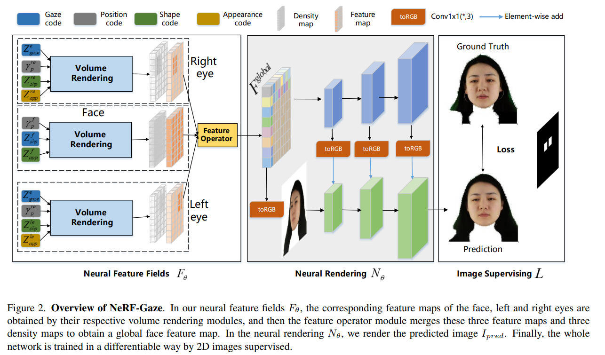

----

[49] NeRFLiX: High-Quality Neural View Synthesis by Learning a Degradation-Driven Inter-viewpoint MiXer

- 题目：NeRFLiX：通过学习退化驱动的视点之间的MiXer来实现高质量的神经视图合成
- 分类：逼真合成
- Project: https://redrock303.github.io/nerflix/
- Code: soon
- Paper: https://arxiv.org/pdf/2303.06919.pdf
- 摘要： 

> *Neural radiance fields (NeRF) show great success in novel view synthesis. However, in real-world scenes, recovering high-quality details from the source images is still challenging for the existing NeRF-based approaches, due to the potential imperfect calibration information and scene representation inaccuracy. Even with high-quality training frames, the synthetic novel views produced by NeRF models still suffer from notable rendering artifacts, such as noise, blur, etc. Towards to improve the synthesis quality of NeRF-based approaches, we propose NeRFLiX, a general NeRF-agnostic restorer paradigm by learning a degradation-driven inter-viewpoint mixer. Specially, we design a NeRF-style degradation modeling approach and construct large-scale training data, enabling the possibility of effectively removing NeRF-native rendering artifacts for existing deep neural networks. Moreover, beyond the degradation removal, we propose an inter-viewpoint aggregation framework that is able to fuse highly related high-quality training images, pushing the performance of cutting-edge NeRF models to entirely new levels and producing highly photo-realistic synthetic views.*

- 图示：

----

[50] 3D Video Loops from Asynchronous Input

- 题目：异步输入的3D视频循环
- 分类：动态场景
- Project: https://limacv.github.io/VideoLoop3D_web/
- Code: https://github.com/limacv/VideoLoop3D
- Paper: https://arxiv.org/pdf/2303.05312.pdf
- 摘要： 

> *Looping videos are short video clips that can be looped endlessly without visible seams or artifacts. They provide a very attractive way to capture the dynamism of natural scenes. Existing methods have been mostly limited to 2D representations. In this paper, we take a step forward and propose a practical solution that enables an immersive experience on dynamic 3D looping scenes. The key challenge is to consider the per-view looping conditions from asynchronous input while maintaining view consistency for the 3D representation. We propose a novel sparse 3D video representation, namely Multi-Tile Video (MTV), which not only provides a view-consistent prior, but also greatly reduces memory usage, making the optimization of a 4D volume tractable. Then, we introduce a two-stage pipeline to construct the 3D looping MTV from completely asynchronous multi-view videos with no time overlap. A novel looping loss based on video temporal retargeting algorithms is adopted during the optimization to loop the 3D scene. Experiments of our framework have shown promise in successfully generating and rendering photorealistic 3D looping videos in real time even on mobile devices. The code, dataset, and live demos are available in [this https URL](https://limacv.github.io/VideoLoop3D_web/).*

- 图示：

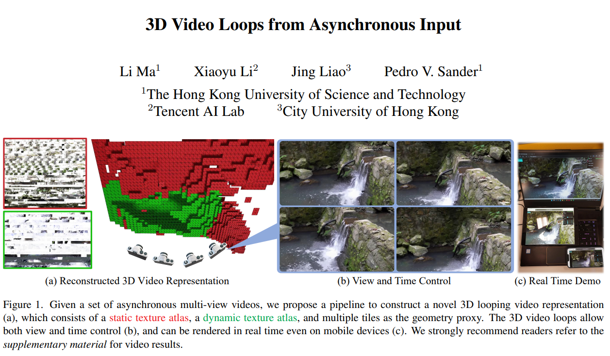

----

[51] MonoHuman: Animatable Human Neural Field from Monocular Video

- 题目：MonoHuman：来自单目视频的可动画人类神经场
- 分类：人体建模,文本交互
- Project: https://yzmblog.github.io/projects/MonoHuman/
- Code: https://github.com/Yzmblog/MonoHuman
- Paper: https://arxiv.org/pdf/2304.02001.pdf
- 摘要： 

> *Animating virtual avatars with free-view control is crucial for various applications like virtual reality and digital entertainment. Previous studies have attempted to utilize the representation power of the neural radiance field (NeRF) to reconstruct the human body from monocular videos. Recent works propose to graft a deformation network into the NeRF to further model the dynamics of the human neural field for animating vivid human motions. However, such pipelines either rely on pose-dependent representations or fall short of motion coherency due to frame-independent optimization, making it difficult to generalize to unseen pose sequences realistically. In this paper, we propose a novel framework MonoHuman, which robustly renders view-consistent and high-fidelity avatars under arbitrary novel poses. Our key insight is to model the deformation field with bi-directional constraints and explicitly leverage the off-the-peg keyframe information to reason the feature correlations for coherent results. Specifically, we first propose a Shared Bidirectional Deformation module, which creates a pose-independent generalizable deformation field by disentangling backward and forward deformation correspondences into shared skeletal motion weight and separate non-rigid motions. Then, we devise a Forward Correspondence Search module, which queries the correspondence feature of keyframes to guide the rendering network. The rendered results are thus multi-view consistent with high fidelity, even under challenging novel pose settings. Extensive experiments demonstrate the superiority of our proposed MonoHuman over state-of-the-art methods.*

- 图示：

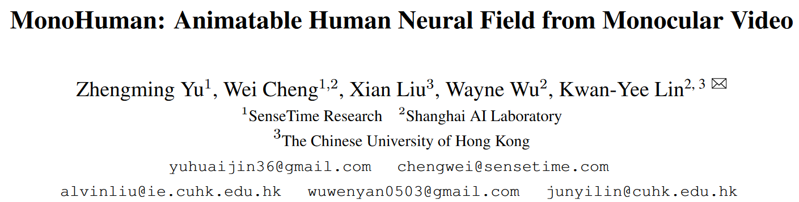

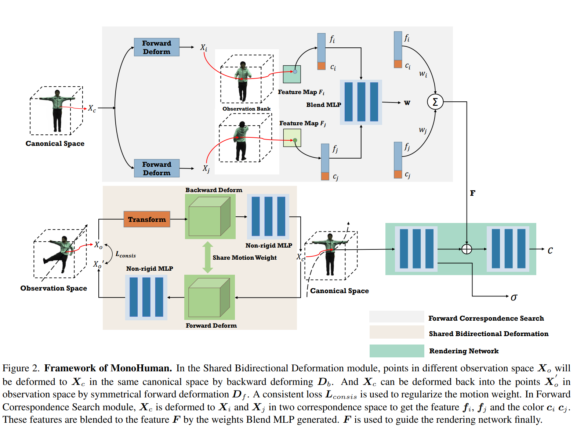

----

[52] NeRF-Supervised Deep Stereo

- 题目：NeRF监督的深度立体网络
- 分类：立体深度
- Project: https://nerfstereo.github.io/
- Code: https://github.com/fabiotosi92/NeRF-Supervised-Deep-Stereo
- Paper: https://arxiv.org/pdf/2303.17603.pdf
- 摘要： 

> *We introduce a novel framework for training deep stereo networks effortlessly and without any ground-truth. By leveraging state-of-the-art neural rendering solutions, we generate stereo training data from image sequences collected with a single handheld camera. On top of them, a NeRF-supervised training procedure is carried out, from which we exploit rendered stereo triplets to compensate for occlusions and depth maps as proxy labels. This results in stereo networks capable of predicting sharp and detailed disparity maps. Experimental results show that models trained under this regime yield a 30-40% improvement over existing self-supervised methods on the challenging Middlebury dataset, filling the gap to supervised models and, most times, outperforming them at zero-shot generalization.*

- 图示：

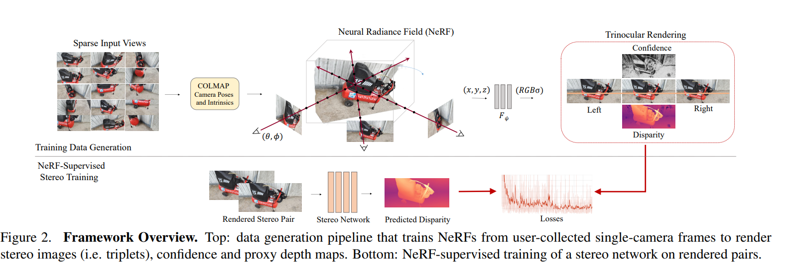

----

[53] Enhanced Stable View Synthesis

- 题目：增强的稳定视图合成
- 分类：视图合成
- Project: none
- Code: none
- Paper: https://arxiv.org/pdf/2303.17094.pdf
- 摘要： 

> *We introduce an approach to enhance the novel view synthesis from images taken from a freely moving camera. The introduced approach focuses on outdoor scenes where recovering accurate geometric scaffold and camera pose is challenging, leading to inferior results using the state-of-the-art stable view synthesis (SVS) method. SVS and related methods fail for outdoor scenes primarily due to (i) over-relying on the multiview stereo (MVS) for geometric scaffold recovery and (ii) assuming COLMAP computed camera poses as the best possible estimates, despite it being well-studied that MVS 3D reconstruction accuracy is limited to scene disparity and camera-pose accuracy is sensitive to key-point correspondence selection. This work proposes a principled way to enhance novel view synthesis solutions drawing inspiration from the basics of multiple view geometry. By leveraging the complementary behavior of MVS and monocular depth, we arrive at a better scene depth per view for nearby and far points, respectively. Moreover, our approach jointly refines camera poses with image-based rendering via multiple rotation averaging graph optimization. The recovered scene depth and the camera-pose help better view-dependent on-surface feature aggregation of the entire scene. Extensive evaluation of our approach on the popular benchmark dataset, such as Tanks and Temples, shows substantial improvement in view synthesis results compared to the prior art. For instance, our method shows 1.5 dB of PSNR improvement on the Tank and Temples. Similar statistics are observed when tested on other benchmark datasets such as FVS, Mip-NeRF 360, and DTU.*

- 图示：

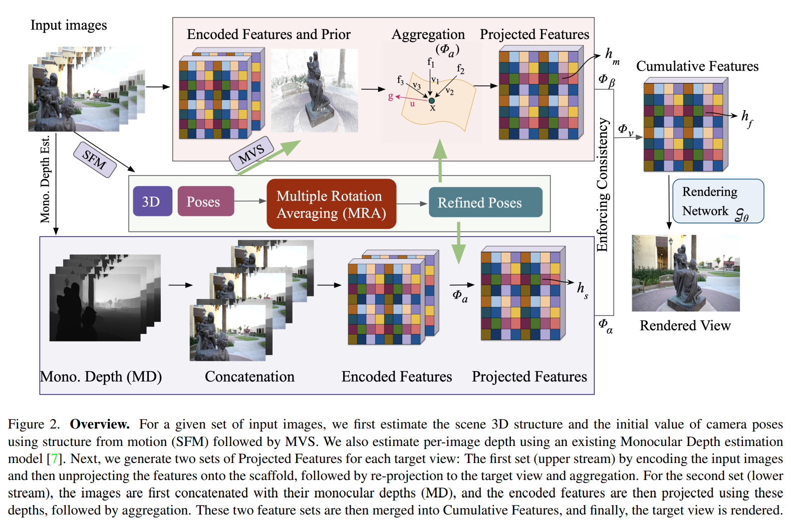

----

[54] $F^2$-NeRF: Fast Neural Radiance Field Training with Free Camera Trajectories

- 题目：F2-NeRF：使用自由相机轨迹进行快速神经辐射场训练
- 分类：任意相机路径,快速
- Project: https://totoro97.github.io/projects/f2-nerf/
- Code: https://github.com/totoro97/f2-nerf
- Paper: https://arxiv.org/pdf/2303.15951.pdf
- 摘要： 

> *This paper presents a novel grid-based NeRF called F2-NeRF (Fast-Free-NeRF) for novel view synthesis, which enables arbitrary input camera trajectories and only costs a few minutes for training. Existing fast grid-based NeRF training frameworks, like Instant-NGP, Plenoxels, DVGO, or TensoRF, are mainly designed for bounded scenes and rely on space warping to handle unbounded scenes. Existing two widely-used space-warping methods are only designed for the forward-facing trajectory or the 360-degree object-centric trajectory but cannot process arbitrary trajectories. In this paper, we delve deep into the mechanism of space warping to handle unbounded scenes. Based on our analysis, we further propose a novel space-warping method called perspective warping, which allows us to handle arbitrary trajectories in the grid-based NeRF framework. Extensive experiments demonstrate that F2-NeRF is able to use the same perspective warping to render high-quality images on two standard datasets and a new free trajectory dataset collected by us. Project page: [this https URL](https://totoro97.github.io/projects/f2-nerf).*

- 图示：

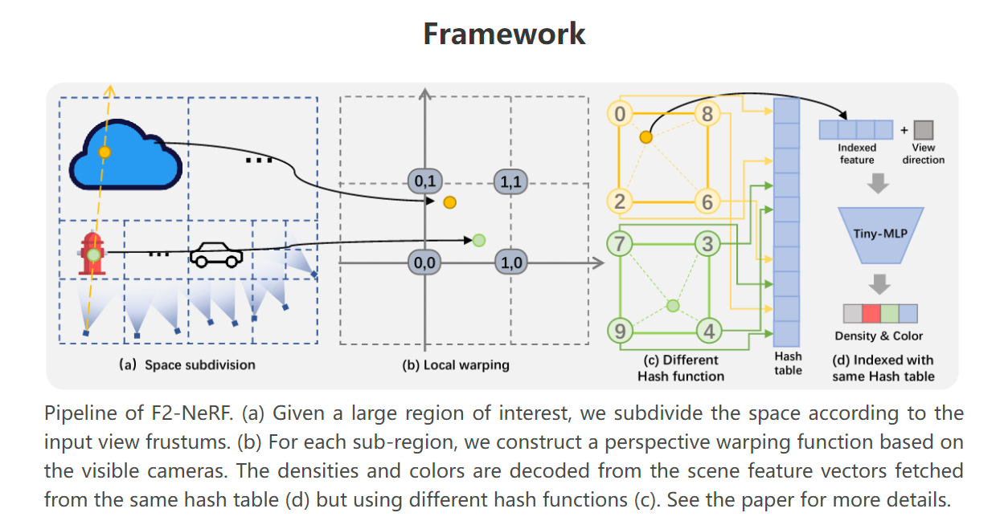

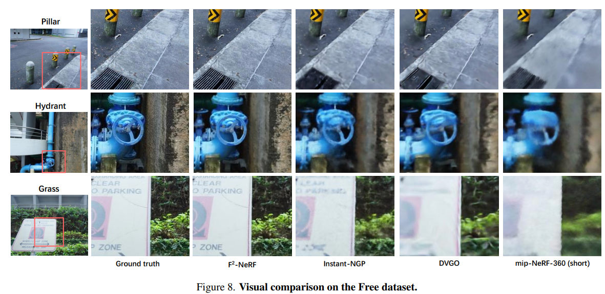

----

[55] Frequency-Modulated Point Cloud Rendering with Easy Editing

- 题目：易于编辑的调频点云渲染
- 分类：可编辑,点云渲染,实时
- Project: none
- Code: https://github.com/yizhangphd/FreqPCR
- Paper: https://arxiv.org/pdf/2303.07596.pdf
- 摘要： 

> *We develop an effective point cloud rendering pipeline for novel view synthesis, which enables high fidelity local detail reconstruction, real-time rendering and user-friendly editing. In the heart of our pipeline is an adaptive frequency modulation module called Adaptive Frequency Net (AFNet), which utilizes a hypernetwork to learn the local texture frequency encoding that is consecutively injected into adaptive frequency activation layers to modulate the implicit radiance signal. This mechanism improves the frequency expressive ability of the network with richer frequency basis support, only at a small computational budget. To further boost performance, a preprocessing module is also proposed for point cloud geometry optimization via point opacity estimation. In contrast to implicit rendering, our pipeline supports high-fidelity interactive editing based on point cloud manipulation. Extensive experimental results on NeRF-Synthetic, ScanNet, DTU and Tanks and Temples datasets demonstrate the superior performances achieved by our method in terms of PSNR, SSIM and LPIPS, in comparison to the state-of-the-art.*

- 图示：

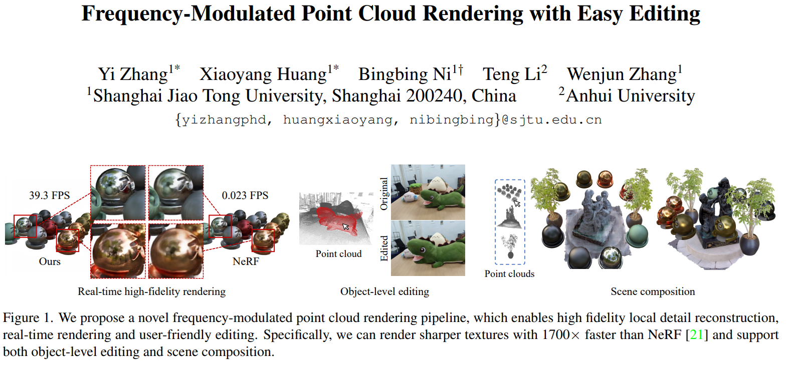

----

[56] FreeNeRF: Improving Few-shot Neural Rendering with Free Frequency Regularization

- 题目：FreeNeRF：使用自由频率正则化改进小样本神经渲染
- 分类：稀疏视图
- Project: https://jiawei-yang.github.io/FreeNeRF/
- Code: https://github.com/Jiawei-Yang/FreeNeRF
- Paper: https://arxiv.org/pdf/2303.07418.pdf
- 摘要： 

> *Novel view synthesis with sparse inputs is a challenging problem for neural radiance fields (NeRF). Recent efforts alleviate this challenge by introducing external supervision, such as pre-trained models and extra depth signals, and by non-trivial patch-based rendering. In this paper, we present Frequency regularized NeRF (FreeNeRF), a surprisingly simple baseline that outperforms previous methods with minimal modifications to the plain NeRF. We analyze the key challenges in few-shot neural rendering and find that frequency plays an important role in NeRF's training. Based on the analysis, we propose two regularization terms. One is to regularize the frequency range of NeRF's inputs, while the other is to penalize the near-camera density fields. Both techniques are ``free lunches'' at no additional computational cost. We demonstrate that even with one line of code change, the original NeRF can achieve similar performance as other complicated methods in the few-shot setting. FreeNeRF achieves state-of-the-art performance across diverse datasets, including Blender, DTU, and LLFF. We hope this simple baseline will motivate a rethinking of the fundamental role of frequency in NeRF's training under the low-data regime and beyond.*

- 图示：

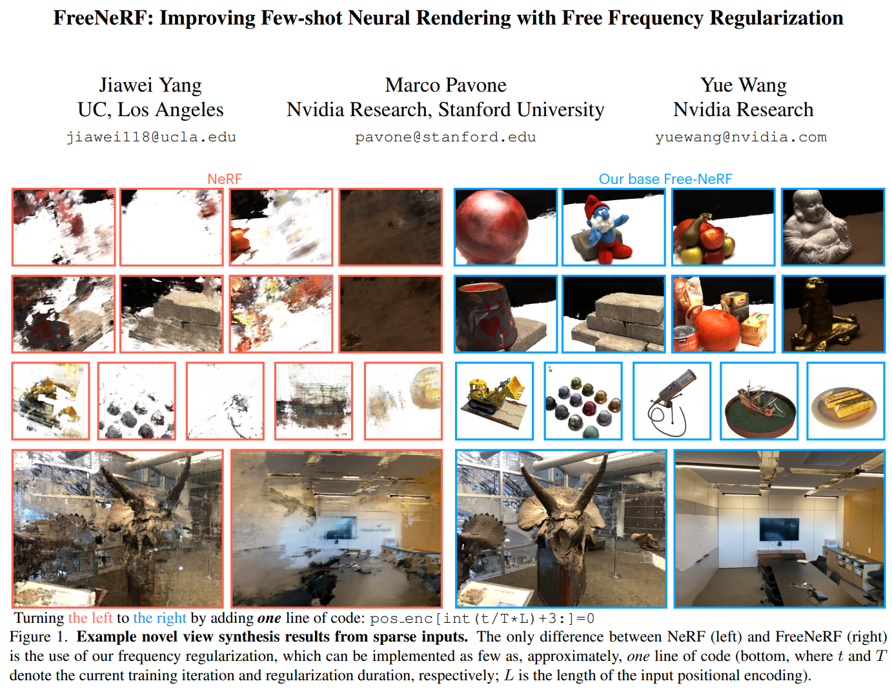

----

[57] GazeNeRF: 3D-Aware Gaze Redirection with Neural Radiance Fields

- 题目：GazeNeRF：具有神经辐射场的3D感知注视重定向
- 分类：Gaze redirection 视线重定向
- Project: none
- Code: https://github.com/AlessandroRuzzi/GazeNeRF
- Paper: https://arxiv.org/pdf/2212.04823.pdf
- 摘要： 

> *We propose GazeNeRF, a 3D-aware method for the task of gaze redirection. Existing gaze redirection methods operate on 2D images and struggle to generate 3D consistent results. Instead, we build on the intuition that the face region and eyeballs are separate 3D structures that move in a coordinated yet independent fashion. Our method leverages recent advancements in conditional image-based neural radiance fields and proposes a two-stream architecture that predicts volumetric features for the face and eye regions separately. Rigidly transforming the eye features via a 3D rotation matrix provides fine-grained control over the desired gaze angle. The final, redirected image is then attained via differentiable volume compositing. Our experiments show that this architecture outperforms naively conditioned NeRF baselines as well as previous state-of-the-art 2D gaze redirection methods in terms of redirection accuracy and identity preservation.*

- 图示：

----

[58] EditableNeRF: Editing Topologically Varying Neural Radiance Fields by Key Points

- 题目：EditableNeRF：按关键点编辑拓扑变化的神经辐射场
- 分类：可编辑
- Project: https://chengwei-zheng.github.io/EditableNeRF/
- Code: soon
- Paper: https://arxiv.org/pdf/2212.04247.pdf
- 摘要： 

> *Neural radiance fields (NeRF) achieve highly photo-realistic novel-view synthesis, but it's a challenging problem to edit the scenes modeled by NeRF-based methods, especially for dynamic scenes. We propose editable neural radiance fields that enable end-users to easily edit dynamic scenes and even support topological changes. Input with an image sequence from a single camera, our network is trained fully automatically and models topologically varying dynamics using our picked-out surface key points. Then end-users can edit the scene by easily dragging the key points to desired new positions. To achieve this, we propose a scene analysis method to detect and initialize key points by considering the dynamics in the scene, and a weighted key points strategy to model topologically varying dynamics by joint key points and weights optimization. Our method supports intuitive multi-dimensional (up to 3D) editing and can generate novel scenes that are unseen in the input sequence. Experiments demonstrate that our method achieves high-quality editing on various dynamic scenes and outperforms the state-of-the-art. Our code and captured data are available at [this https URL](https://chengwei-zheng.github.io/EditableNeRF/).*

- 图示：

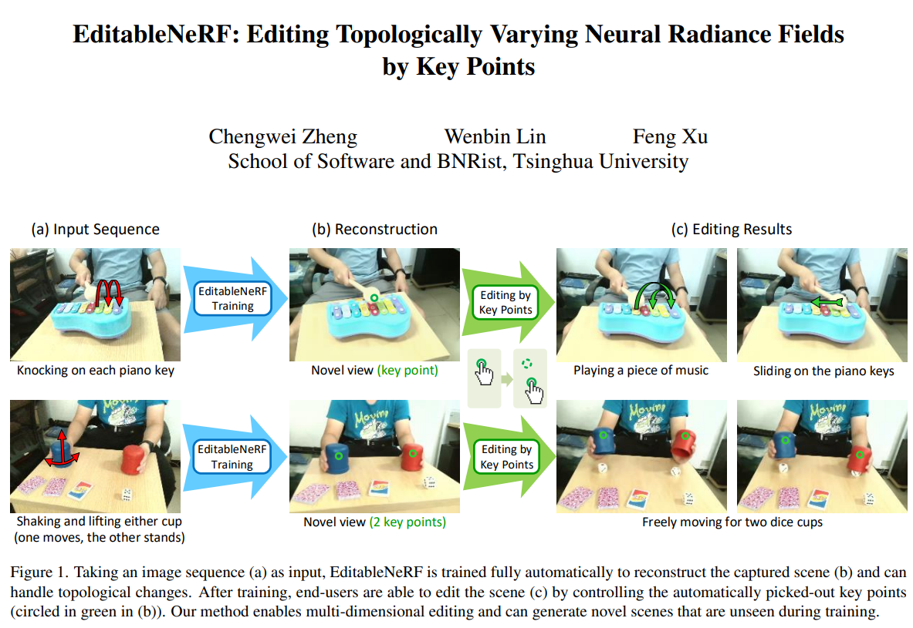

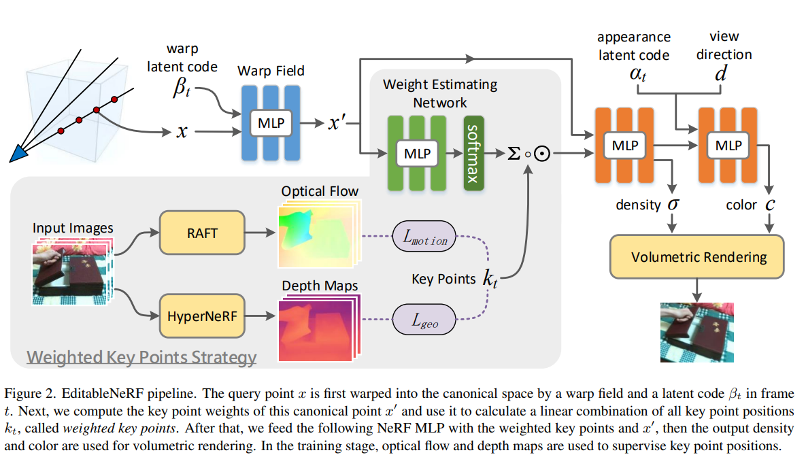

----

[59] Unsupervised Continual Semantic Adaptation through Neural Rendering

- 题目：通过神经渲染的无监督连续语义适应
- 分类：语义分割
- Project: none
- Code: none
- Paper: https://arxiv.org/pdf/2211.13969.pdf
- 摘要： 

> *An increasing amount of applications rely on data-driven models that are deployed for perception tasks across a sequence of scenes. Due to the mismatch between training and deployment data, adapting the model on the new scenes is often crucial to obtain good performance. In this work, we study continual multi-scene adaptation for the task of semantic segmentation, assuming that no ground-truth labels are available during deployment and that performance on the previous scenes should be maintained. We propose training a Semantic-NeRF network for each scene by fusing the predictions of a segmentation model and then using the view-consistent rendered semantic labels as pseudo-labels to adapt the model. Through joint training with the segmentation model, the Semantic-NeRF model effectively enables 2D-3D knowledge transfer. Furthermore, due to its compact size, it can be stored in a long-term memory and subsequently used to render data from arbitrary viewpoints to reduce forgetting. We evaluate our approach on ScanNet, where we outperform both a voxel-based baseline and a state-of-the-art unsupervised domain adaptation method.*

- 图示：

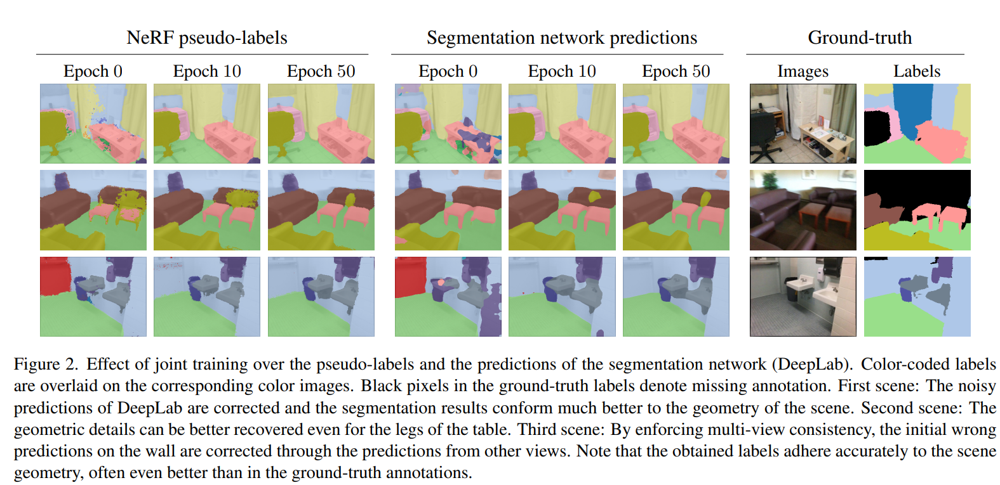

----

[60] ESLAM: Efficient Dense SLAM System Based on Hybrid Representation of Signed Distance Fields

- 题目：ESLAM：基于符号距离场混合表示的高效密集SLAM系统
- 分类：混合表达SDF,高效密集SLAM
- Project: https://www.idiap.ch/paper/eslam/
- Code: https://github.com/idiap/ESLAM
- Paper: https://arxiv.org/pdf/2211.11704.pdf
- 摘要： 

> *We present ESLAM, an efficient implicit neural representation method for Simultaneous Localization and Mapping (SLAM). ESLAM reads RGB-D frames with unknown camera poses in a sequential manner and incrementally reconstructs the scene representation while estimating the current camera position in the scene. We incorporate the latest advances in Neural Radiance Fields (NeRF) into a SLAM system, resulting in an efficient and accurate dense visual SLAM method. Our scene representation consists of multi-scale axis-aligned perpendicular feature planes and shallow decoders that, for each point in the continuous space, decode the interpolated features into Truncated Signed Distance Field (TSDF) and RGB values. Our extensive experiments on three standard datasets, Replica, ScanNet, and TUM RGB-D show that ESLAM improves the accuracy of 3D reconstruction and camera localization of state-of-the-art dense visual SLAM methods by more than 50%, while it runs up to 10 times faster and does not require any pre-training.*

- 图示：

----

[61] Instant-NVR: Instant Neural Volumetric Rendering for Human-object Interactions from Monocular RGBD Stream

- 题目：Instant-NVR：用于单目RGBD流的人机交互的即时神经体积渲染
- 分类：人机交互,动态场景
- Project: https://nowheretrix.github.io/Instant-NVR/
- Code: soon
- Paper: https://arxiv.org/pdf/2304.03184.pdf
- 摘要： 

> *Convenient 4D modeling of human-object interactions is essential for numerous applications. However, monocular tracking and rendering of complex interaction scenarios remain challenging. In this paper, we propose Instant-NVR, a neural approach for instant volumetric human-object tracking and rendering using a single RGBD camera. It bridges traditional non-rigid tracking with recent instant radiance field techniques via a multi-thread tracking-rendering mechanism. In the tracking front-end, we adopt a robust human-object capture scheme to provide sufficient motion priors. We further introduce a separated instant neural representation with a novel hybrid deformation module for the interacting scene. We also provide an on-the-fly reconstruction scheme of the dynamic/static radiance fields via efficient motion-prior searching. Moreover, we introduce an online key frame selection scheme and a rendering-aware refinement strategy to significantly improve the appearance details for online novel-view synthesis. Extensive experiments demonstrate the effectiveness and efficiency of our approach for the instant generation of human-object radiance fields on the fly, notably achieving real-time photo-realistic novel view synthesis under complex human-object interactions.*

- 图示：

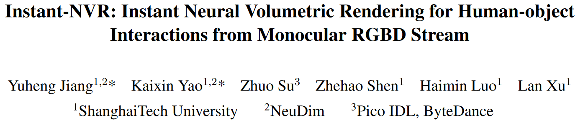

----

[62] Disorder-invariant Implicit Neural Representation

- 题目：无序不变的隐式神经表征
- 分类：本质工作,光谱偏差
- Project: https://ezio77.github.io/DINER-website/
- Code: https://github.com/Ezio77/DINER
- Paper: https://arxiv.org/pdf/2304.00837.pdf
- 摘要： 

> *Implicit neural representation (INR) characterizes the attributes of a signal as a function of corresponding coordinates which emerges as a sharp weapon for solving inverse problems. However, the expressive power of INR is limited by the spectral bias in the network training. In this paper, we find that such a frequency-related problem could be greatly solved by re-arranging the coordinates of the input signal, for which we propose the disorder-invariant implicit neural representation (DINER) by augmenting a hash-table to a traditional INR backbone. Given discrete signals sharing the same histogram of attributes and different arrangement orders, the hash-table could project the coordinates into the same distribution for which the mapped signal can be better modeled using the subsequent INR network, leading to significantly alleviated spectral bias. Furthermore, the expressive power of the DINER is determined by the width of the hash-table. Different width corresponds to different geometrical elements in the attribute space, \textit{e.g.}, 1D curve, 2D curved-plane and 3D curved-volume when the width is set as 1, 2 and 3, respectively. More covered areas of the geometrical elements result in stronger expressive power. Experiments not only reveal the generalization of the DINER for different INR backbones (MLP vs. SIREN) and various tasks (image/video representation, phase retrieval, refractive index recovery, and neural radiance field optimization) but also show the superiority over the state-of-the-art algorithms both in quality and speed. Project page: [this https URL](https://ezio77.github.io/DINER-website/)*

- 图示：

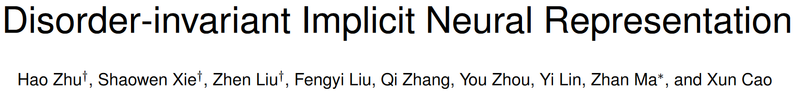

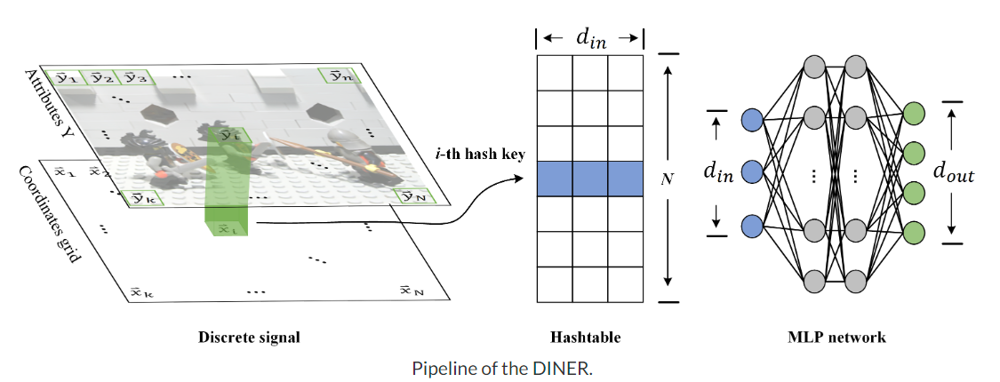

----

[63] NeFII: Inverse Rendering for Reflectance Decomposition with Near-Field Indirect Illumination

- 题目：NeFII：近场间接照明反射分解的逆向渲染
- 分类：光照反射渲染
- Project: none
- Code: none
- Paper: https://arxiv.org/pdf/2303.16617.pdf
- 摘要： 

> *Inverse rendering methods aim to estimate geometry, materials and illumination from multi-view RGB images. In order to achieve better decomposition, recent approaches attempt to model indirect illuminations reflected from different materials via Spherical Gaussians (SG), which, however, tends to blur the high-frequency reflection details. In this paper, we propose an end-to-end inverse rendering pipeline that decomposes materials and illumination from multi-view images, while considering near-field indirect illumination. In a nutshell, we introduce the Monte Carlo sampling based path tracing and cache the indirect illumination as neural radiance, enabling a physics-faithful and easy-to-optimize inverse rendering method. To enhance efficiency and practicality, we leverage SG to represent the smooth environment illuminations and apply importance sampling techniques. To supervise indirect illuminations from unobserved directions, we develop a novel radiance consistency constraint between implicit neural radiance and path tracing results of unobserved rays along with the joint optimization of materials and illuminations, thus significantly improving the decomposition performance. Extensive experiments demonstrate that our method outperforms the state-of-the-art on multiple synthetic and real datasets, especially in terms of inter-reflection decomposition.*

- 图示：

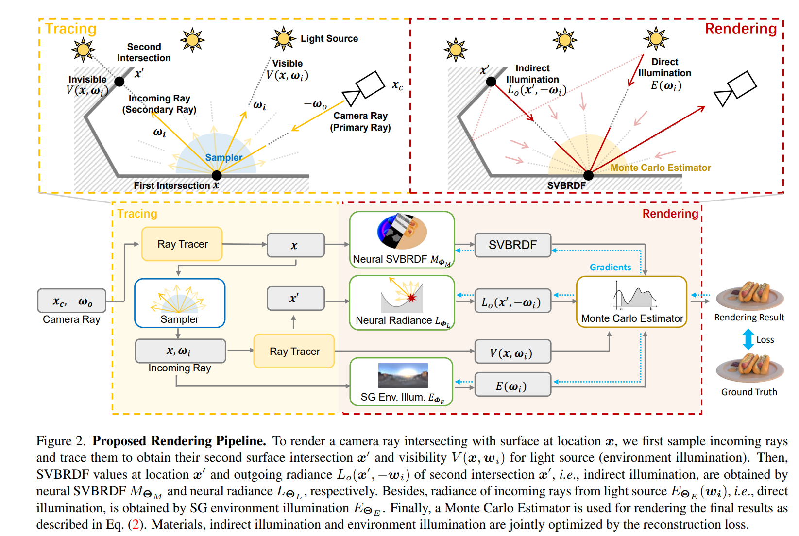

----

[64] PAniC-3D: Stylized Single-view 3D Reconstruction from Portraits of Anime Characters

- 题目：PAniC-3D：动漫人物肖像的程式化单视图3D重建
- 分类：单视图3D重建
- Project: none
- Code: https://github.com/ShuhongChen/panic3d-anime-reconstruction
- Paper: https://arxiv.org/pdf/2303.14587.pdf
- 摘要： 

> *We propose PAniC-3D, a system to reconstruct stylized 3D character heads directly from illustrated (p)ortraits of (ani)me (c)haracters. Our anime-style domain poses unique challenges to single-view reconstruction; compared to natural images of human heads, character portrait illustrations have hair and accessories with more complex and diverse geometry, and are shaded with non-photorealistic contour lines. In addition, there is a lack of both 3D model and portrait illustration data suitable to train and evaluate this ambiguous stylized reconstruction task. Facing these challenges, our proposed PAniC-3D architecture crosses the illustration-to-3D domain gap with a line-filling model, and represents sophisticated geometries with a volumetric radiance field. We train our system with two large new datasets (11.2k Vroid 3D models, 1k Vtuber portrait illustrations), and evaluate on a novel AnimeRecon benchmark of illustration-to-3D pairs. PAniC-3D significantly outperforms baseline methods, and provides data to establish the task of stylized reconstruction from portrait illustrations.*

- 图示：

----

[65] Temporal Interpolation Is All You Need for Dynamic Neural Radiance Fields

- 题目：时间插值是动态神经辐射场所需的一切
- 分类：动态场景
- Project: https://sungheonpark.github.io/tempinterpnerf/
- Code: none
- Paper: https://arxiv.org/pdf/2302.09311.pdf
- 摘要： 

> *Temporal interpolation often plays a crucial role to learn meaningful representations in dynamic scenes. In this paper, we propose a novel method to train spatiotemporal neural radiance fields of dynamic scenes based on temporal interpolation of feature vectors. Two feature interpolation methods are suggested depending on underlying representations, neural networks or grids. In the neural representation, we extract features from space-time inputs via multiple neural network modules and interpolate them based on time frames. The proposed multi-level feature interpolation network effectively captures features of both short-term and long-term time ranges. In the grid representation, space-time features are learned via four-dimensional hash grids, which remarkably reduces training time. The grid representation shows more than 100 times faster training speed than the previous neural-net-based methods while maintaining the rendering quality. Concatenating static and dynamic features and adding a simple smoothness term further improve the performance of our proposed models. Despite the simplicity of the model architectures, our method achieved state-of-the-art performance both in rendering quality for the neural representation and in training speed for the grid representation.*

- 图示：

----

[66] Dream3D: Zero-Shot Text-to-3D Synthesis Using 3D Shape Prior and Text-to-Image Diffusion Models

- 题目：Dream3D：使用3D形状先验和文本到图像扩散模型的零样本文本到3D合成
- 分类：CLIP, Text-to-3D,扩散模型,零样本
- Project: https://bluestyle97.github.io/dream3d/
- Code: soon
- Paper: https://arxiv.org/pdf/2212.14704.pdf
- 摘要： 

> *Recent CLIP-guided 3D optimization methods, such as DreamFields and PureCLIPNeRF, have achieved impressive results in zero-shot text-to-3D synthesis. However, due to scratch training and random initialization without prior knowledge, these methods often fail to generate accurate and faithful 3D structures that conform to the input text. In this paper, we make the first attempt to introduce explicit 3D shape priors into the CLIP-guided 3D optimization process. Specifically, we first generate a high-quality 3D shape from the input text in the text-to-shape stage as a 3D shape prior. We then use it as the initialization of a neural radiance field and optimize it with the full prompt. To address the challenging text-to-shape generation task, we present a simple yet effective approach that directly bridges the text and image modalities with a powerful text-to-image diffusion model. To narrow the style domain gap between the images synthesized by the text-to-image diffusion model and shape renderings used to train the image-to-shape generator, we further propose to jointly optimize a learnable text prompt and fine-tune the text-to-image diffusion model for rendering-style image generation. Our method, Dream3D, is capable of generating imaginative 3D content with superior visual quality and shape accuracy compared to state-of-the-art methods.*

- 图示：

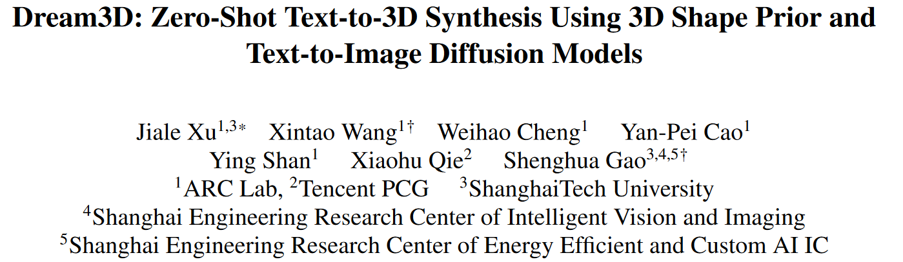

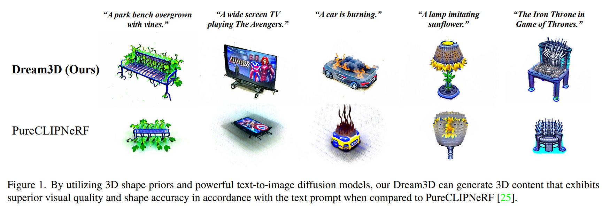

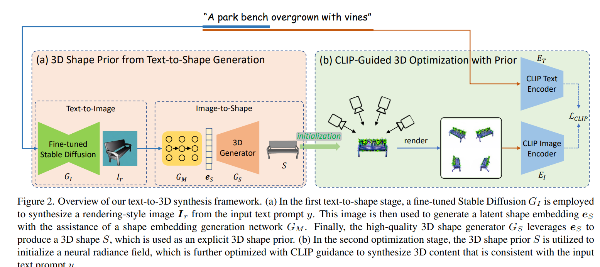

----

[67] SinGRAF: Learning a 3D Generative Radiance Field for a Single Scene

- 题目：SinGRAF：学习单个场景的3D生成辐射场
- 分类：3D GAN,生成辐射场
- Project: https://www.computationalimaging.org/publications/singraf/
- Code: soon
- Paper: https://arxiv.org/pdf/2211.17260.pdf
- 摘要： 

> *Generative models have shown great promise in synthesizing photorealistic 3D objects, but they require large amounts of training data. We introduce SinGRAF, a 3D-aware generative model that is trained with a few input images of a single scene. Once trained, SinGRAF generates different realizations of this 3D scene that preserve the appearance of the input while varying scene layout. For this purpose, we build on recent progress in 3D GAN architectures and introduce a novel progressive-scale patch discrimination approach during training. With several experiments, we demonstrate that the results produced by SinGRAF outperform the closest related works in both quality and diversity by a large margin.*

- 图示：

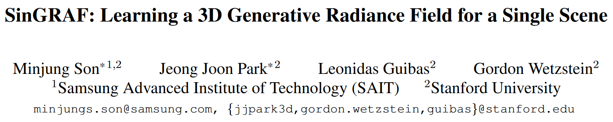

----

[68] $Level-S^2fM$: Structure from Motion on Neural Level Set of Implicit Surfaces

- 题目：Level-S2fM：隐式曲面的神经水平集上的运动恢复结构
- 分类：neural incremental Structure-from-Motion (SfM），增量重建,无位姿
- Project: https://henry123-boy.github.io/level-s2fm/
- Code: https://github.com/henry123-boy/Level-S2FM_official/tree/main
- Paper: https://arxiv.org/pdf/2211.12018.pdf
- 摘要： 

> *This paper presents a neural incremental Structure-from-Motion (SfM) approach, Level-S2fM, which estimates the camera poses and scene geometry from a set of uncalibrated images by learning coordinate MLPs for the implicit surfaces and the radiance fields from the established keypoint correspondences. Our novel formulation poses some new challenges due to inevitable two-view and few-view configurations in the incremental SfM pipeline, which complicates the optimization of coordinate MLPs for volumetric neural rendering with unknown camera poses. Nevertheless, we demonstrate that the strong inductive basis conveying in the 2D correspondences is promising to tackle those challenges by exploiting the relationship between the ray sampling schemes. Based on this, we revisit the pipeline of incremental SfM and renew the key components, including two-view geometry initialization, the camera poses registration, the 3D points triangulation, and Bundle Adjustment, with a fresh perspective based on neural implicit surfaces. By unifying the scene geometry in small MLP networks through coordinate MLPs, our Level-S2fM treats the zero-level set of the implicit surface as an informative top-down regularization to manage the reconstructed 3D points, reject the outliers in correspondences via querying SDF, and refine the estimated geometries by NBA (Neural BA). Not only does our Level-S2fM lead to promising results on camera pose estimation and scene geometry reconstruction, but it also shows a promising way for neural implicit rendering without knowing camera extrinsic beforehand.*

- 图示

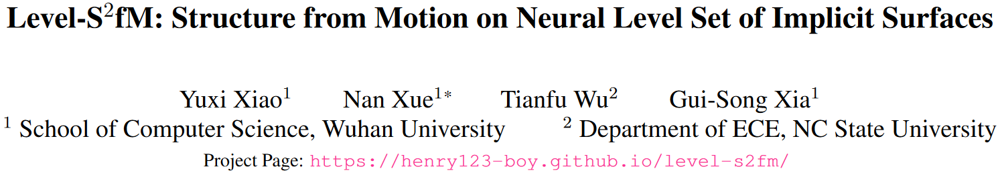

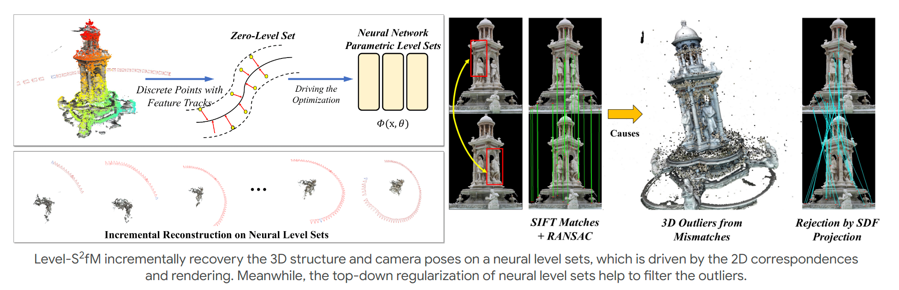

----

[69] PermutoSDF: Fast Multi-View Reconstruction with Implicit Surfaces using Permutohedral Lattices

- 题目：PermutoSDF：使用全面体晶格的隐式曲面快速多视图重建
- 分类：快速渲染, 30 fps on an RTX 3090
- Project: https://radualexandru.github.io/permuto_sdf/
- Code: https://github.com/RaduAlexandru/permuto_sdf
- Paper: https://arxiv.org/pdf/2211.12562.pdf
- 摘要： 

> *Neural radiance-density field methods have become increasingly popular for the task of novel-view rendering. Their recent extension to hash-based positional encoding ensures fast training and inference with visually pleasing results. However, density-based methods struggle with recovering accurate surface geometry. Hybrid methods alleviate this issue by optimizing the density based on an underlying SDF. However, current SDF methods are overly smooth and miss fine geometric details. In this work, we combine the strengths of these two lines of work in a novel hash-based implicit surface representation. We propose improvements to the two areas by replacing the voxel hash encoding with a permutohedral lattice which optimizes faster, especially for higher dimensions. We additionally propose a regularization scheme which is crucial for recovering high-frequency geometric detail. We evaluate our method on multiple datasets and show that we can recover geometric detail at the level of pores and wrinkles while using only RGB images for supervision. Furthermore, using sphere tracing we can render novel views at 30 fps on an RTX 3090.*

- 图示

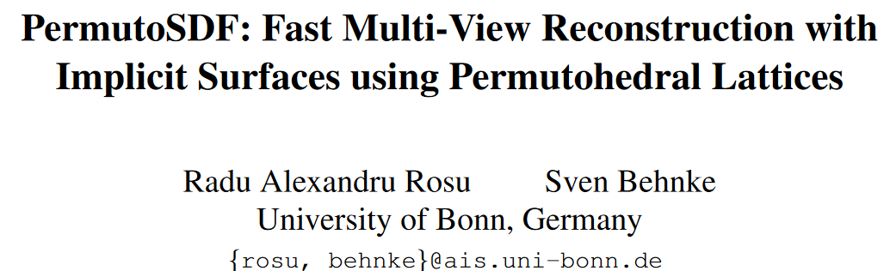

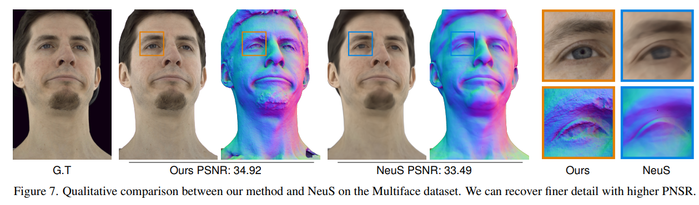

----

[70] Compressing Volumetric Radiance Fields to 1 MB

- 题目：将体积辐射场压缩到1MB
- 分类：节省内存
- Project: none
- Code: https://github.com/AlgoHunt/VQRF
- Paper: https://arxiv.org/pdf/2211.16386.pdf
- 摘要： 

> *Approximating radiance fields with volumetric grids is one of promising directions for improving NeRF, represented by methods like Plenoxels and DVGO, which achieve super-fast training convergence and real-time rendering. However, these methods typically require a tremendous storage overhead, costing up to hundreds of megabytes of disk space and runtime memory for a single scene. We address this issue in this paper by introducing a simple yet effective framework, called vector quantized radiance fields (VQRF), for compressing these volume-grid-based radiance fields. We first present a robust and adaptive metric for estimating redundancy in grid models and performing voxel pruning by better exploring intermediate outputs of volumetric rendering. A trainable vector quantization is further proposed to improve the compactness of grid models. In combination with an efficient joint tuning strategy and post-processing, our method can achieve a compression ratio of 100× by reducing the overall model size to 1 MB with negligible loss on visual quality. Extensive experiments demonstrate that the proposed framework is capable of achieving unrivaled performance and well generalization across multiple methods with distinct volumetric structures, facilitating the wide use of volumetric radiance fields methods in real-world applications. Code Available at \url{[this https URL](https://github.com/AlgoHunt/VQRF)}*

- 图示

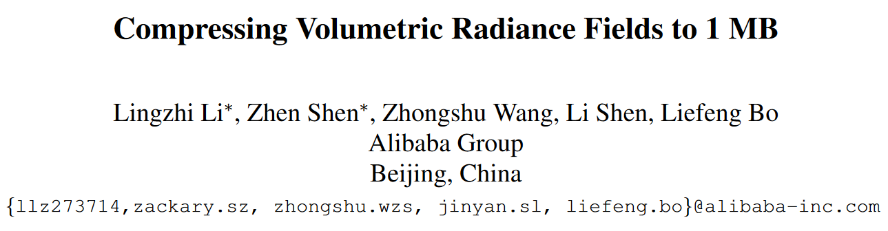

---

[71] ReRF: Neural Residual Radiance Fields for Streamably Free-Viewpoint Videos

- 题目：ReRF：用于流式自由视点视频的神经残差辐射场
- 分类：动态场景
- Project: none
- Group: https://www.xu-lan.com/research.html
- Code: soon
- Paper: soon
- Video: https://www.youtube.com/watch?v=dFvwaI1h-nc
- 摘要： 

> 

- 图示

---

[72] Co-SLAM: Joint Coordinate and Sparse Parametric Encodings for Neural Real-Time SLAM

- 题目：Co-SLAM：神经实时SLAM的联合坐标和稀疏参数编码
- 分类：NeRF-based SLAM
- Group: https://jingwenwang95.github.io/resume/
- Project: 
- Code: 
- Paper: 
- 摘要： 

> 

- 图示

-----

[73] vMAP: Vectorised Object Mapping for Neural Field SLAM

- 题目：vMAP：用于神经场SLAM的矢量化对象映射
- 分类：NeRF-based SLAM, RGBD
- Project: https://kxhit.github.io/vMAP
- Code: https://github.com/kxhit/vMAP
- Paper: https://arxiv.org/pdf/2302.01838.pdf
- 摘要： 

> *We present vMAP, an object-level dense SLAM system using neural field representations. Each object is represented by a small MLP, enabling efficient, watertight object modelling without the need for 3D priors. As an RGB-D camera browses a scene with no prior information, vMAP detects object instances on-the-fly, and dynamically adds them to its map. Specifically, thanks to the power of vectorised training, vMAP can optimise as many as 50 individual objects in a single scene, with an extremely efficient training speed of 5Hz map update. We experimentally demonstrate significantly improved scene-level and object-level reconstruction quality compared to prior neural field SLAM systems. Project page: [this https URL](https://kxhit.github.io/vMAP).*

- 图示

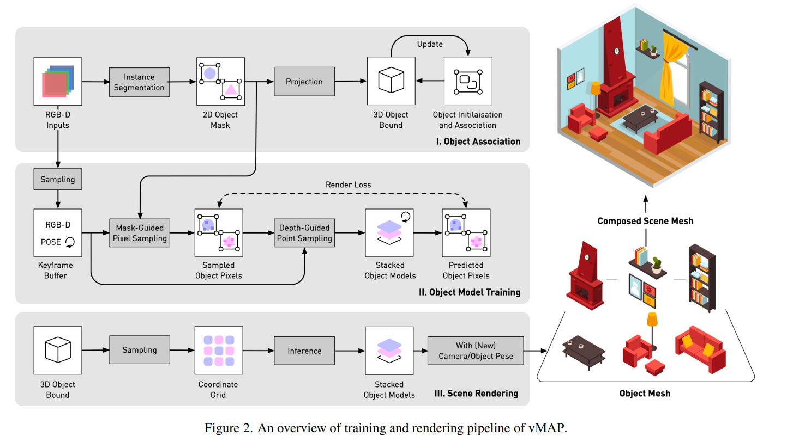

----

[74] Local Implicit Ray Function for Generalizable Radiance Field Representation

*Xin Huang · Qi Zhang · Ying Feng · Xiaoyu Li · Xuan Wang · Qing Wang*

- 题目：可泛化辐射场表示的局部隐式射线函数
- 分类：
- Project: 
- Code: 
- Paper: 
- 摘要： 

> 

- 图示

----

[75] Learning Neural Duplex Radiance Fields for Real-Time View Synthesis

*Ziyu Wan · Christian Richardt · Aljaz Bozic · Chao Li · Vijay Rengarajan · Seonghyeon Nam · Xiaoyu Xiang · Tuotuo Li · Bo Zhu · Rakesh Ranjan · Jing Liao*

- 题目：学习用于实时视图合成的神经双工辐射场
- 分类：
- Project: 
- Code: 
- Paper: 
- 摘要： 

> 

- 图示

---

[76] NeuralEditor: Editing Neural Radiance Fields via Manipulating Point Clouds

*Junkun Chen · Jipeng Lyu · Yu-Xiong Wang*

- 题目：NeuralEditor：通过操纵点云编辑神经辐射场
- 分类：
- Project: 
- Code: 
- Paper: 
- 摘要： 

> 

- 图示

---

[77] Multi-Space Neural Radiance Fields

*Ze-Xin Yin · Jiaxiong Qiu · Ming-Ming Cheng · Bo Ren*

- 题目：多空间神经辐射场
- 分类：
- Project: 
- Code: 
- Paper: 
- 摘要： 

> 

- 图示

---

[78] NeRFLight: Fast and Light Neural Radiance Fields using a Shared Feature Grid

*Fernando Rivas-Manzaneque · Jorge Sierra-Acosta · Adrian Penate-Sanchez · Francesc Moreno-Noguer · Angela Ribeiro*

- 题目：NeRFLight：使用共享特征网格的快速和轻型神经辐射场
- 分类：
- Project: 
- Code: 
- Paper: 
- 摘要： 

> 

- 图示

---

[79] Cross-Guided Optimization of Radiance Fields with Multi-View Image Super-Resolution for High-Resolution Novel View Synthesis

- 题目：用于高分辨率新视图合成的多视图图像超分辨率辐射场的交叉引导优化
- 分类：
- Project: 
- Code: 
- Paper: 
- 摘要： 

> 

- 图示

---

[80] DiffusioNeRF: Regularizing Neural Radiance Fields with Denoising Diffusion Models

- 题目：DiffusioNeRF：使用去噪扩散模型对神经辐射场进行正则化
- 分类：扩散模型
- Project: none
- Code: https://github.com/nianticlabs/diffusionerf
- Paper: https://arxiv.org/pdf/2302.12231.pdf
- 摘要： 

> *Under good conditions, Neural Radiance Fields (NeRFs) have shown impressive results on novel view synthesis tasks. NeRFs learn a scene's color and density fields by minimizing the photometric discrepancy between training views and differentiable renders of the scene. Once trained from a sufficient set of views, NeRFs can generate novel views from arbitrary camera positions. However, the scene geometry and color fields are severely under-constrained, which can lead to artifacts, especially when trained with few input views.
> To alleviate this problem we learn a prior over scene geometry and color, using a denoising diffusion model (DDM). Our DDM is trained on RGBD patches of the synthetic Hypersim dataset and can be used to predict the gradient of the logarithm of a joint probability distribution of color and depth patches. We show that, during NeRF training, these gradients of logarithms of RGBD patch priors serve to regularize geometry and color for a scene. During NeRF training, random RGBD patches are rendered and the estimated gradients of the log-likelihood are backpropagated to the color and density fields. Evaluations on LLFF, the most relevant dataset, show that our learned prior achieves improved quality in the reconstructed geometry and improved generalization to novel views. Evaluations on DTU show improved reconstruction quality among NeRF methods.*

- 图示

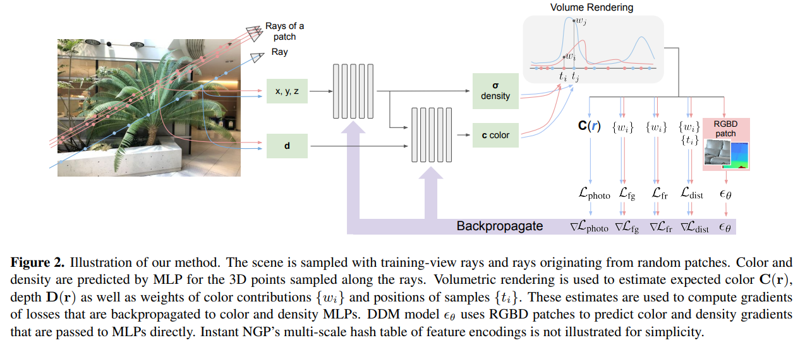

---

[81] DisCoScene: Spatially Disentangled Generative Radiance Fields for Controllable 3D-aware Scene Synthesis

- 题目：DisCoScene：用于可控3D感知场景合成的空间分离生成辐射场
- 分类：可编辑
- Project: https://snap-research.github.io/discoscene/
- Code: https://github.com/snap-research/discoscene
- Paper: https://snap-research.github.io/discoscene/contents/discoscene.pdf
- 摘要： 

> *Existing 3D-aware image synthesis approaches mainly focus on generating a single canonical object and show limited capacity in composing a complex scene containing a variety of objects. This work presents DisCoScene: a 3Daware generative model for high-quality and controllable scene synthesis. The key ingredient of our method is a very abstract object-level representation (i.e., 3D bounding boxes without semantic annotation) as the scene layout prior, which is simple to obtain, general to describe various scene contents, and yet informative to disentangle objects and background. Moreover, it serves as an intuitive user control for scene editing. Based on such a prior, the proposed model spatially disentangles the whole scene into object-centric generative radiance fields by learning on only 2D images with the global-local discrimination. Our model obtains the generation fidelity and editing flexibility of individual objects while being able to efficiently compose objects and the background into a complete scene. We demonstrate state-of-the-art performance on many scene datasets, including the challenging Waymo outdoor dataset. Project page: [this https URL](https://snap-research.github.io/discoscene/)*

- 图示

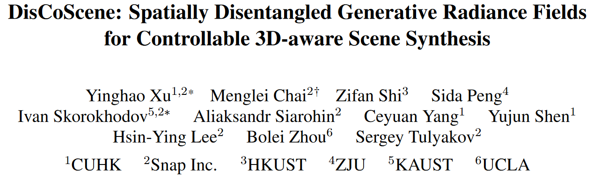

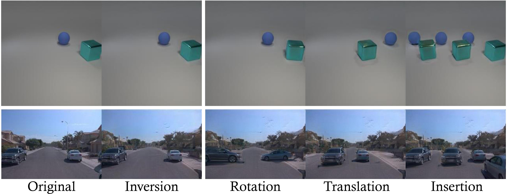

---

[82] HumanGen: Generating Human Radiance Fields with Explicit Priors

- 题目：HumanGen：使用显式先验生成人体辐射场
- 分类：人体建模
- Project: none
- Code: none
- Paper: https://arxiv.org/pdf/2212.05321.pdf
- 摘要： 

> *Recent years have witnessed the tremendous progress of 3D GANs for generating view-consistent radiance fields with photo-realism. Yet, high-quality generation of human radiance fields remains challenging, partially due to the limited human-related priors adopted in existing methods. We present HumanGen, a novel 3D human generation scheme with detailed geometry and 360∘ realistic free-view rendering. It explicitly marries the 3D human generation with various priors from the 2D generator and 3D reconstructor of humans through the design of "anchor image". We introduce a hybrid feature representation using the anchor image to bridge the latent space of HumanGen with the existing 2D generator. We then adopt a pronged design to disentangle the generation of geometry and appearance. With the aid of the anchor image, we adapt a 3D reconstructor for fine-grained details synthesis and propose a two-stage blending scheme to boost appearance generation. Extensive experiments demonstrate our effectiveness for state-of-the-art 3D human generation regarding geometry details, texture quality, and free-view performance. Notably, HumanGen can also incorporate various off-the-shelf 2D latent editing methods, seamlessly lifting them into 3D.*

- 图示

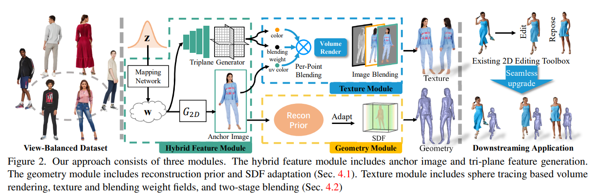

---

[83] ContraNeRF: Generalizable Neural Radiance Fields for Synthetic-to-real Novel View Synthesis via Contrastive Learning

- 题目：ContraNeRF：通过对比学习从合成到真实的新视图合成的可推广神经辐射场
- 分类：真实渲染
- Project: none
- Group: https://www.catalyzex.com/author/Hao%20Yang
- Code: none
- Paper: https://arxiv.org/pdf/2303.11052.pdf
- 摘要： 

> *Although many recent works have investigated generalizable NeRF-based novel view synthesis for unseen scenes, they seldom consider the synthetic-to-real generalization, which is desired in many practical applications. In this work, we first investigate the effects of synthetic data in synthetic-to-real novel view synthesis and surprisingly observe that models trained with synthetic data tend to produce sharper but less accurate volume densities. For pixels where the volume densities are correct, fine-grained details will be obtained. Otherwise, severe artifacts will be produced. To maintain the advantages of using synthetic data while avoiding its negative effects, we propose to introduce geometry-aware contrastive learning to learn multi-view consistent features with geometric constraints. Meanwhile, we adopt cross-view attention to further enhance the geometry perception of features by querying features across input views. Experiments demonstrate that under the synthetic-to-real setting, our method can render images with higher quality and better fine-grained details, outperforming existing generalizable novel view synthesis methods in terms of PSNR, SSIM, and LPIPS. When trained on real data, our method also achieves state-of-the-art results.*

- 图示

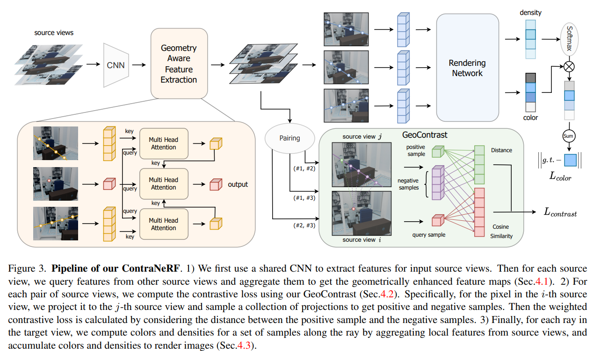

---

[84] Removing Objects From Neural Radiance Fields

- 题目：从神经辐射场中移除对象
- 分类：可编辑
- Project: https://nianticlabs.github.io/nerf-object-removal/
- Code: soon
- Paper: https://arxiv.org/pdf/2212.11966.pdf
- 摘要： 

> *Neural Radiance Fields (NeRFs) are emerging as a ubiquitous scene representation that allows for novel view synthesis. Increasingly, NeRFs will be shareable with other people. Before sharing a NeRF, though, it might be desirable to remove personal information or unsightly objects. Such removal is not easily achieved with the current NeRF editing frameworks. We propose a framework to remove objects from a NeRF representation created from an RGB-D sequence. Our NeRF inpainting method leverages recent work in 2D image inpainting and is guided by a user-provided mask. Our algorithm is underpinned by a confidence based view selection procedure. It chooses which of the individual 2D inpainted images to use in the creation of the NeRF, so that the resulting inpainted NeRF is 3D consistent. We show that our method for NeRF editing is effective for synthesizing plausible inpaintings in a multi-view coherent manner. We validate our approach using a new and still-challenging dataset for the task of NeRF inpainting.*

- 图示

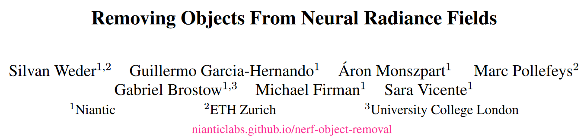

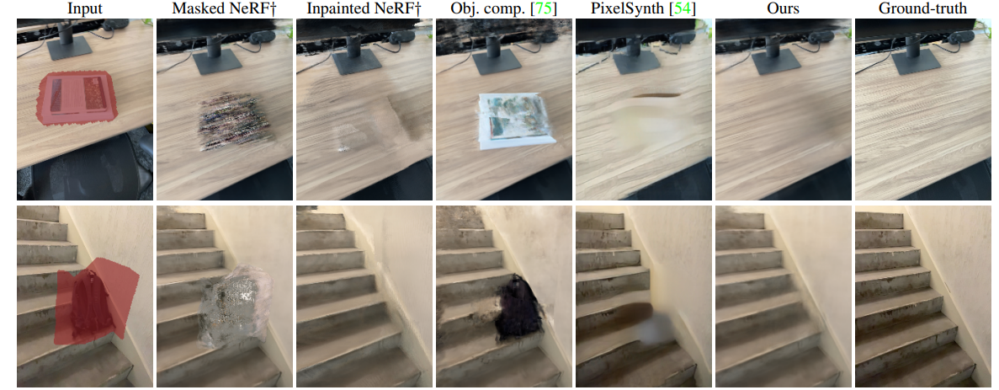

---

[85] **Complementary Intrinsics from Neural Radiance Fields and CNNs for Outdoor Scene Relighting**

*Siqi Yang · Xuanning Cui · Yongjie Zhu · Jiajun Tang · Si Li · Zhaofei Yu · Boxin Shi*

- 题目：
- 分类：
- Project: 
- Code: 
- Paper: 
- 摘要： 

> 

- 图示

---

[86] **One-Shot High-Fidelity Talking-Head Synthesis with Deformable Neural Radiance Field**

*Weichuang Li · Longhao Zhang · Dong Wang · Bin Zhao · Zhigang Wang · Mulin Chen · Bang Zhang · Zhongjian Wang · Liefeng Bo · Xuelong Li*

- 题目：
- 分类：
- Project: 
- Code: 
- Paper: 
- 摘要： 

> 

- 图示

---

[87] **High-fidelity Event-Radiance Recovery via Transient Event Frequency**

*Jin Han · Yuta Asano · Boxin Shi · Yinqiang Zheng · Zhihang Zhong*

- 题目：
- 分类：
- Project: 
- Code: 
- Paper: 
- 摘要： 

> 

- 图示

---

[88] PaletteNeRF: Palette-based Appearance Editing of Neural Radiance Fields

- 题目：PaletteNeRF：基于调色板的神经辐射场外观编辑
- 分类：外观编辑
- Project: https://palettenerf.github.io/
- Code: https://github.com/zfkuang/PaletteNeRF
- Paper: https://arxiv.org/pdf/2212.10699.pdf
- 摘要： 

> *Recent advances in neural radiance fields have enabled the high-fidelity 3D reconstruction of complex scenes for novel view synthesis. However, it remains underexplored how the appearance of such representations can be efficiently edited while maintaining photorealism.
> In this work, we present PaletteNeRF, a novel method for photorealistic appearance editing of neural radiance fields (NeRF) based on 3D color decomposition. Our method decomposes the appearance of each 3D point into a linear combination of palette-based bases (i.e., 3D segmentations defined by a group of NeRF-type functions) that are shared across the scene. While our palette-based bases are view-independent, we also predict a view-dependent function to capture the color residual (e.g., specular shading). During training, we jointly optimize the basis functions and the color palettes, and we also introduce novel regularizers to encourage the spatial coherence of the decomposition.
> Our method allows users to efficiently edit the appearance of the 3D scene by modifying the color palettes. We also extend our framework with compressed semantic features for semantic-aware appearance editing. We demonstrate that our technique is superior to baseline methods both quantitatively and qualitatively for appearance editing of complex real-world scenes.*

- 图示

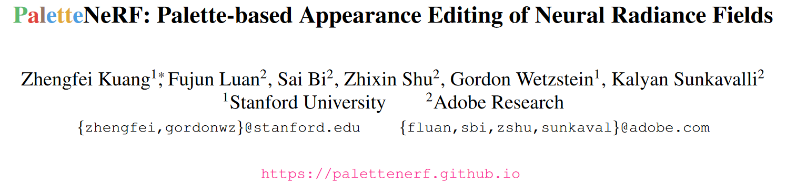

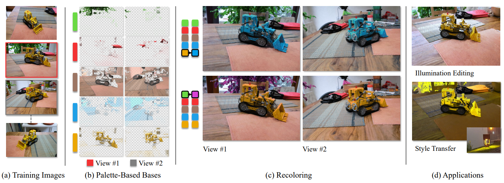

---

[89] **Occlusion-Free Scene Recovery via Neural Radiance Fields**

*Chengxuan Zhu · Renjie Wan · Yunkai Tang · Boxin Shi*

- 题目：
- 分类：
- Project: 
- Code: 
- Paper: 
- 摘要： 

> 

- 图示

---

[90] ORCa: Glossy Objects as Radiance Field Cameras

- 题目：ORCa：作为辐射场相机的光滑物体
- 分类：辐射场相机,物体反射【好新奇！！！？？？】
- Project: https://ktiwary2.github.io/objectsascam/
- Code: soon
- Paper: https://arxiv.org/pdf/2212.04531.pdf
- 摘要： 

> *Reflections on glossy objects contain valuable and hidden information about the surrounding environment. By converting these objects into cameras, we can unlock exciting applications, including imaging beyond the camera's field-of-view and from seemingly impossible vantage points, e.g. from reflections on the human eye. However, this task is challenging because reflections depend jointly on object geometry, material properties, the 3D environment, and the observer viewing direction. Our approach converts glossy objects with unknown geometry into radiance-field cameras to image the world from the object's perspective. Our key insight is to convert the object surface into a virtual sensor that captures cast reflections as a 2D projection of the 5D environment radiance field visible to the object. We show that recovering the environment radiance fields enables depth and radiance estimation from the object to its surroundings in addition to beyond field-of-view novel-view synthesis, i.e. rendering of novel views that are only directly-visible to the glossy object present in the scene, but not the observer. Moreover, using the radiance field we can image around occluders caused by close-by objects in the scene. Our method is trained end-to-end on multi-view images of the object and jointly estimates object geometry, diffuse radiance, and the 5D environment radiance field.*

- 图示

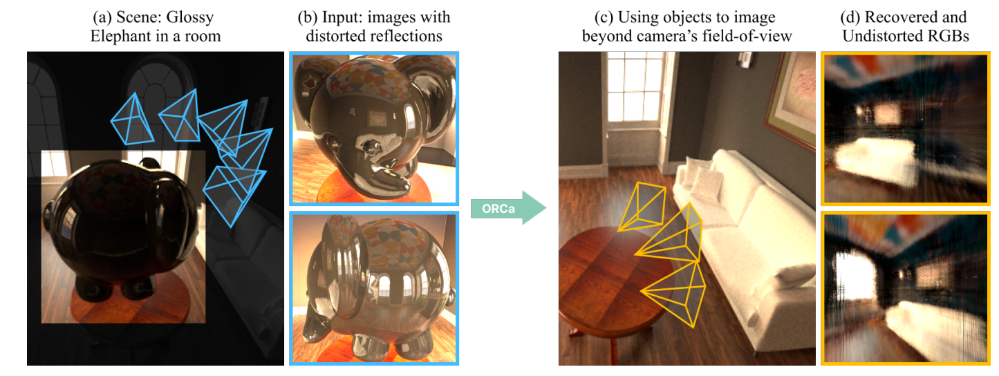

---

[91] VDN-NeRF: Resolving Shape-Radiance Ambiguity via View-Dependence Normalization

- 题目：VDN-NeRF：通过视图依赖归一化解决形状辐射模糊
- 分类：去模糊
- Project: none
- Code: https://github.com/BoifZ/VDN-NeRF
- Paper: https://arxiv.org/pdf/2303.17968.pdf
- 摘要： 

> *We propose VDN-NeRF, a method to train neural radiance fields (NeRFs) for better geometry under non-Lambertian surface and dynamic lighting conditions that cause significant variation in the radiance of a point when viewed from different angles. Instead of explicitly modeling the underlying factors that result in the view-dependent phenomenon, which could be complex yet not inclusive, we develop a simple and effective technique that normalizes the view-dependence by distilling invariant information already encoded in the learned NeRFs. We then jointly train NeRFs for view synthesis with view-dependence normalization to attain quality geometry. Our experiments show that even though shape-radiance ambiguity is inevitable, the proposed normalization can minimize its effect on geometry, which essentially aligns the optimal capacity needed for explaining view-dependent variations. Our method applies to various baselines and significantly improves geometry without changing the volume rendering pipeline, even if the data is captured under a moving light source. Code is available at: [this https URL](https://github.com/BoifZ/VDN-NeRF).*

- 图示

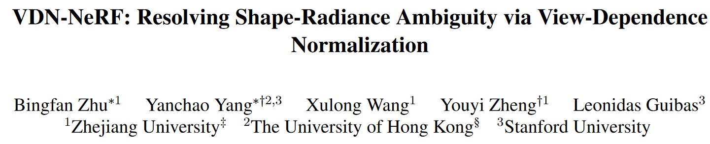

---

[92] **SurfelNeRF: Neural Surfel Radiance Fields for Online Photorealistic Reconstruction of Indoor Scenes**

*Yiming Gao · Yan-Pei Cao · Ying Shan*

- 题目：
- 分类：
- Project: 
- Code: 
- Paper: 
- 摘要： 

> 

- 图示

---

[93] DBARF: Deep Bundle-Adjusting Generalizable Neural Radiance Fields

- 题目：DBARF：深度束调整泛化神经辐射场
- 分类：Bundle-Adjusting
- Project: https://aibluefisher.github.io/dbarf/
- Code: https://github.com/AIBluefisher/dbarf
- Paper: https://arxiv.org/pdf/2303.14478.pdf
- 摘要： 

> *Recent works such as BARF and GARF can bundle adjust camera poses with neural radiance fields (NeRF) which is based on coordinate-MLPs. Despite the impressive results, these methods cannot be applied to Generalizable NeRFs (GeNeRFs) which require image feature extractions that are often based on more complicated 3D CNN or transformer architectures. In this work, we first analyze the difficulties of jointly optimizing camera poses with GeNeRFs, and then further propose our DBARF to tackle these issues. Our DBARF which bundle adjusts camera poses by taking a cost feature map as an implicit cost function can be jointly trained with GeNeRFs in a self-supervised manner. Unlike BARF and its follow-up works, which can only be applied to per-scene optimized NeRFs and need accurate initial camera poses with the exception of forward-facing scenes, our method can generalize across scenes and does not require any good initialization. Experiments show the effectiveness and generalization ability of our DBARF when evaluated on real-world datasets. Our code is available at \url{[this https URL](https://aibluefisher.github.io/dbarf)}.*

- 图示

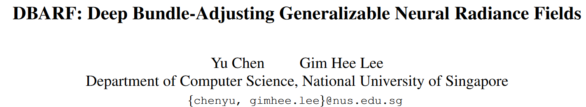

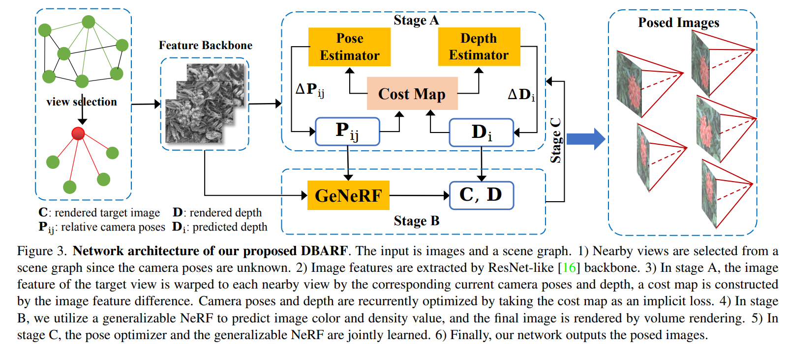

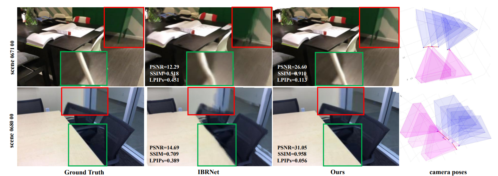

---

[94] PlenVDB: Memory Efficient VDB-Based Radiance Fields for Fast Training and Rendering

- 题目：PlenVDB：用于快速训练和渲染的内存高效的基于VDB的辐射场
- 分类：快速渲染,节省内存
- Project: https://plenvdb.github.io/
- Code: none
- Paper: soon
- 摘要： 

> *In this paper, we present a new representation for neural radiance fields that accelerates both the training and the inference processes with VDB, a hierarchical data structure for sparse volumes. VDB takes both the advantages of sparse and dense volumes for compact data representation and efficient data access, being a promising data structure for NeRF data interpolation and ray marching. Our method, Plenoptic VDB (PlenVDB), directly learns the VDB data structure from a set of posed images by means of a novel training strategy and then uses it for real-time rendering. Experimental results demonstrate the effectiveness and the efficiency of our method over previous arts: First, it converges faster in the training process. Second, it delivers a more compact data format for NeRF data presentation. Finally, it renders more efficiently on commodity graphics hardware. Our mobile PlenVDB demo achieves 30+ FPS, 1280x720 resolution on an iPhone12 mobile phone.*

- 图示

---

[95] **SeaThru-NeRF: Neural Radiance Fields in Scattering Media**

*Deborah Levy · Amit Peleg · Naama Pearl · Dan Rosenbaum · Derya Akkaynak · Simon Korman · Tali Treibitz*

- 题目：SeaThru-NeRF：散射介质中的神经辐射场
- 分类：
- Project: 
- Video: https://www.youtube.com/watch?v=oRMvTBBARKE
- Code: 
- Paper: 
- 摘要： 

> *Research on neural radiance fields (NeRFs) for novel view generation is exploding with new models and extensions. However, a question that remains unanswered is what happens in underwater or foggy  scenes where the medium strongly influences the appearance of objects? Thus far, NeRF and its variants have ignored these cases. However, since the NeRF framework is based on volumetric rendering, it has inherent capability to account for the medium's effects, once modeled appropriately. We develop a new rendering model for NeRFs in scattering media, which is based on the SeaThru image formation model, and suggest a suitable architecture for learning both scene information and medium parameters. We demonstrate the strength of our method using simulated and real-world scenes with diverse optical properties on several tasks, correctly rendering novel photorealistic views underwater. Even more excitingly, we can render clear views of these scenes, removing the interfering medium between the camera and the scene and reconstructing the appearance and depth of further objects, which are severely occluded by the medium. We make our code and unique dataset available and discuss the promise and limitations of NeRFs in scattering media.*

- 图示

---

[96] Point2Pix: Photo-Realistic Point Cloud Rendering via Neural Radiance Fields

- 题目：Point2Pix：通过神经辐射场进行逼真的点云渲染
- 分类：点云渲染
- Project: none
- Code: none
- Paper: https://arxiv.org/pdf/2303.16482.pdf
- 摘要： 

> *Synthesizing photo-realistic images from a point cloud is challenging because of the sparsity of point cloud representation. Recent Neural Radiance Fields and extensions are proposed to synthesize realistic images from 2D input. In this paper, we present Point2Pix as a novel point renderer to link the 3D sparse point clouds with 2D dense image pixels. Taking advantage of the point cloud 3D prior and NeRF rendering pipeline, our method can synthesize high-quality images from colored point clouds, generally for novel indoor scenes. To improve the efficiency of ray sampling, we propose point-guided sampling, which focuses on valid samples. Also, we present Point Encoding to build Multi-scale Radiance Fields that provide discriminative 3D point features. Finally, we propose Fusion Encoding to efficiently synthesize high-quality images. Extensive experiments on the ScanNet and ArkitScenes datasets demonstrate the effectiveness and generalization.*

- 图示

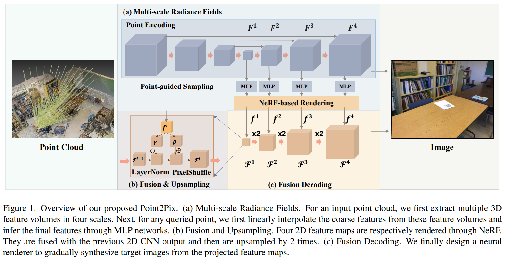

---

[97] DINER: Depth-aware Image-based NEural Radiance fields

- 题目：DINER：基于深度感知图像的神经辐射场
- 分类：人脸建模,深度监督
- Project: https://malteprinzler.github.io/projects/diner/diner.html
- Code: https://github.com/malteprinzler/diner
- Paper: https://arxiv.org/pdf/2211.16630.pdf
- 摘要： 

> *We present Depth-aware Image-based NEural Radiance fields (DINER). Given a sparse set of RGB input views, we predict depth and feature maps to guide the reconstruction of a volumetric scene representation that allows us to render 3D objects under novel views. Specifically, we propose novel techniques to incorporate depth information into feature fusion and efficient scene sampling. In comparison to the previous state of the art, DINER achieves higher synthesis quality and can process input views with greater disparity. This allows us to capture scenes more completely without changing capturing hardware requirements and ultimately enables larger viewpoint changes during novel view synthesis. We evaluate our method by synthesizing novel views, both for human heads and for general objects, and observe significantly improved qualitative results and increased perceptual metrics compared to the previous state of the art. The code is publicly available for research purposes.*

- 图示

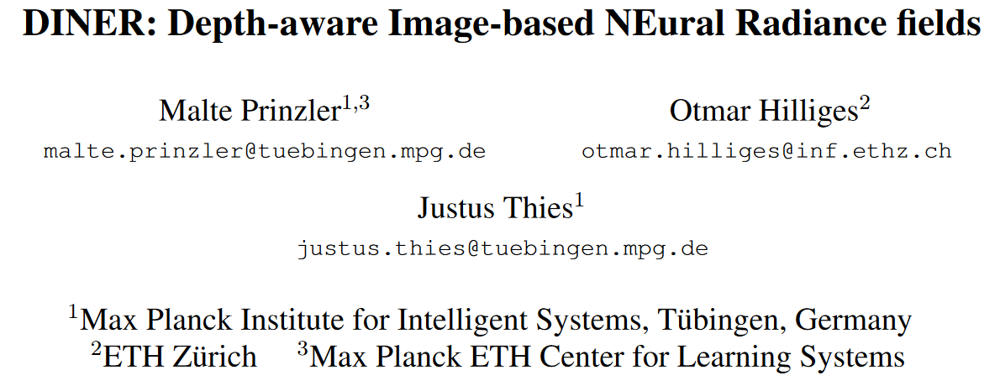

---

[98] **NeRFVS: Neural Radiance Fields for Free View Synthesis via Geometry Scaffolds**

*chen yang · Peihao Li · Zanwei Zhou · Shanxin Yuan · Bingbing Liu · Xiaokang Yang · Weichao Qiu · Wei Shen*

- 题目：NeRFVS：通过几何支架进行自由视图合成的神经辐射场
- 分类：
- Project: 
- Code: 
- Paper: 
- 摘要： 

> 

- 图示

---

[99] Exact-NeRF: An Exploration of a Precise Volumetric Parameterization for Neural Radiance Fields

- 题目：Exact-NeRF：神经辐射场精确体积参数化的探索
- 分类：本质工作,位置编码
- Project: none
- Code: https://github.com/KostadinovShalon/exact-nerf
- Paper: https://arxiv.org/pdf/2211.12285.pdf
- 摘要： 

> *Neural Radiance Fields (NeRF) have attracted significant attention due to their ability to synthesize novel scene views with great accuracy. However, inherent to their underlying formulation, the sampling of points along a ray with zero width may result in ambiguous representations that lead to further rendering artifacts such as aliasing in the final scene. To address this issue, the recent variant mip-NeRF proposes an Integrated Positional Encoding (IPE) based on a conical view frustum. Although this is expressed with an integral formulation, mip-NeRF instead approximates this integral as the expected value of a multivariate Gaussian distribution. This approximation is reliable for short frustums but degrades with highly elongated regions, which arises when dealing with distant scene objects under a larger depth of field. In this paper, we explore the use of an exact approach for calculating the IPE by using a pyramid-based integral formulation instead of an approximated conical-based one. We denote this formulation as Exact-NeRF and contribute the first approach to offer a precise analytical solution to the IPE within the NeRF domain. Our exploratory work illustrates that such an exact formulation Exact-NeRF matches the accuracy of mip-NeRF and furthermore provides a natural extension to more challenging scenarios without further modification, such as in the case of unbounded scenes. Our contribution aims to both address the hitherto unexplored issues of frustum approximation in earlier NeRF work and additionally provide insight into the potential future consideration of analytical solutions in future NeRF extensions.*

- 图示

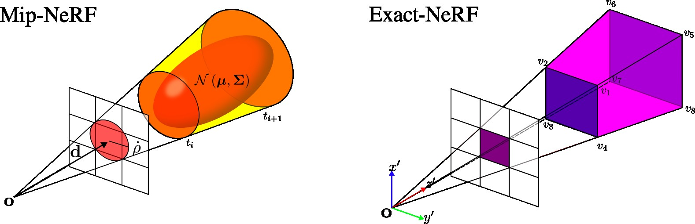

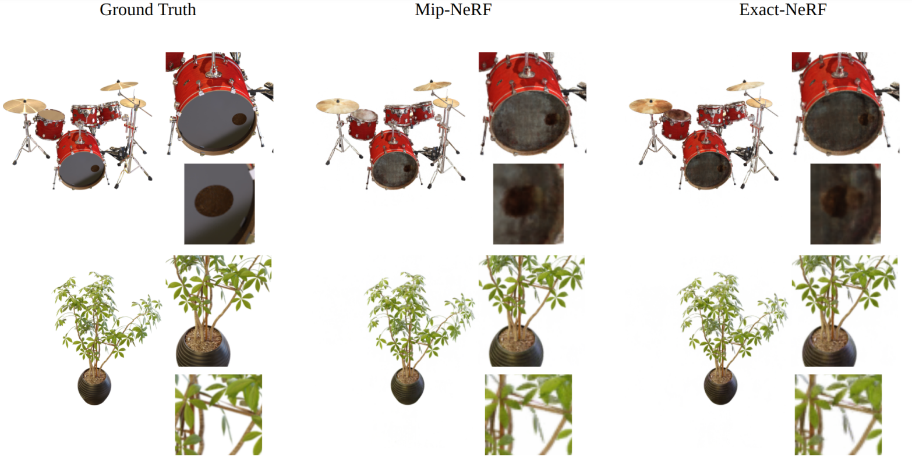

---

[100] **Lift3D: Synthesize 3D Training Data by Lifting 2D GAN to 3D Generative Radiance Field**

*Leheng Li · Qing LIAN · Luozhou WANG · Ningning MA · Ying-Cong Chen*

- 题目：
- 分类：
- Project: 
- Code: 
- Paper: 
- 摘要： 

> 

- 图示

---

[101] BAD-NeRF: Bundle Adjusted Deblur Neural Radiance Fields

- 题目：BAD-NeRF：束调整的去模糊神经辐射场
- 分类：Bundle-Adjusting,去模糊
- Project: none
- Code: https://github.com/WU-CVGL/BAD-NeRF
- Paper: https://arxiv.org/pdf/2211.12853.pdf
- 摘要： 

> *Neural Radiance Fields (NeRF) have received considerable attention recently, due to its impressive capability in photo-realistic 3D reconstruction and novel view synthesis, given a set of posed camera images. Earlier work usually assumes the input images are in good quality. However, image degradation (e.g. image motion blur in low-light conditions) can easily happen in real-world scenarios, which would further affect the rendering quality of NeRF. In this paper, we present a novel bundle adjusted deblur Neural Radiance Fields (BAD-NeRF), which can be robust to severe motion blurred images and inaccurate camera poses. Our approach models the physical image formation process of a motion blurred image, and jointly learns the parameters of NeRF and recovers the camera motion trajectories during exposure time. In experiments, we show that by directly modeling the real physical image formation process, BAD-NeRF achieves superior performance over prior works on both synthetic and real datasets.*

- 图示

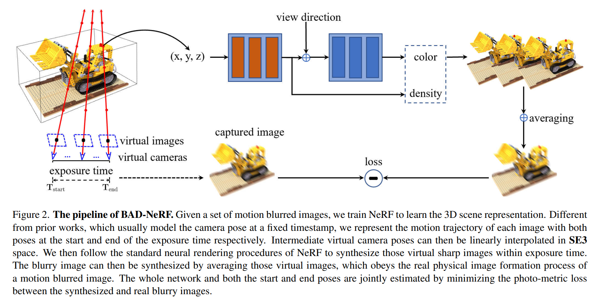

---

[102] **Clothed Human Performance Capture with a Double-layer Neural Radiance Fields**

*Kangkan Wang · Guofeng Zhang · Suxu Cong · Jian Yang*

- 题目：两层神经辐射场的穿衣人体动作捕捉
- 分类：
- Project: 
- Code: 
- Paper: 
- 摘要： 

> 

- 图示

---

[103] K-Planes: Explicit Radiance Fields in Space, Time, and Appearance

- 题目：K平面：空间、时间和外观中的显式辐射场
- 分类：快速渲染,节省内存
- Project: https://sarafridov.github.io/K-Planes/
- Code: https://github.com/sarafridov/K-Planes
- Paper: https://arxiv.org/pdf/2301.10241.pdf
- 摘要： 

> *We introduce k-planes, a white-box model for radiance fields in arbitrary dimensions. Our model uses d choose 2 planes to represent a d-dimensional scene, providing a seamless way to go from static (d=3) to dynamic (d=4) scenes. This planar factorization makes adding dimension-specific priors easy, e.g. temporal smoothness and multi-resolution spatial structure, and induces a natural decomposition of static and dynamic components of a scene. We use a linear feature decoder with a learned color basis that yields similar performance as a nonlinear black-box MLP decoder. Across a range of synthetic and real, static and dynamic, fixed and varying appearance scenes, k-planes yields competitive and often state-of-the-art reconstruction fidelity with low memory usage, achieving 1000x compression over a full 4D grid, and fast optimization with a pure PyTorch implementation. For video results and code, please see [this https URL](https://sarafridov.github.io/K-Planes).*

- 图示

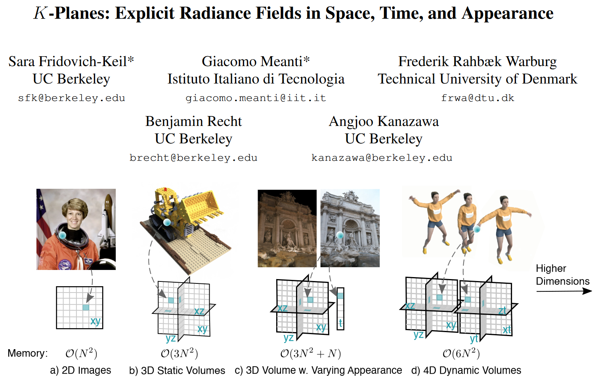

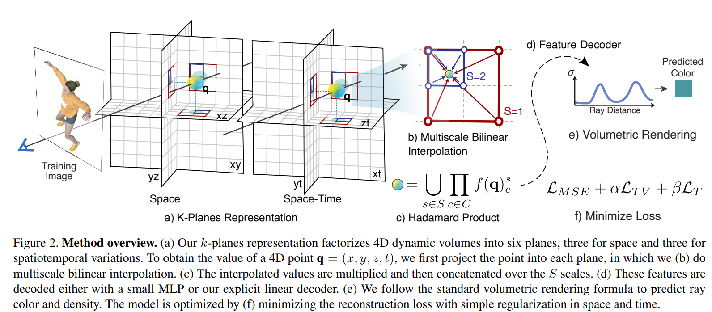

---

[104] SteerNeRF: Accelerating NeRF Rendering via Smooth Viewpoint Trajectory

- 题目：SteerNeRF：通过平滑视点轨迹加速NeRF渲染
- 分类：快速渲染
- Project: none
- Code: none
- Paper: https://arxiv.org/pdf/2212.08476.pdf
- 摘要： 

> *Neural Radiance Fields (NeRF) have demonstrated superior novel view synthesis performance but are slow at rendering. To speed up the volume rendering process, many acceleration methods have been proposed at the cost of large memory consumption. To push the frontier of the efficiency-memory trade-off, we explore a new perspective to accelerate NeRF rendering, leveraging a key fact that the viewpoint change is usually smooth and continuous in interactive viewpoint control. This allows us to leverage the information of preceding viewpoints to reduce the number of rendered pixels as well as the number of sampled points along the ray of the remaining pixels. In our pipeline, a low-resolution feature map is rendered first by volume rendering, then a lightweight 2D neural renderer is applied to generate the output image at target resolution leveraging the features of preceding and current frames. We show that the proposed method can achieve competitive rendering quality while reducing the rendering time with little memory overhead, enabling 30FPS at 1080P image resolution with a low memory footprint.*

- 图示

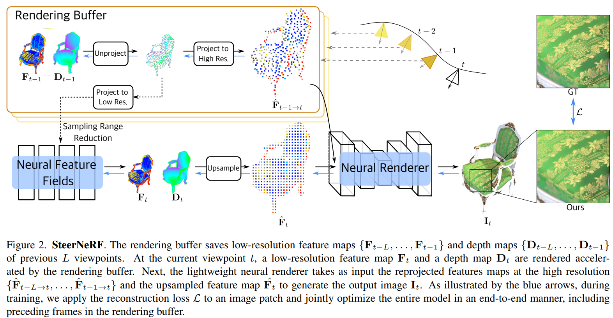

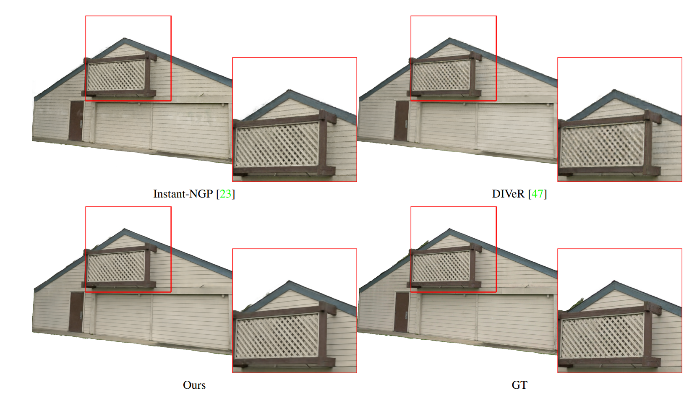

---

[105] JacobiNeRF: NeRF Shaping with Mutual Information Gradients

- 题目：JacobiNeRF：具有互信息梯度的NeRF整形
- 分类：语义分割
- Project: none
- Code: https://github.com/xxm19/jacobinerf
- Paper: https://arxiv.org/pdf/2304.00341.pdf
- 摘要： 

> *We propose a method that trains a neural radiance field (NeRF) to encode not only the appearance of the scene but also semantic correlations between scene points, regions, or entities -- aiming to capture their mutual co-variation patterns. In contrast to the traditional first-order photometric reconstruction objective, our method explicitly regularizes the learning dynamics to align the Jacobians of highly-correlated entities, which proves to maximize the mutual information between them under random scene perturbations. By paying attention to this second-order information, we can shape a NeRF to express semantically meaningful synergies when the network weights are changed by a delta along the gradient of a single entity, region, or even a point. To demonstrate the merit of this mutual information modeling, we leverage the coordinated behavior of scene entities that emerges from our shaping to perform label propagation for semantic and instance segmentation. Our experiments show that a JacobiNeRF is more efficient in propagating annotations among 2D pixels and 3D points compared to NeRFs without mutual information shaping, especially in extremely sparse label regimes -- thus reducing annotation burden. The same machinery can further be used for entity selection or scene modifications.*

- 图示

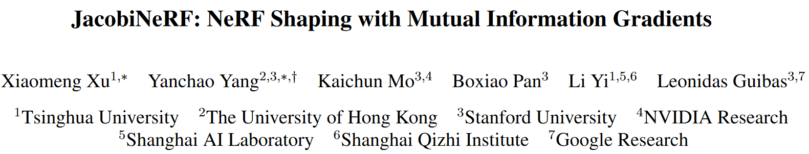

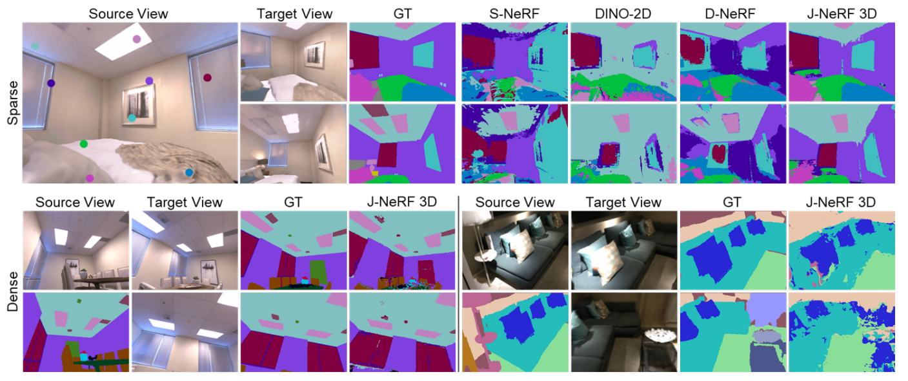

---

[106] NeRDi: Single-View NeRF Synthesis with Language-Guided Diffusion as General Image Priors

- 题目：NeRDi：以语言引导扩散作为一般图像先验的单视图NeRF合成
- 分类：扩散模型,语言引导
- Project: none
- Code: none
- Paper: https://arxiv.org/pdf/2212.03267.pdf
- 摘要： 

> *2D-to-3D reconstruction is an ill-posed problem, yet humans are good at solving this problem due to their prior knowledge of the 3D world developed over years. Driven by this observation, we propose NeRDi, a single-view NeRF synthesis framework with general image priors from 2D diffusion models. Formulating single-view reconstruction as an image-conditioned 3D generation problem, we optimize the NeRF representations by minimizing a diffusion loss on its arbitrary view renderings with a pretrained image diffusion model under the input-view constraint. We leverage off-the-shelf vision-language models and introduce a two-section language guidance as conditioning inputs to the diffusion model. This is essentially helpful for improving multiview content coherence as it narrows down the general image prior conditioned on the semantic and visual features of the single-view input image. Additionally, we introduce a geometric loss based on estimated depth maps to regularize the underlying 3D geometry of the NeRF. Experimental results on the DTU MVS dataset show that our method can synthesize novel views with higher quality even compared to existing methods trained on this dataset. We also demonstrate our generalizability in zero-shot NeRF synthesis for in-the-wild images.*

- 图示

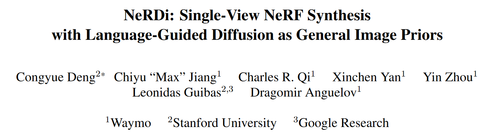

---

[107] MixNeRF: Modeling a Ray with Mixture Density for Novel View Synthesis from Sparse Inputs

- 题目：MixNeRF：使用混合密度对光线进行建模，以从稀疏输入中合成新的视图
- 分类：稀疏视图,深度监督
- Project: none
- Code: none
- Paper: https://arxiv.org/pdf/2302.08788.pdf
- 摘要： 

> *Neural Radiance Field (NeRF) has broken new ground in the novel view synthesis due to its simple concept and state-of-the-art quality. However, it suffers from severe performance degradation unless trained with a dense set of images with different camera poses, which hinders its practical applications. Although previous methods addressing this problem achieved promising results, they relied heavily on the additional training resources, which goes against the philosophy of sparse-input novel-view synthesis pursuing the training efficiency. In this work, we propose MixNeRF, an effective training strategy for novel view synthesis from sparse inputs by modeling a ray with a mixture density model. Our MixNeRF estimates the joint distribution of RGB colors along the ray samples by modeling it with mixture of distributions. We also propose a new task of ray depth estimation as a useful training objective, which is highly correlated with 3D scene geometry. Moreover, we remodel the colors with regenerated blending weights based on the estimated ray depth and further improves the robustness for colors and viewpoints. Our MixNeRF outperforms other state-of-the-art methods in various standard benchmarks with superior efficiency of training and inference.*

- 图示

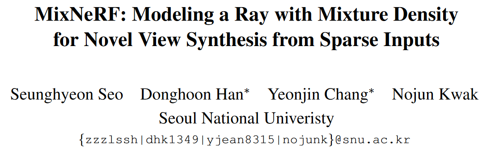

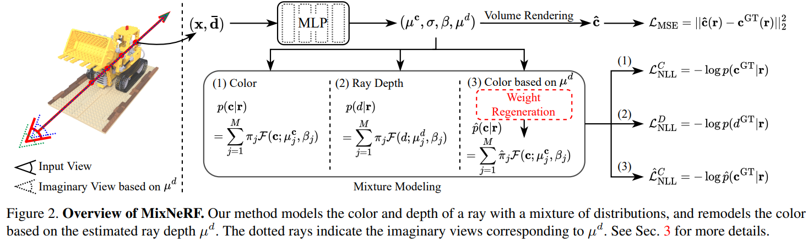

---

[108] **ReLight My NeRF: A Dataset for Novel View Synthesis and Relighting of Real World Objects**

*Marco Toschi · Riccardo De Matteo · Riccardo Spezialetti · Daniele Gregorio · Luigi Di Stefano · Samuele Salti*

- 题目：ReLight My NeRF：用于现实世界对象的新颖视图合成和重新照明的数据集
- 分类：新数据集
- Project: 
- Code: 
- Paper: 
- 摘要： 

> 

- 图示

---

[109] Flow supervision for Deformable NeRF

- 题目：可变形NeRF的光流监督
- 分类：光流监督
- Project: https://mightychaos.github.io/projects/fsdnerf/
- Code: soon
- Paper: https://arxiv.org/pdf/2303.16333.pdf
- 摘要： 

> *In this paper we present a new method for deformable NeRF that can directly use optical flow as supervision. We overcome the major challenge with respect to the computationally inefficiency of enforcing the flow constraints to the backward deformation field, used by deformable NeRFs. Specifically, we show that inverting the backward deformation function is actually not needed for computing scene flows between frames. This insight dramatically simplifies the problem, as one is no longer constrained to deformation functions that can be analytically inverted. Instead, thanks to the weak assumptions required by our derivation based on the inverse function theorem, our approach can be extended to a broad class of commonly used backward deformation field. We present results on monocular novel view synthesis with rapid object motion, and demonstrate significant improvements over baselines without flow supervision.*

- 图示

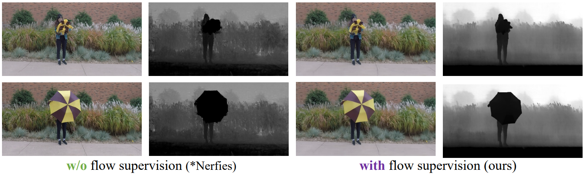

---

[110] **SurfelNeRF: Neural Surfel Radiance Fields for Online Photorealistic Reconstruction of Indoor Scenes**

*Yiming Gao · Yan-Pei Cao · Ying Shan*

- 题目：
- 分类：
- Project: 
- Code: 
- Paper: 
- 摘要： 

> 

- 图示

---

[111] RobustNeRF: Ignoring Distractors with Robust Losses

- 题目：RobustNeRF：忽略具有强大损失的干扰因素
- 分类：去模糊,真实渲染
- Project: https://robustnerf.github.io/public/
- Code: none
- Paper: https://arxiv.org/pdf/2302.00833.pdf
- 摘要： 

> *Neural radiance fields (NeRF) excel at synthesizing new views given multi-view, calibrated images of a static scene. When scenes include distractors, which are not persistent during image capture (moving objects, lighting variations, shadows), artifacts appear as view-dependent effects or 'floaters'. To cope with distractors, we advocate a form of robust estimation for NeRF training, modeling distractors in training data as outliers of an optimization problem. Our method successfully removes outliers from a scene and improves upon our baselines, on synthetic and real-world scenes. Our technique is simple to incorporate in modern NeRF frameworks, with few hyper-parameters. It does not assume a priori knowledge of the types of distractors, and is instead focused on the optimization problem rather than pre-processing or modeling transient objects. More results on our page [this https URL](https://robustnerf.github.io/public).*

- 图示

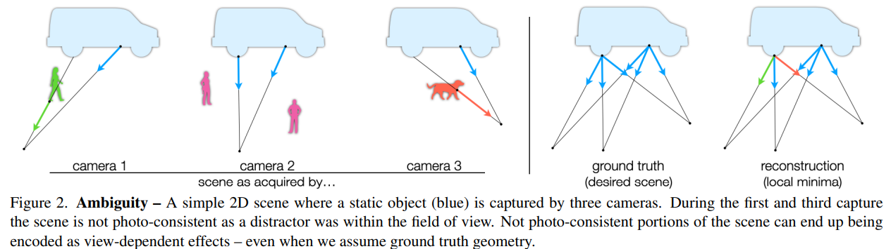

---

[112] PersonNeRF: Personalized Reconstruction from Photo Collections

- 题目：PersonNeRF：照片集的个性化重建
- 分类：人体建模
- Project: https://grail.cs.washington.edu/projects/personnerf/
- Code: none
- Paper: https://arxiv.org/pdf/2302.08504.pdf
- 摘要： 

> *We present PersonNeRF, a method that takes a collection of photos of a subject (e.g. Roger Federer) captured across multiple years with arbitrary body poses and appearances, and enables rendering the subject with arbitrary novel combinations of viewpoint, body pose, and appearance. PersonNeRF builds a customized neural volumetric 3D model of the subject that is able to render an entire space spanned by camera viewpoint, body pose, and appearance. A central challenge in this task is dealing with sparse observations; a given body pose is likely only observed by a single viewpoint with a single appearance, and a given appearance is only observed under a handful of different body poses. We address this issue by recovering a canonical T-pose neural volumetric representation of the subject that allows for changing appearance across different observations, but uses a shared pose-dependent motion field across all observations. We demonstrate that this approach, along with regularization of the recovered volumetric geometry to encourage smoothness, is able to recover a model that renders compelling images from novel combinations of viewpoint, pose, and appearance from these challenging unstructured photo collections, outperforming prior work for free-viewpoint human rendering.*

- 图示

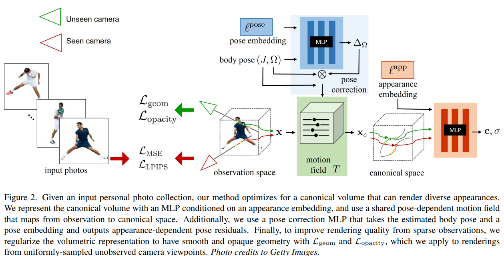

---

[113] **RefSR-NeRF: Towards High Fidelity and Super Resolution View Synthesis**

*Xudong Huang · Wei Li · Jie Hu · Hanting Chen · Yunhe Wang*

- 分类：
- Project: 
- Code: 
- Paper: 
- 摘要： 

> **

- 图示

---

[114] NeRF in the Palm of Your Hand: Corrective Augmentation for Robotics via Novel-View Synthesis

- 题目：掌中NeRF：通过新视图合成对机器人进行矫正增强
- 分类：机器人感知,抓取感知 [超赞！！！！]
- Project: https://bland.website/spartn/
- Code: none
- Paper: https://arxiv.org/pdf/2301.08556.pdf
- 摘要： 

> *Expert demonstrations are a rich source of supervision for training visual robotic manipulation policies, but imitation learning methods often require either a large number of demonstrations or expensive online expert supervision to learn reactive closed-loop behaviors. In this work, we introduce SPARTN (Synthetic Perturbations for Augmenting Robot Trajectories via NeRF): a fully-offline data augmentation scheme for improving robot policies that use eye-in-hand cameras. Our approach leverages neural radiance fields (NeRFs) to synthetically inject corrective noise into visual demonstrations, using NeRFs to generate perturbed viewpoints while simultaneously calculating the corrective actions. This requires no additional expert supervision or environment interaction, and distills the geometric information in NeRFs into a real-time reactive RGB-only policy. In a simulated 6-DoF visual grasping benchmark, SPARTN improves success rates by 2.8× over imitation learning without the corrective augmentations and even outperforms some methods that use online supervision. It additionally closes the gap between RGB-only and RGB-D success rates, eliminating the previous need for depth sensors. In real-world 6-DoF robotic grasping experiments from limited human demonstrations, our method improves absolute success rates by 22.5% on average, including objects that are traditionally challenging for depth-based methods. See video results at \urlhttps://bland.website/spartn}$.*

- 图示

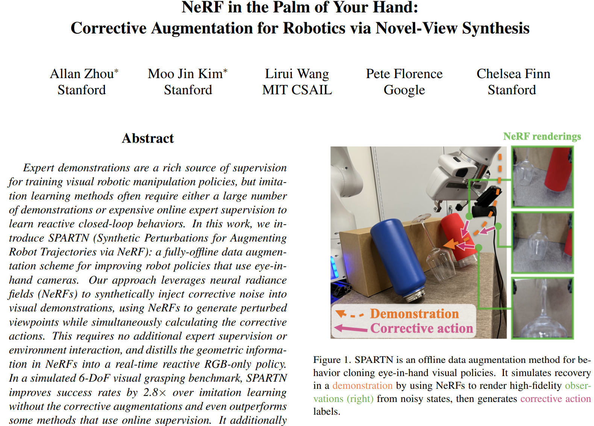

---

[115] NeRFInvertor: High Fidelity NeRF-GAN Inversion for Single-shot Real Image Animation

- 题目：NeRFInvertor：用于单次真实图像动画的高保真NeRF-GAN反演
- 分类：NeRF-GAN 
- Project: none
- Code: none
- Paper: https://arxiv.org/pdf/2211.17235.pdf
- 摘要： 

> *Nerf-based Generative models have shown impressive capacity in generating high-quality images with consistent 3D geometry. Despite successful synthesis of fake identity images randomly sampled from latent space, adopting these models for generating face images of real subjects is still a challenging task due to its so-called inversion issue. In this paper, we propose a universal method to surgically fine-tune these NeRF-GAN models in order to achieve high-fidelity animation of real subjects only by a single image. Given the optimized latent code for an out-of-domain real image, we employ 2D loss functions on the rendered image to reduce the identity gap. Furthermore, our method leverages explicit and implicit 3D regularizations using the in-domain neighborhood samples around the optimized latent code to remove geometrical and visual artifacts. Our experiments confirm the effectiveness of our method in realistic, high-fidelity, and 3D consistent animation of real faces on multiple NeRF-GAN models across different datasets.*

- 图示

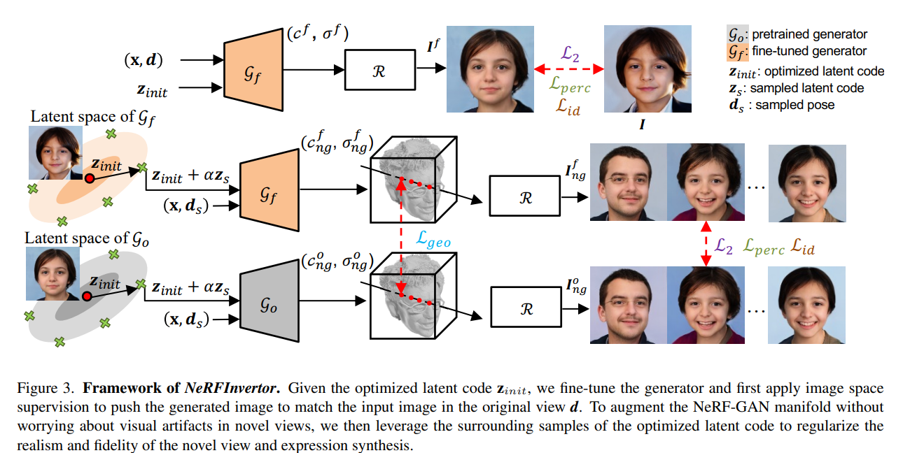

---

[116] Representing Volumetric Videos as Dynamic MLP Maps

- 题目：将体积视频表示为动态MLP映射

- 分类：动态人体建模
- Project: https://zju3dv.github.io/mlp_maps/
- Code: https://github.com/zju3dv/mlp_maps
- Paper: [pdf](https://zjueducn-my.sharepoint.com/personal/pengsida_zju_edu_cn/_layouts/15/onedrive.aspx?id=%2Fpersonal%2Fpengsida%5Fzju%5Fedu%5Fcn%2FDocuments%2Fmlp%5Fmaps%2FMLP%5FMaps%2Epdf&parent=%2Fpersonal%2Fpengsida%5Fzju%5Fedu%5Fcn%2FDocuments%2Fmlp%5Fmaps&ga=1)
- 摘要： 

> *This paper introduces a novel representation of volumetric videos for real-time view synthesis of dynamic scenes. Recent advances in neural scene representations demonstrate their remarkable capability to model and render complex static scenes, but extending them to represent dynamic scenes is not straightforward due to their slow rendering speed or high storage cost. To solve this problem, our key idea is to represent the radiance field of each frame as a set of shallow MLP networks whose parameters are stored in 2D grids, called MLP maps, and dynamically predicted by a 2D CNN decoder shared by all frames. Representing 3D scenes with shallow MLPs significantly improves the rendering speed, while dynamically predicting MLP parameters with a shared 2D CNN instead of explicitly storing them leads to low storage cost. Experiments show that the proposed approach achieves state-of-the-art rendering quality on the NHR and ZJU-MoCap datasets, while being efficient for real-time rendering with a speed of 41.7 fps for 512x512 images on an RTX 3090 GPU.*

- 图示

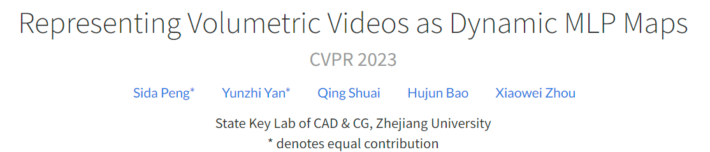

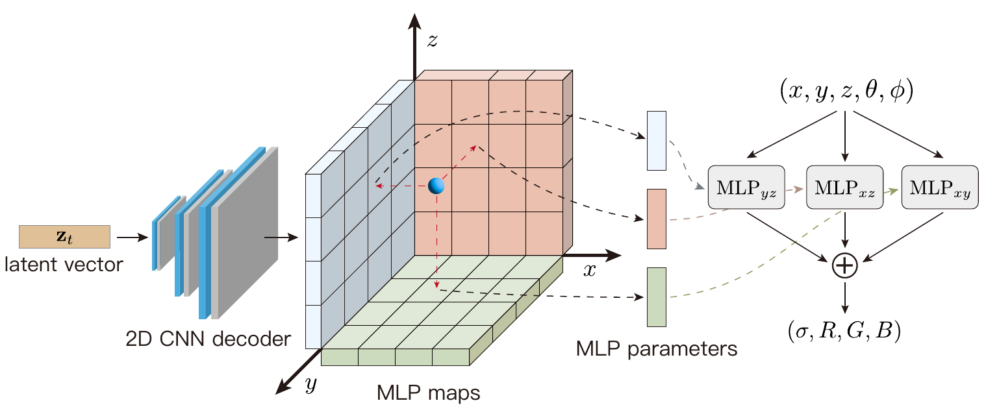

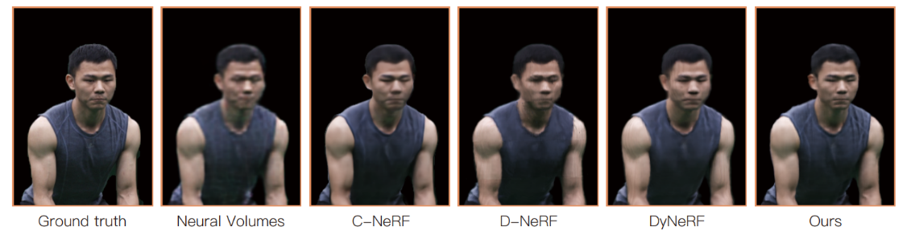

---

[117] 

- 题目：

- 分类：
- Project: 
- Code: 
- Paper: 
- 摘要： 

> **

- 图示

---

[118] 

- 题目：

- 分类：
- Project: 
- Code: 
- Paper: 
- 摘要： 

> **

- 图示

---

[119] 

- 题目：

- 分类：
- Project: 
- Code: 
- Paper: 
- 摘要： 

> **

- 图示

---

[120] 

- 题目：

- 分类：
- Project: 
- Code: 
- Paper: 
- 摘要： 

> **

- 图示

