# NeRFs-ECCV2022

> - 当前论文数：28
> - 收集来源：[ECCV 2022 Papers](https://www.ecva.net/papers.php)  注：搜索词(“nerf” OR “radiance” OR “slam”)

---

[1] [PS-NeRF: Neural Inverse Rendering for Multi-View Photometric Stereo](https://www.ecva.net/papers/eccv_2022/papers_ECCV/html/1832_ECCV_2022_paper.php)

Wenqi Yang, Guanying Chen, Chaofeng Chen, Zhenfang Chen, Kwan-Yee K. Wong

- Title：PS-NeRF：神经逆渲染用于多视图光度立体

- Category：多视图光度立体 (MVPS)

- Project: https://ywq.github.io/psnerf/

- Code: https://github.com/ywq/psnerf

- Paper: [pdf](https://www.ecva.net/papers/eccv_2022/papers_ECCV/papers/136610263.pdf)

- Abstract：

  > *Traditional multi-view photometric stereo (MVPS) methods are often composed of multiple disjoint stages, resulting in noticeable accumulated errors. In this paper, we present a neural inverse rendering method for MVPS based on implicit representation. Given multi-view images of a non-Lambertian object illuminated by multiple unknown directional lights, our method jointly estimates the geometry, materials, and lights. Our method first employs multi-light images to estimate per-view surface normal maps, which are used to regularize the normals derived from the neural radiance field. It then jointly optimizes the surface normals, spatially-varying BRDFs, and lights based on a shadow-aware differentiable rendering layer. After optimization, the reconstructed object can be used for novel-view rendering, relighting, and material editing. Experiments on both synthetic and real datasets demonstrate that our method achieves far more accurate shape reconstruction than existing MVPS and neural rendering methods. Our code and model can be found at https://ywq.github.io/psnerf.*

- Figure：

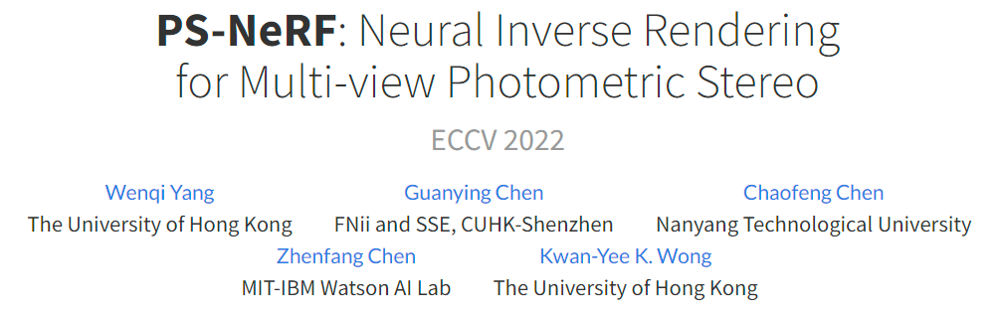

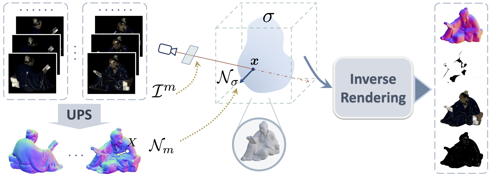

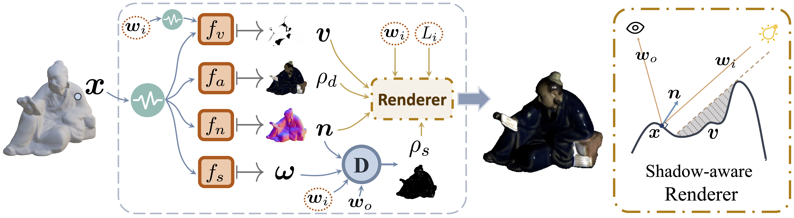

---

[2] [MoFaNeRF: Morphable Facial Neural Radiance Field](https://www.ecva.net/papers/eccv_2022/papers_ECCV/html/4505_ECCV_2022_paper.php)

Yiyu Zhuang, Hao Zhu, Xusen Sun, Xun Cao

- Title：MoFaNeRF：可变形面部神经辐射场

- Category：可变形,人脸建模,可编辑

- Project: https://neverstopzyy.github.io/mofanerf/

- Code: https://github.com/zhuhao-nju/mofanerf

- Paper: [pdf](https://www.ecva.net/papers/eccv_2022/papers_ECCV/papers/136630267.pdf)

- Abstract：

  > *We propose a parametric model that maps free-view images into a vector space of coded facial shape, expression and appearance with a neural radiance field, namely Morphable Facial NeRF. Specifically, MoFaNeRF takes the coded facial shape, expression and appearance along with space coordinate and view direction as input to an MLP, and outputs the radiance of the space point for photo-realistic image synthesis. Compared with conventional 3D morphable models (3DMM), MoFaNeRF shows superiority in directly synthesizing photo-realistic facial details even for eyes, mouths, and beards. Also, continuous face morphing can be easily achieved by interpolating the input shape, expression and appearance codes. By introducing identity-specific modulation and texture encoder, our model synthesizes accurate photometric details and shows strong representation ability. Our model shows strong ability on multiple applications including image-based fitting, random generation, face rigging, face editing, and novel view synthesis. Experiments show that our method achieves higher representation ability than previous parametric models, and achieves competitive performance in several applications. To the best of our knowledge, our work is the first facial parametric model built upon a neural radiance field that can be used in fitting, generation and manipulation. The code and data is available at https://github.com/zhuhao-nju/mofanerf.*

- Figure：

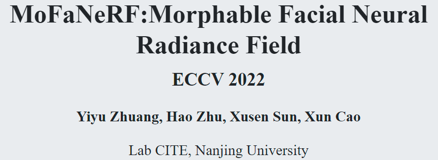

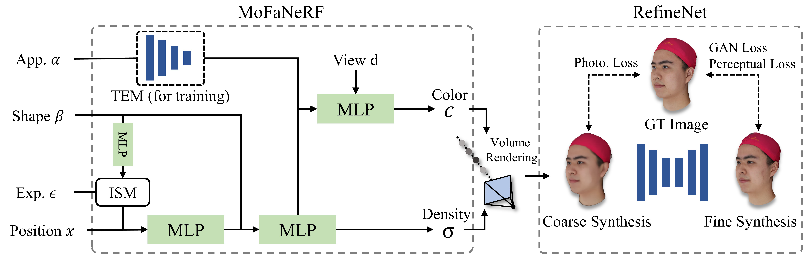

---

[3] [Conditional-Flow NeRF: Accurate 3D Modelling with Reliable Uncertainty Quantification](https://www.ecva.net/papers/eccv_2022/papers_ECCV/html/7028_ECCV_2022_paper.php)

Jianxiong Shen, Antonio Agudo, Francesc Moreno-Noguer, Adria Ruiz

- Title：条件流 NeRF：具有可靠不确定性量化的准确 3D 建模

- Category：精确建模

- Project: none

- Code: none

- Paper: [pdf](https://www.ecva.net/papers/eccv_2022/papers_ECCV/papers/136630531.pdf)

- Abstract：

  > *"A critical limitation of current methods based on Neural Radiance Fields (NeRF) is that they are unable to quantify the uncertainty associated with the learned appearance and geometry of the scene. This information is paramount in real applications such as medical diagnosis or autonomous driving where, to reduce potentially catastrophic failures, the confidence on the model outputs must be included into the decision-making process. In this context, we introduce Conditional-Flow NeRF (CF-NeRF), a novel probabilistic framework to incorporate uncertainty quantification into NeRF-based approaches. For this purpose, our method learns a distribution over all possible radiance fields modelling the scene which is used to quantify the uncertainty associated with the modelled scene. In contrast to previous approaches enforcing strong constraints over the radiance field distribution, CF-NeRF learns it in a flexible and fully data-driven manner by coupling Latent Variable Modelling and Conditional Normalizing Flows. This strategy allows to obtain reliable uncertainty estimation while preserving model expressivity. Compared to previous state-of-the-art methods proposed for uncertainty quantification in NeRF, our experiments show that the proposed method achieves significantly lower prediction errors and more reliable uncertainty values for synthetic novel view and depth-map estimation."*

- Figure：

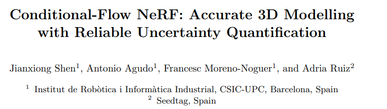

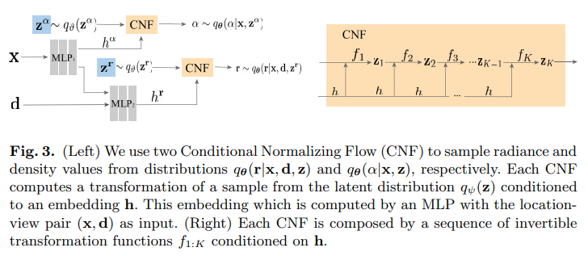

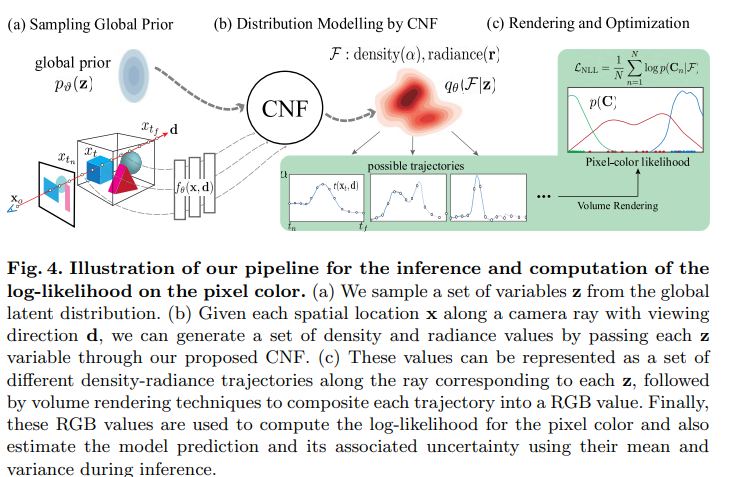

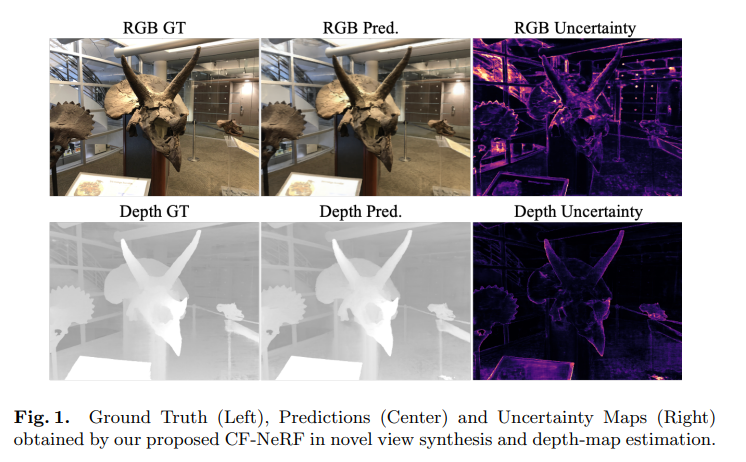

---

[4] [Sem2NeRF: Converting Single-View Semantic Masks to Neural Radiance Fields](https://www.ecva.net/papers/eccv_2022/papers_ECCV/html/636_ECCV_2022_paper.php)

Yuedong Chen, Qianyi Wu, Chuanxia Zheng, Tat-Jen Cham, Jianfei Cai

- Title：Sem2NeRF：将单视图语义掩码转换为神经辐射场

- Category：单视图,语义分割

- Project: https://donydchen.github.io/sem2nerf/

- Code: https://github.com/donydchen/sem2nerf

- Paper: [pdf](https://www.ecva.net/papers/eccv_2022/papers_ECCV/papers/136740713.pdf)

- Abstract：

  > *"Image translation and manipulation have gain increasing attention along with the rapid development of deep generative models. Although existing approaches have brought impressive results, they mainly operated in 2D space. In light of recent advances in NeRF-based 3D-aware generative models, we introduce a new task, Semantic-to-NeRF translation, that aims to reconstruct a 3D scene modelled by NeRF, conditioned on one single-view semantic mask as input. To kick-off this novel task, we propose the Sem2NeRF framework. In particular, Sem2NeRF addresses the highly challenging task by encoding the semantic mask into the latent code that controls the 3D scene representation of a pre-trained decoder. To further improve the accuracy of the mapping, we integrate a new region-aware learning strategy into the design of both the encoder and the decoder. We verify the efficacy of the proposed Sem2NeRF and demonstrate that it outperforms several strong baselines on two benchmark datasets. Code and video are available at https://donydchen.github.io/sem2nerf/"*

- Figure：

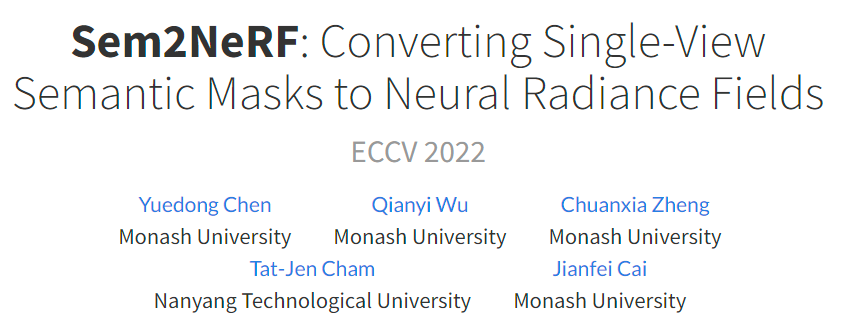

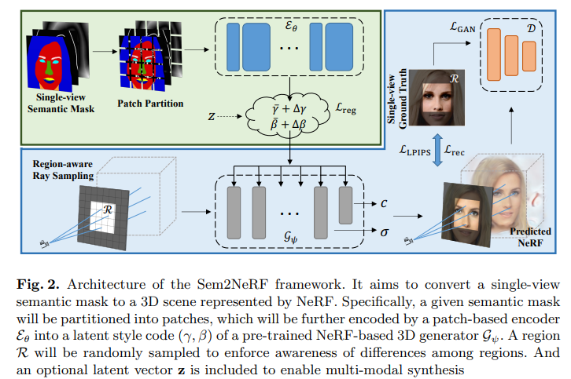

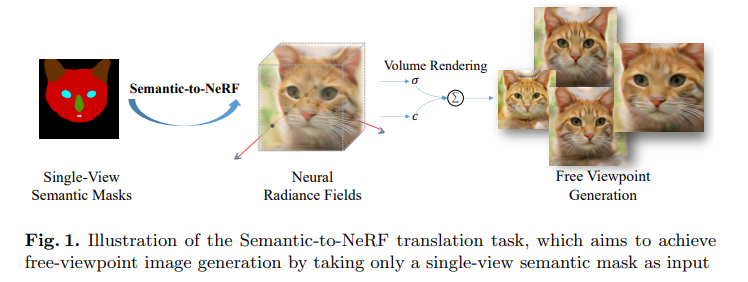

---

[5] [KeypointNeRF: Generalizing Image-Based Volumetric Avatars Using Relative Spatial Encoding of Keypoints](https://www.ecva.net/papers/eccv_2022/papers_ECCV/html/1322_ECCV_2022_paper.php)

Marko Mihajlovic, Aayush Bansal, Michael Zollhöfer, Siyu Tang, Shunsuke Saito

- Title：KeypointNeRF：使用关键点的相对空间编码来推广基于图像的体积化身

- Category：人体建模

- Project: https://markomih.github.io/KeypointNeRF/

- Code: https://github.com/facebookresearch/KeypointNeRF

- Paper: [pdf](https://www.ecva.net/papers/eccv_2022/papers_ECCV/papers/136750176.pdf)

- Abstract：

  > *"Image-based volumetric avatars using pixel-aligned features promise generalization to unseen poses and identities. Prior work leverages global spatial encodings and multi-view geometric consistency to reduce spatial ambiguity. However, global encodings often suffer from overfitting to the distribution of the training data, and it is difficult to learn multi-view consistent reconstruction from sparse views. In this work, we investigate common issues with existing spatial encodings and propose a simple yet highly effective approach to modeling high-fidelity volumetric avatars from sparse views. One of the key ideas is to encode relative spatial 3D information via sparse 3D keypoints. This approach is robust to novel view synthesis and the sparsity of viewpoints. Our approach outperforms state-of-the-art methods for head reconstruction. On body reconstruction for unseen subjects, we also achieve performance comparable to prior art that uses a parametric human body model and temporal feature aggregation. Our experiments show that a majority of errors in prior work stem from an inappropriate choice of spatial encoding and thus we suggest a new direction for high-fidelity image-based avatar modeling."*

- Figure：

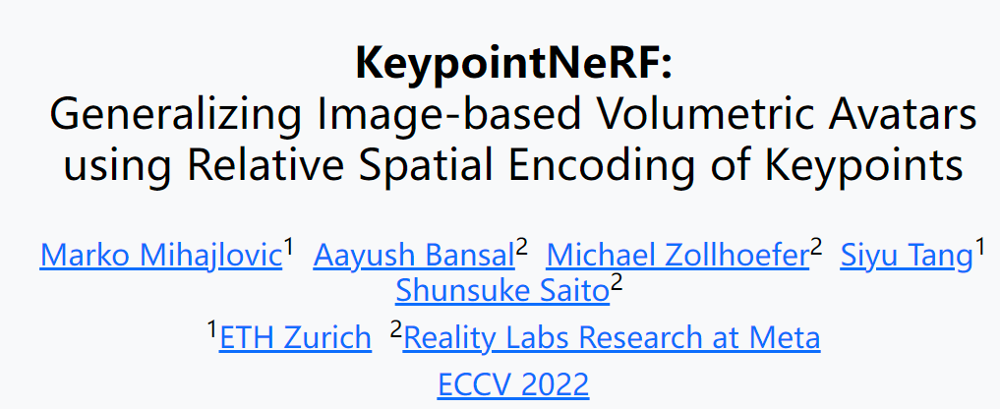

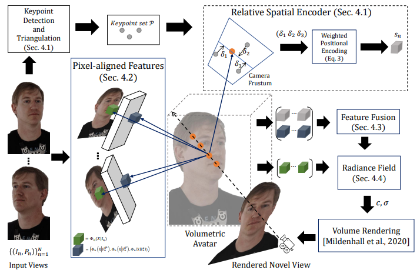

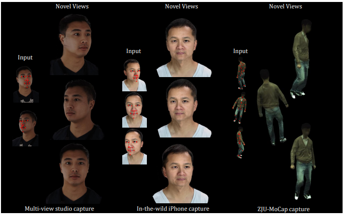

---

[6] [ViewFormer: NeRF-Free Neural Rendering from Few Images Using Transformers](https://www.ecva.net/papers/eccv_2022/papers_ECCV/html/1417_ECCV_2022_paper.php)

Jonáš Kulhánek, Erik Derner, Torsten Sattler, Robert Babuška

- Title：ViewFormer：使用Transformer从少量图像中进行无 NeRF 的神经渲染

- Category：稀疏视图,视图合成,Transformer

- Project: https://jkulhanek.com/viewformer/

- Code: https://github.com/jkulhanek/viewformer/

- Paper: [pdf](https://www.ecva.net/papers/eccv_2022/papers_ECCV/papers/136750195.pdf)

- Abstract：

  > *"Novel view synthesis is a long-standing problem. In this work, we consider a variant of the problem where we are given only a few context views sparsely covering a scene or an object. The goal is to predict novel viewpoints in the scene, which requires learning priors. The current state of the art is based on Neural Radiance Field (NeRF), and while achieving impressive results, the methods suffer from long training times as they require evaluating millions of 3D point samples via a neural network for each image. We propose a 2D-only method that maps multiple context views and a query pose to a new image in a single pass of a neural network. Our model uses a two-stage architecture consisting of a codebook and a transformer model. The codebook is used to embed individual images into a smaller latent space, and the transformer solves the view synthesis task in this more compact space. To train our model efficiently, we introduce a novel branching attention mechanism that allows us to use the same model not only for neural rendering but also for camera pose estimation. Experimental results on real-world scenes show that our approach is competitive compared to NeRF-based methods while not reasoning explicitly in 3D, and it is faster to train."*

- Figure：

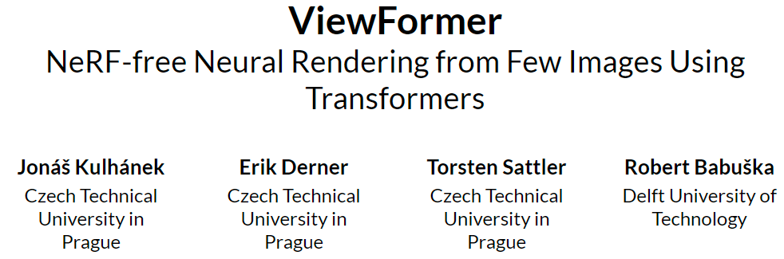

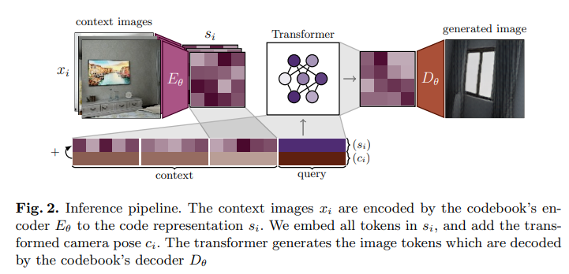

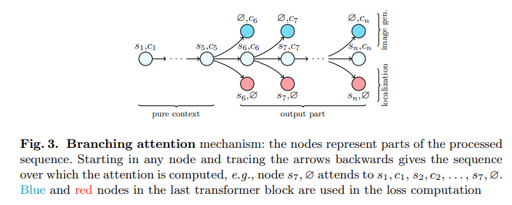

---

[7] [NeRF for Outdoor Scene Relighting](https://www.ecva.net/papers/eccv_2022/papers_ECCV/html/4998_ECCV_2022_paper.php)

Viktor Rudnev, Mohamed Elgharib, William Smith, Lingjie Liu, Vladislav Golyanik, Christian Theobalt

- Title：用于室外场景重新照明的 NeRF

- Category：室外场景,重新照明

- Project: https://4dqv.mpi-inf.mpg.de/NeRF-OSR/

- Code: https://github.com/r00tman/NeRF-OSR

- Paper: [pdf](https://www.ecva.net/papers/eccv_2022/papers_ECCV/papers/136760593.pdf)

- Abstract：

  > *"Photorealistic editing of outdoor scenes from photographs requires a profound understanding of the image formation process and an accurate estimation of the scene geometry, reflectance and illumination. A delicate manipulation of the lighting can then be performed while keeping the scene albedo and geometry unaltered. We present NeRF-OSR, i.e., the first approach for outdoor scene relighting based on neural radiance fields. In contrast to the prior art, our technique allows simultaneous editing of both scene illumination and camera viewpoint using only a collection of outdoor photos shot in uncontrolled settings. Moreover, it enables direct control over the scene illumination, as defined through a spherical harmonics model. For evaluation, we collect a new benchmark dataset of several outdoor sites photographed from multiple viewpoints and at different times. For each time, a 360 degree environment map is captured together with a colour-calibration chequerboard to allow accurate numerical evaluations on real data against ground truth. Comparisons against SoTA show that NeRF-OSR enables controllable lighting and viewpoint editing at higher quality and with realistic self-shadowing reproduction."*

- Figure：

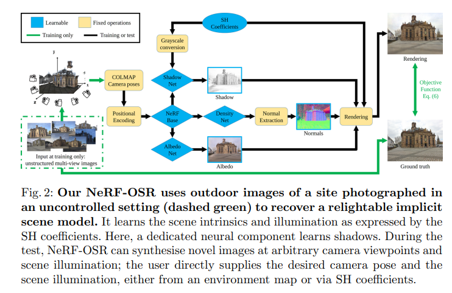

---

[8] [Injecting 3D Perception of Controllable NeRF-GAN into StyleGAN for Editable Portrait Image Synthesis](https://www.ecva.net/papers/eccv_2022/papers_ECCV/html/6505_ECCV_2022_paper.php)

Jeong-gi Kwak, Yuanming Li, Dongsik Yoon, Donghyeon Kim, David Han, Hanseok Ko

- Title：将可控 NeRF-GAN 的 3D 感知注入 StyleGAN 用于可编辑人像图像合成

- Category：NeRF-GAN,人脸建模,可编辑

- Project: https://jgkwak95.github.io/surfgan/

- Code: https://github.com/jgkwak95/SURF-GAN

- Paper: [pdf](https://www.ecva.net/papers/eccv_2022/papers_ECCV/papers/136770240.pdf)

- Abstract：

  > *"Over the years, 2D GANs have achieved great successes in photorealistic portrait generation. However, they lack 3D understanding in the generation process, thus they suffer from multi-view inconsistency problem. To alleviate the issue, many 3D-aware GANs have been proposed and shown notable results, but 3D GANs struggle with editing semantic attributes. The controllability and interpretability of 3D GANs have not been much explored. In this work, we propose two solutions to overcome these weaknesses of 2D GANs and 3D-aware GANs. We first introduce a novel 3D-aware GAN, SURF-GAN, which is capable of discovering semantic attributes during training and controlling them in an unsupervised manner. After that, we inject the prior of SURF-GAN into StyleGAN to obtain a high-fidelity 3D-controllable generator. Unlike existing latent-based methods allowing implicit pose control, the proposed 3D-controllable StyleGAN enables explicit pose control over portrait generation. This distillation allows direct compatibility between 3D control and many StyleGAN-based techniques (e.g., inversion and stylization), and also brings an advantage in terms of computational resources. Our codes are available at https://github.com/jgkwak95/SURF-GAN."*

- Figure：

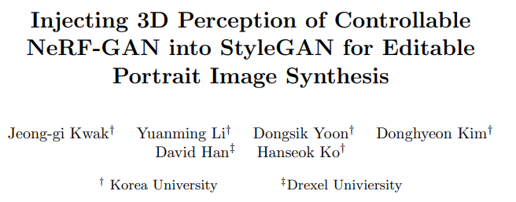

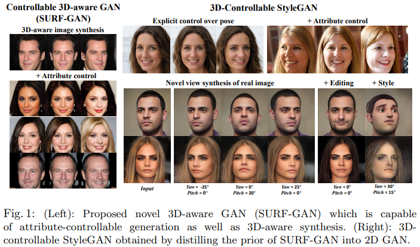

---

[9] [AdaNeRF: Adaptive Sampling for Real-Time Rendering of Neural Radiance Fields](https://www.ecva.net/papers/eccv_2022/papers_ECCV/html/6513_ECCV_2022_paper.php)

Andreas Kurz, Thomas Neff, Zhaoyang Lv, Michael Zollhöfer, Markus Steinberger

- Title：AdaNeRF：神经辐射场实时渲染的自适应采样

- Category：实时,加速,采样优化

- Project: https://thomasneff.github.io/adanerf/

- Code: https://github.com/thomasneff/AdaNeRF

- Paper: [pdf](https://www.ecva.net/papers/eccv_2022/papers_ECCV/papers/136770258.pdf)

- Abstract：

  > *"Novel view synthesis has recently been revolutionized by learning neural radiance fields directly from sparse observations. However, rendering images with this new paradigm is slow due to the fact that an accurate quadrature of the volume rendering equation requires a large number of samples for each ray. Previous work has mainly focused on speeding up the network evaluations that are associated with each sample point, e.g., via caching of radiance values into explicit spatial data structures, but this comes at the expense of model compactness. In this paper, we propose a novel dual-network architecture that takes an orthogonal direction by learning how to best reduce the number of required sample points. To this end, we split our network into a sampling and shading network that are jointly trained. Our training scheme employs fixed sample positions along each ray, and incrementally introduces sparsity throughout training to achieve high quality even at low sample counts. After fine-tuning with the target number of samples, the resulting compact neural representation can be rendered in real-time. Our experiments demonstrate that our approach outperforms concurrent compact neural representations in terms of quality and frame rate and performs on par with highly efficient hybrid representations. Code and supplementary material is available at https://thomasneff.github.io/adanerf."*

- Figure：

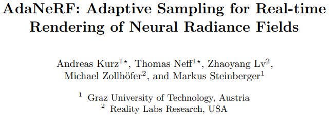

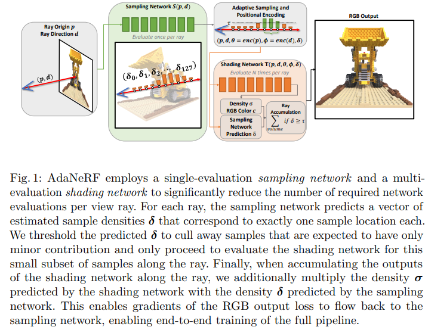

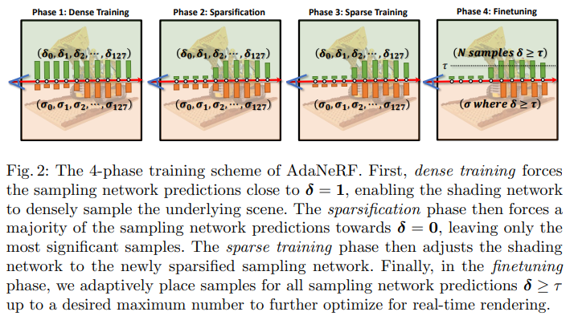

---

[10] [GeoAug: Data Augmentation for Few-Shot NeRF with Geometry Constraints](https://www.ecva.net/papers/eccv_2022/papers_ECCV/html/6720_ECCV_2022_paper.php)

Di Chen, Yu Liu, Lianghua Huang, Bin Wang, Pan Pan

- Title：使用几何约束增强小样本神经辐射场

- Category：深度估计,稀疏视图

- Project: none

- Code: none

- Paper: [pdf](https://www.ecva.net/papers/eccv_2022/papers_ECCV/papers/136770326.pdf)

- Abstract：

  > *"Neural Radiance Fields (NeRF) show remarkable ability to render novel views of a certain scene by learning an implicit volumetric representation with only posed RGB images. Despite its impressiveness and simplicity, NeRF usually converges to sub-optimal solutions with incorrect geometries given few training images. We hereby present GeoAug: a data augmentation method for NeRF, which enriches training data based on multi-view geometric constraint. GeoAug provides random artificial (novel pose, RGB image) pairs for training, where the RGB image is from a nearby training view. The rendering of a novel pose is warped to the nearby training view with depth map and relative pose to match the RGB image supervision. Our method reduces the risk of over-fitting by introducing more data during training, while also provides additional implicit supervision for depth maps. In experiments, our method significantly boosts the performance of neural radiance fields conditioned on few training views."*

- Figure：

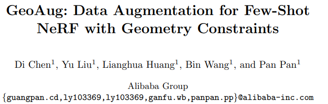

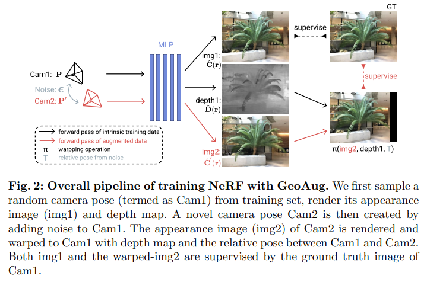

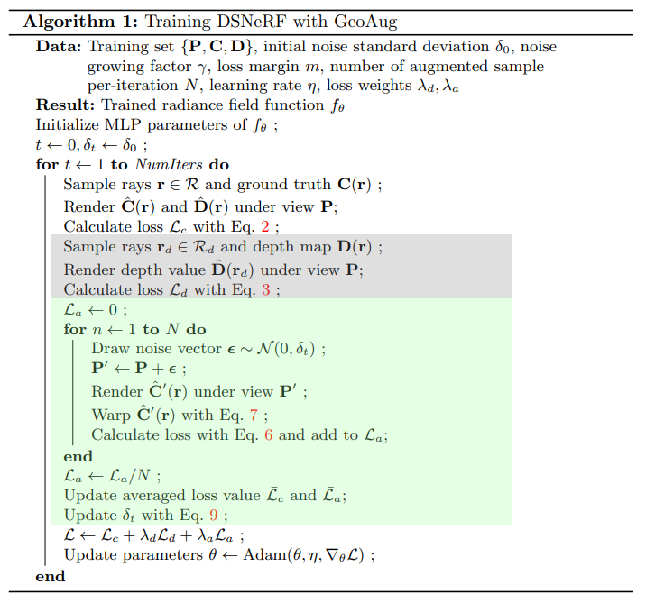

---

[11] [SinNeRF: Training Neural Radiance Fields on Complex Scenes from a Single Image](https://www.ecva.net/papers/eccv_2022/papers_ECCV/html/1064_ECCV_2022_paper.php)

Dejia Xu, Yifan Jiang, Peihao Wang, Zhiwen Fan, Humphrey Shi, Zhangyang Wang

- Title：SinNeRF：在单个图像的复杂场景上训练神经辐射场

- Category：单视图

- Project: https://vita-group.github.io/SinNeRF/

- Code: https://github.com/Ir1d/SinNeRF

- Paper: [pdf](https://www.ecva.net/papers/eccv_2022/papers_ECCV/papers/136820712.pdf)

- Abstract：

  > *"Despite the rapid development of Neural Radiance Field (NeRF), the necessity of dense covers largely prohibits its wider applications. While several recent works have attempted to address this issue, they either operate with sparse views (yet still, a few of them) or on simple objects/scenes. In this work, we consider a more ambitious task: training neural radiance field, over realistically complex visual scenes, by “looking only once”, i.e., using only a single view. To attain this goal, we present a Single View NeRF (SinNeRF) framework consisting of thoughtfully designed semantic and geometry regularizations. Specifically, SinNeRF constructs a semi-supervised learning process, where we introduce and propagate geometry pseudo labels and semantic pseudo labels to guide the progressive training process. Extensive experiments are conducted on complex scene benchmarks, including NeRF synthetic dataset, Local Light Field Fusion dataset, and DTU dataset. We show that even without pre-training on multi-view datasets, SinNeRF can yield photo-realistic novel-view synthesis results. Under the single image setting, SinNeRF significantly outperforms the current state-of-the-art NeRF baselines in all cases. Project page: https://vita-group.github.io/SinNeRF/"*

- Figure：

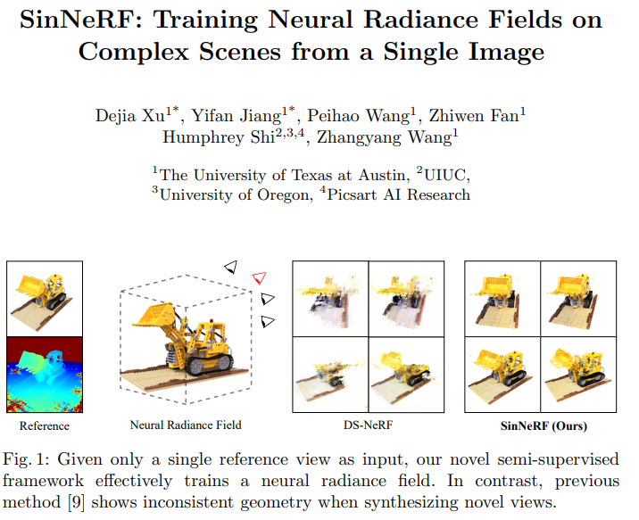

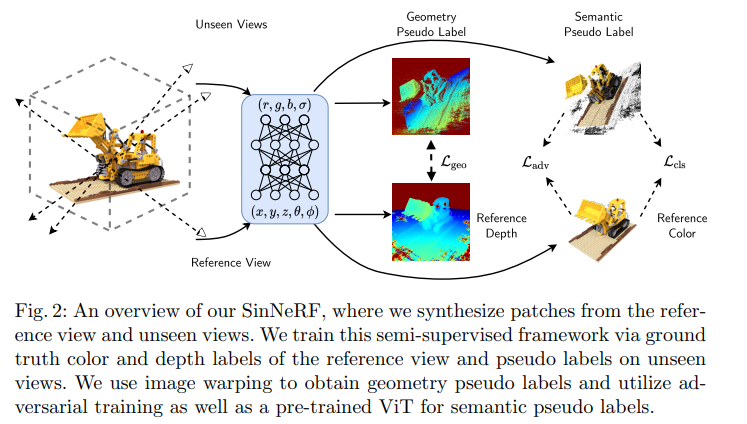

---

[12] [Geometry-Guided Progressive NeRF for Generalizable and Efficient Neural Human Rendering](https://www.ecva.net/papers/eccv_2022/papers_ECCV/html/5198_ECCV_2022_paper.php)

Mingfei Chen, Jianfeng Zhang, Xiangyu Xu, Lijuan Liu, Yujun Cai, Jiashi Feng, Shuicheng Yan

- Title：用于通用和高效神经人体渲染的几何引导渐进式 NeRF

- Category：人体建模

- Project: none

- Code: https://github.com/sail-sg/GP-Nerf

- Paper: [pdf](https://www.ecva.net/papers/eccv_2022/papers_ECCV/papers/136830224.pdf)

- Abstract：

  > *"In this work we develop a generalizable and efficient Neural Radiance Field (NeRF) pipeline for high-fidelity free-viewpoint human body synthesis under settings with sparse camera views. Though existing NeRF-based methods can synthesize rather realistic details for human body, they tend to produce poor results when the input has self-occlusion, especially for unseen humans under sparse views. Moreover, these methods often require a large number of sampling points for rendering, which leads to low efficiency and limits their real-world applicability. To address these challenges, we propose a Geometry-guided Progressive NeRF (GP-NeRF). In particular, to better tackle self-occlusion, we devise a geometry-guided multi-view feature integration approach that utilizes the estimated geometry prior to integrate the incomplete information from input views and construct a complete geometry volume for the target human body. Meanwhile, for achieving higher rendering efficiency, we introduce a geometry-guided progressive rendering pipeline, which leverages the geometric feature volume and the predicted density values to progressively reduce the number of sampling points and speed up the rendering process. Experiments on the ZJU-MoCap and THUman datasets show that our method outperforms the state-of-the-arts significantly across multiple generalization settings, while the time cost is reduced via >70% via applying our efficient progressive rendering pipeline."*

- Figure：

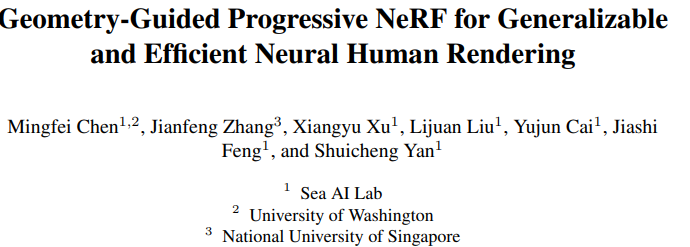

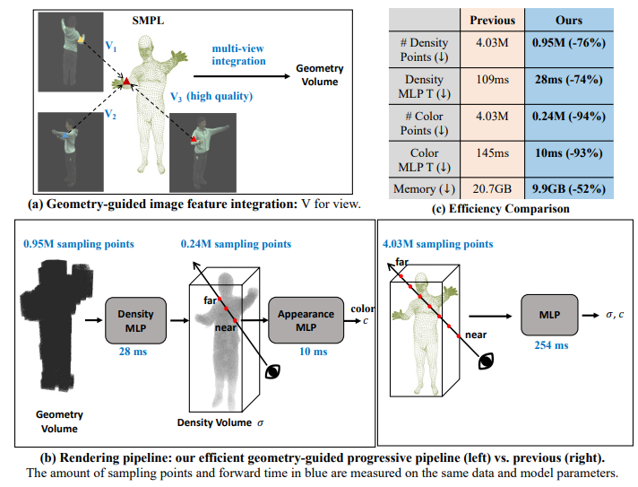

---

[13] [Neural-Sim: Learning to Generate Training Data with NeRF](https://www.ecva.net/papers/eccv_2022/papers_ECCV/html/4188_ECCV_2022_paper.php)

Yunhao Ge, Harkirat Behl, Jiashu Xu, Suriya Gunasekar, Neel Joshi, Yale Song, Xin Wang, Laurent Itti, Vibhav Vineet

- Title：Neural-Sim：学习使用 NeRF 生成训练数据

- Category：数据集生成

- Project: none

- Code: https://github.com/gyhandy/Neural-Sim-NeRF

- Paper: https://arxiv.org/pdf/2207.11368.pdf

- Abstract：

  > *"Traditional approaches for training a computer vision models requires collecting and labelling vast amounts of imagery under a diverse set of scene configurations and properties. This process is incredibly time-consuming, and it is challenging to ensure that the captured data distribution maps well to the target domain of an application scenario. In recent years, synthetic data has emerged as a way to address both of these issues. However, current approaches either require human experts to manually tune each scene property or use automatic methods that provide little to no control; this requires rendering large amounts random data variations, which is slow and is often suboptimal for the target domain. We present the first fully differentiable synthetic data generation pipeline that uses Neural Radiance Fields (NeRFs) in a closed-loop with a target application’s loss function to generate data, on demand, with no human labor, to maximise accuracy for a target task. We illustrate the effectiveness of our method with synthetic and real-world object detection experiments. In addition, we evaluate on a new ""YCB-in-the-Wild"" dataset that provides a test scenario for object detection with varied pose in real-world environments."*

- Figure：

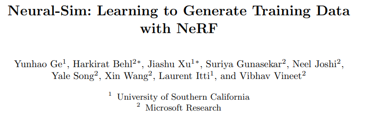

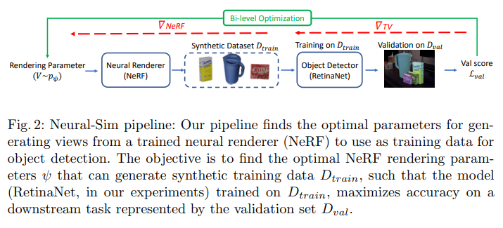

---

[14] [BungeeNeRF: Progressive Neural Radiance Field for Extreme Multi-Scale Scene Rendering](https://www.ecva.net/papers/eccv_2022/papers_ECCV/html/1947_ECCV_2022_paper.php)

Yuanbo Xiangli, Linning Xu, Xingang Pan, Nanxuan Zhao, Anyi Rao, Christian Theobalt, Bo Dai, Dahua Lin

- Title：BungeeNeRF：用于极端多尺度场景渲染的渐进神经辐射场

- Category：大规模场景,城市场景

- Project: https://city-super.github.io/citynerf/

- Code: https://github.com/city-super/BungeeNeRF

- Paper: [pdf](https://www.ecva.net/papers/eccv_2022/papers_ECCV/papers/136920106.pdf)

- Abstract：

  > *"Neural Radiance Field (NeRF) has achieved outstanding performance in modeling 3D objects and controlled scenes, usually under a single scale. In this work, we focus on multi-scale cases where large changes in imagery are observed at drastically different scales. This scenario vastly exists in the real world, such as city scenes, with views ranging from satellite level that captures the overview of a city, to ground level imagery showing complex details of an architecture; and can also be commonly identified in landscape and delicate minecraft 3D models. The wide span of viewing points within these scenes yields multiscale renderings with very different levels of detail, which poses great challenges to neural radiance field and biases it towards compromised results. To address these issues, we introduce BungeeNeRF, a progressive neural radiance field that achieves level-of-detail rendering across drastically varied scales. Starting from fitting distant views with a shallow base block, as training progresses, new blocks are appended to accommodate the emerging details in the increasingly closer views. The strategy progressively activates high-frequency channels in NeRF’s positional encoding inputs to unfold more complex details as the training proceeds. We demonstrate the superiority of BungeeNeRF in modeling diverse multi-scale scenes with drastically varying views on multiple data sources (e.g., city models, synthetic, and drone captured data), and its support for high-quality rendering in different levels of detail."*

- Figure：

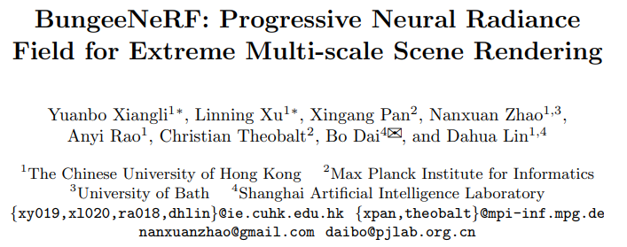

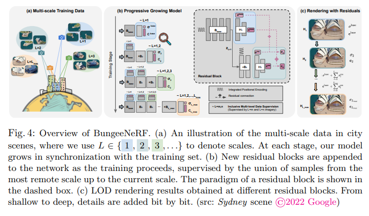

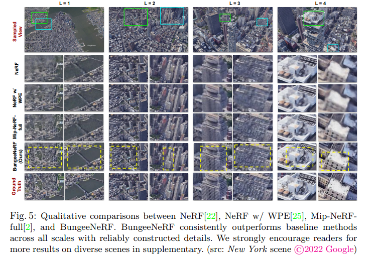

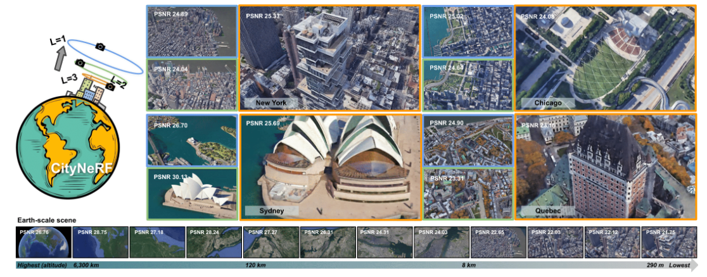

---

[15] [ActiveNeRF: Learning Where to See with Uncertainty Estimation](https://www.ecva.net/papers/eccv_2022/papers_ECCV/html/7175_ECCV_2022_paper.php)

Xuran Pan, Zihang Lai, Shiji Song, Gao Huang

- Title：ActiveNeRF：通过不确定性估计学习在哪里看

- Category：不确定性估计,主动学习,视图合成

- Project: none

- Code: https://github.com/LeapLabTHU/ActiveNeRF

- Paper: [pdf](https://www.ecva.net/papers/eccv_2022/papers_ECCV/papers/136930225.pdf)

- Abstract：

  > *"Recently, Neural Radiance Fields (NeRF) has shown promising performances on reconstructing 3D scenes and synthesizing novel views from a sparse set of 2D images. Albeit effective, the performance of NeRF is highly influenced by the quality of training samples. With limited posed images from the scene, NeRF fails to generalize well to novel views and may collapse to trivial solutions in unobserved regions. This makes NeRF impractical under resource-constrained scenarios. In this paper, we present a novel learning framework, \textit{ActiveNeRF}, aiming to model a 3D scene with a constrained input budget. Specifically, we first incorporate uncertainty estimation into a NeRF model, which ensures robustness under few observations and provides an interpretation of how NeRF understands the scene. On this basis, we propose to supplement the existing training set with newly captured samples based on an active learning scheme. By evaluating the reduction of uncertainty given new inputs, we select the samples that bring the most information gain. In this way, the quality of novel view synthesis can be improved with minimal additional resources. Extensive experiments validate the performance of our model on both realistic and synthetic scenes, especially with scarcer training data."*

- Figure：

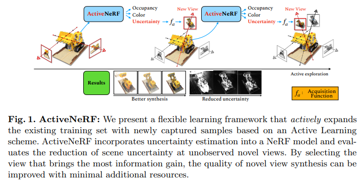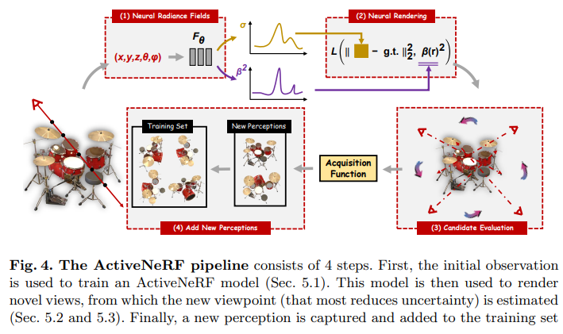

---

[16] [LaTeRF: Label and Text Driven Object Radiance Fields](https://www.ecva.net/papers/eccv_2022/papers_ECCV/html/2145_ECCV_2022_paper.php)

Ashkan Mirzaei, Yash Kant, Jonathan Kelly, Igor Gilitschenski

- Title：LaTeRF：标签和文本驱动的对象辐射场

- Category：文本驱动

- Project: https://tisl.cs.toronto.edu/publication/202210-eccv-laterf/

- Code: none

- Paper: [pdf](https://www.ecva.net/papers/eccv_2022/papers_ECCV/papers/136630021.pdf)

- Abstract：

  > *"Obtaining 3D object representations is important for creating photo-realistic simulators and collecting assets for AR/VR applications. Neural fields have shown their effectiveness in learning a continuous volumetric representation of a scene from 2D images, but acquiring object representations from these models with weak supervision remains an open challenge. In this paper we introduce LaTeRF, a method for extracting an object of interest from a scene given 2D images of the entire scene and known camera poses, a natural language description of the object, and a small number of point-labels of object and non-object points in the input images. To faithfully extract the object from the scene, LaTeRF extends the NeRF formulation with an additional ‘objectness’ probability at each 3D point. Additionally, we leverage the rich latent space of a pre-trained CLIP model combined with our differentiable object renderer, to inpaint the occluded parts of the object. We demonstrate high-fidelity object extraction on both synthetic and real datasets and justify our design choices through an extensive ablation study."*

- Figure：

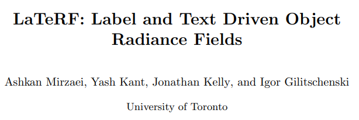

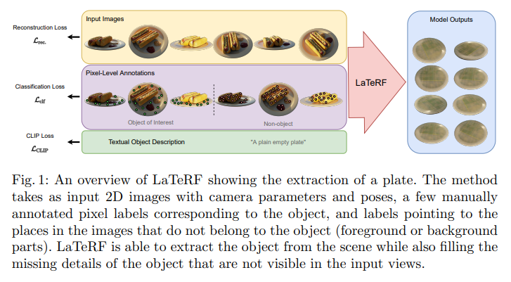

---

[17] [Learning Dynamic Facial Radiance Fields for Few-Shot Talking Head Synthesis](https://www.ecva.net/papers/eccv_2022/papers_ECCV/html/2373_ECCV_2022_paper.php)

Shuai Shen, Wanhua Li, Zheng Zhu, Yueqi Duan, Jie Zhou, Jiwen Lu

- Title：学习动态面部辐射场以进行少镜头说话头部合成

- Category：音频驱动,人脸合成

- Project: https://sstzal.github.io/DFRF/

- Code: https://github.com/sstzal/DFRF

- Paper: [pdf](https://www.ecva.net/papers/eccv_2022/papers_ECCV/papers/136720657.pdf)

- Abstract：

  > *"Talking head synthesis is an emerging technology with wide applications in film dubbing, virtual avatars and online education. Recent NeRF-based methods generate more natural talking videos, as they better capture the 3D structural information of faces. However, a specific model needs to be trained for each identity with a large dataset. In this paper, we propose Dynamic Facial Radiance Fields (DFRF) for few-shot talking head synthesis, which can rapidly generalize to an unseen identity with few training data. Different from the existing NeRF-based methods which directly encode the 3D geometry and appearance of a specific person into the network, our DFRF conditions face radiance field on 2D appearance images to learn the face prior. Thus the facial radiance field can be flexibly adjusted to the new identity with few reference images. Additionally, for better modeling of the facial deformations, we propose a differentiable face warping module conditioned on audio signals to deform all reference images to the query space. Extensive experiments show that with only tens of seconds of training clip available, our proposed DFRF can synthesize natural and high-quality audio-driven talking head videos for novel identities with only 40k iterations. We highly recommend readers view our supplementary video for intuitive comparisons. Code is available in https://sstzal.github.io/DFRF/."*

- Figure：

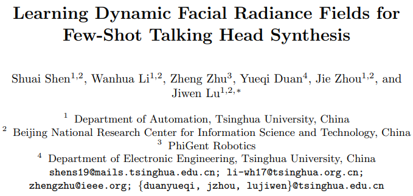

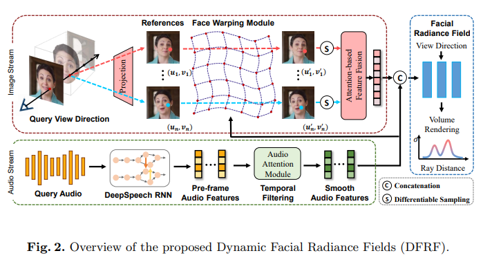

---

[18] [Digging into Radiance Grid for Real-Time View Synthesis with Detail Preservation](https://www.ecva.net/papers/eccv_2022/papers_ECCV/html/3346_ECCV_2022_paper.php)

Jian Zhang, Jinchi Huang, Bowen Cai, Huan Fu, Mingming Gong, Chaohui Wang, Jiaming Wang, Hongchen Luo, Rongfei Jia, Binqiang Zhao, Xing Tang

- Title：挖掘辐射网格以进行实时视图合成并保留细节

- Category：实时

- Group: https://hufu6371.github.io/huanfu/

- Project: none

- Code: none

- Paper: [pdf](https://www.ecva.net/papers/eccv_2022/papers_ECCV/papers/136750722.pdf)

- Abstract：

  > *"Neural Radiance Fields (NeRF) [31] series are impressive in representing scenes and synthesizing high-quality novel views. However, most previous works fail to preserve texture details and suffer from slow training speed. A recent method SNeRG [11] demonstrates that baking a trained NeRF as a Sparse Neural Radiance Grid enables real-time view synthesis with slight scarification of rendering quality. In this paper, we dig into the Radiance Grid representation and present a set of improvements, which together result in boosted performance in terms of both speed and quality. First, we propose an HieRarchical Sparse Radiance Grid (HrSRG) representation that has higher voxel resolution for informative spaces and fewer voxels for other spaces. HrSRG leverages a hierarchical voxel grid building process inspired by [30, 55], and can describe a scene at high resolution without excessive memory footprint. Furthermore, we show that directly optimizing the voxel grid leads to surprisingly good texture details in rendered images. This direct optimization is memory-friendly and requires multiple orders of magnitude less time than conventional NeRFs as it only involves a tiny MLP. Finally, we find that a critical factor that prevents fine details restoration is the misaligned 2D pixels among images caused by camera pose errors. We propose to use the perceptual loss to add tolerance to misalignments, leading to the improved visual quality of rendered images."*

- Figure：

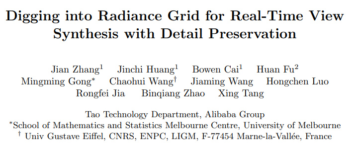

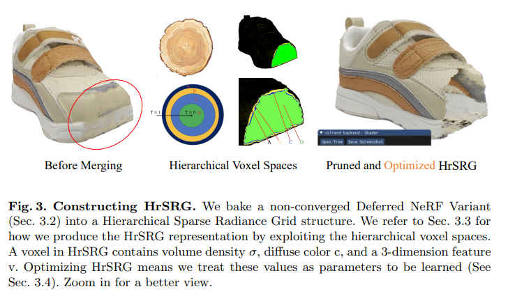

---

[19] [Neural Radiance Transfer Fields for Relightable Novel-View Synthesis with Global Illumination](https://www.ecva.net/papers/eccv_2022/papers_ECCV/html/6143_ECCV_2022_paper.php)

Linjie Lyu, Ayush Tewari, Thomas Leimkühler, Marc Habermann, Christian Theobalt

- Title：用于具有全局照明的可发光新视图合成的神经辐射传输场

- Category：重新照明

- Project: none

- Code: https://github.com/LinjieLyu/NRTF

- Paper: [pdf](https://www.ecva.net/papers/eccv_2022/papers_ECCV/papers/136770155.pdf)

- Abstract：

  > *"Given a set of images of a scene, the re-rendering of this scene from novel views and lighting conditions is an important and challenging problem in Computer Vision and Graphics. On the one hand, most existing works in Computer Vision usually impose many assumptions regarding the image formation process, e.g. direct illumination and predefined materials, to make scene parameter estimation tractable. On the other hand, mature Computer Graphics tools allow modeling of complex photo-realistic light transport given all the scene parameters. Combining these approaches, we propose a method for scene relighting under novel views by learning a neural precomputed radiance transfer function, which implicitly handles global illumination effects using novel environment maps. Our method can be solely supervised on a set of real images of the scene under a single unknown lighting condition. To disambiguate the task during training, we tightly integrate a differentiable path tracer in the training process and propose a combination of a synthesized OLAT and a real image loss. Results show that the recovered disentanglement of scene parameters improves significantly over the current state of the art and, thus, also our re-rendering results are more realistic and accurate."*

- Figure：

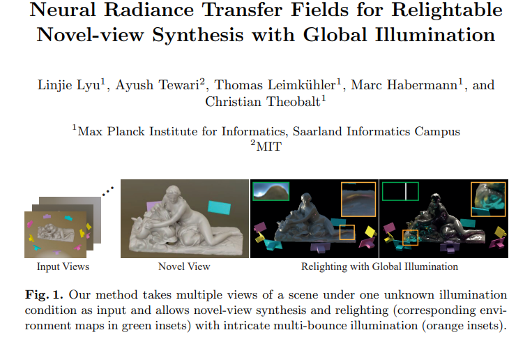

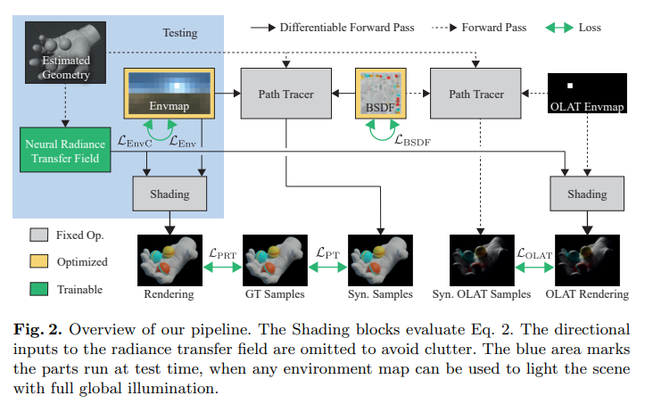

---

[20] [R2L: Distilling Neural Radiance Field to Neural Light Field for Efficient Novel View Synthesis](https://www.ecva.net/papers/eccv_2022/papers_ECCV/html/626_ECCV_2022_paper.php)

Huan Wang, Jian Ren, Zeng Huang, Kyle Olszewski, Menglei Chai, Yun Fu, Sergey Tulyakov

- Title：R2L：将神经辐射场提取为神经光场以实现高效的新视图合成

- Category：加速

- Project: https://snap-research.github.io/R2L/

- Code: https://github.com/snap-research/R2L

- Paper: [pdf](https://www.ecva.net/papers/eccv_2022/papers_ECCV/papers/136910598.pdf)

- Abstract：

  > *"Recent research explosion on Neural Radiance Field (NeRF) shows the encouraging potential to represent complex scenes with neural networks. One major drawback of NeRF is its prohibitive inference time: Rendering a single pixel requires querying the NeRF network hundreds of times. To resolve it, existing efforts mainly attempt to reduce the number of required sampled points. However, the problem of iterative sampling still exists. On the other hand, Neural \textit{Light} Field (NeLF) presents a more straightforward representation over NeRF in novel view synthesis -- the rendering of a pixel amounts to \textit{one single forward pass} without ray-marching. In this work, we present a \textit{deep residual MLP} network (88 layers) to effectively learn the light field. We show the key to successfully learning such a deep NeLF network is to have sufficient data, for which we transfer the knowledge from a pre-trained NeRF model via data distillation. Extensive experiments on both synthetic and real-world scenes show the merits of our method over other counterpart algorithms. On the synthetic scenes, we achieve $26\sim35\times$ FLOPs reduction (per camera ray) and $28\sim31\times$ runtime speedup, meanwhile delivering \textit{significantly better} ($1.4\sim2.8$ dB average PSNR improvement) rendering quality than NeRF without any customized parallelism requirement."*

- Figure：

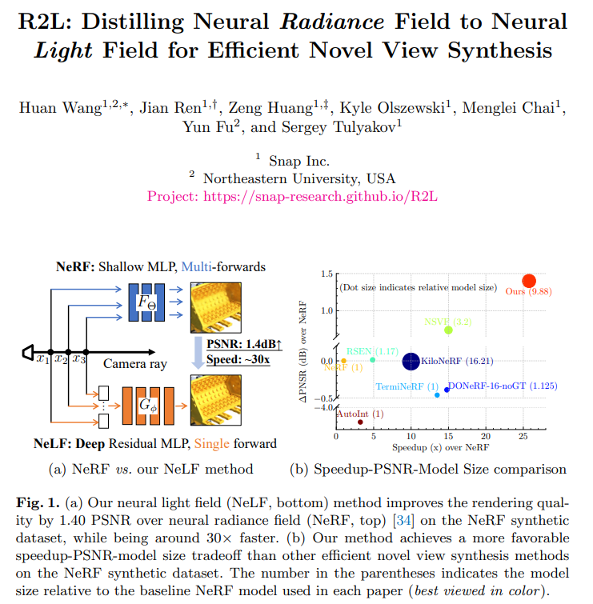

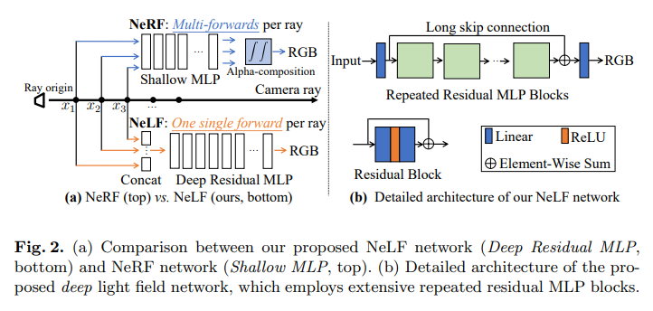

---

[21] [ARF: Artistic Radiance Fields](https://www.ecva.net/papers/eccv_2022/papers_ECCV/html/1424_ECCV_2022_paper.php)

Kai Zhang, Nick Kolkin, Sai Bi, Fujun Luan, Zexiang Xu, Eli Shechtman, Noah Snavely

- Title：ARF：艺术辐射场

- Category：3D风格化

- Project: https://www.cs.cornell.edu/projects/arf/

- Code: https://github.com/Kai-46/ARF-svox2

- Paper: [pdf](https://www.ecva.net/papers/eccv_2022/papers_ECCV/papers/136910701.pdf)

- Abstract：

  > *"We present a method for transferring the artistic features of an arbitrary style image to a 3D scene. Previous methods that perform 3D stylization on point clouds or meshes are sensitive to geometric reconstruction errors for complex real-world scenes. Instead, we propose to stylize the more robust radiance field representation. We find that the commonly used Gram matrix-based loss tends to produce blurry results lacking in faithful style detail. We instead utilize a nearest neighbor-based loss that is highly effective at capturing style details while maintaining multi-view consistency. We also propose a novel deferred back-propagation method to enable optimization of memory-intensive radiance fields using style losses defined on full-resolution rendered images. Our evaluation demonstrates that, compared to baselines, our method transfers artistic appearance in a way that more closely resembles the style image. Please see our project webpage for video results and an open-source implementation: https://www.cs.cornell.edu/projects/arf/."*

- Figure：

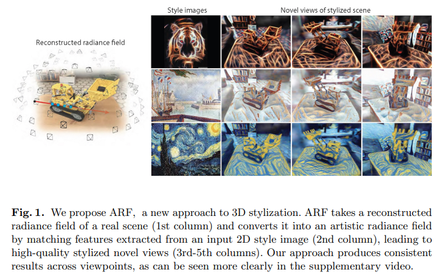

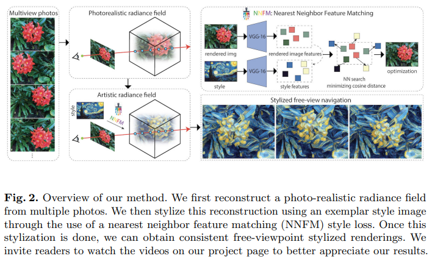

---

[22] [NeXT: Towards High Quality Neural Radiance Fields via Multi-Skip Transformer](https://www.ecva.net/papers/eccv_2022/papers_ECCV/html/1810_ECCV_2022_paper.php)

Yunxiao Wang, Yanjie Li, Peidong Liu, Tao Dai, Shu-Tao Xia

- Title：NeXT：通过 Multi-Skip Transformer 实现高质量的神经辐射场

- Category：Transformer,采样优化

- Project: none

- Code: https://github.com/Crishawy/NeXT

- Paper: [pdf](https://www.ecva.net/papers/eccv_2022/papers_ECCV/papers/136920069.pdf)

- Abstract：

  > *"Neural Radiance Fields (NeRF) methods show impressive performance for novel view synthesis by representing a scene via a neural network. However, most existing NeRF based methods, including its variants, treat each sample point individually as input, while ignoring the inherent relationships between adjacent sample points from the corresponding rays, thus hindering the reconstruction performance. To address this issue, we explore a brand new scheme, namely NeXT, introducing a multi-skip transformer to capture the rich relationships between various sample points in a ray-level query. Specifically, ray tokenization is proposed to represent each ray as a sequence of point embeddings which is taken as input of our proposed NeXT. In this way, relationships between sample points are captured via the built-in self-attention mechanism to promote the reconstruction. Besides, our proposed NeXT can be easily combined with other NeRF based methods to improve their rendering quality. Extensive experiments conducted on three datasets demonstrate that NeXT significantly outperforms all previous state-of- the-art work by a large margin. In particular, the proposed NeXT surpasses the strong NeRF baseline by 2.74 dB of PSNR on Blender dataset. The code is available at https://github.com/Crishawy/NeXT."*

- Figure：

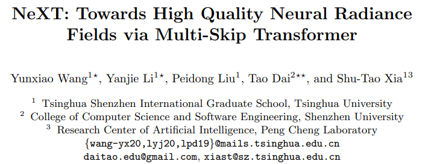

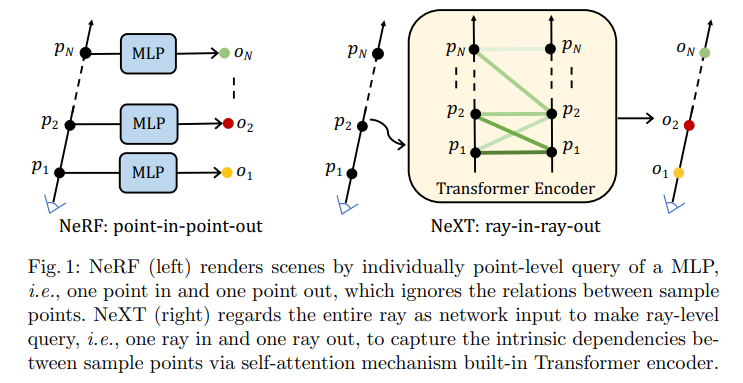

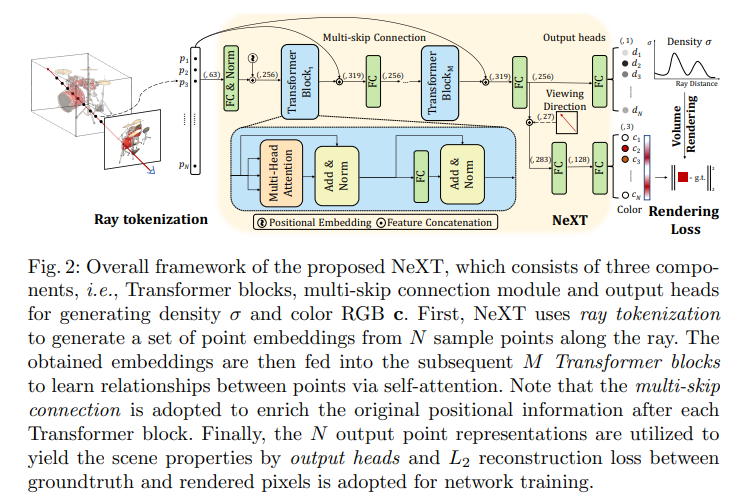

---

[23] [TensoRF: Tensorial Radiance Fields](https://www.ecva.net/papers/eccv_2022/papers_ECCV/html/3555_ECCV_2022_paper.php)

Anpei Chen, Zexiang Xu, Andreas Geiger, Jingyi Yu, Hao Su

- Title：TensoRF：张量辐射场

- Category：体素网格,加速,节省内存

- Project: https://apchenstu.github.io/TensoRF/

- Code: https://github.com/apchenstu/TensoRF

- Paper: [pdf](https://www.ecva.net/papers/eccv_2022/papers_ECCV/papers/136920332.pdf)

- Abstract：

  > *"We present TensoRF, a novel approach to model and reconstruct radiance fields. Unlike NeRF that purely uses MLPs, we model the radiance field of a scene as a 4D tensor, which represents a 3D voxel grid with per-voxel multi-channel features. Our central idea is to factorize the 4D scene tensor into multiple compact low-rank tensor components. We demonstrate that applying traditional CANDECOMP/PARAFAC (CP) decomposition -- that factorizes tensors into rank-one components with compact vectors -- in our framework leads to improvements over vanilla NeRF. To further boost performance, we introduce a novel vector-matrix (VM) decomposition that relaxes the low-rank constraints for two modes of a tensor and factorizes tensors into compact vector and matrix factors. Beyond superior rendering quality, our models with CP and VM decompositions lead to a significantly lower memory footprint in comparison to previous and concurrent works that directly optimize per-voxel features. Experimentally, we demonstrate that TensoRF with CP decomposition achieves fast reconstruction (<30 min) with better rendering quality and even a smaller model size (<4 MB) compared to NeRF. Moreover, TensoRF with VM decomposition further boosts rendering quality and outperforms previous state-of-the-art methods, while reducing the reconstruction time (<10 min) and retaining a compact model size (<75 MB)."*

- Figure：

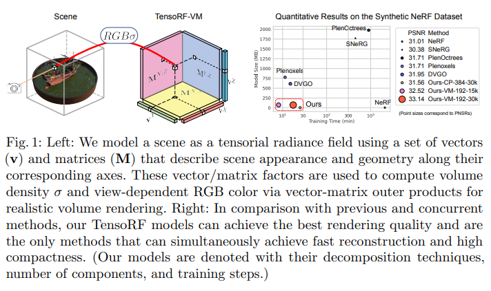

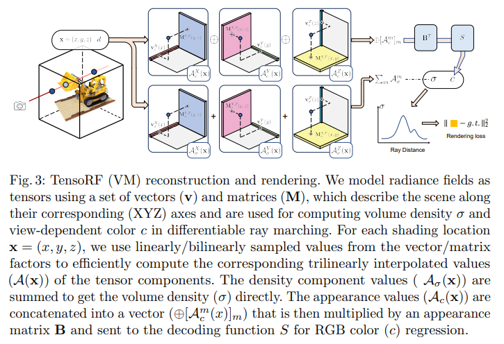

---

[24] [HDR-Plenoxels: Self-Calibrating High Dynamic Range Radiance Fields](https://www.ecva.net/papers/eccv_2022/papers_ECCV/html/3703_ECCV_2022_paper.php)

Kim Jun-Seong, Kim Yu-Ji, Moon Ye-Bin, Tae-Hyun Oh

- Title：HDR-Plenoxels：自校准高动态范围辐射场

- Category：HDR,体素网格

- Project: https://hdr-plenoxels.github.io/

- Code: https://github.com/postech-ami/HDR-Plenoxels

- Paper: [pdf](https://www.ecva.net/papers/eccv_2022/papers_ECCV/papers/136920383.pdf)

- Abstract：

  > *"We propose high dynamic range radiance (HDR) fields, HDR-Plenoxels, that learns a plenoptic function of 3D HDR radiance fields, geometry information, and varying camera settings inherent in 2D low dynamic range (LDR) images. Our voxel-based volume rendering pipeline reconstructs HDR radiance fields with only multi-view LDR images taken from varying camera settings in an end-to-end manner and has a fast convergence speed. To deal with various cameras in real-world scenario, we introduce a tone mapping module that models the digital in camera imaging pipeline (ISP) and disentangles radiometric settings. Our tone mapping module allows us to render by controlling the radiometric settings of each novel view. Finally, we build a multi-view dataset with varying camera conditions, which fits our problem setting. Our experiments show that HDR-Plenoxels can express detail and high-quality HDR novel views from only LDR images with various cameras."*

- Figure：

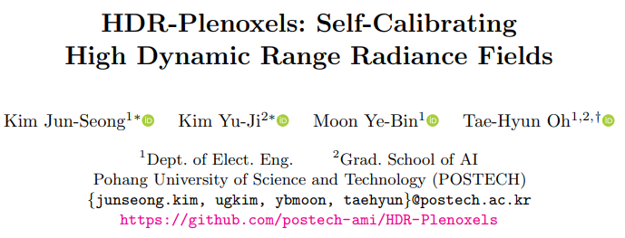

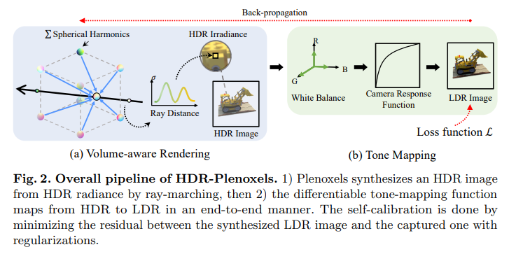

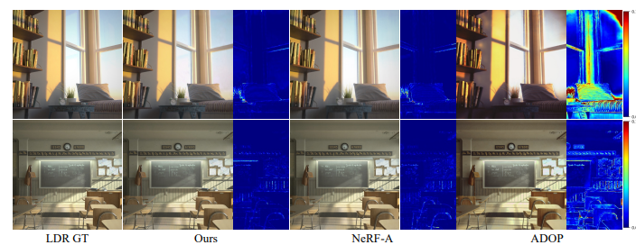

---

[25] [NeuMan: Neural Human Radiance Field from a Single Video](https://www.ecva.net/papers/eccv_2022/papers_ECCV/html/3737_ECCV_2022_paper.php)

Wei Jiang, Kwang Moo Yi, Golnoosh Samei, Oncel Tuzel, Anurag Ranjan

- Title：NeuMan：来自单个视频的神经人体辐射场

- Category：人体建模

- Project: none

- Code: https://github.com/apple/ml-neuman

- Paper: [pdf](https://www.ecva.net/papers/eccv_2022/papers_ECCV/papers/136920400.pdf)

- Abstract：

  > *"Photorealistic rendering and reposing of humans is important for enabling augmented reality experiences. We propose a novel framework to reconstruct the human and the scene that can be rendered with novel human poses and views from just a single in-the-wild video. Given a video captured by a moving camera, we train two NeRF models: a human NeRF model and a scene NeRF model. To train these models, we rely on existing methods to estimate the rough geometry of the human and the scene. Those rough geometry estimates allow us to create a warping field from the observation space to the canonical pose-independent space, where we train the human model in. Our method is able to learn subject specific details, including cloth wrinkles and accessories, from just a 10 seconds video clip, and to provide high quality renderings of the human under novel poses, from novel views, together with the background."*

- Figure：

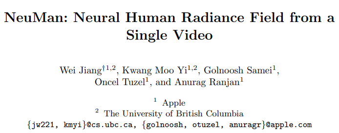

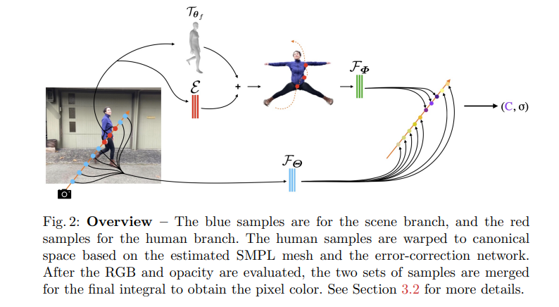

---

[26] [Deforming Radiance Fields with Cages](https://www.ecva.net/papers/eccv_2022/papers_ECCV/html/6719_ECCV_2022_paper.php)

Tianhan Xu, Tatsuya Harada

- Title：用笼子变形辐射场

- Category：可变形

- Project: https://xth430.github.io/deforming-nerf/

- Code: https://github.com/xth430/deforming-nerf

- Paper: [pdf](https://www.ecva.net/papers/eccv_2022/papers_ECCV/papers/136930155.pdf)

- Abstract：

  > *"Recent advances in radiance fields enable photorealistic rendering of static or dynamic 3D scenes, but still do not support explicit deformation that is used for scene manipulation or animation. In this paper, we propose a method that enables a new type of deformation of the radiance field: free-form radiance field deformation. We use a triangular mesh that encloses the foreground object called cage as an interface, and by manipulating the cage vertices, our approach enables the free-form deformation of the radiance field. The core of our approach is cage-based deformation which is commonly used in mesh deformation. We propose a novel formulation to extend it to the radiance field, which maps the position and the view direction of the sampling points from the deformed space to the canonical space, thus enabling the rendering of the deformed scene. The deformation results of the synthetic datasets and the real-world datasets demonstrate the effectiveness of our approach."*

- Figure：

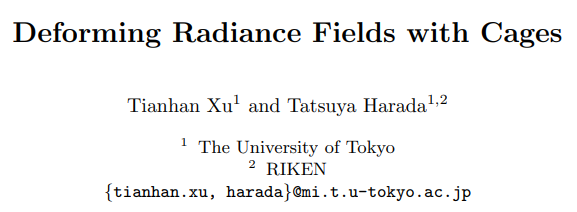

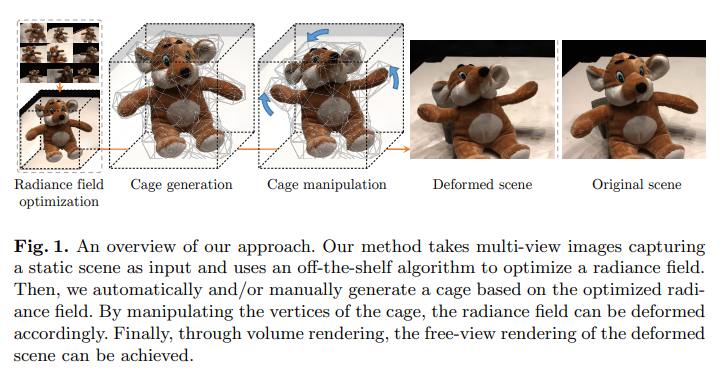

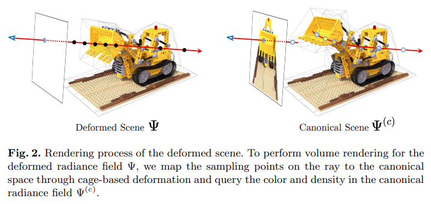

---

[27] [Gaussian Activated Neural Radiance Fields for High Fidelity Reconstruction \& Pose Estimation](https://www.ecva.net/papers/eccv_2022/papers_ECCV/html/7838_ECCV_2022_paper.php)

Shin-Fang Chng, Sameera Ramasinghe, Jamie Sherrah, Simon Lucey

- Title：用于高保真重建和位姿估计的高斯激活神经辐射场

- Category：真实渲染,位姿估计

- Project: https://sfchng.github.io/garf/

- Code: https://github.com/sfchng/Gaussian-Activated-Radiance-Fields.git

- Paper: [pdf](https://www.ecva.net/papers/eccv_2022/papers_ECCV/papers/136930259.pdf)

- Abstract：

  > *"Despite Neural Radiance Fields (NeRF) showing compelling results in photorealistic novel views synthesis of real-world scenes, most existing approaches require accurate prior camera poses. Although approaches for jointly recovering the radiance field and camera pose exist, they rely on a cumbersome coarse-to-fine auxiliary positional embedding to ensure good performance. We present Gaussian Activated Neural Radiance Fields (GARF), a new positional embedding-free neural radiance field architecture -- employing Gaussian activations -- that is competitive with the current state-of-the-art in terms of high fidelity reconstruction and pose estimation."*

- Figure：

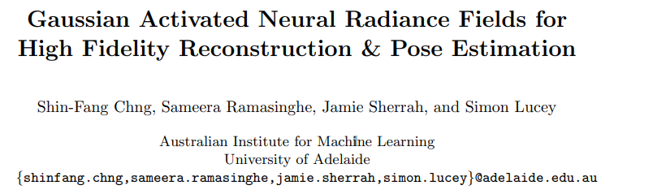

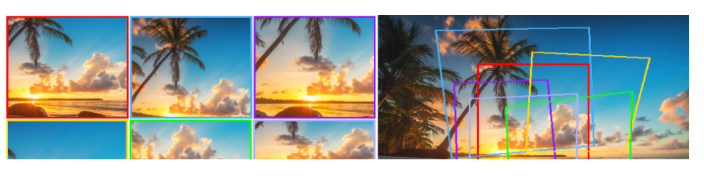

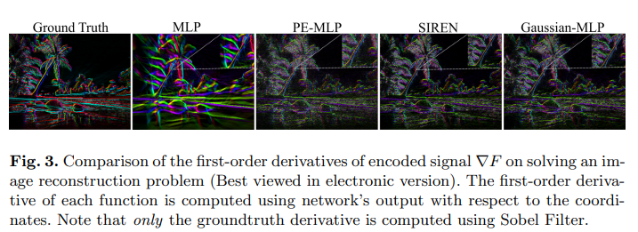

---

[28] [Self-Calibrating Photometric Stereo by Neural Inverse Rendering](https://www.ecva.net/papers/eccv_2022/papers_ECCV/html/5007_ECCV_2022_paper.php)

Junxuan Li, Hongdong Li

- Title：通过神经逆向渲染自校准光度立体

- Category：自标定光度立体

- Project: none

- Code: https://github.com/junxuan-li/SCPS-NIR

- Paper: [pdf](https://www.ecva.net/papers/eccv_2022/papers_ECCV/papers/136620160.pdf)

- Abstract：

  > *"This paper tackles the task of uncalibrated photometric stereo for 3D object reconstruction, where both the object shape, object reflectance, and lighting directions are unknown. This is an extremely difficult task, and the challenge is further compounded with the existence of the well-known generalized bas-relief (GBR) ambiguity in photometric stereo. Previous methods to resolve this ambiguity either rely on an overly simplified reflectance model, or assume special light distribution. We propose a new method that jointly optimizes object shape, light directions, and light intensities, all under general surfaces and lights assumptions. The specularities are used explicitly to resolve the GBR ambiguity via a neural inverse rendering process. We gradually fit specularities from shiny to rough using novel progressive specular bases. Our method leverages a physically based rendering equation by minimizing the reconstruction error on a per-object-basis. Our method demonstrates state-of-the-art accuracy in light estimation and shape recovery on real-world datasets."*

- Figure：

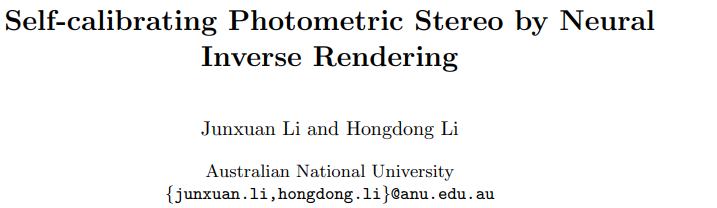

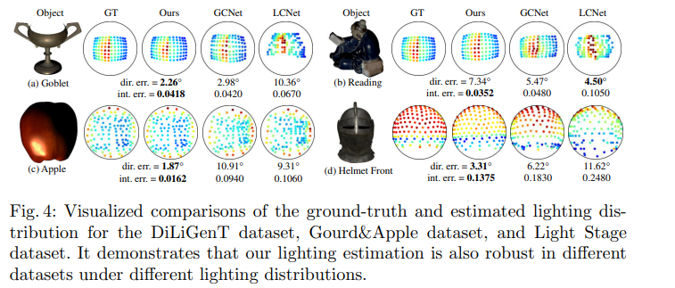

---

[29] 

- Title：

- Category：

- Project: 

- Code: 

- Paper: 

- Abstract：

  > **

- Figure：

