# NeRFs-ICCV2023

- #Papers: 15

-----
[1] Zip-NeRF: Anti-Aliased Grid-Based Neural Radiance Fields
- Category：Anti-Aliased, Grid-Based
- Project: https://jonbarron.info/zipnerf/
- Code: [unofficial](https://github.com/SuLvXiangXin/zipnerf-pytorch)
- Paper: https://arxiv.org/abs/2304.06706
- Abstract:
> *Neural Radiance Field training can be accelerated through the use of grid-based representations in NeRF's learned mapping from spatial coordinates to colors and volumetric density. However, these grid-based approaches lack an explicit understanding of scale and therefore often introduce aliasing, usually in the form of jaggies or missing scene content. Anti-aliasing has previously been addressed by mip-NeRF 360, which reasons about sub-volumes along a cone rather than points along a ray, but this approach is not natively compatible with current grid-based techniques. We show how ideas from rendering and signal processing can be used to construct a technique that combines mip-NeRF 360 and grid-based models such as Instant NGP to yield error rates that are 8% - 77% lower than either prior technique, and that trains 24x faster than mip-NeRF 360.* 
- Figure: 
  

-----
[2] Delicate Textured Mesh Recovery from NeRF via Adaptive Surface Refinement
- Category：nerf2mesh, nerf-texture
- Project: https://me.kiui.moe/nerf2mesh/
- Code: https://github.com/ashawkey/nerf2mesh
- Paper: https://arxiv.org/pdf/2303.02091.pdf
- Abstract:
> *Neural Radiance Fields (NeRF) have constituted a remarkable breakthrough in image-based 3D reconstruction. However, their implicit volumetric representations differ significantly from the widely-adopted polygonal meshes and lack support from common 3D software and hardware, making their rendering and manipulation inefficient. To overcome this limitation, we present a novel framework that generates textured surface meshes from images. Our approach begins by efficiently initializing the geometry and view-dependency decomposed appearance with a NeRF. Subsequently, a coarse mesh is extracted, and an iterative surface refining algorithm is developed to adaptively adjust both vertex positions and face density based on re-projected rendering errors. We jointly refine the appearance with geometry and bake it into texture images for real-time rendering. Extensive experiments demonstrate that our method achieves superior mesh quality and competitive rendering quality.* 
- Figure: 
  
  

-----
[3] IntrinsicNeRF: Learning Intrinsic Neural Radiance Fields for Editable Novel View Synthesis
- Category：Editable
- Project: https://zju3dv.github.io/intrinsic_nerf/
- Code: https://github.com/zju3dv/IntrinsicNeRF
- Paper: https://arxiv.org/pdf/2210.00647.pdf
- Abstract:
> *Existing inverse rendering combined with neural rendering methods~/cite{zhang2021physg, zhang2022modeling} can only perform editable novel view synthesis on object-specific scenes, while we present intrinsic neural radiance fields, dubbed IntrinsicNeRF, which introduce intrinsic decomposition into the NeRF-based~/cite{mildenhall2020nerf} neural rendering method and can extend its application to room-scale scenes. Since intrinsic decomposition is a fundamentally under-constrained inverse problem, we propose a novel distance-aware point sampling and adaptive reflectance iterative clustering optimization method, which enables IntrinsicNeRF with traditional intrinsic decomposition constraints to be trained in an unsupervised manner, resulting in temporally consistent intrinsic decomposition results. To cope with the problem that different adjacent instances of similar reflectance in a scene are incorrectly clustered together, we further propose a hierarchical clustering method with coarse-to-fine optimization to obtain a fast hierarchical indexing representation. It supports compelling real-time augmented applications such as recoloring and illumination variation. Extensive experiments and editing samples on both object-specific/room-scale scenes and synthetic/real-word data demonstrate that we can obtain consistent intrinsic decomposition results and high-fidelity novel view synthesis even for challenging sequences. Project page: [this https URL](https://zju3dv.github.io/intrinsic_nerf).* 
- Figure: 
  
  

-----
[4] DreamBooth3D: Subject-Driven Text-to-3D Generation
- Category：Text-to-3D
- Project: https://dreambooth3d.github.io/
- Code: None
- Paper: https://arxiv.org/pdf/2303.13508.pdf
- Abstract:
> *We present DreamBooth3D, an approach to personalize text-to-3D generative models from as few as 3-6 casually captured images of a subject. Our approach combines recent advances in personalizing text-to-image models (DreamBooth) with text-to-3D generation (DreamFusion). We find that naively combining these methods fails to yield satisfactory subject-specific 3D assets due to personalized text-to-image models overfitting to the input viewpoints of the subject. We overcome this through a 3-stage optimization strategy where we jointly leverage the 3D consistency of neural radiance fields together with the personalization capability of text-to-image models. Our method can produce high-quality, subject-specific 3D assets with text-driven modifications such as novel poses, colors and attributes that are not seen in any of the input images of the subject.* 
- Figure: 
  
  

-----
[5] Tetra-NeRF: Representing Neural Radiance Fields Using Tetrahedra
- Category：Point-Based, Tetrahedra-Based
- Project: https://jkulhanek.com/tetra-nerf/
- Code: https://github.com/jkulhanek/tetra-nerf/
- Paper: https://arxiv.org/pdf/2304.09987.pdf
- Abstract:
> *Neural Radiance Fields (NeRFs) are a very recent and very popular approach for the problems of novel view synthesis and 3D reconstruction. A popular scene representation used by NeRFs is to combine a uniform, voxel-based subdivision of the scene with an MLP. Based on the observation that a (sparse) point cloud of the scene is often available, this paper proposes to use an adaptive representation based on tetrahedra obtained by the Delaunay triangulation instead of the uniform subdivision or point-based representations. We show that such a representation enables efficient training and leads to state-of-the-art results. Our approach elegantly combines concepts from 3D geometry processing, triangle-based rendering, and modern neural radiance fields. Compared to voxel-based representations, ours provides more detail around parts of the scene likely to be close to the surface. Compared to point-based representations, our approach achieves better performance.* 
- Figure: 
  

-----
[6] SparseNeRF: Distilling Depth Ranking for Few-shot Novel View Synthesis
- Category：depth-based, Few-shot
- Project: https://sparsenerf.github.io/
- Code: https://github.com/Wanggcong/SparseNeRF
- Paper: https://arxiv.org/pdf/2303.16196.pdf
- Abstract:
> *Neural Radiance Field (NeRF) significantly degrades when only a limited number of views are available. To complement the lack of 3D information, depth-based models, such as DSNeRF and MonoSDF, explicitly assume the availability of accurate depth maps of multiple views. They linearly scale the accurate depth maps as supervision to guide the predicted depth of few-shot NeRFs. However, accurate depth maps are difficult and expensive to capture due to wide-range depth distances in the wild.
> In this work, we present a new Sparse-view NeRF (SparseNeRF) framework that exploits depth priors from real-world inaccurate observations. The inaccurate depth observations are either from pre-trained depth models or coarse depth maps of consumer-level depth sensors. Since coarse depth maps are not strictly scaled to the ground-truth depth maps, we propose a simple yet effective constraint, a local depth ranking method, on NeRFs such that the expected depth ranking of the NeRF is consistent with that of the coarse depth maps in local patches. To preserve the spatial continuity of the estimated depth of NeRF, we further propose a spatial continuity constraint to encourage the consistency of the expected depth continuity of NeRF with coarse depth maps. Surprisingly, with simple depth ranking constraints, SparseNeRF outperforms all state-of-the-art few-shot NeRF methods (including depth-based models) on standard LLFF and DTU datasets. Moreover, we collect a new dataset NVS-RGBD that contains real-world depth maps from Azure Kinect, ZED 2, and iPhone 13 Pro. Extensive experiments on NVS-RGBD dataset also validate the superiority and generalizability of SparseNeRF. Project page is available at [this https URL](https://sparsenerf.github.io/).* 
- Figure: 
  

-----
[7] SHERF: Generalizable Human NeRF from a Single Image
- Category：3D Human
- Project: https://skhu101.github.io/SHERF/
- Code: https://github.com/skhu101/SHERF
- Paper: https://arxiv.org/pdf/2303.12791.pdf
- Abstract:
> *Existing Human NeRF methods for reconstructing 3D humans typically rely on multiple 2D images from multi-view cameras or monocular videos captured from fixed camera views. However, in real-world scenarios, human images are often captured from random camera angles, presenting challenges for high-quality 3D human reconstruction. In this paper, we propose SHERF, the first generalizable Human NeRF model for recovering animatable 3D humans from a single input image. SHERF extracts and encodes 3D human representations in canonical space, enabling rendering and animation from free views and poses. To achieve high-fidelity novel view and pose synthesis, the encoded 3D human representations should capture both global appearance and local fine-grained textures. To this end, we propose a bank of 3D-aware hierarchical features, including global, point-level, and pixel-aligned features, to facilitate informative encoding. Global features enhance the information extracted from the single input image and complement the information missing from the partial 2D observation. Point-level features provide strong clues of 3D human structure, while pixel-aligned features preserve more fine-grained details. To effectively integrate the 3D-aware hierarchical feature bank, we design a feature fusion transformer. Extensive experiments on THuman, RenderPeople, ZJU_MoCap, and HuMMan datasets demonstrate that SHERF achieves state-of-the-art performance, with better generalizability for novel view and pose synthesis.* 
- Figure: 
  

-----
[8] Make-It-3D: High-Fidelity 3D Creation from A Single Image with Diffusion Prior
- Category：3D Creation, NeRF-Diffusion
- Project: https://make-it-3d.github.io/
- Code: https://github.com/junshutang/Make-It-3D
- Paper: https://arxiv.org/pdf/2303.14184.pdf
- Abstract:
> *In this work, we investigate the problem of creating high-fidelity 3D content from only a single image. This is inherently challenging: it essentially involves estimating the underlying 3D geometry while simultaneously hallucinating unseen textures. To address this challenge, we leverage prior knowledge from a well-trained 2D diffusion model to act as 3D-aware supervision for 3D creation. Our approach, Make-It-3D, employs a two-stage optimization pipeline: the first stage optimizes a neural radiance field by incorporating constraints from the reference image at the frontal view and diffusion prior at novel views; the second stage transforms the coarse model into textured point clouds and further elevates the realism with diffusion prior while leveraging the high-quality textures from the reference image. Extensive experiments demonstrate that our method outperforms prior works by a large margin, resulting in faithful reconstructions and impressive visual quality. Our method presents the first attempt to achieve high-quality 3D creation from a single image for general objects and enables various applications such as text-to-3D creation and texture editing.* 
- Figure: 
  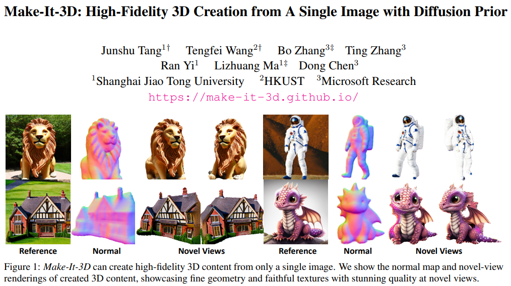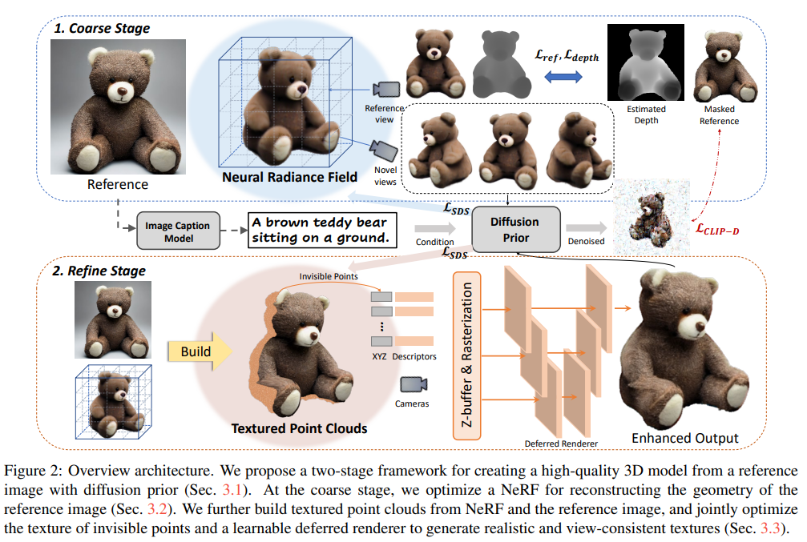

-----
[9] Neural Haircut: Prior-Guided Strand-Based Hair Reconstruction
- Category：Hair Reconstruction, NeRF-Diffusion
- Project: https://samsunglabs.github.io/NeuralHaircut/
- Code: https://github.com/SamsungLabs/NeuralHaircut
- Paper: https://arxiv.org/pdf/2306.05872.pdf
- Abstract:
> *Generating realistic human 3D reconstructions using image or video data is essential for various communication and entertainment applications. While existing methods achieved impressive results for body and facial regions, realistic hair modeling still remains challenging due to its high mechanical complexity. This work proposes an approach capable of accurate hair geometry reconstruction at a strand level from a monocular video or multi-view images captured in uncontrolled lighting conditions. Our method has two stages, with the first stage performing joint reconstruction of coarse hair and bust shapes and hair orientation using implicit volumetric representations. The second stage then estimates a strand-level hair reconstruction by reconciling in a single optimization process the coarse volumetric constraints with hair strand and hairstyle priors learned from the synthetic data. To further increase the reconstruction fidelity, we incorporate image-based losses into the fitting process using a new differentiable renderer. The combined system, named Neural Haircut, achieves high realism and personalization of the reconstructed hairstyles.* 
- Figure: 
  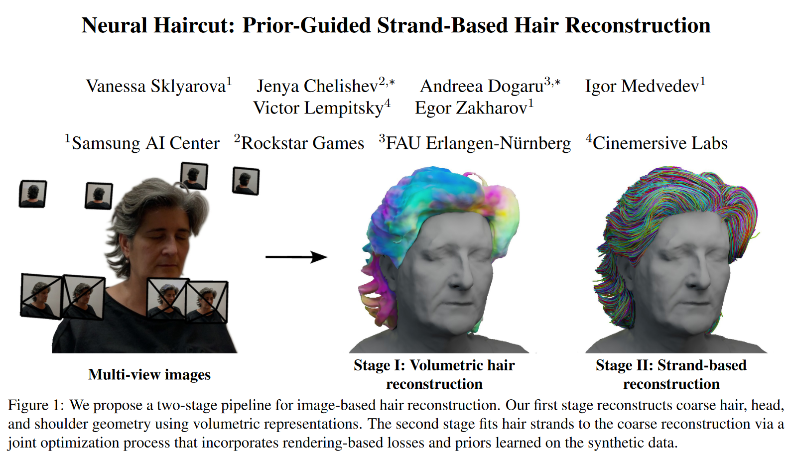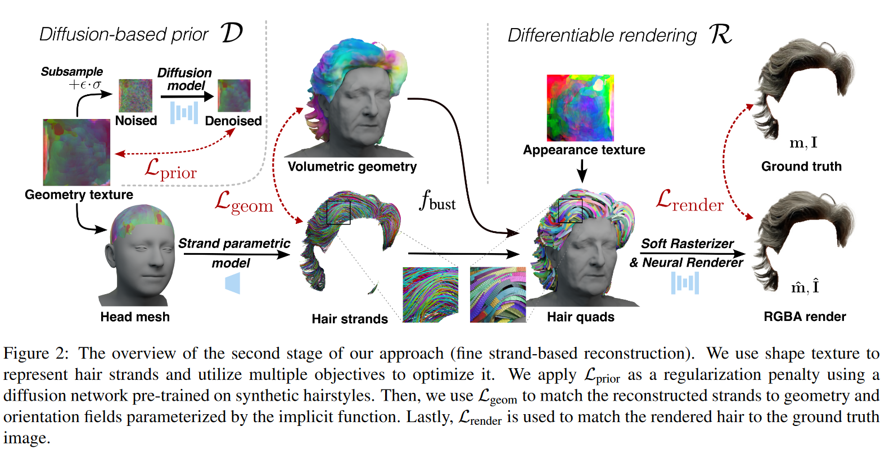

-----
[10] Urban Radiance Field Representation with Deformable Neural Mesh Primitives
- Category：Urban Reconstruction
- Project: https://dnmp.github.io/
- Code: https://github.com/DNMP/DNMP
- Paper: https://arxiv.org/pdf/2307.10776.pdf
- Abstract:
> *Neural Radiance Fields (NeRFs) have achieved great success in the past few years. However, most current methods still require intensive resources due to ray marching-based rendering. To construct urban-level radiance fields efficiently, we design Deformable Neural Mesh Primitive~(DNMP), and propose to parameterize the entire scene with such primitives. The DNMP is a flexible and compact neural variant of classic mesh representation, which enjoys both the efficiency of rasterization-based rendering and the powerful neural representation capability for photo-realistic image synthesis. Specifically, a DNMP consists of a set of connected deformable mesh vertices with paired vertex features to parameterize the geometry and radiance information of a local area. To constrain the degree of freedom for optimization and lower the storage budgets, we enforce the shape of each primitive to be decoded from a relatively low-dimensional latent space. The rendering colors are decoded from the vertex features (interpolated with rasterization) by a view-dependent MLP. The DNMP provides a new paradigm for urban-level scene representation with appealing properties: (1) High-quality rendering. Our method achieves leading performance for novel view synthesis in urban scenarios. (2) Low computational costs. Our representation enables fast rendering (2.07ms/1k pixels) and low peak memory usage (110MB/1k pixels). We also present a lightweight version that can run 33× faster than vanilla NeRFs, and comparable to the highly-optimized Instant-NGP (0.61 vs 0.71ms/1k pixels). Project page: \href{[this https URL](https://dnmp.github.io/)}{[this https URL](https://dnmp.github.io/)}.* 
- Figure: 
  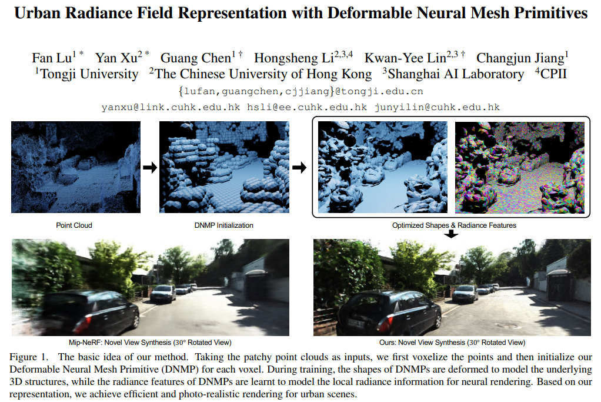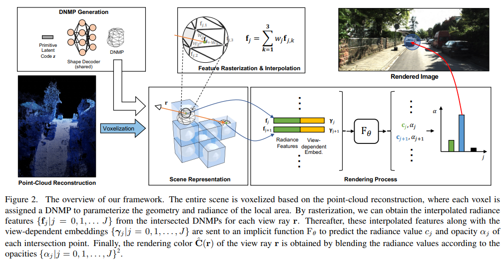

-----
[11] SKED: Sketch-guided Text-based 3D Editing
- Category：Text-to-3D Editing
- Project: https://sked-paper.github.io/
- Code: coming soon!
- Paper: https://arxiv.org/pdf/2303.10735v3.pdf
- Abstract:
> *Text-to-image diffusion models are gradually introduced into computer graphics, recently enabling the development of Text-to-3D pipelines in an open domain. However, for interactive editing purposes, local manipulations of content through a simplistic textual interface can be arduous. Incorporating user guided sketches with Text-to-image pipelines offers users more intuitive control. Still, as state-of-the-art Text-to-3D pipelines rely on optimizing Neural Radiance Fields (NeRF) through gradients from arbitrary rendering views, conditioning on sketches is not straightforward. In this paper, we present SKED, a technique for editing 3D shapes represented by NeRFs. Our technique utilizes as few as two guiding sketches from different views to alter an existing neural field. The edited region respects the prompt semantics through a pre-trained diffusion model. To ensure the generated output adheres to the provided sketches, we propose novel loss functions to generate the desired edits while preserving the density and radiance of the base instance. We demonstrate the effectiveness of our proposed method through several qualitative and quantitative experiments.* 
- Figure: 
  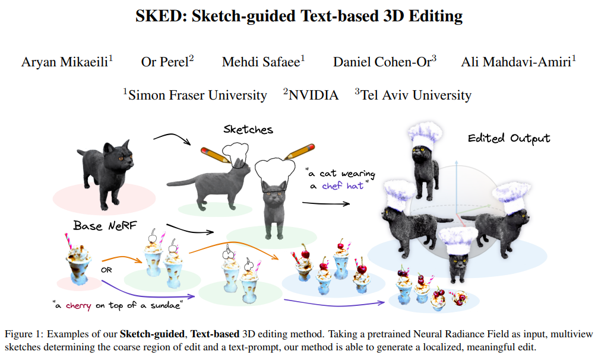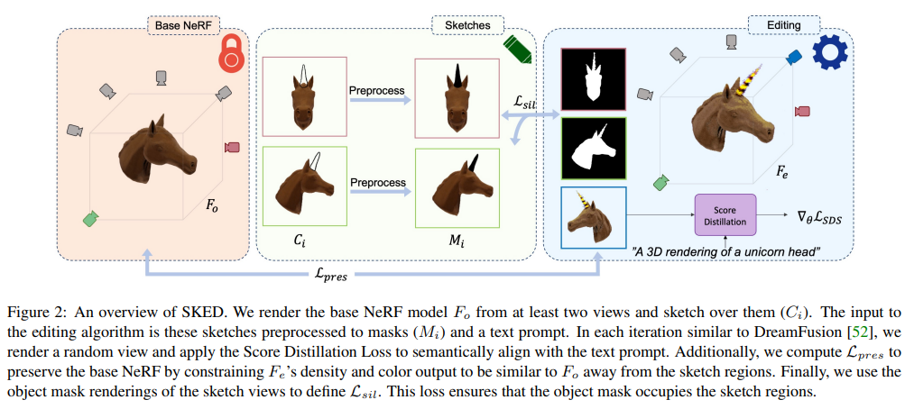

-----
[12] Lighting up NeRF via Unsupervised Decomposition and Enhancement
- Category：Low Light
- Project: https://www.whyy.site/paper/llnerf
- Code: https://github.com/onpix/LLNeRF
- Paper: https://arxiv.org/pdf/2307.10664.pdf
- Abstract:
> *Neural Radiance Field (NeRF) is a promising approach for synthesizing novel views, given a set of images and the corresponding camera poses of a scene. However, images photographed from a low-light scene can hardly be used to train a NeRF model to produce high-quality results, due to their low pixel intensities, heavy noise, and color distortion. Combining existing low-light image enhancement methods with NeRF methods also does not work well due to the view inconsistency caused by the individual 2D enhancement process. In this paper, we propose a novel approach, called Low-Light NeRF (or LLNeRF), to enhance the scene representation and synthesize normal-light novel views directly from sRGB low-light images in an unsupervised manner. The core of our approach is a decomposition of radiance field learning, which allows us to enhance the illumination, reduce noise and correct the distorted colors jointly with the NeRF optimization process. Our method is able to produce novel view images with proper lighting and vivid colors and details, given a collection of camera-finished low dynamic range (8-bits/channel) images from a low-light scene. Experiments demonstrate that our method outperforms existing low-light enhancement methods and NeRF methods.* 
- Figure: 
  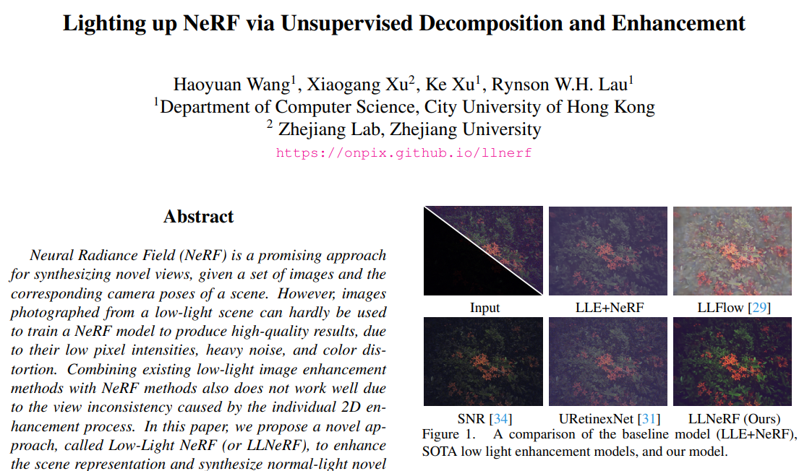
  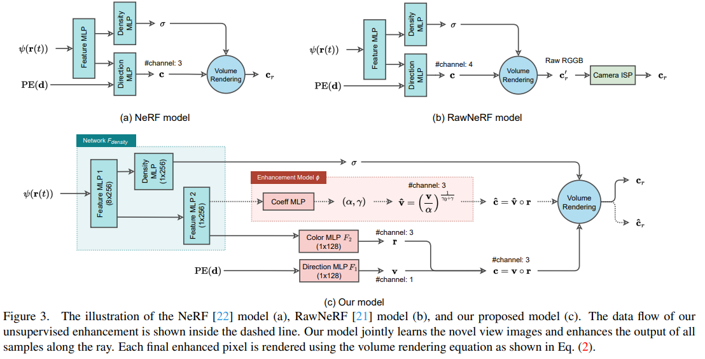

-----
[13] Efficient Region-Aware Neural Radiance Fields for High-Fidelity Talking Portrait Synthesis
- Category：Audio Driven
- Project: none
- Code: https://github.com/Fictionarry/ER-NeRF
- Paper: https://arxiv.org/pdf/2307.09323.pdf
- Abstract:
> *This paper presents ER-NeRF, a novel conditional Neural Radiance Fields (NeRF) based architecture for talking portrait synthesis that can concurrently achieve fast convergence, real-time rendering, and state-of-the-art performance with small model size. Our idea is to explicitly exploit the unequal contribution of spatial regions to guide talking portrait modeling. Specifically, to improve the accuracy of dynamic head reconstruction, a compact and expressive NeRF-based Tri-Plane Hash Representation is introduced by pruning empty spatial regions with three planar hash encoders. For speech audio, we propose a Region Attention Module to generate region-aware condition feature via an attention mechanism. Different from existing methods that utilize an MLP-based encoder to learn the cross-modal relation implicitly, the attention mechanism builds an explicit connection between audio features and spatial regions to capture the priors of local motions. Moreover, a direct and fast Adaptive Pose Encoding is introduced to optimize the head-torso separation problem by mapping the complex transformation of the head pose into spatial coordinates. Extensive experiments demonstrate that our method renders better high-fidelity and audio-lips synchronized talking portrait videos, with realistic details and high efficiency compared to previous methods.* 
- Figure: 
  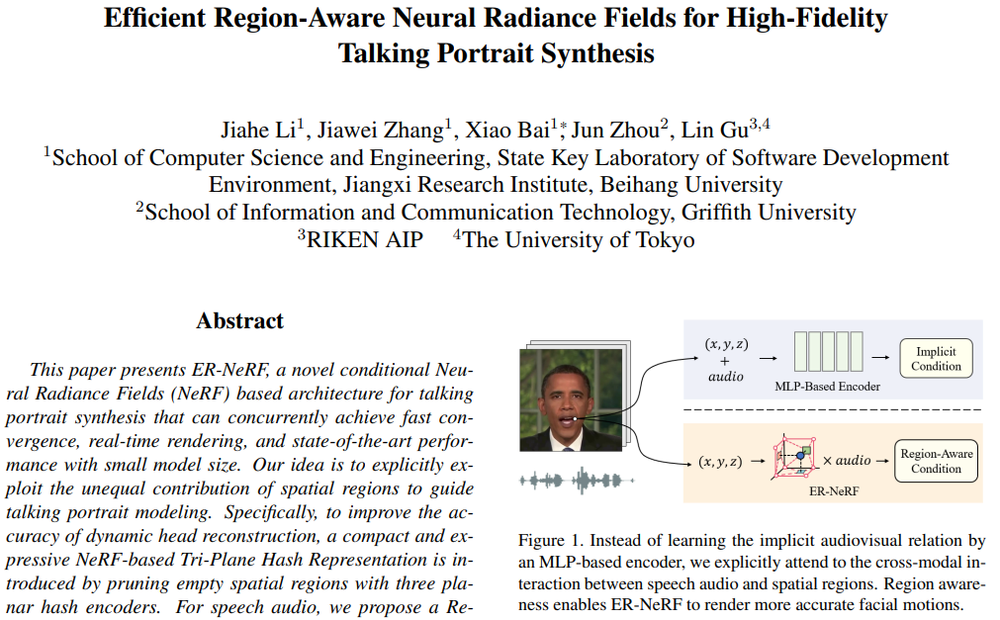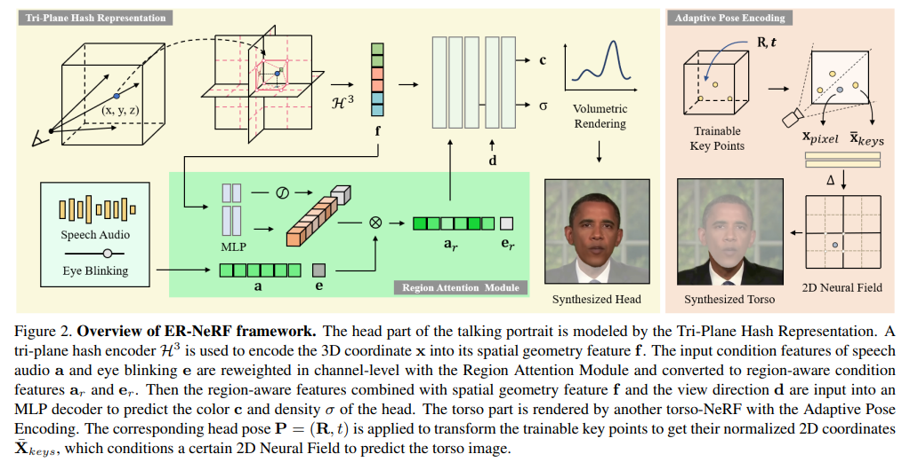

-----
[14] Tri-MipRF: Tri-Mip Representation for Efficient Anti-Aliasing Neural Radiance Fields
- Category：Anti-Aliasing, Faster
- Project: https://wbhu.github.io/projects/Tri-MipRF/
- Code: https://github.com/wbhu/Tri-MipRF
- Paper: https://arxiv.org/pdf/2307.11335.pdf
- Abstract:
> *Despite the tremendous progress in neural radiance fields (NeRF), we still face a dilemma of the trade-off between quality and efficiency, e.g., MipNeRF presents fine-detailed and anti-aliased renderings but takes days for training, while Instant-ngp can accomplish the reconstruction in a few minutes but suffers from blurring or aliasing when rendering at various distances or resolutions due to ignoring the sampling area. To this end, we propose a novel Tri-Mip encoding that enables both instant reconstruction and anti-aliased high-fidelity rendering for neural radiance fields. The key is to factorize the pre-filtered 3D feature spaces in three orthogonal mipmaps. In this way, we can efficiently perform 3D area sampling by taking advantage of 2D pre-filtered feature maps, which significantly elevates the rendering quality without sacrificing efficiency. To cope with the novel Tri-Mip representation, we propose a cone-casting rendering technique to efficiently sample anti-aliased 3D features with the Tri-Mip encoding considering both pixel imaging and observing distance. Extensive experiments on both synthetic and real-world datasets demonstrate our method achieves state-of-the-art rendering quality and reconstruction speed while maintaining a compact representation that reduces 25% model size compared against Instant-ngp.* 
- Figure: 
  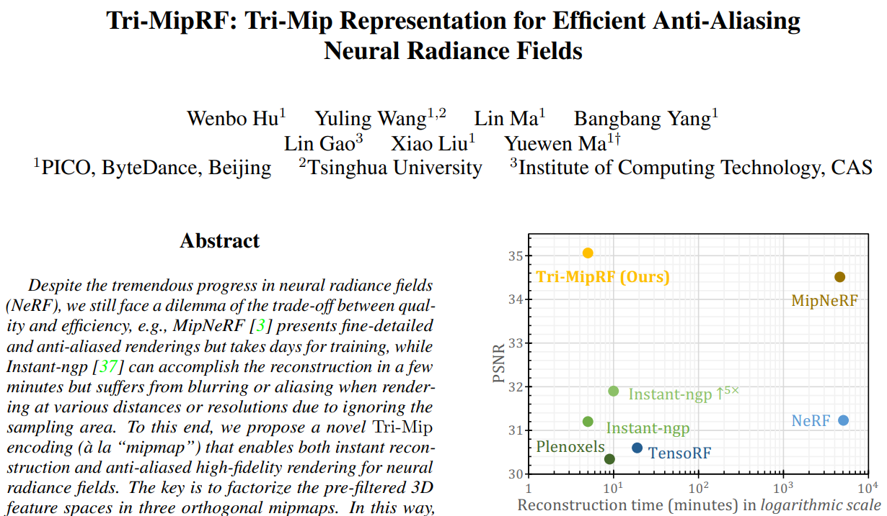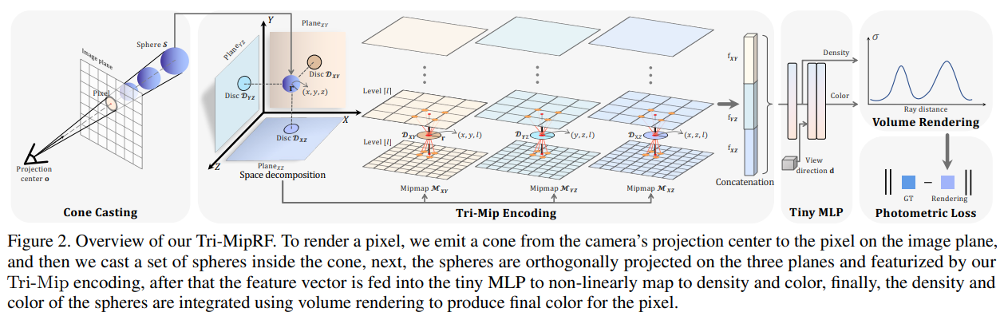

-----
[15] AvatarCraft: Transforming Text into Neural Human Avatars with Parameterized Shape and Pose Control
- Category：Text-to-Avatars
- Project: https://avatar-craft.github.io/
- Code: https://github.com/songrise/AvatarCraft
- Paper: https://arxiv.org/pdf/2303.17606.pdf
- Abstract:
> *Neural implicit fields are powerful for representing 3D scenes and generating high-quality novel views, but it remains challenging to use such implicit representations for creating a 3D human avatar with a specific identity and artistic style that can be easily animated. Our proposed method, AvatarCraft, addresses this challenge by using diffusion models to guide the learning of geometry and texture for a neural avatar based on a single text prompt. We carefully design the optimization framework of neural implicit fields, including a coarse-to-fine multi-bounding box training strategy, shape regularization, and diffusion-based constraints, to produce high-quality geometry and texture. Additionally, we make the human avatar animatable by deforming the neural implicit field with an explicit warping field that maps the target human mesh to a template human mesh, both represented using parametric human models. This simplifies animation and reshaping of the generated avatar by controlling pose and shape parameters. Extensive experiments on various text descriptions show that AvatarCraft is effective and robust in creating human avatars and rendering novel views, poses, and shapes. Our project page is: \url{[this https URL](https://avatar-craft.github.io/)}.* 
- Figure: 
  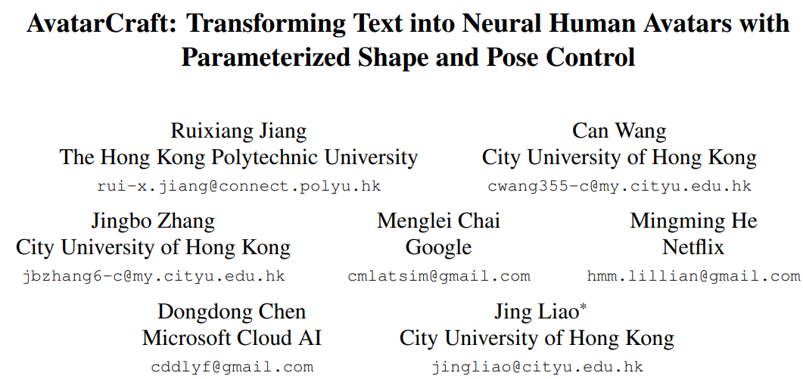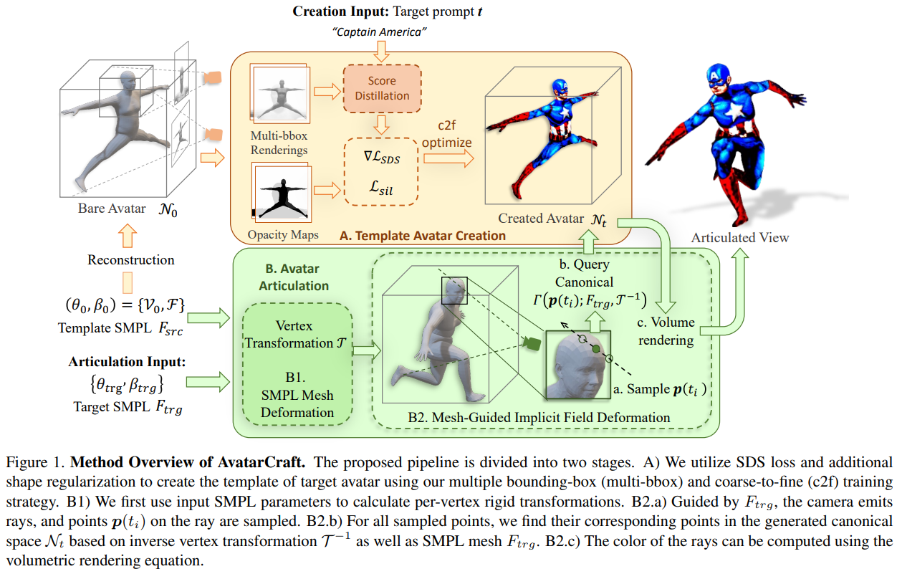

-----
[16] 
- Category：
- Project: 
- Code: 
- Paper: 
- Abstract:
> ** 
- Figure: 

-----
[] 
- Category：
- Project: 
- Code: 
- Paper: 
- Abstract:
> ** 
- Figure: 