# NeRFs-ICCV2023

- #Papers: 7

-----
[1] Zip-NeRF: Anti-Aliased Grid-Based Neural Radiance Fields
- Category：Anti-Aliased, Grid-Based
- Project: https://jonbarron.info/zipnerf/
- Code: [unofficial](https://github.com/SuLvXiangXin/zipnerf-pytorch)
- Paper: https://arxiv.org/abs/2304.06706
- Abstract:
> *Neural Radiance Field training can be accelerated through the use of grid-based representations in NeRF's learned mapping from spatial coordinates to colors and volumetric density. However, these grid-based approaches lack an explicit understanding of scale and therefore often introduce aliasing, usually in the form of jaggies or missing scene content. Anti-aliasing has previously been addressed by mip-NeRF 360, which reasons about sub-volumes along a cone rather than points along a ray, but this approach is not natively compatible with current grid-based techniques. We show how ideas from rendering and signal processing can be used to construct a technique that combines mip-NeRF 360 and grid-based models such as Instant NGP to yield error rates that are 8% - 77% lower than either prior technique, and that trains 24x faster than mip-NeRF 360.* 
- Figure: 
  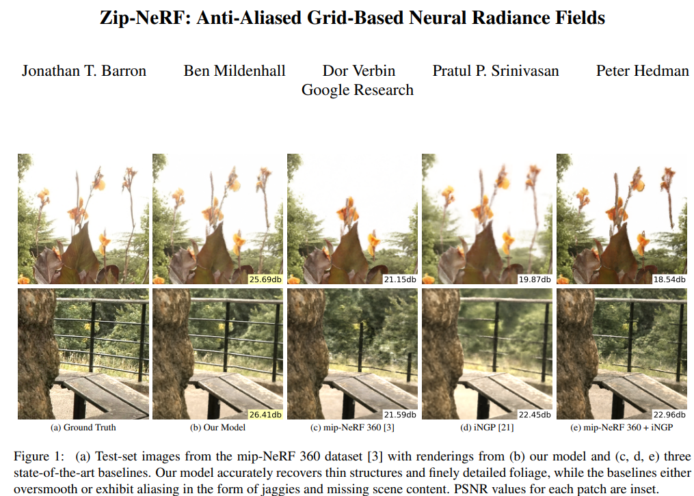

-----
[2] Delicate Textured Mesh Recovery from NeRF via Adaptive Surface Refinement
- Category：nerf2mesh, nerf-texture
- Project: https://me.kiui.moe/nerf2mesh/
- Code: https://github.com/ashawkey/nerf2mesh
- Paper: https://arxiv.org/pdf/2303.02091.pdf
- Abstract:
> *Neural Radiance Fields (NeRF) have constituted a remarkable breakthrough in image-based 3D reconstruction. However, their implicit volumetric representations differ significantly from the widely-adopted polygonal meshes and lack support from common 3D software and hardware, making their rendering and manipulation inefficient. To overcome this limitation, we present a novel framework that generates textured surface meshes from images. Our approach begins by efficiently initializing the geometry and view-dependency decomposed appearance with a NeRF. Subsequently, a coarse mesh is extracted, and an iterative surface refining algorithm is developed to adaptively adjust both vertex positions and face density based on re-projected rendering errors. We jointly refine the appearance with geometry and bake it into texture images for real-time rendering. Extensive experiments demonstrate that our method achieves superior mesh quality and competitive rendering quality.* 
- Figure: 
  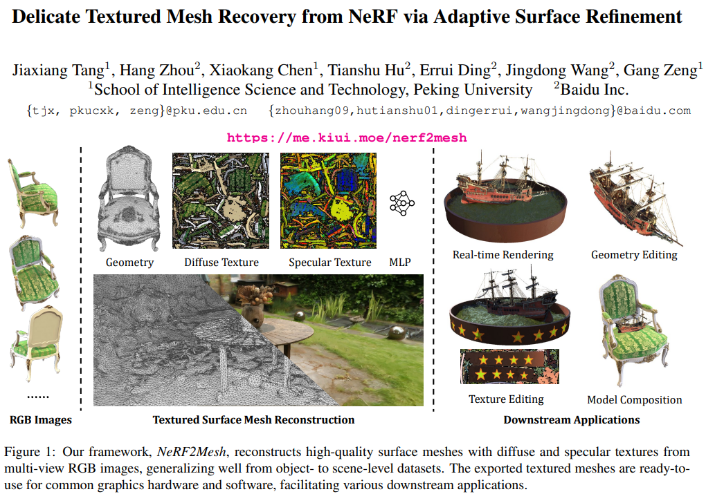
  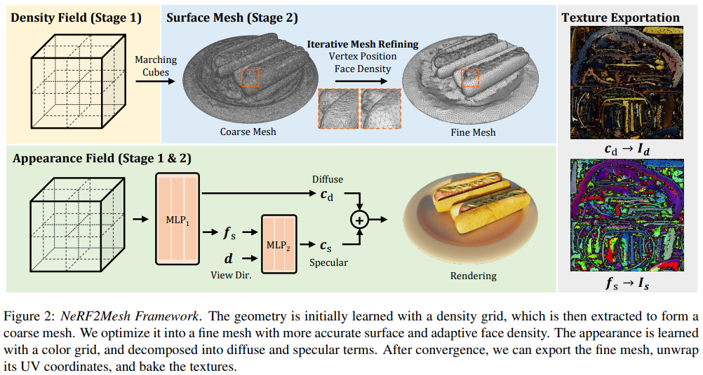

-----
[3] IntrinsicNeRF: Learning Intrinsic Neural Radiance Fields for Editable Novel View Synthesis
- Category：Editable
- Project: https://zju3dv.github.io/intrinsic_nerf/
- Code: https://github.com/zju3dv/IntrinsicNeRF
- Paper: https://arxiv.org/pdf/2210.00647.pdf
- Abstract:
> *Existing inverse rendering combined with neural rendering methods~/cite{zhang2021physg, zhang2022modeling} can only perform editable novel view synthesis on object-specific scenes, while we present intrinsic neural radiance fields, dubbed IntrinsicNeRF, which introduce intrinsic decomposition into the NeRF-based~/cite{mildenhall2020nerf} neural rendering method and can extend its application to room-scale scenes. Since intrinsic decomposition is a fundamentally under-constrained inverse problem, we propose a novel distance-aware point sampling and adaptive reflectance iterative clustering optimization method, which enables IntrinsicNeRF with traditional intrinsic decomposition constraints to be trained in an unsupervised manner, resulting in temporally consistent intrinsic decomposition results. To cope with the problem that different adjacent instances of similar reflectance in a scene are incorrectly clustered together, we further propose a hierarchical clustering method with coarse-to-fine optimization to obtain a fast hierarchical indexing representation. It supports compelling real-time augmented applications such as recoloring and illumination variation. Extensive experiments and editing samples on both object-specific/room-scale scenes and synthetic/real-word data demonstrate that we can obtain consistent intrinsic decomposition results and high-fidelity novel view synthesis even for challenging sequences. Project page: [this https URL](https://zju3dv.github.io/intrinsic_nerf).* 
- Figure: 
  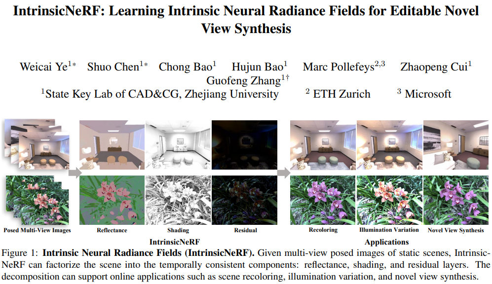
  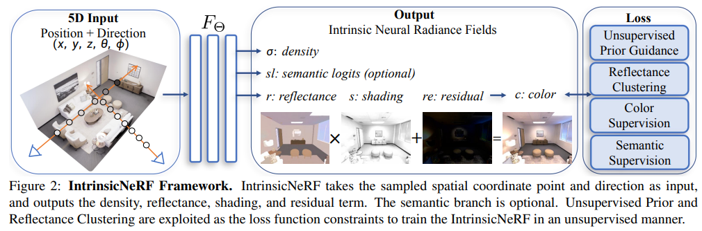

-----
[4] DreamBooth3D: Subject-Driven Text-to-3D Generation
- Category：Text-to-3D
- Project: https://dreambooth3d.github.io/
- Code: None
- Paper: https://arxiv.org/pdf/2303.13508.pdf
- Abstract:
> *We present DreamBooth3D, an approach to personalize text-to-3D generative models from as few as 3-6 casually captured images of a subject. Our approach combines recent advances in personalizing text-to-image models (DreamBooth) with text-to-3D generation (DreamFusion). We find that naively combining these methods fails to yield satisfactory subject-specific 3D assets due to personalized text-to-image models overfitting to the input viewpoints of the subject. We overcome this through a 3-stage optimization strategy where we jointly leverage the 3D consistency of neural radiance fields together with the personalization capability of text-to-image models. Our method can produce high-quality, subject-specific 3D assets with text-driven modifications such as novel poses, colors and attributes that are not seen in any of the input images of the subject.* 
- Figure: 
  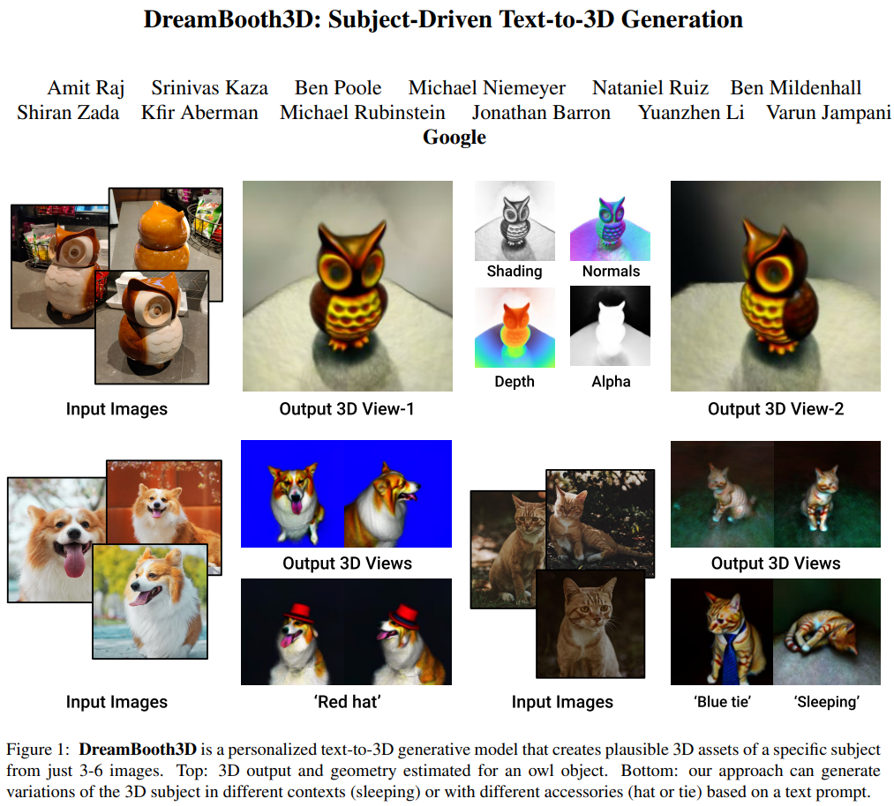
  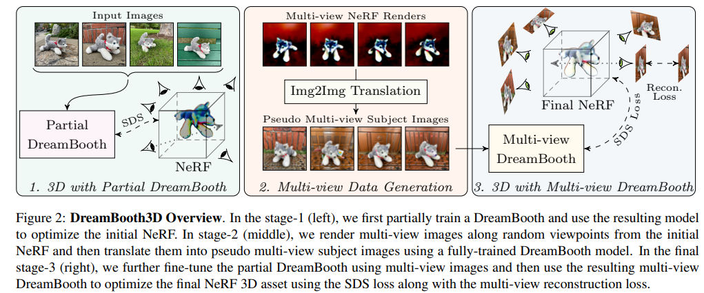

-----
[5] Tetra-NeRF: Representing Neural Radiance Fields Using Tetrahedra
- Category：Point-Based, Tetrahedra-Based
- Project: https://jkulhanek.com/tetra-nerf/
- Code: https://github.com/jkulhanek/tetra-nerf/
- Paper: https://arxiv.org/pdf/2304.09987.pdf
- Abstract:
> *Neural Radiance Fields (NeRFs) are a very recent and very popular approach for the problems of novel view synthesis and 3D reconstruction. A popular scene representation used by NeRFs is to combine a uniform, voxel-based subdivision of the scene with an MLP. Based on the observation that a (sparse) point cloud of the scene is often available, this paper proposes to use an adaptive representation based on tetrahedra obtained by the Delaunay triangulation instead of the uniform subdivision or point-based representations. We show that such a representation enables efficient training and leads to state-of-the-art results. Our approach elegantly combines concepts from 3D geometry processing, triangle-based rendering, and modern neural radiance fields. Compared to voxel-based representations, ours provides more detail around parts of the scene likely to be close to the surface. Compared to point-based representations, our approach achieves better performance.* 
- Figure: 
  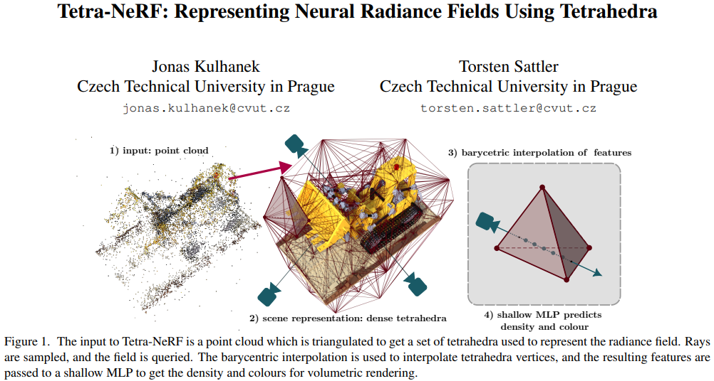

-----
[6] SparseNeRF: Distilling Depth Ranking for Few-shot Novel View Synthesis
- Category：depth-based, Few-shot
- Project: https://sparsenerf.github.io/
- Code: https://github.com/Wanggcong/SparseNeRF
- Paper: https://arxiv.org/pdf/2303.16196.pdf
- Abstract:
> *Neural Radiance Field (NeRF) significantly degrades when only a limited number of views are available. To complement the lack of 3D information, depth-based models, such as DSNeRF and MonoSDF, explicitly assume the availability of accurate depth maps of multiple views. They linearly scale the accurate depth maps as supervision to guide the predicted depth of few-shot NeRFs. However, accurate depth maps are difficult and expensive to capture due to wide-range depth distances in the wild.
> In this work, we present a new Sparse-view NeRF (SparseNeRF) framework that exploits depth priors from real-world inaccurate observations. The inaccurate depth observations are either from pre-trained depth models or coarse depth maps of consumer-level depth sensors. Since coarse depth maps are not strictly scaled to the ground-truth depth maps, we propose a simple yet effective constraint, a local depth ranking method, on NeRFs such that the expected depth ranking of the NeRF is consistent with that of the coarse depth maps in local patches. To preserve the spatial continuity of the estimated depth of NeRF, we further propose a spatial continuity constraint to encourage the consistency of the expected depth continuity of NeRF with coarse depth maps. Surprisingly, with simple depth ranking constraints, SparseNeRF outperforms all state-of-the-art few-shot NeRF methods (including depth-based models) on standard LLFF and DTU datasets. Moreover, we collect a new dataset NVS-RGBD that contains real-world depth maps from Azure Kinect, ZED 2, and iPhone 13 Pro. Extensive experiments on NVS-RGBD dataset also validate the superiority and generalizability of SparseNeRF. Project page is available at [this https URL](https://sparsenerf.github.io/).* 
- Figure: 
  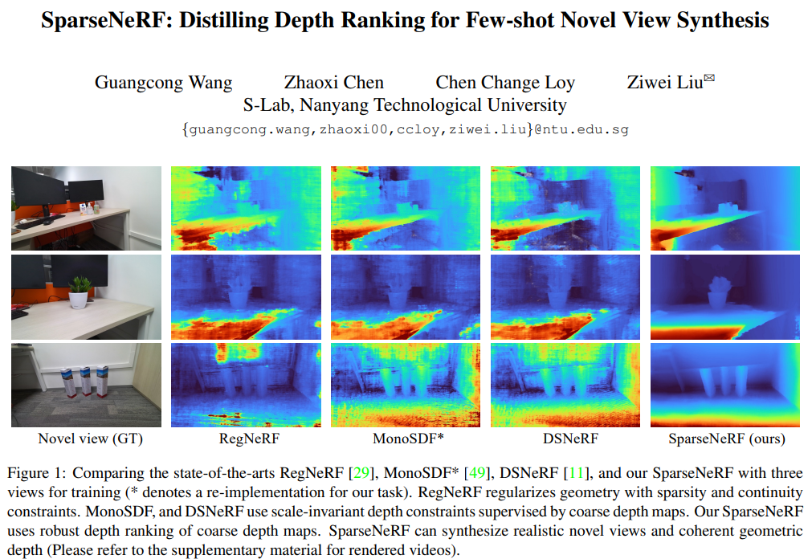

-----
[7] SHERF: Generalizable Human NeRF from a Single Image
- Category：3D Human
- Project: https://skhu101.github.io/SHERF/
- Code: https://github.com/skhu101/SHERF
- Paper: https://arxiv.org/pdf/2303.12791.pdf
- Abstract:
> *Existing Human NeRF methods for reconstructing 3D humans typically rely on multiple 2D images from multi-view cameras or monocular videos captured from fixed camera views. However, in real-world scenarios, human images are often captured from random camera angles, presenting challenges for high-quality 3D human reconstruction. In this paper, we propose SHERF, the first generalizable Human NeRF model for recovering animatable 3D humans from a single input image. SHERF extracts and encodes 3D human representations in canonical space, enabling rendering and animation from free views and poses. To achieve high-fidelity novel view and pose synthesis, the encoded 3D human representations should capture both global appearance and local fine-grained textures. To this end, we propose a bank of 3D-aware hierarchical features, including global, point-level, and pixel-aligned features, to facilitate informative encoding. Global features enhance the information extracted from the single input image and complement the information missing from the partial 2D observation. Point-level features provide strong clues of 3D human structure, while pixel-aligned features preserve more fine-grained details. To effectively integrate the 3D-aware hierarchical feature bank, we design a feature fusion transformer. Extensive experiments on THuman, RenderPeople, ZJU_MoCap, and HuMMan datasets demonstrate that SHERF achieves state-of-the-art performance, with better generalizability for novel view and pose synthesis.* 
- Figure: 
  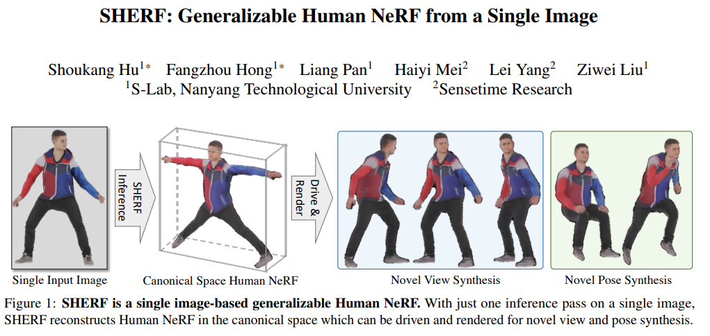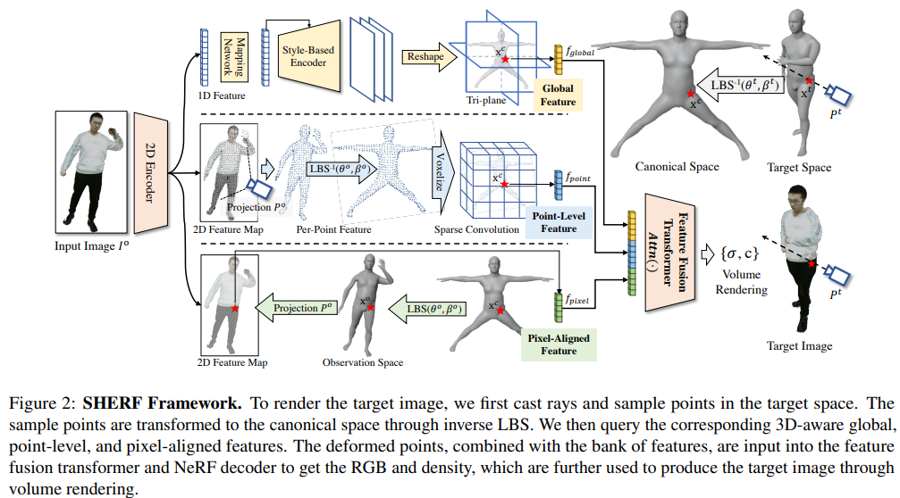

-----
[8] 
- Category：
- Project: 
- Code: 
- Paper: 
- Abstract:
> ** 
- Figure: 

-----
[9] 
- Category：
- Project: 
- Code: 
- Paper: 
- Abstract:
> ** 
- Figure: 

-----
[10] 
- Category：
- Project: 
- Code: 
- Paper: 
- Abstract:
> ** 
- Figure: 

-----
[11] 
- Category：
- Project: 
- Code: 
- Paper: 
- Abstract:
> ** 
- Figure: 

-----
[12] 
- Category：
- Project: 
- Code: 
- Paper: 
- Abstract:
> ** 
- Figure: 

-----
[13] 
- Category：
- Project: 
- Code: 
- Paper: 
- Abstract:
> ** 
- Figure: 

-----
[14] 
- Category：
- Project: 
- Code: 
- Paper: 
- Abstract:
> ** 
- Figure: 

-----
[15] 
- Category：
- Project: 
- Code: 
- Paper: 
- Abstract:
> ** 
- Figure: 

-----
[16] 
- Category：
- Project: 
- Code: 
- Paper: 
- Abstract:
> ** 
- Figure: 

-----
[] 
- Category：
- Project: 
- Code: 
- Paper: 
- Abstract:
> ** 
- Figure: 