# NeRFs-ICLR

> - 当前论文数：17
>
> - [NeRFs-ICLR2022： 2](#NeRFs-ICLR2022)
> - [NeRFs-ICLR2023： 15](#NeRFs-ICLR2023)

## NeRFs-ICLR2022

> - 收集来源：[ICLR 2022 Papers](https://iclr.cc/virtual/2022/papers.html?filter=titles)  search: “nerf” OR “radiance” OR “slam”

---

[1] StyleNeRF: A Style-based 3D-Aware Generator for High-resolution Image Synthesis

- Title：StyleNeRF：用于高分辨率图像合成的基于样式的3D感知生成器

- Category：NeRF-GAN

- Project: https://jiataogu.me/style_nerf/

- Code: https://github.com/facebookresearch/StyleNeRF

- Paper: https://arxiv.org/pdf/2110.08985.pdf

- Abstract：

  > *We propose StyleNeRF, a 3D-aware generative model for photo-realistic high-resolution image synthesis with high multi-view consistency, which can be trained on unstructured 2D images. Existing approaches either cannot synthesize high-resolution images with fine details or yield noticeable 3D-inconsistent artifacts. In addition, many of them lack control over style attributes and explicit 3D camera poses. StyleNeRF integrates the neural radiance field (NeRF) into a style-based generator to tackle the aforementioned challenges, i.e., improving rendering efficiency and 3D consistency for high-resolution image generation. We perform volume rendering only to produce a low-resolution feature map and progressively apply upsampling in 2D to address the first issue. To mitigate the inconsistencies caused by 2D upsampling, we propose multiple designs, including a better upsampler and a new regularization loss. With these designs, StyleNeRF can synthesize high-resolution images at interactive rates while preserving 3D consistency at high quality. StyleNeRF also enables control of camera poses and different levels of styles, which can generalize to unseen views. It also supports challenging tasks, including zoom-in and-out, style mixing, inversion, and semantic editing.*

- Figure：

---

[2] Unsupervised Discovery of Object Radiance Fields

- Title：物体辐射场的无监督发现

- Category：单视图

- Project: https://kovenyu.com/uorf/

- Code: https://github.com/KovenYu/uORF

- Paper: https://arxiv.org/pdf/2107.07905.pdf

- Abstract：

  > *We study the problem of inferring an object-centric scene representation from a single image, aiming to derive a representation that explains the image formation process, captures the scene's 3D nature, and is learned without supervision. Most existing methods on scene decomposition lack one or more of these characteristics, due to the fundamental challenge in integrating the complex 3D-to-2D image formation process into powerful inference schemes like deep networks. In this paper, we propose unsupervised discovery of Object Radiance Fields (uORF), integrating recent progresses in neural 3D scene representations and rendering with deep inference networks for unsupervised 3D scene decomposition. Trained on multi-view RGB images without annotations, uORF learns to decompose complex scenes with diverse, textured background from a single image. We show that uORF enables novel tasks, such as scene segmentation and editing in 3D, and it performs well on these tasks and on novel view synthesis on three datasets.*

- Figure：

---

[] 

- Title：

- Category：

- Project: 

- Code: 

- Paper: 

- Abstract：

  > **

- Figure：

## NeRFs-ICLR2023

---

[1] DreamFusion: Text-to-3D using 2D Diffusion

- Title：DreamFusion：使用2D扩散的文本到3D

- Category：Text-to-3D,扩散模型

- Project: https://dreamfusion3d.github.io/

- Code: none

- Paper: https://arxiv.org/pdf/2209.14988.pdf

- Abstract：

  > *Recent breakthroughs in text-to-image synthesis have been driven by diffusion models trained on billions of image-text pairs. Adapting this approach to 3D synthesis would require large-scale datasets of labeled 3D data and efficient architectures for denoising 3D data, neither of which currently exist. In this work, we circumvent these limitations by using a pretrained 2D text-to-image diffusion model to perform text-to-3D synthesis. We introduce a loss based on probability density distillation that enables the use of a 2D diffusion model as a prior for optimization of a parametric image generator. Using this loss in a DeepDream-like procedure, we optimize a randomly-initialized 3D model (a Neural Radiance Field, or NeRF) via gradient descent such that its 2D renderings from random angles achieve a low loss. The resulting 3D model of the given text can be viewed from any angle, relit by arbitrary illumination, or composited into any 3D environment. Our approach requires no 3D training data and no modifications to the image diffusion model, demonstrating the effectiveness of pretrained image diffusion models as priors.*

- Figure：

---

[2] [View Synthesis with Sculpted Neural Points](https://openreview.net/forum?id=0ypGZvm0er0)

- Title：使用雕刻的神经点进行视图合成

- Category：视图合成 点云渲染

- Project: none

- Code: https://github.com/princeton-vl/SNP

- Paper: https://openreview.net/pdf?id=0ypGZvm0er0

- Abstract：

  > *We address the task of view synthesis, generating novel views of a scene given a set of images as input. In many recent works such as NeRF (Mildenhall et al., 2020), the scene geometry is parameterized using neural implicit representations (i.e., MLPs). Implicit neural representations have achieved impressive visual quality but have drawbacks in computational efficiency. In this work, we propose a new approach that performs view synthesis using point clouds. It is the first point-based method that achieves better visual quality than NeRF while being 100x faster in rendering speed. Our approach builds on existing works on differentiable point-based rendering but introduces a novel technique we call "Sculpted Neural Points (SNP)", which significantly improves the robustness to errors and holes in the reconstructed point cloud. We further propose to use view-dependent point features based on spherical harmonics to capture non-Lambertian surfaces, and new designs in the point-based rendering pipeline that further boost the performance. Finally, we show that our system supports fine-grained scene editing. Code is available at [this https URL](https://github.com/princeton-vl/SNP).*

- Figure：

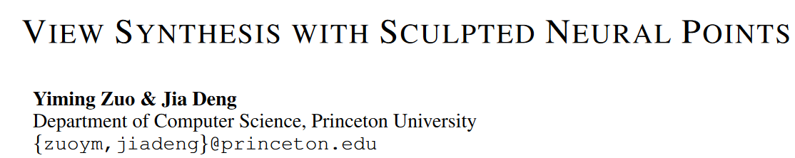

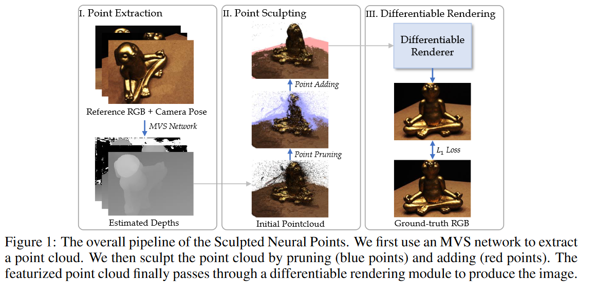

---

[3] [PAC-NeRF: Physics Augmented Continuum Neural Radiance Fields for Geometry-Agnostic System Identification ](https://openreview.net/forum?id=tVkrbkz42vc)

- Title：PAC-NeRF：用于几何不可知系统识别的物理增强连续体神经辐射场

- Category：流体 物理仿真

- Project: https://sites.google.com/view/PAC-NeRF

- Code: https://github.com/xuan-li/PAC-NeRF

- Paper: https://arxiv.org/pdf/2303.05512.pdf

- Abstract：

  > *Existing approaches to system identification (estimating the physical parameters of an object) from videos assume known object geometries. This precludes their applicability in a vast majority of scenes where object geometries are complex or unknown. In this work, we aim to identify parameters characterizing a physical system from a set of multi-view videos without any assumption on object geometry or topology. To this end, we propose "Physics Augmented Continuum Neural Radiance Fields" (PAC-NeRF), to estimate both the unknown geometry and physical parameters of highly dynamic objects from multi-view videos. We design PAC-NeRF to only ever produce physically plausible states by enforcing the neural radiance field to follow the conservation laws of continuum mechanics. For this, we design a hybrid Eulerian-Lagrangian representation of the neural radiance field, i.e., we use the Eulerian grid representation for NeRF density and color fields, while advecting the neural radiance fields via Lagrangian particles. This hybrid Eulerian-Lagrangian representation seamlessly blends efficient neural rendering with the material point method (MPM) for robust differentiable physics simulation. We validate the effectiveness of our proposed framework on geometry and physical parameter estimation over a vast range of materials, including elastic bodies, plasticine, sand, Newtonian and non-Newtonian fluids, and demonstrate significant performance gain on most tasks.*

- Figure：

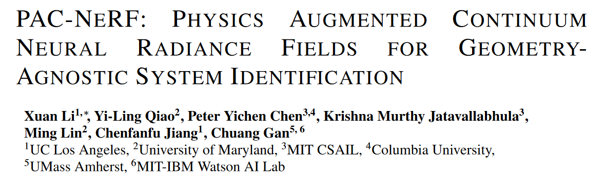

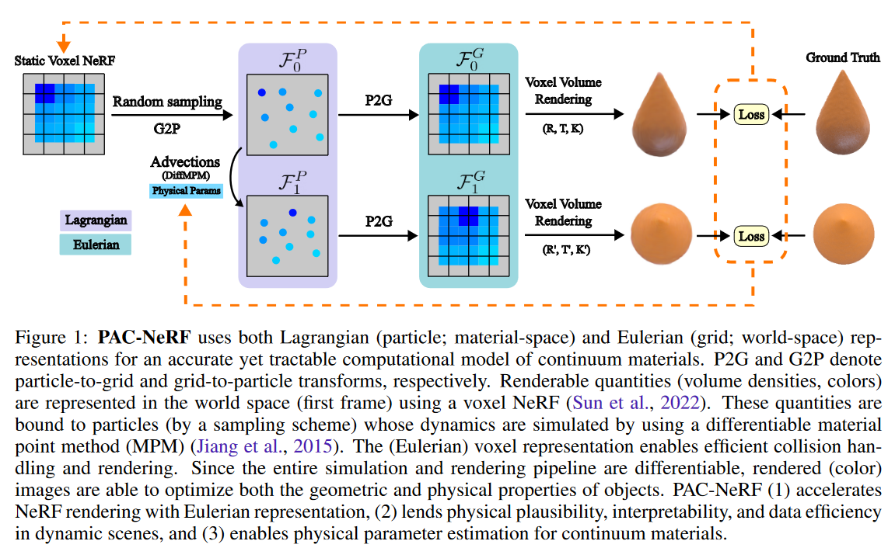

---

[4] [EVA3D: Compositional 3D Human Generation from 2D Image Collections ](https://openreview.net/forum?id=g7U9jD_2CUr)

- Title：EVA3D：来自 2D 图像集合的合成 3D 人类生成

- Category：人体建模  新姿态生成 NERF-GAN

- Project: https://hongfz16.github.io/projects/EVA3D.html

- Code: https://github.com/hongfz16/EVA3D

- Paper: https://arxiv.org/pdf/2210.04888.pdf

- Abstract：

  > *Inverse graphics aims to recover 3D models from 2D observations. Utilizing differentiable rendering, recent 3D-aware generative models have shown impressive results of rigid object generation using 2D images. However, it remains challenging to generate articulated objects, like human bodies, due to their complexity and diversity in poses and appearances. In this work, we propose, EVA3D, an unconditional 3D human generative model learned from 2D image collections only. EVA3D can sample 3D humans with detailed geometry and render high-quality images (up to 512x256) without bells and whistles (e.g. super resolution). At the core of EVA3D is a compositional human NeRF representation, which divides the human body into local parts. Each part is represented by an individual volume. This compositional representation enables 1) inherent human priors, 2) adaptive allocation of network parameters, 3) efficient training and rendering. Moreover, to accommodate for the characteristics of sparse 2D human image collections (e.g. imbalanced pose distribution), we propose a pose-guided sampling strategy for better GAN learning. Extensive experiments validate that EVA3D achieves state-of-the-art 3D human generation performance regarding both geometry and texture quality. Notably, EVA3D demonstrates great potential and scalability to "inverse-graphics" diverse human bodies with a clean framework.*

- Figure：

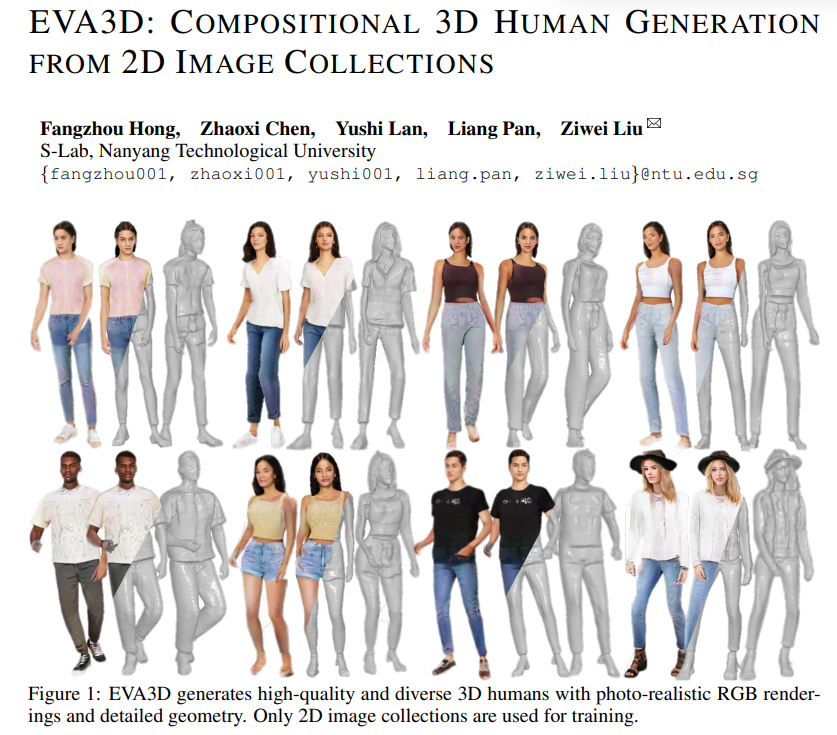

---

[5] [Is Attention All That NeRF Needs? ](https://openreview.net/forum?id=xE-LtsE-xx)

- Title：NeRF 需要的只是注意力吗？

- Category：NeRF-Transformer 视图合成

- Project: https://vita-group.github.io/GNT/

- Code: https://github.com/VITA-Group/GNT

- Paper: https://arxiv.org/pdf/2207.13298.pdf

- Abstract：

  > We present Generalizable NeRF Transformer (GNT), a transformer-based architecture that reconstructs Neural Radiance Fields (NeRFs) and learns to renders novel views on the fly from source views. While prior works on NeRFs optimize a scene representation by inverting a handcrafted rendering equation, GNT achieves neural representation and rendering that generalizes across scenes using transformers at two stages. (1) The view transformer leverages multi-view geometry as an inductive bias for attention-based scene representation, and predicts coordinate-aligned features by aggregating information from epipolar lines on the neighboring views. (2) The ray transformer renders novel views using attention to decode the features from the view transformer along the sampled points during ray marching. Our experiments demonstrate that when optimized on a single scene, GNT can successfully reconstruct NeRF without an explicit rendering formula due to the learned ray renderer. When trained on multiple scenes, GNT consistently achieves state-of-the-art performance when transferring to unseen scenes and outperform all other methods by ~10% on average. Our analysis of the learned attention maps to infer depth and occlusion indicate that attention enables learning a physically-grounded rendering. Our results show the promise of transformers as a universal modeling tool for graphics. Please refer to our project page for video results: [this https URL](https://vita-group.github.io/GNT/).**

- Figure：

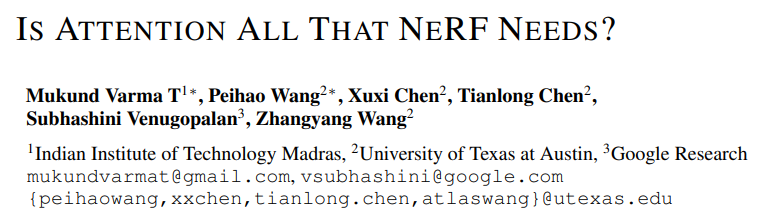

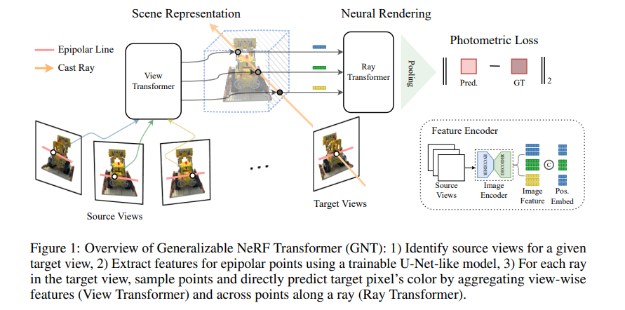

---

[6] [NeRF-SOS: Any-View Self-supervised Object Segmentation on Complex Scenes](https://openreview.net/forum?id=kfOtMqYJlUU)

- Title：NeRF-SOS：复杂场景上的任意视图自监督对象分割

- Category：对象分割

- Project: https://zhiwenfan.github.io/NeRF-SOS/

- Code: https://github.com/VITA-Group/NeRF-SOS

- Paper: https://arxiv.org/pdf/2209.08776.pdf

- Abstract：

  > *Neural volumetric representations have shown the potential that Multi-layer Perceptrons (MLPs) can be optimized with multi-view calibrated images to represent scene geometry and appearance, without explicit 3D supervision. Object segmentation can enrich many downstream applications based on the learned radiance field. However, introducing hand-crafted segmentation to define regions of interest in a complex real-world scene is non-trivial and expensive as it acquires per view annotation. This paper carries out the exploration of self-supervised learning for object segmentation using NeRF for complex real-world scenes. Our framework, called NeRF with Self-supervised Object Segmentation NeRF-SOS, couples object segmentation and neural radiance field to segment objects in any view within a scene. By proposing a novel collaborative contrastive loss in both appearance and geometry levels, NeRF-SOS encourages NeRF models to distill compact geometry-aware segmentation clusters from their density fields and the self-supervised pre-trained 2D visual features. The self-supervised object segmentation framework can be applied to various NeRF models that both lead to photo-realistic rendering results and convincing segmentation maps for both indoor and outdoor scenarios. Extensive results on the LLFF, Tank & Temple, and BlendedMVS datasets validate the effectiveness of NeRF-SOS. It consistently surpasses other 2D-based self-supervised baselines and predicts finer semantics masks than existing supervised counterparts. Please refer to the video on our project page for more details:[this https URL](https://zhiwenfan.github.io/NeRF-SOS).*

- Figure：

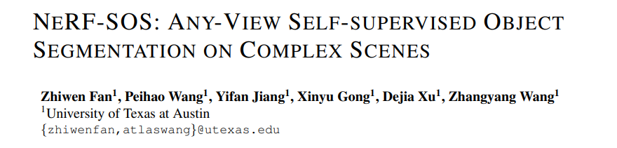

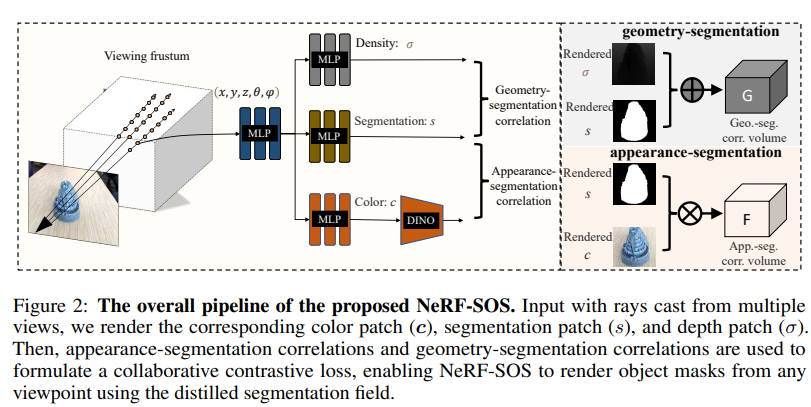

---

[7] [Switch-NeRF: Learning Scene Decomposition with Mixture of Experts for Large-scale Neural Radiance Fields](https://openreview.net/forum?id=PQ2zoIZqvm)

- Title：Switch-NeRF：混合专家学习场景分解，用于大规模神经辐射场

- Category：航拍街景 大规模街景

- Project: https://mizhenxing.github.io/switchnerf/

- Code: https://github.com/MiZhenxing/Switch-NeRF

- Paper: https://openreview.net/pdf?id=PQ2zoIZqvm

- Abstract：

  > *The Neural Radiance Fields (NeRF) have been recently applied to reconstruct building-scale and even city-scale scenes. To model a large-scale scene efficiently, a dominant strategy is to employ a divide-and-conquer paradigm via performing scene decomposition, which decomposes a complex scene into parts that are further processed by different sub-networks. Existing large-scale NeRFs mainly use heuristic hand-crafted scene decomposition, with regular 3D-distance-based or physical-street-block-based schemes. Although achieving promising results, the hand-crafted schemes limit the capabilities of NeRF in large-scale scene modeling in several aspects. Manually designing a universal scene decomposition rule for different complex scenes is challenging, leading to adaptation issues for different scenarios. The decomposition procedure is not learnable, hindering the network from jointly optimizing the scene decomposition and the radiance fields in an end-to-end manner.  The different sub-networks are typically optimized independently, and thus hand-crafted rules are required to composite them to achieve a better consistency.  To tackle these issues, we propose Switch-NeRF, a novel end-to-end large-scale NeRF with learning-based scene decomposition. We design a gating network to dispatch 3D points to different NeRF sub-networks. The gating network can be optimized together with the NeRF sub-networks for different scene partitions, by a design with the Sparsely Gated Mixture of Experts (MoE). The outputs from different sub-networks can also be fused in a learnable way in the unified framework to effectively guarantee the consistency of the whole scene. Furthermore, the proposed MoE-based Switch-NeRF model is carefully implemented and optimized to achieve both high-fidelity scene reconstruction and efficient computation. Our method establishes clear state-of-the-art performances on several large-scale datasets. To the best of our knowledge, we are the first to propose an applicable end-to-end sparse NeRF network  with learning-based decomposition for large-scale scenes. Codes are released at https://github.com/MiZhenxing/Switch-NeRF.*

- Figure：

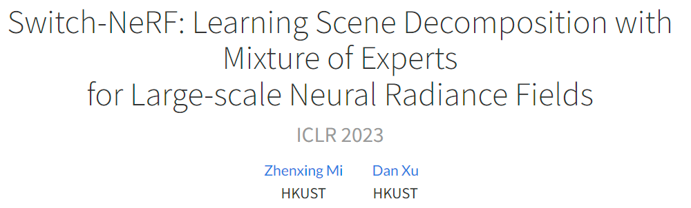

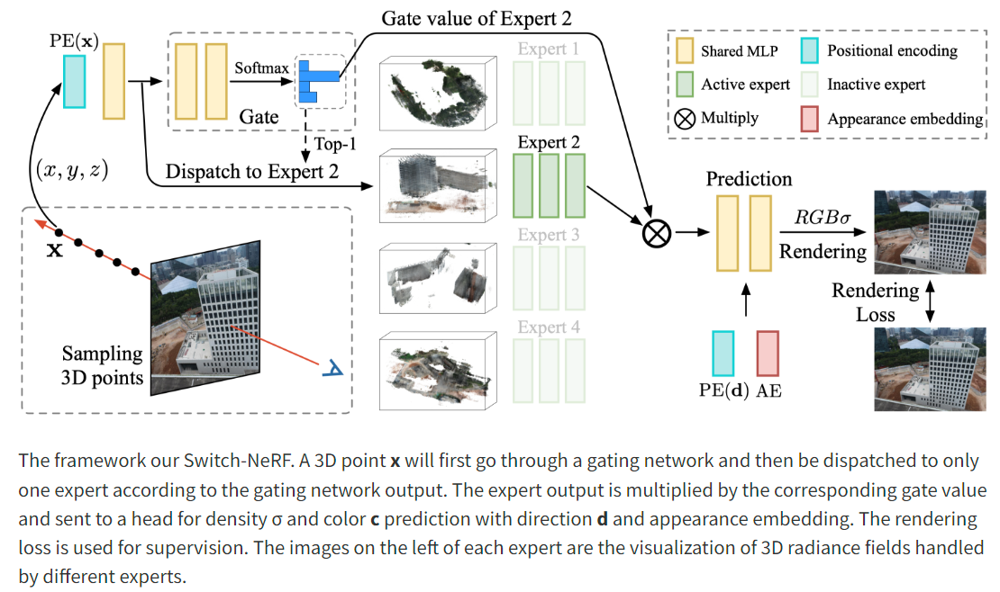

---

[8] [S-NeRF: Neural Radiance Fields for Street Views](https://openreview.net/forum?id=gx2yJS-ENqI)

- Title：S-NeRF：街景的神经辐射场

- Category：自动驾驶街景

- Project: https://ziyang-xie.github.io/s-nerf/

- Code: soon

- Paper: https://arxiv.org/pdf/2303.00749.pdf

- Abstract：

  > *Neural Radiance Fields (NeRFs) aim to synthesize novel views of objects and scenes, given the object-centric camera views with large overlaps. However, we conjugate that this paradigm does not fit the nature of the street views that are collected by many self-driving cars from the large-scale unbounded scenes. Also, the onboard cameras perceive scenes without much overlapping. Thus, existing NeRFs often produce blurs, 'floaters' and other artifacts on street-view synthesis. In this paper, we propose a new street-view NeRF (S-NeRF) that considers novel view synthesis of both the large-scale background scenes and the foreground moving vehicles jointly. Specifically, we improve the scene parameterization function and the camera poses for learning better neural representations from street views. We also use the the noisy and sparse LiDAR points to boost the training and learn a robust geometry and reprojection based confidence to address the depth outliers. Moreover, we extend our S-NeRF for reconstructing moving vehicles that is impracticable for conventional NeRFs. Thorough experiments on the large-scale driving datasets (e.g., nuScenes and Waymo) demonstrate that our method beats the state-of-the-art rivals by reducing 7% to 40% of the mean-squared error in the street-view synthesis and a 45% PSNR gain for the moving vehicles rendering.*

- Figure：

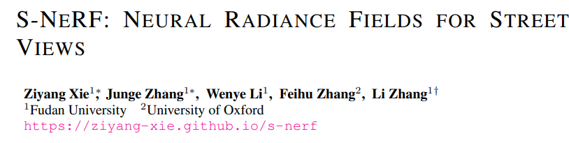

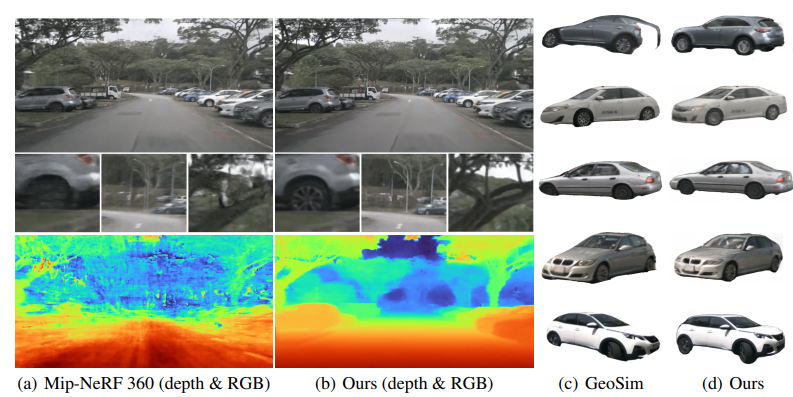

---

[9] [DM-NeRF: 3D Scene Geometry Decomposition and Manipulation from 2D Images ](https://openreview.net/forum?id=C_PRLz8bEJx)

- Title：DM-NeRF：2D 图像的 3D 场景几何分解和操作

- Category：对象操作,几何编辑

- Project: none

- Code: https://github.com/vLAR-group/DM-NeRF

- Paper: https://arxiv.org/pdf/2208.07227.pdf

- Abstract：

  > *In this paper, we study the problem of 3D scene geometry decomposition and manipulation from 2D views. By leveraging the recent implicit neural representation techniques, particularly the appealing neural radiance fields, we introduce an object field component to learn unique codes for all individual objects in 3D space only from 2D supervision. The key to this component is a series of carefully designed loss functions to enable every 3D point, especially in non-occupied space, to be effectively optimized even without 3D labels. In addition, we introduce an inverse query algorithm to freely manipulate any specified 3D object shape in the learned scene representation. Notably, our manipulation algorithm can explicitly tackle key issues such as object collisions and visual occlusions. Our method, called DM-NeRF, is among the first to simultaneously reconstruct, decompose, manipulate and render complex 3D scenes in a single pipeline. Extensive experiments on three datasets clearly show that our method can accurately decompose all 3D objects from 2D views, allowing any interested object to be freely manipulated in 3D space such as translation, rotation, size adjustment, and deformation.*

- Figure：

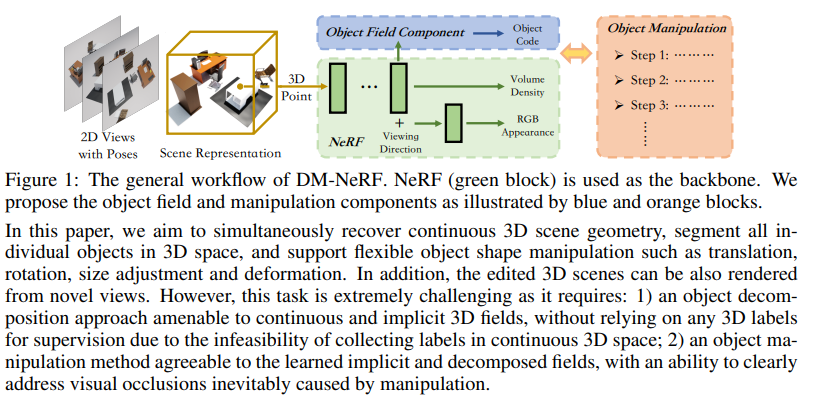

---

[10] [WiNeRT: Towards Neural Ray Tracing for Wireless Channel Modelling and Differentiable Simulations ](https://openreview.net/forum?id=tPKKXeW33YU)

- Title：WiNeRT：面向无线信道建模和可微分模拟的神经光线追踪

- Category：模拟无线电磁传播效应  ？？？

- Project: none

- Code: none

- Paper: https://openreview.net/pdf?id=tPKKXeW33YU

- Abstract：

  > *In this paper, we work towards a neural surrogate to model wireless electro-magnetic propagation effects in indoor environments. Such neural surrogates provide a fast, differentiable, and continuous representation of the environment and enables end-to-end optimization for downstream tasks (e.g., network planning). Specifically, the goal of the paper is to render the wireless signal (e.g., time-of-flights, power of each path) in an environment as a function of the sensor's spatial configuration (e.g., placement of transmit and receive antennas). NeRF-based approaches have shown promising results in the visual setting (RGB image signal, with a camera sensor), where the key idea is to algorithmically evaluate the 'global' signal (e.g., using volumetric rendering) by breaking it down in a sequence of 'local' evaluations (e.g., using co-ordinate neural networks). In a similar spirit, we model the time-angle channel impulse response (the global wireless signal) as a superposition of multiple paths. The wireless characteristics (e.g., power) of each path is a result of multiple evaluations of a neural network that learns implicit ray-surface interaction properties. We evaluate our approach in multiple indoor scenarios and demonstrate that our model achieves strong performance (e.g., <0.33ns error in time-of-flight predictions). Furthermore, we demonstrate that our neural surrogate whitens the `black-box' wireless simulators, and thus enables inverse rendering applications (e.g., user localization).*

- Figure：

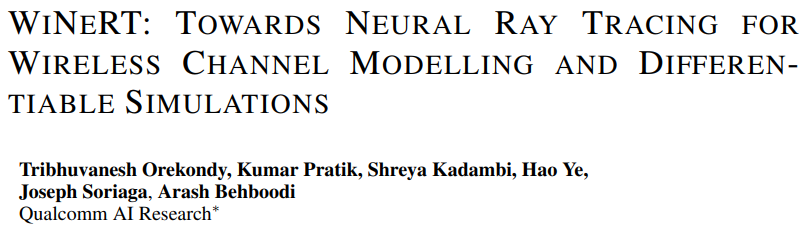

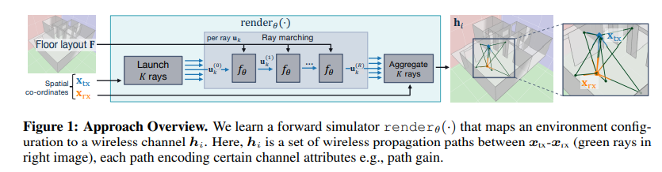

---

[11] [GeneFace: Generalized and High-Fidelity Audio-Driven 3D Talking Face Synthesis ](https://openreview.net/forum?id=YfwMIDhPccD)

- Title：GeneFace：通用和高保真音频驱动的 3D 说话人脸合成

- Category：音频驱动,人像建模

- Project: https://geneface.github.io/

- Code: https://github.com/yerfor/GeneFace

- Paper: https://arxiv.org/pdf/2301.13430.pdf

- Abstract：

  > *Generating photo-realistic video portrait with arbitrary speech audio is a crucial problem in film-making and virtual reality. Recently, several works explore the usage of neural radiance field in this task to improve 3D realness and image fidelity. However, the generalizability of previous NeRF-based methods to out-of-domain audio is limited by the small scale of training data. In this work, we propose GeneFace, a generalized and high-fidelity NeRF-based talking face generation method, which can generate natural results corresponding to various out-of-domain audio. Specifically, we learn a variaitional motion generator on a large lip-reading corpus, and introduce a domain adaptative post-net to calibrate the result. Moreover, we learn a NeRF-based renderer conditioned on the predicted facial motion. A head-aware torso-NeRF is proposed to eliminate the head-torso separation problem. Extensive experiments show that our method achieves more generalized and high-fidelity talking face generation compared to previous methods.*

- Figure：

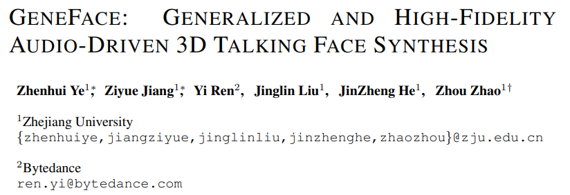

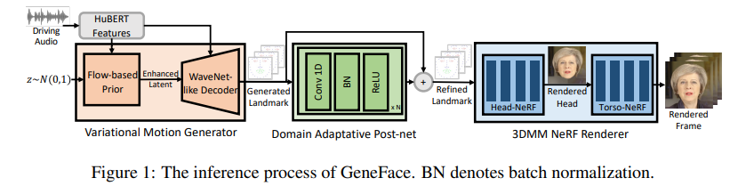

---

[12] [Neural Image-based Avatars: Generalizable Radiance Fields for Human Avatar Modeling ](https://openreview.net/forum?id=-ng-FXFlzgK)

- Title：基于神经图像的化身：用于人类化身建模的通用辐射场

- Category：人体建模

- Project: https://youngjoongunc.github.io/nia/

- Code: https://github.com/YoungJoongUNC/Neural_Image_Based_Avatars

- Paper: https://arxiv.org/pdf/2304.04897.pdf

- Abstract：

  > *We present a method that enables synthesizing novel views and novel poses of arbitrary human performers from sparse multi-view images. A key ingredient of our method is a hybrid appearance blending module that combines the advantages of the implicit body NeRF representation and image-based rendering. Existing generalizable human NeRF methods that are conditioned on the body model have shown robustness against the geometric variation of arbitrary human performers. Yet they often exhibit blurry results when generalized onto unseen identities. Meanwhile, image-based rendering shows high-quality results when sufficient observations are available, whereas it suffers artifacts in sparse-view settings. We propose Neural Image-based Avatars (NIA) that exploits the best of those two methods: to maintain robustness under new articulations and self-occlusions while directly leveraging the available (sparse) source view colors to preserve appearance details of new subject identities. Our hybrid design outperforms recent methods on both in-domain identity generalization as well as challenging cross-dataset generalization settings. Also, in terms of the pose generalization, our method outperforms even the per-subject optimized animatable NeRF methods. The video results are available at [this https URL](https://youngjoongunc.github.io/nia)*

- Figure：

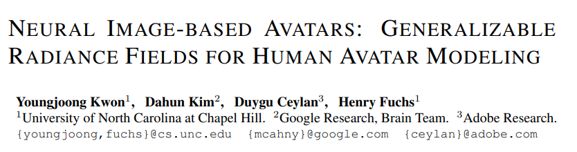

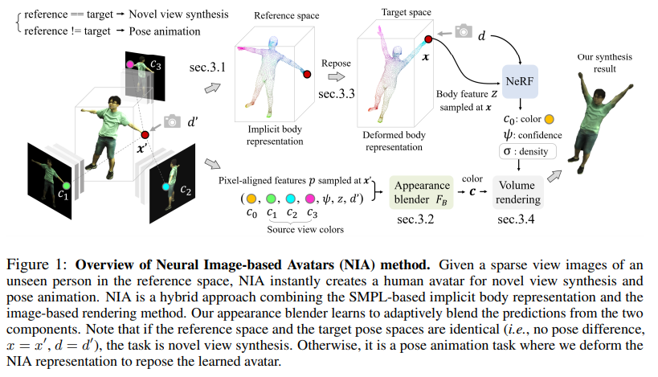

---

[13] [General Neural Gauge Fields ](https://openreview.net/forum?id=XWkWK2UagFR)

- Title：一般神经量场

- Category：坐标映射,规范变换

- Project: none

- Code: none

- Paper: https://openreview.net/pdf?id=XWkWK2UagFR

- Abstract：

  > *The recent advance of neural fields, such as neural radiance fields, has significantly pushed the boundary of scene representation learning. Aiming to boost the computation efficiency and rendering quality of 3D scenes, a popular line of research maps the 3D coordinate system to another measuring system, e.g., 2D manifolds and hash tables, for modeling neural fields. The conversion of coordinate systems can be typically dubbed as \emph{gauge transformation}, which is usually a pre-defined mapping function, e.g., orthogonal projection or spatial hash function. This begs a question: can we directly learn a desired gauge transformation along with the neural field in an end-to-end manner? In this work, we extend this problem to a general paradigm with a taxonomy of discrete and continuous cases, and develop an end-to-end learning framework to jointly optimize the gauge transformation and neural fields. To counter the problem that the learning of gauge transformations can collapse easily, we derive a general regularization mechanism from the principle of information conservation during the gauge transformation. To circumvent the high computation cost in gauge learning with regularization, we directly derive an information-invariant gauge transformation which allows to preserve scene information inherently and yield superior performance.*

- Figure：

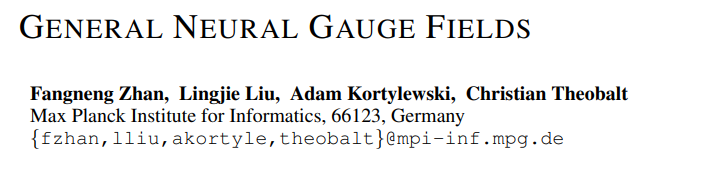

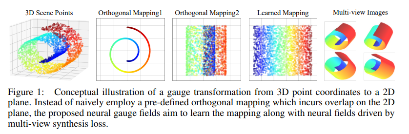

---

[14] [Neural Groundplans: Persistent Neural Scene Representations from a Single Image ](https://openreview.net/forum?id=Pza24zf9FpS)

- Title：神经平面图：来自单个图像的持久神经场景表示

- Category：场景编辑,动静分离

- Project: https://prafullsharma.net/neural_groundplans/

- Code: soon

- Paper: https://arxiv.org/pdf/2207.11232.pdf

- Abstract：

  > *We present a method to map 2D image observations of a scene to a persistent 3D scene representation, enabling novel view synthesis and disentangled representation of the movable and immovable components of the scene. Motivated by the bird's-eye-view (BEV) representation commonly used in vision and robotics, we propose conditional neural groundplans, ground-aligned 2D feature grids, as persistent and memory-efficient scene representations. Our method is trained self-supervised from unlabeled multi-view observations using differentiable rendering, and learns to complete geometry and appearance of occluded regions. In addition, we show that we can leverage multi-view videos at training time to learn to separately reconstruct static and movable components of the scene from a single image at test time. The ability to separately reconstruct movable objects enables a variety of downstream tasks using simple heuristics, such as extraction of object-centric 3D representations, novel view synthesis, instance-level segmentation, 3D bounding box prediction, and scene editing. This highlights the value of neural groundplans as a backbone for efficient 3D scene understanding models.*

- Figure：

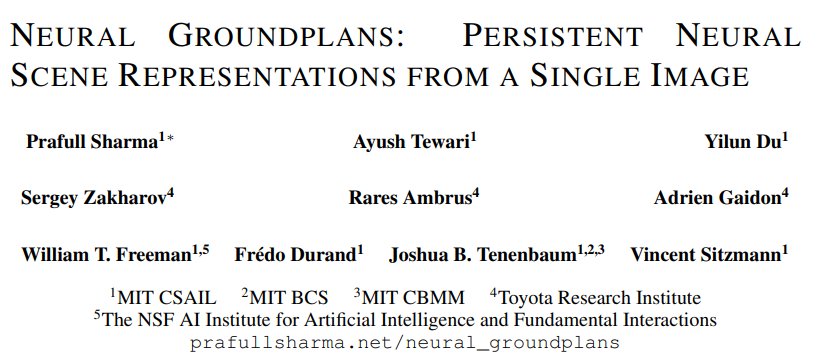

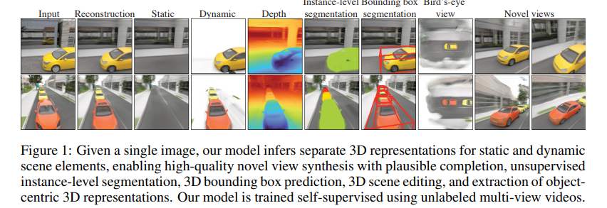

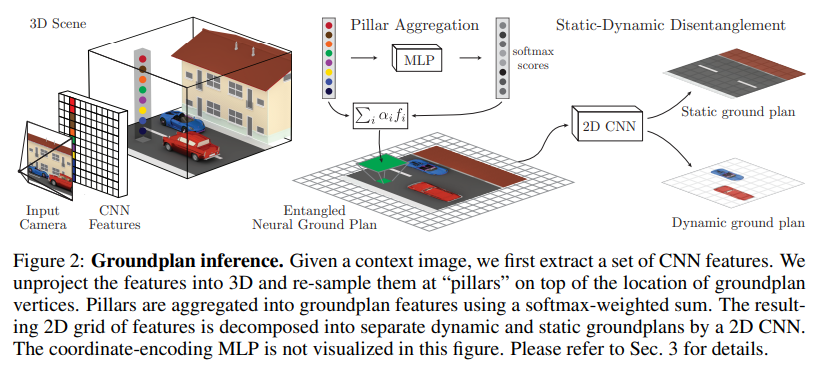

---

[15] [Neural Radiance Field Codebooks ](https://openreview.net/forum?id=mX56bKDybu5)

- Title：神经辐射场密码本

- Category：语义分割

- Project: none

- Code: none

- Paper: https://arxiv.org/pdf/2301.04101.pdf

- Abstract：

  > *Compositional representations of the world are a promising step towards enabling high-level scene understanding and efficient transfer to downstream tasks. Learning such representations for complex scenes and tasks remains an open challenge. Towards this goal, we introduce Neural Radiance Field Codebooks (NRC), a scalable method for learning object-centric representations through novel view reconstruction. NRC learns to reconstruct scenes from novel views using a dictionary of object codes which are decoded through a volumetric renderer. This enables the discovery of reoccurring visual and geometric patterns across scenes which are transferable to downstream tasks. We show that NRC representations transfer well to object navigation in THOR, outperforming 2D and 3D representation learning methods by 3.1% success rate. We demonstrate that our approach is able to perform unsupervised segmentation for more complex synthetic (THOR) and real scenes (NYU Depth) better than prior methods (29% relative improvement). Finally, we show that NRC improves on the task of depth ordering by 5.5% accuracy in THOR.*

- Figure：

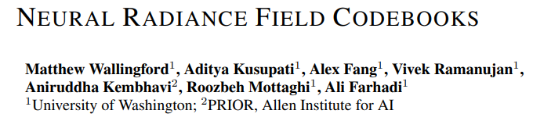

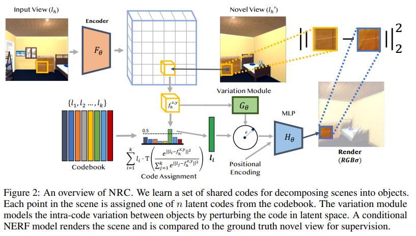

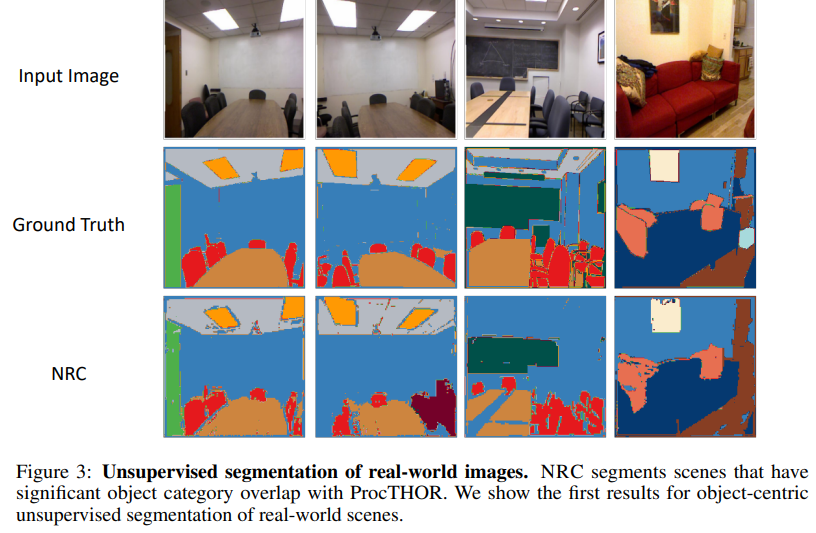

---

[] 

- Title：

- Category：

- Project: 

- Code: 

- Paper: 

- Abstract：

  > **

- Figure：

---

[] 

- Title：

- Category：

- Project: 

- Code: 

- Paper: 

- Abstract：

  > **

- Figure：

---

[] 

- Title：

- Category：

- Project: 

- Code: 

- Paper: 

- Abstract：

  > **

- Figure：

---

[] 

- Title：

- Category：

- Project: 

- Code: 

- Paper: 

- Abstract：

  > **

- Figure：

---

[] 

- Title：

- Category：

- Project: 

- Code: 

- Paper: 

- Abstract：

  > **

- Figure：

---

[] 

- Title：

- Category：

- Project: 

- Code: 

- Paper: 

- Abstract：

  > **

- Figure：

---

[] 

- Title：

- Category：

- Project: 

- Code: 

- Paper: 

- Abstract：

  > **

- Figure：

