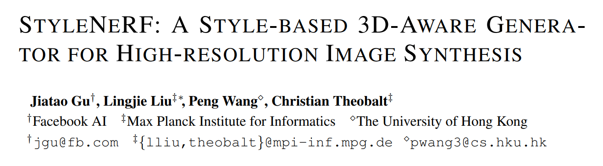
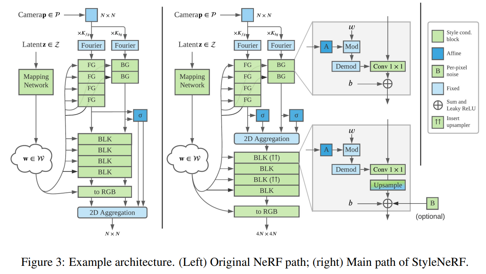
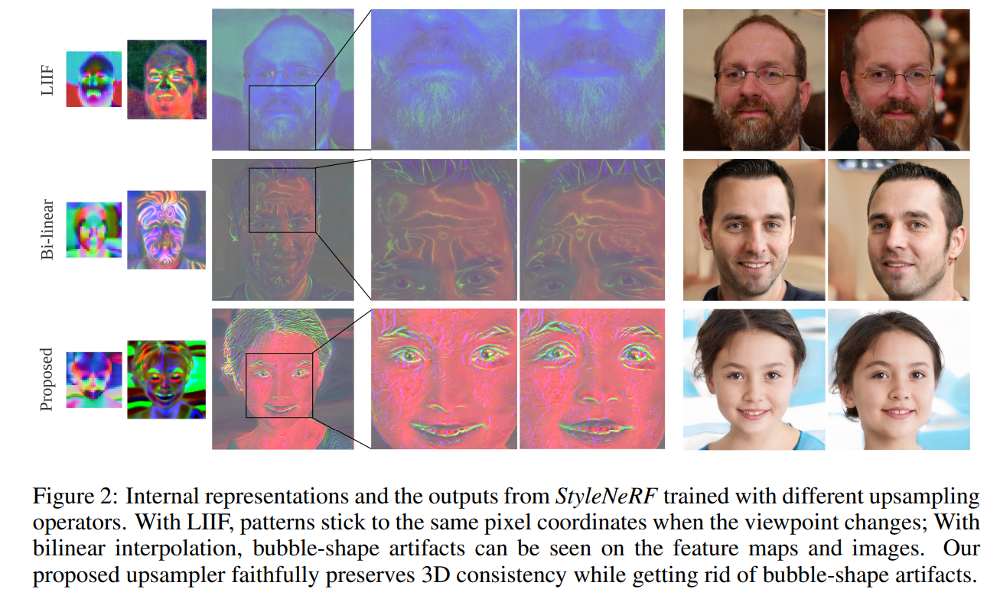
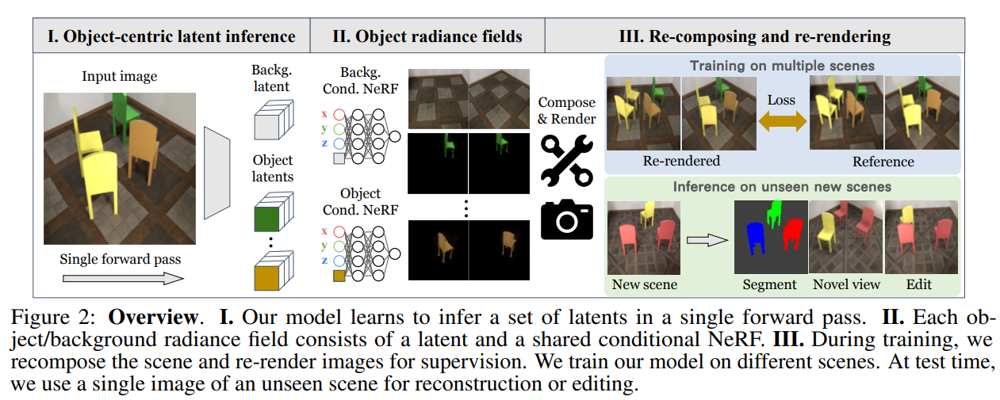
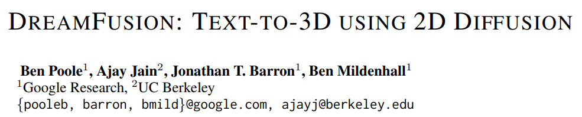
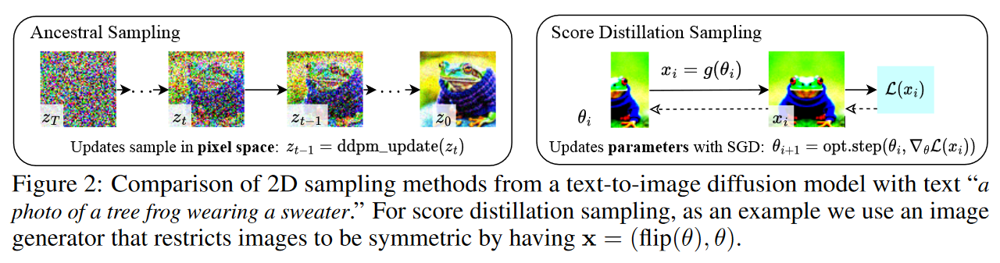

# NeRFs-ICLR

> - 当前论文数：2
>
> - [NeRFs-ICLR2022](#NeRFs-ICLR2022)
> - [NeRFs-ICLR2023](#NeRFs-ICLR2023)

## NeRFs-ICLR2022

> - 收集来源：[ICLR 2022 Papers](https://iclr.cc/virtual/2022/papers.html?filter=titles)  search: “nerf” OR “radiance” OR “slam”

---

[1] StyleNeRF: A Style-based 3D-Aware Generator for High-resolution Image Synthesis

- Title：StyleNeRF：用于高分辨率图像合成的基于样式的3D感知生成器

- Category：NeRF-GAN

- Project: https://jiataogu.me/style_nerf/

- Code: https://github.com/facebookresearch/StyleNeRF

- Paper: https://arxiv.org/pdf/2110.08985.pdf

- Abstract：

  > *We propose StyleNeRF, a 3D-aware generative model for photo-realistic high-resolution image synthesis with high multi-view consistency, which can be trained on unstructured 2D images. Existing approaches either cannot synthesize high-resolution images with fine details or yield noticeable 3D-inconsistent artifacts. In addition, many of them lack control over style attributes and explicit 3D camera poses. StyleNeRF integrates the neural radiance field (NeRF) into a style-based generator to tackle the aforementioned challenges, i.e., improving rendering efficiency and 3D consistency for high-resolution image generation. We perform volume rendering only to produce a low-resolution feature map and progressively apply upsampling in 2D to address the first issue. To mitigate the inconsistencies caused by 2D upsampling, we propose multiple designs, including a better upsampler and a new regularization loss. With these designs, StyleNeRF can synthesize high-resolution images at interactive rates while preserving 3D consistency at high quality. StyleNeRF also enables control of camera poses and different levels of styles, which can generalize to unseen views. It also supports challenging tasks, including zoom-in and-out, style mixing, inversion, and semantic editing.*

- Figure：

---

[2] Unsupervised Discovery of Object Radiance Fields

- Title：物体辐射场的无监督发现

- Category：单视图

- Project: https://kovenyu.com/uorf/

- Code: https://github.com/KovenYu/uORF

- Paper: https://arxiv.org/pdf/2107.07905.pdf

- Abstract：

  > *We study the problem of inferring an object-centric scene representation from a single image, aiming to derive a representation that explains the image formation process, captures the scene's 3D nature, and is learned without supervision. Most existing methods on scene decomposition lack one or more of these characteristics, due to the fundamental challenge in integrating the complex 3D-to-2D image formation process into powerful inference schemes like deep networks. In this paper, we propose unsupervised discovery of Object Radiance Fields (uORF), integrating recent progresses in neural 3D scene representations and rendering with deep inference networks for unsupervised 3D scene decomposition. Trained on multi-view RGB images without annotations, uORF learns to decompose complex scenes with diverse, textured background from a single image. We show that uORF enables novel tasks, such as scene segmentation and editing in 3D, and it performs well on these tasks and on novel view synthesis on three datasets.*

- Figure：

---

[] 

- Title：

- Category：

- Project: 

- Code: 

- Paper: 

- Abstract：

  > **

- Figure：

## NeRFs-ICLR2023

---

[1] DreamFusion: Text-to-3D using 2D Diffusion

- Title：DreamFusion：使用2D扩散的文本到3D

- Category：Text-to-3D,扩散模型

- Project: https://dreamfusion3d.github.io/

- Code: none

- Paper: https://arxiv.org/pdf/2209.14988.pdf

- Abstract：

  > *Recent breakthroughs in text-to-image synthesis have been driven by diffusion models trained on billions of image-text pairs. Adapting this approach to 3D synthesis would require large-scale datasets of labeled 3D data and efficient architectures for denoising 3D data, neither of which currently exist. In this work, we circumvent these limitations by using a pretrained 2D text-to-image diffusion model to perform text-to-3D synthesis. We introduce a loss based on probability density distillation that enables the use of a 2D diffusion model as a prior for optimization of a parametric image generator. Using this loss in a DeepDream-like procedure, we optimize a randomly-initialized 3D model (a Neural Radiance Field, or NeRF) via gradient descent such that its 2D renderings from random angles achieve a low loss. The resulting 3D model of the given text can be viewed from any angle, relit by arbitrary illumination, or composited into any 3D environment. Our approach requires no 3D training data and no modifications to the image diffusion model, demonstrating the effectiveness of pretrained image diffusion models as priors.*

- Figure：

---

[] 

- Title：

- Category：

- Project: 

- Code: 

- Paper: 

- Abstract：

  > **

- Figure：

---

[] 

- Title：

- Category：

- Project: 

- Code: 

- Paper: 

- Abstract：

  > **

- Figure：

---

[] 

- Title：

- Category：

- Project: 

- Code: 

- Paper: 

- Abstract：

  > **

- Figure：

---

[] 

- Title：

- Category：

- Project: 

- Code: 

- Paper: 

- Abstract：

  > **

- Figure：

---

[] 

- Title：

- Category：

- Project: 

- Code: 

- Paper: 

- Abstract：

  > **

- Figure：

