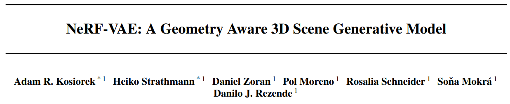
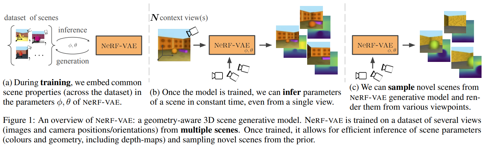
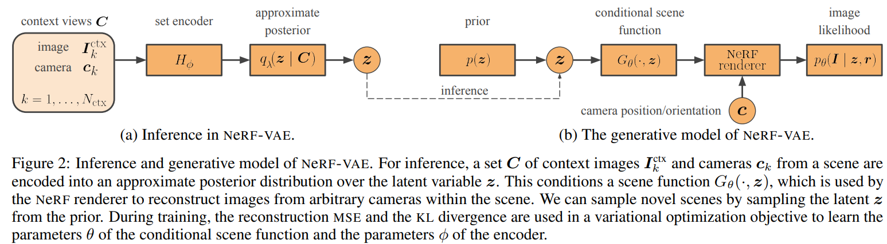
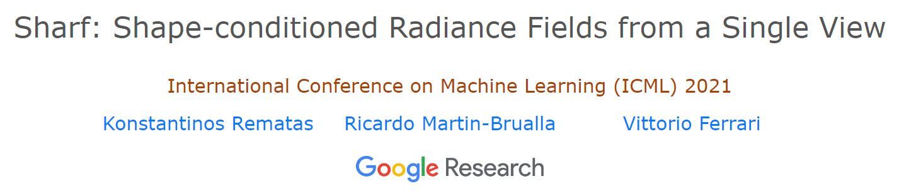
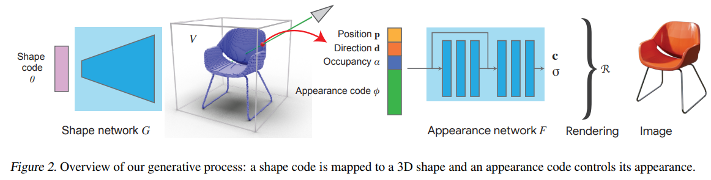
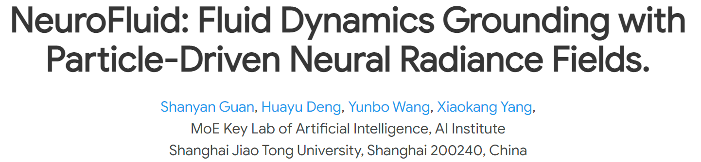
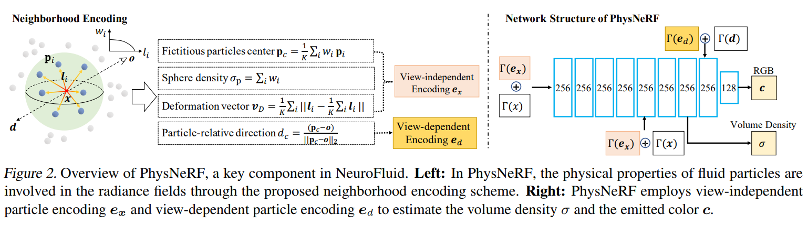

# NeRFs-ICML

> 当前论文数： 3

## NeRFs-ICML2021

> - 收集来源：[ICML 2021](https://dblp.uni-trier.de/db/conf/icml/icml2021.html)   **refine by search term**: “nerf” OR “radiance” OR “slam”

---

[1] NeRF-VAE: A Geometry Aware 3D Scene Generative Model

- Title：NeRF-VAE：几何感知3D场景生成模型

- Category：生成式模型,稀疏视图

- Project: https://www.deepmind.com/publications/nerf-vae-a-geometry-aware-3d-scene-generative-model

- Code: none, [DeepMind]

- Paper: https://arxiv.org/pdf/2104.00587

- Abstract：

  > *We propose NeRF-VAE, a 3D scene generative model that incorporates geometric structure via NeRF and differentiable volume rendering. In contrast to NeRF, our model takes into account shared structure across scenes, and is able to infer the structure of a novel scene -- without the need to re-train -- using amortized inference. NeRF-VAE's explicit 3D rendering process further contrasts previous generative models with convolution-based rendering which lacks geometric structure. Our model is a VAE that learns a distribution over radiance fields by conditioning them on a latent scene representation. We show that, once trained, NeRF-VAE is able to infer and render geometrically-consistent scenes from previously unseen 3D environments using very few input images. We further demonstrate that NeRF-VAE generalizes well to out-of-distribution cameras, while convolutional models do not. Finally, we introduce and study an attention-based conditioning mechanism of NeRF-VAE's decoder, which improves model performance.*

- Figure：

---

[2] ShaRF: Shape-conditioned Radiance Fields from a Single View

- Title：ShaRF：单一视图的形状条件辐射场

- Category：单视图

- Project: http://www.krematas.com/sharf/index.html

- Code: https://github.com/tensorflow/graphics/tree/master/tensorflow_graphics/projects/radiance_fields

- Paper: https://arxiv.org/pdf/2102.08860.pdf

- Abstract：

  > *We present a method for estimating neural scenes representations of objects given only a single image. The core of our method is the estimation of a geometric scaffold for the object and its use as a guide for the reconstruction of the underlying radiance field. Our formulation is based on a generative process that first maps a latent code to a voxelized shape, and then renders it to an image, with the object appearance being controlled by a second latent code. During inference, we optimize both the latent codes and the networks to fit a test image of a new object. The explicit disentanglement of shape and appearance allows our model to be fine-tuned given a single image. We can then render new views in a geometrically consistent manner and they represent faithfully the input object. Additionally, our method is able to generalize to images outside of the training domain (more realistic renderings and even real photographs). Finally, the inferred geometric scaffold is itself an accurate estimate of the object's 3D shape. We demonstrate in several experiments the effectiveness of our approach in both synthetic and real images.*

- Figure：

## NeRFs-ICML2022

> - 收集来源：[ICML 2022](https://dblp.uni-trier.de/db/conf/icml/icml2022.html)   **refine by search term**: “nerf” OR “radiance” OR “slam”

---

[1] NeuroFluid: Fluid Dynamics Grounding with Particle-Driven Neural Radiance Fields

- Title：NeuroFluid：基于粒子驱动神经辐射场的流体动力学

- Category：动态场景,流体渲染

- Project: https://syguan96.github.io/NeuroFluid/

- Code: https://github.com/syguan96/NeuroFluid

- Paper: https://arxiv.org/pdf/2203.01762.pdf

- Abstract：

  > *Deep learning has shown great potential for modeling the physical dynamics of complex particle systems such as fluids. Existing approaches, however, require the supervision of consecutive particle properties, including positions and velocities. In this paper, we consider a partially observable scenario known as fluid dynamics grounding, that is, inferring the state transitions and interactions within the fluid particle systems from sequential visual observations of the fluid surface. We propose a differentiable two-stage network named NeuroFluid. Our approach consists of (i) a particle-driven neural renderer, which involves fluid physical properties into the volume rendering function, and (ii) a particle transition model optimized to reduce the differences between the rendered and the observed images. NeuroFluid provides the first solution to unsupervised learning of particle-based fluid dynamics by training these two models jointly. It is shown to reasonably estimate the underlying physics of fluids with different initial shapes, viscosity, and densities.*

- Figure：

