# NeRFs-CVPR2023

> - 推荐Repo:
>   - [CVPR2023论文整理](https://github.com/extreme-assistant/CVPR2023-Paper-Code-Interpretation/blob/master/CVPR2023.md)

---

[1] NeRF-RPN: A general framework for object detection in NeRFs

- 题目：NeRF-RPN：NeRF中对象检测的通用框架
- 分类：目标检测

- Code: https://github.com/lyclyc52/NeRF_RPN

- Paper: https://arxiv.org/abs/2211.11646

- 摘要：

  > *This paper presents the first significant object detection framework, NeRF-RPN, which directly operates on NeRF. Given a pre-trained NeRF model, NeRF-RPN aims to detect all bounding boxes of objects in a scene. By exploiting a novel voxel representation that incorporates multi-scale 3D neural volumetric features, we demonstrate it is possible to regress the 3D bounding boxes of objects in NeRF directly without rendering the NeRF at any viewpoint. NeRF-RPN is a general framework and can be applied to detect objects without class labels. We experimented NeRF-RPN with various backbone architectures, RPN head designs and loss functions. All of them can be trained in an end-to-end manner to estimate high quality 3D bounding boxes. To facilitate future research in object detection for NeRF, we built a new benchmark dataset which consists of both synthetic and real-world data with careful labeling and clean up. Code and dataset are available at [this https URL](https://github.com/lyclyc52/NeRF_RPN).*

- 图示：

---

[2] SCADE: NeRFs from Space Carving with Ambiguity-Aware Depth Estimates

- 题目：SCADE：来自具有歧义感知深度估计的空间雕刻的 NeRF
- 分类：深度监督
- Project: https://scade-spacecarving-nerfs.github.io/
- Code: soon
- Paper: https://arxiv.org/pdf/2303.13582.pdf
- 摘要： 

> *Neural radiance fields (NeRFs) have enabled high fidelity 3D reconstruction from multiple 2D input views. However, a well-known drawback of NeRFs is the less-than-ideal performance under a small number of views, due to insufficient constraints enforced by volumetric rendering. To address this issue, we introduce SCADE, a novel technique that improves NeRF reconstruction quality on sparse, unconstrained input views for in-the-wild indoor scenes. To constrain NeRF reconstruction, we leverage geometric priors in the form of per-view depth estimates produced with state-of-the-art monocular depth estimation models, which can generalize across scenes. A key challenge is that monocular depth estimation is an ill-posed problem, with inherent ambiguities. To handle this issue, we propose a new method that learns to predict, for each view, a continuous, multimodal distribution of depth estimates using conditional Implicit Maximum Likelihood Estimation (cIMLE). In order to disambiguate exploiting multiple views, we introduce an original space carving loss that guides the NeRF representation to fuse multiple hypothesized depth maps from each view and distill from them a common geometry that is consistent with all views. Experiments show that our approach enables higher fidelity novel view synthesis from sparse views. Our project page can be found at scade-spacecarving-nerfs.github.io.*

- 图示：

---

[3] 3D-Aware Multi-Class Image-to-Image Translation with NeRFs

- 题目：使用 NeRF 进行3D感知的多类图像到图像转换
- 分类：3D风格迁移
- Code: https://github.com/sen-mao/3di2i-translation
- Paper: https://arxiv.org/pdf/2303.15012.pdf
- 摘要： 

> *Recent advances in 3D-aware generative models (3D-aware GANs) combined with Neural Radiance Fields (NeRF) have achieved impressive results for novel view synthesis. However no prior works investigate 3D-aware GANs for 3D consistent multi-class image-to-image (3D-aware I2I) translation. Naively using 2D-I2I translation methods suffers from unrealistic shape/identity change. To perform 3D-aware multi-class I2I translation, we decouple this learning process into a multi-class 3D-aware GAN step and a 3D-aware I2I translation step. In the first step, we propose two novel techniques: a new conditional architecture and a effective training strategy. In the second step, based on the well-trained multi-class 3D-aware GAN architecture that preserves view-consistency, we construct a 3D-aware I2I translation system. To further reduce the view-consistency problems, we propose several new techniques, including a U-net-like adaptor network design, a hierarchical representation constrain and a relative regularization loss. In extensive experiments on two datasets, quantitative and qualitative results demonstrate that we successfully perform 3D-aware I2I translation with multi-view consistency.*

- 图示：

---

[4] StyleRF: Zero-shot 3D Style Transfer of Neural Radiance Fields

- 题目：StyleRF：神经辐射场的零样本 3D 风格迁移
- 分类：3D风格迁移
- Project: https://kunhao-liu.github.io/StyleRF/
- Code: https://github.com/Kunhao-Liu/StyleRF
- Paper: https://arxiv.org/pdf/2303.10598.pdf
- 摘要： 

> *3D style transfer aims to render stylized novel views of a 3D scene with multi-view consistency. However, most existing work suffers from a three-way dilemma over accurate geometry reconstruction, high-quality stylization, and being generalizable to arbitrary new styles. We propose StyleRF (Style Radiance Fields), an innovative 3D style transfer technique that resolves the three-way dilemma by performing style transformation within the feature space of a radiance field. StyleRF employs an explicit grid of high-level features to represent 3D scenes, with which high-fidelity geometry can be reliably restored via volume rendering. In addition, it transforms the grid features according to the reference style which directly leads to high-quality zero-shot style transfer. StyleRF consists of two innovative designs. The first is sampling-invariant content transformation that makes the transformation invariant to the holistic statistics of the sampled 3D points and accordingly ensures multi-view consistency. The second is deferred style transformation of 2D feature maps which is equivalent to the transformation of 3D points but greatly reduces memory footprint without degrading multi-view consistency. Extensive experiments show that StyleRF achieves superior 3D stylization quality with precise geometry reconstruction and it can generalize to various new styles in a zero-shot manner.*

- 图示：

---

[5] NeuFace: Realistic 3D Neural Face Rendering from Multi-view Images

- 题目：NeuFace：来自多视图图像的逼真3D人脸神经渲染
- 分类：人脸渲染
- Code: https://github.com/aejion/NeuFace
- Paper: https://arxiv.org/pdf/2303.14092.pdf
- 摘要： 

> *Realistic face rendering from multi-view images is beneficial to various computer vision and graphics applications. Due to the complex spatially-varying reflectance properties and geometry characteristics of faces, however, it remains challenging to recover 3D facial representations both faithfully and efficiently in the current studies. This paper presents a novel 3D face rendering model, namely NeuFace, to learn accurate and physically-meaningful underlying 3D representations by neural rendering techniques. It naturally incorporates the neural BRDFs into physically based rendering, capturing sophisticated facial geometry and appearance clues in a collaborative manner. Specifically, we introduce an approximated BRDF integration and a simple yet new low-rank prior, which effectively lower the ambiguities and boost the performance of the facial BRDFs. Extensive experiments demonstrate the superiority of NeuFace in human face rendering, along with a decent generalization ability to common objects.*

- 图示：

---

[6] BundleSDF: Neural 6-DoF Tracking and 3D Reconstruction of Unknown Objects

- 题目：BundleSDF：未知对象的神经6-DoF跟踪和3D重建
- 分类：RGBD实时跟踪与3D重建
- Project: https://bundlesdf.github.io/
- Code:  Soon
- Paper: https://arxiv.org/abs/2303.14158 
- 摘要： 

> *We present a near real-time method for 6-DoF tracking of an unknown object from a monocular RGBD video sequence, while simultaneously performing neural 3D reconstruction of the object. Our method works for arbitrary rigid objects, even when visual texture is largely absent. The object is assumed to be segmented in the first frame only. No additional information is required, and no assumption is made about the interaction agent. Key to our method is a Neural Object Field that is learned concurrently with a pose graph optimization process in order to robustly accumulate information into a consistent 3D representation capturing both geometry and appearance. A dynamic pool of posed memory frames is automatically maintained to facilitate communication between these threads. Our approach handles challenging sequences with large pose changes, partial and full occlusion, untextured surfaces, and specular highlights. We show results on HO3D, YCBInEOAT, and BEHAVE datasets, demonstrating that our method significantly outperforms existing approaches. Project page: [this https URL](https://bundlesdf.github.io/)*

- 图示：

---

[7] Seeing Through the Glass: Neural 3D Reconstruction of Object Inside a Transparent Container

- 题目：透明容器内物体的神经 3D 重建
- 分类：3D重建
- Code: https://github.com/hirotong/ReNeuS，soon
- Paper: https://arxiv.org/pdf/2303.13805.pdf
- 摘要： 

> *In this paper, we define a new problem of recovering the 3D geometry of an object confined in a transparent enclosure. We also propose a novel method for solving this challenging problem. Transparent enclosures pose challenges of multiple light reflections and refractions at the interface between different propagation media e.g. air or glass. These multiple reflections and refractions cause serious image distortions which invalidate the single viewpoint assumption. Hence the 3D geometry of such objects cannot be reliably reconstructed using existing methods, such as traditional structure from motion or modern neural reconstruction methods. We solve this problem by explicitly modeling the scene as two distinct sub-spaces, inside and outside the transparent enclosure. We use an existing neural reconstruction method (NeuS) that implicitly represents the geometry and appearance of the inner subspace. In order to account for complex light interactions, we develop a hybrid rendering strategy that combines volume rendering with ray tracing. We then recover the underlying geometry and appearance of the model by minimizing the difference between the real and hybrid rendered images. We evaluate our method on both synthetic and real data. Experiment results show that our method outperforms the state-of-the-art (SOTA) methods. Codes and data will be available at [this https URL](https://github.com/hirotong/ReNeuS)*

- 图示：

---

[8] HexPlane: A Fast Representation for Dynamic Scenes

- 题目：HexPlane：动态场景的快速表示
- 分类：动态场景重建
- Project: https://caoang327.github.io/HexPlane/
- Code: https://github.com/Caoang327/HexPlane, soon
- Paper: https://arxiv.org/pdf/2301.09632.pdf
- 摘要： 

> *Modeling and re-rendering dynamic 3D scenes is a challenging task in 3D vision. Prior approaches build on NeRF and rely on implicit representations. This is slow since it requires many MLP evaluations, constraining real-world applications. We show that dynamic 3D scenes can be explicitly represented by six planes of learned features, leading to an elegant solution we call HexPlane. A HexPlane computes features for points in spacetime by fusing vectors extracted from each plane, which is highly efficient. Pairing a HexPlane with a tiny MLP to regress output colors and training via volume rendering gives impressive results for novel view synthesis on dynamic scenes, matching the image quality of prior work but reducing training time by more than 100×. Extensive ablations confirm our HexPlane design and show that it is robust to different feature fusion mechanisms, coordinate systems, and decoding mechanisms. HexPlane is a simple and effective solution for representing 4D volumes, and we hope they can broadly contribute to modeling spacetime for dynamic 3D scenes.*

- 图示：

---

[9] Transforming Radiance Field with Lipschitz Network for Photorealistic 3D Scene Stylization

- 题目：使用Lipschitz网络转换辐射场以实现逼真的3D场景风格化
- 分类：逼真3D风格迁移
- Code: no
- Paper: https://arxiv.org/pdf/2303.13232.pdf
- 摘要： 

> *Recent advances in 3D scene representation and novel view synthesis have witnessed the rise of Neural Radiance Fields (NeRFs). Nevertheless, it is not trivial to exploit NeRF for the photorealistic 3D scene stylization task, which aims to generate visually consistent and photorealistic stylized scenes from novel views. Simply coupling NeRF with photorealistic style transfer (PST) will result in cross-view inconsistency and degradation of stylized view syntheses. Through a thorough analysis, we demonstrate that this non-trivial task can be simplified in a new light: When transforming the appearance representation of a pre-trained NeRF with Lipschitz mapping, the consistency and photorealism across source views will be seamlessly encoded into the syntheses. That motivates us to build a concise and flexible learning framework namely LipRF, which upgrades arbitrary 2D PST methods with Lipschitz mapping tailored for the 3D scene. Technically, LipRF first pre-trains a radiance field to reconstruct the 3D scene, and then emulates the style on each view by 2D PST as the prior to learn a Lipschitz network to stylize the pre-trained appearance. In view of that Lipschitz condition highly impacts the expressivity of the neural network, we devise an adaptive regularization to balance the reconstruction and stylization. A gradual gradient aggregation strategy is further introduced to optimize LipRF in a cost-efficient manner. We conduct extensive experiments to show the high quality and robust performance of LipRF on both photorealistic 3D stylization and object appearance editing.*

- 图示：

---

[10] PartNeRF: Generating Part-Aware Editable 3D Shapes without 3D Supervision

- 题目：PartNeRF：在没有3D监督的情况下生成部分感知可编辑的3D形状
- 分类：部分可编辑
- Project: https://ktertikas.github.io/part_nerf
- Code: https://github.com/ktertikas/part_nerf
- Paper: https://arxiv.org/pdf/2303.09554.pdf
- 摘要： 

> *Impressive progress in generative models and implicit representations gave rise to methods that can generate 3D shapes of high quality. However, being able to locally control and edit shapes is another essential property that can unlock several content creation applications. Local control can be achieved with part-aware models, but existing methods require 3D supervision and cannot produce textures. In this work, we devise PartNeRF, a novel part-aware generative model for editable 3D shape synthesis that does not require any explicit 3D supervision. Our model generates objects as a set of locally defined NeRFs, augmented with an affine transformation. This enables several editing operations such as applying transformations on parts, mixing parts from different objects etc. To ensure distinct, manipulable parts we enforce a hard assignment of rays to parts that makes sure that the color of each ray is only determined by a single NeRF. As a result, altering one part does not affect the appearance of the others. Evaluations on various ShapeNet categories demonstrate the ability of our model to generate editable 3D objects of improved fidelity, compared to previous part-based generative approaches that require 3D supervision or models relying on NeRFs.*

- 图示：

---

[11] Masked Wavelet Representation for Compact Neural Radiance Fields

- 题目：紧凑型神经辐射场的掩码小波表示
- 分类：节省内存
- Project: https://daniel03c1.github.io/masked_wavelet_nerf/
- Code: https://github.com/daniel03c1/masked_wavelet_nerf
- Paper: https://arxiv.org/pdf/2212.09069.pdf
- 摘要： 

> *Neural radiance fields (NeRF) have demonstrated the potential of coordinate-based neural representation (neural fields or implicit neural representation) in neural rendering. However, using a multi-layer perceptron (MLP) to represent a 3D scene or object requires enormous computational resources and time. There have been recent studies on how to reduce these computational inefficiencies by using additional data structures, such as grids or trees. Despite the promising performance, the explicit data structure necessitates a substantial amount of memory. In this work, we present a method to reduce the size without compromising the advantages of having additional data structures. In detail, we propose using the wavelet transform on grid-based neural fields. Grid-based neural fields are for fast convergence, and the wavelet transform, whose efficiency has been demonstrated in high-performance standard codecs, is to improve the parameter efficiency of grids. Furthermore, in order to achieve a higher sparsity of grid coefficients while maintaining reconstruction quality, we present a novel trainable masking approach. Experimental results demonstrate that non-spatial grid coefficients, such as wavelet coefficients, are capable of attaining a higher level of sparsity than spatial grid coefficients, resulting in a more compact representation. With our proposed mask and compression pipeline, we achieved state-of-the-art performance within a memory budget of 2 MB. Our code is available at [this https URL](https://github.com/daniel03c1/masked_wavelet_nerf).*

- 图示：

---

[12] Shape, Pose, and Appearance from a Single Image via Bootstrapped Radiance Field Inversion

- 题目：通过自举辐射场反演从单个图像中获取形状、姿势和外观
- 分类：单图3D重建
- Code: https://github.com/google-research/nerf-from-image
- Paper: https://arxiv.org/pdf/2211.11674.pdf
- 摘要： 

> *Neural Radiance Fields (NeRF) coupled with GANs represent a promising direction in the area of 3D reconstruction from a single view, owing to their ability to efficiently model arbitrary topologies. Recent work in this area, however, has mostly focused on synthetic datasets where exact ground-truth poses are known, and has overlooked pose estimation, which is important for certain downstream applications such as augmented reality (AR) and robotics. We introduce a principled end-to-end reconstruction framework for natural images, where accurate ground-truth poses are not available. Our approach recovers an SDF-parameterized 3D shape, pose, and appearance from a single image of an object, without exploiting multiple views during training. More specifically, we leverage an unconditional 3D-aware generator, to which we apply a hybrid inversion scheme where a model produces a first guess of the solution which is then refined via optimization. Our framework can de-render an image in as few as 10 steps, enabling its use in practical scenarios. We demonstrate state-of-the-art results on a variety of real and synthetic benchmarks.*

- 图示：

---

[13] NEF: Neural Edge Fields for 3D Parametric Curve Reconstruction from Multi-view Images

- 题目：NEF：用于从多视图图像重建3D参数曲线的神经边缘场
- 分类：3D边缘重建
- Project: https://yunfan1202.github.io/NEF/
- Code: https://github.com/yunfan1202/NEF_code
- Paper: https://arxiv.org/pdf/2303.07653.pdf
- 摘要： 

> *We study the problem of reconstructing 3D feature curves of an object from a set of calibrated multi-view images. To do so, we learn a neural implicit field representing the density distribution of 3D edges which we refer to as Neural Edge Field (NEF). Inspired by NeRF, NEF is optimized with a view-based rendering loss where a 2D edge map is rendered at a given view and is compared to the ground-truth edge map extracted from the image of that view. The rendering-based differentiable optimization of NEF fully exploits 2D edge detection, without needing a supervision of 3D edges, a 3D geometric operator or cross-view edge correspondence. Several technical designs are devised to ensure learning a range-limited and view-independent NEF for robust edge extraction. The final parametric 3D curves are extracted from NEF with an iterative optimization method. On our benchmark with synthetic data, we demonstrate that NEF outperforms existing state-of-the-art methods on all metrics. Project page: [this https URL](https://yunfan1202.github.io/NEF/).*

- 图示：

---

[14] NeuDA: Neural Deformable Anchor for High-Fidelity Implicit Surface Reconstruction

- 题目：NeuDA：用于高保真隐式表面重建的神经可变形锚
- 分类：保真表面重建
- Project: https://3d-front-future.github.io/neuda/
- Code: https://github.com/3D-FRONT-FUTURE/NeuDA, soon
- Paper: https://arxiv.org/pdf/2303.02375.pdf
- 摘要： 

> *This paper studies implicit surface reconstruction leveraging differentiable ray casting. Previous works such as IDR and NeuS overlook the spatial context in 3D space when predicting and rendering the surface, thereby may fail to capture sharp local topologies such as small holes and structures. To mitigate the limitation, we propose a flexible neural implicit representation leveraging hierarchical voxel grids, namely Neural Deformable Anchor (NeuDA), for high-fidelity surface reconstruction. NeuDA maintains the hierarchical anchor grids where each vertex stores a 3D position (or anchor) instead of the direct embedding (or feature). We optimize the anchor grids such that different local geometry structures can be adaptively encoded. Besides, we dig into the frequency encoding strategies and introduce a simple hierarchical positional encoding method for the hierarchical anchor structure to flexibly exploit the properties of high-frequency and low-frequency geometry and appearance. Experiments on both the DTU and BlendedMVS datasets demonstrate that NeuDA can produce promising mesh surfaces.*

- 图示：

---

[15] FlexNeRF: Photorealistic Free-viewpoint Rendering of Moving Humans from Sparse Views

- 题目：FlexNeRF：从稀疏视图中移动人体的逼真自由视点渲染
- 分类：人物动态场景
- Project: https://flex-nerf.github.io/
- Code: no
- Paper: https://arxiv.org/pdf/2303.14368.pdf
- 摘要： 

> *We present FlexNeRF, a method for photorealistic freeviewpoint rendering of humans in motion from monocular videos. Our approach works well with sparse views, which is a challenging scenario when the subject is exhibiting fast/complex motions. We propose a novel approach which jointly optimizes a canonical time and pose configuration, with a pose-dependent motion field and pose-independent temporal deformations complementing each other. Thanks to our novel temporal and cyclic consistency constraints along with additional losses on intermediate representation such as segmentation, our approach provides high quality outputs as the observed views become sparser. We empirically demonstrate that our method significantly outperforms the state-of-the-art on public benchmark datasets as well as a self-captured fashion dataset. The project page is available at: [this https URL](https://flex-nerf.github.io/)*

- 图示：

---

[16] DyLiN: Making Light Field Networks Dynamic

- 题目：DyLiN：使光场网络动态化
- 分类：动态场景
- Project: https://dylin2023.github.io/
- Code: https://github.com/Heng14/DyLiN
- Paper: https://arxiv.org/pdf/2303.14243.pdf
- 摘要： 

> *Light Field Networks, the re-formulations of radiance fields to oriented rays, are magnitudes faster than their coordinate network counterparts, and provide higher fidelity with respect to representing 3D structures from 2D observations. They would be well suited for generic scene representation and manipulation, but suffer from one problem: they are limited to holistic and static scenes. In this paper, we propose the Dynamic Light Field Network (DyLiN) method that can handle non-rigid deformations, including topological changes. We learn a deformation field from input rays to canonical rays, and lift them into a higher dimensional space to handle discontinuities. We further introduce CoDyLiN, which augments DyLiN with controllable attribute inputs. We train both models via knowledge distillation from pretrained dynamic radiance fields. We evaluated DyLiN using both synthetic and real world datasets that include various non-rigid deformations. DyLiN qualitatively outperformed and quantitatively matched state-of-the-art methods in terms of visual fidelity, while being 25 - 71x computationally faster. We also tested CoDyLiN on attribute annotated data and it surpassed its teacher model. Project page: [this https URL](https://dylin2023.github.io/) .*

- 图示：

---

[17] DiffRF: Rendering-Guided 3D Radiance Field Diffusion

- 题目：DiffRF：渲染引导的3D辐射场扩散
- 分类：扩散模型
- Project: https://sirwyver.github.io/DiffRF/
- Code: no
- Paper: https://arxiv.org/pdf/2212.01206.pdf
- 摘要： 

> *We introduce DiffRF, a novel approach for 3D radiance field synthesis based on denoising diffusion probabilistic models. While existing diffusion-based methods operate on images, latent codes, or point cloud data, we are the first to directly generate volumetric radiance fields. To this end, we propose a 3D denoising model which directly operates on an explicit voxel grid representation. However, as radiance fields generated from a set of posed images can be ambiguous and contain artifacts, obtaining ground truth radiance field samples is non-trivial. We address this challenge by pairing the denoising formulation with a rendering loss, enabling our model to learn a deviated prior that favours good image quality instead of trying to replicate fitting errors like floating artifacts. In contrast to 2D-diffusion models, our model learns multi-view consistent priors, enabling free-view synthesis and accurate shape generation. Compared to 3D GANs, our diffusion-based approach naturally enables conditional generation such as masked completion or single-view 3D synthesis at inference time.*

- 图示：

---

[18] JAWS: Just A Wild Shot for Cinematic Transfer in Neural Radiance Fields

- 题目：JAWS：只是神经辐射场中电影传输的疯狂镜头
- 分类：电影剪辑
- Project: https://www.lix.polytechnique.fr/vista/projects/2023_cvpr_wang/
- Code: https://github.com/robincourant/jaws, no
- Paper: https://arxiv.org/pdf/2303.15427.pdf
- 摘要： 

> *This paper presents JAWS, an optimization-driven approach that achieves the robust transfer of visual cinematic features from a reference in-the-wild video clip to a newly generated clip. To this end, we rely on an implicit-neural-representation (INR) in a way to compute a clip that shares the same cinematic features as the reference clip. We propose a general formulation of a camera optimization problem in an INR that computes extrinsic and intrinsic camera parameters as well as timing. By leveraging the differentiability of neural representations, we can back-propagate our designed cinematic losses measured on proxy estimators through a NeRF network to the proposed cinematic parameters directly. We also introduce specific enhancements such as guidance maps to improve the overall quality and efficiency. Results display the capacity of our system to replicate well known camera sequences from movies, adapting the framing, camera parameters and timing of the generated video clip to maximize the similarity with the reference clip.*

- 图示：

---

[19] Magic3D: High-Resolution Text-to-3D Content Creation

- 题目：Magic3D：高分辨率文本到3D内容创建
- 分类：Text-to-3D
- Project: https://research.nvidia.com/labs/dir/magic3d/
- Code: no
- Paper: https://arxiv.org/pdf/2211.10440.pdf
- 摘要： 

> *DreamFusion has recently demonstrated the utility of a pre-trained text-to-image diffusion model to optimize Neural Radiance Fields (NeRF), achieving remarkable text-to-3D synthesis results. However, the method has two inherent limitations: (a) extremely slow optimization of NeRF and (b) low-resolution image space supervision on NeRF, leading to low-quality 3D models with a long processing time. In this paper, we address these limitations by utilizing a two-stage optimization framework. First, we obtain a coarse model using a low-resolution diffusion prior and accelerate with a sparse 3D hash grid structure. Using the coarse representation as the initialization, we further optimize a textured 3D mesh model with an efficient differentiable renderer interacting with a high-resolution latent diffusion model. Our method, dubbed Magic3D, can create high quality 3D mesh models in 40 minutes, which is 2x faster than DreamFusion (reportedly taking 1.5 hours on average), while also achieving higher resolution. User studies show 61.7% raters to prefer our approach over DreamFusion. Together with the image-conditioned generation capabilities, we provide users with new ways to control 3D synthesis, opening up new avenues to various creative applications.*

- 图示：

---

[20] SUDS: Scalable Urban Dynamic Scenes

- 题目：SUDS：可扩展的城市动态场景
- 分类：城市动态场景
- Project: https://haithemturki.com/suds/
- Code: https://github.com/hturki/suds
- Paper: https://arxiv.org/pdf/2303.14536.pdf
- 摘要： 

> *We extend neural radiance fields (NeRFs) to dynamic large-scale urban scenes. Prior work tends to reconstruct single video clips of short durations (up to 10 seconds). Two reasons are that such methods (a) tend to scale linearly with the number of moving objects and input videos because a separate model is built for each and (b) tend to require supervision via 3D bounding boxes and panoptic labels, obtained manually or via category-specific models. As a step towards truly open-world reconstructions of dynamic cities, we introduce two key innovations: (a) we factorize the scene into three separate hash table data structures to efficiently encode static, dynamic, and far-field radiance fields, and (b) we make use of unlabeled target signals consisting of RGB images, sparse LiDAR, off-the-shelf self-supervised 2D descriptors, and most importantly, 2D optical flow.
> Operationalizing such inputs via photometric, geometric, and feature-metric reconstruction losses enables SUDS to decompose dynamic scenes into the static background, individual objects, and their motions. When combined with our multi-branch table representation, such reconstructions can be scaled to tens of thousands of objects across 1.2 million frames from 1700 videos spanning geospatial footprints of hundreds of kilometers, (to our knowledge) the largest dynamic NeRF built to date.
> We present qualitative initial results on a variety of tasks enabled by our representations, including novel-view synthesis of dynamic urban scenes, unsupervised 3D instance segmentation, and unsupervised 3D cuboid detection. To compare to prior work, we also evaluate on KITTI and Virtual KITTI 2, surpassing state-of-the-art methods that rely on ground truth 3D bounding box annotations while being 10x quicker to train.*

- 图示：

---

[21] NeRF-DS: Neural Radiance Fields for Dynamic Specular Objects

- 题目：NeRF-DS：动态镜面物体的神经辐射场
- 分类：动态镜面物体
- Code: https://github.com/JokerYan/NeRF-DS
- Paper: https://arxiv.org/pdf/2303.14435.pdf
- 摘要： 

> *Dynamic Neural Radiance Field (NeRF) is a powerful algorithm capable of rendering photo-realistic novel view images from a monocular RGB video of a dynamic scene. Although it warps moving points across frames from the observation spaces to a common canonical space for rendering, dynamic NeRF does not model the change of the reflected color during the warping. As a result, this approach often fails drastically on challenging specular objects in motion. We address this limitation by reformulating the neural radiance field function to be conditioned on surface position and orientation in the observation space. This allows the specular surface at different poses to keep the different reflected colors when mapped to the common canonical space. Additionally, we add the mask of moving objects to guide the deformation field. As the specular surface changes color during motion, the mask mitigates the problem of failure to find temporal correspondences with only RGB supervision. We evaluate our model based on the novel view synthesis quality with a self-collected dataset of different moving specular objects in realistic environments. The experimental results demonstrate that our method significantly improves the reconstruction quality of moving specular objects from monocular RGB videos compared to the existing NeRF models. Our code and data are available at the project website [this https URL](https://github.com/JokerYan/NeRF-DS).*

- 图示：

---

[22] Ref-NPR: Reference-Based Non-Photorealistic Radiance Fields for Controllable Scene Stylization

- 题目：Ref-NPR：用于可控场景风格化的基于参考的非真实感辐射场
- 分类：3D场景风格化
- Project: https://ref-npr.github.io/
- Code: https://github.com/dvlab-research/Ref-NPR
- Paper: https://arxiv.org/pdf/2212.02766.pdf
- 摘要： 

> *Current 3D scene stylization methods transfer textures and colors as styles using arbitrary style references, lacking meaningful semantic correspondences. We introduce Reference-Based Non-Photorealistic Radiance Fields (Ref-NPR) to address this limitation. This controllable method stylizes a 3D scene using radiance fields with a single stylized 2D view as a reference. We propose a ray registration process based on the stylized reference view to obtain pseudo-ray supervision in novel views. Then we exploit semantic correspondences in content images to fill occluded regions with perceptually similar styles, resulting in non-photorealistic and continuous novel view sequences. Our experimental results demonstrate that Ref-NPR outperforms existing scene and video stylization methods regarding visual quality and semantic correspondence. The code and data are publicly available on the project page at [this https URL](https://ref-npr.github.io/).*

- 图示：

---

[23] Interactive Segmentation of Radiance Fields

- 题目：辐射场的交互式分割
- 分类：交互式场景分割
- Project: https://rahul-goel.github.io/isrf/
- Code: https://github.com/rahul-goel/isrf_code
- Paper: https://arxiv.org/pdf/2212.13545.pdf
- 摘要： 

> *Radiance Fields (RF) are popular to represent casually-captured scenes for new view synthesis and several applications beyond it. Mixed reality on personal spaces needs understanding and manipulating scenes represented as RFs, with semantic segmentation of objects as an important step. Prior segmentation efforts show promise but don't scale to complex objects with diverse appearance. We present the ISRF method to interactively segment objects with fine structure and appearance. Nearest neighbor feature matching using distilled semantic features identifies high-confidence seed regions. Bilateral search in a joint spatio-semantic space grows the region to recover accurate segmentation. We show state-of-the-art results of segmenting objects from RFs and compositing them to another scene, changing appearance, etc., and an interactive segmentation tool that others can use.
> Project Page: [this https URL](https://rahul-goel.github.io/isrf/)*

- 图示：

---

[24] GM-NeRF: Learning Generalizable Model-based Neural Radiance Fields from Multi-view Images

- 题目：GM-NeRF：从多视图图像中学习可泛化的基于模型的神经辐射场
- 分类：人体重建
- Code: https://github.com/JanaldoChen/GM-NeRF, soon
- Paper: https://arxiv.org/pdf/2303.13777.pdf
- 摘要： 

> *In this work, we focus on synthesizing high-fidelity novel view images for arbitrary human performers, given a set of sparse multi-view images. It is a challenging task due to the large variation among articulated body poses and heavy self-occlusions. To alleviate this, we introduce an effective generalizable framework Generalizable Model-based Neural Radiance Fields (GM-NeRF) to synthesize free-viewpoint images. Specifically, we propose a geometry-guided attention mechanism to register the appearance code from multi-view 2D images to a geometry proxy which can alleviate the misalignment between inaccurate geometry prior and pixel space. On top of that, we further conduct neural rendering and partial gradient backpropagation for efficient perceptual supervision and improvement of the perceptual quality of synthesis. To evaluate our method, we conduct experiments on synthesized datasets THuman2.0 and Multi-garment, and real-world datasets Genebody and ZJUMocap. The results demonstrate that our approach outperforms state-of-the-art methods in terms of novel view synthesis and geometric reconstruction.*

- 图示：

---

[25] Progressively Optimized Local Radiance Fields for Robust View Synthesis

- 题目：渐进优化的局部辐射场，用于稳健的视图合成
- 分类：增量重建，联合估计位姿，室内室外
- Project: https://localrf.github.io/
- Code: https://github.com/facebookresearch/localrf, soon
- Paper: https://arxiv.org/pdf/2303.13791.pdf
- 摘要： 

> *We present an algorithm for reconstructing the radiance field of a large-scale scene from a single casually captured video. The task poses two core challenges. First, most existing radiance field reconstruction approaches rely on accurate pre-estimated camera poses from Structure-from-Motion algorithms, which frequently fail on in-the-wild videos. Second, using a single, global radiance field with finite representational capacity does not scale to longer trajectories in an unbounded scene. For handling unknown poses, we jointly estimate the camera poses with radiance field in a progressive manner. We show that progressive optimization significantly improves the robustness of the reconstruction. For handling large unbounded scenes, we dynamically allocate new local radiance fields trained with frames within a temporal window. This further improves robustness (e.g., performs well even under moderate pose drifts) and allows us to scale to large scenes. Our extensive evaluation on the Tanks and Temples dataset and our collected outdoor dataset, Static Hikes, show that our approach compares favorably with the state-of-the-art.*

- 图示：

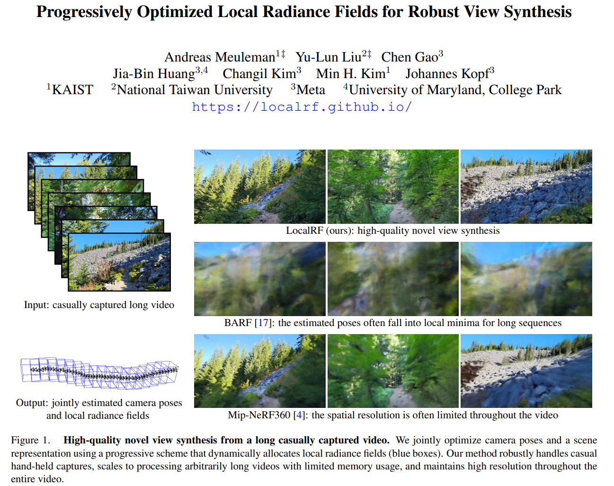

---

[26] ABLE-NeRF: Attention-Based Rendering with Learnable Embeddings for Neural Radiance Field

- 题目：ABLE-NeRF：基于注意力的神经辐射场可学习嵌入渲染
- 分类：注意力机制
- Code: https://github.com/TangZJ/able-nerf
- Paper: https://arxiv.org/pdf/2303.13817.pdf
- 摘要： 

> *Neural Radiance Field (NeRF) is a popular method in representing 3D scenes by optimising a continuous volumetric scene function. Its large success which lies in applying volumetric rendering (VR) is also its Achilles' heel in producing view-dependent effects. As a consequence, glossy and transparent surfaces often appear murky. A remedy to reduce these artefacts is to constrain this VR equation by excluding volumes with back-facing normal. While this approach has some success in rendering glossy surfaces, translucent objects are still poorly represented. In this paper, we present an alternative to the physics-based VR approach by introducing a self-attention-based framework on volumes along a ray. In addition, inspired by modern game engines which utilise Light Probes to store local lighting passing through the scene, we incorporate Learnable Embeddings to capture view dependent effects within the scene. Our method, which we call ABLE-NeRF, significantly reduces `blurry' glossy surfaces in rendering and produces realistic translucent surfaces which lack in prior art. In the Blender dataset, ABLE-NeRF achieves SOTA results and surpasses Ref-NeRF in all 3 image quality metrics PSNR, SSIM, LPIPS.*

- 图示：

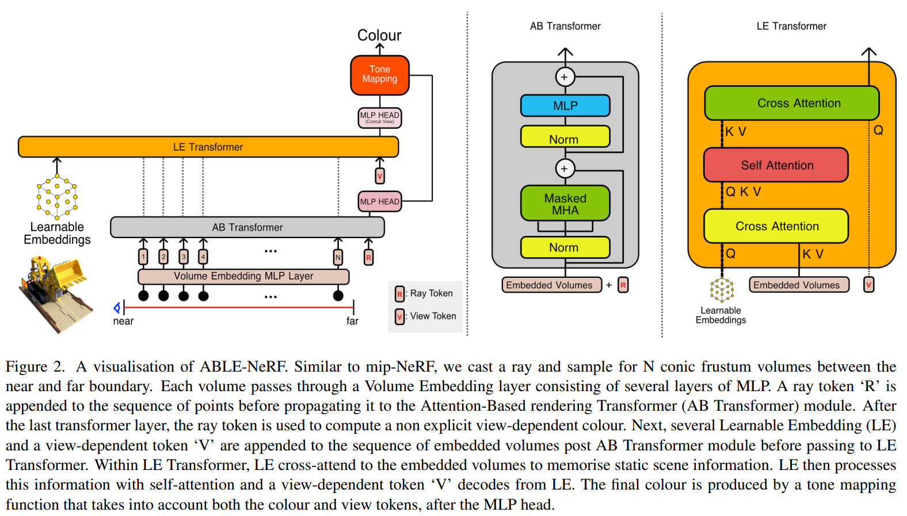

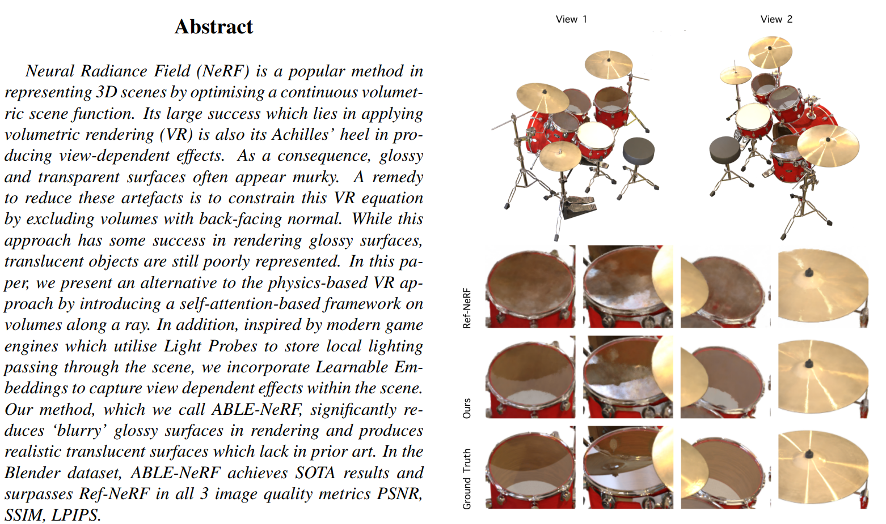

---

[27] SINE: Semantic-driven Image-based NeRF Editing with Prior-guided Editing Field

- 题目：SINE：语义驱动的基于图像的NeRF编辑，具有先验引导编辑字段
- 分类：可编辑
- Project: https://zju3dv.github.io/sine/
- Code: https://github.com/zju3dv/SINE, soon
- Paper: https://arxiv.org/pdf/2303.13277.pdf
- 摘要： 

> *Despite the great success in 2D editing using user-friendly tools, such as Photoshop, semantic strokes, or even text prompts, similar capabilities in 3D areas are still limited, either relying on 3D modeling skills or allowing editing within only a few categories. In this paper, we present a novel semantic-driven NeRF editing approach, which enables users to edit a neural radiance field with a single image, and faithfully delivers edited novel views with high fidelity and multi-view consistency. To achieve this goal, we propose a prior-guided editing field to encode fine-grained geometric and texture editing in 3D space, and develop a series of techniques to aid the editing process, including cyclic constraints with a proxy mesh to facilitate geometric supervision, a color compositing mechanism to stabilize semantic-driven texture editing, and a feature-cluster-based regularization to preserve the irrelevant content unchanged. Extensive experiments and editing examples on both real-world and synthetic data demonstrate that our method achieves photo-realistic 3D editing using only a single edited image, pushing the bound of semantic-driven editing in 3D real-world scenes. Our project webpage: [this https URL](https://zju3dv.github.io/sine/).*

- 图示：

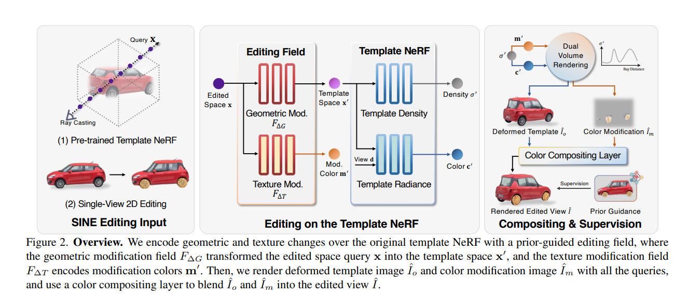

---

[28] RUST: Latent Neural Scene Representations from Unposed Imagery

- 题目：RUST：来自未处理图像的潜在神经场景表征
- 分类：没有位姿 NeRF without pose
- Project: https://rust-paper.github.io/
- Code: none
- Paper: https://arxiv.org/pdf/2211.14306.pdf
- 摘要： 

> *Inferring the structure of 3D scenes from 2D observations is a fundamental challenge in computer vision. Recently popularized approaches based on neural scene representations have achieved tremendous impact and have been applied across a variety of applications. One of the major remaining challenges in this space is training a single model which can provide latent representations which effectively generalize beyond a single scene. Scene Representation Transformer (SRT) has shown promise in this direction, but scaling it to a larger set of diverse scenes is challenging and necessitates accurately posed ground truth data. To address this problem, we propose RUST (Really Unposed Scene representation Transformer), a pose-free approach to novel view synthesis trained on RGB images alone. Our main insight is that one can train a Pose Encoder that peeks at the target image and learns a latent pose embedding which is used by the decoder for view synthesis. We perform an empirical investigation into the learned latent pose structure and show that it allows meaningful test-time camera transformations and accurate explicit pose readouts. Perhaps surprisingly, RUST achieves similar quality as methods which have access to perfect camera pose, thereby unlocking the potential for large-scale training of amortized neural scene representations.*

- 图示：

---

[29] SPARF: Neural Radiance Fields from Sparse and Noisy Poses

- 题目：SPARF：来自稀疏和噪声位姿的神经辐射场
- 分类：稀疏视图，位姿不准
- Project: http://prunetruong.com/sparf.github.io/
- Code: None
- Paper: https://arxiv.org/pdf/2211.11738.pdf
- 摘要： 

> *Neural Radiance Field (NeRF) has recently emerged as a powerful representation to synthesize photorealistic novel views. While showing impressive performance, it relies on the availability of dense input views with highly accurate camera poses, thus limiting its application in real-world scenarios. In this work, we introduce Sparse Pose Adjusting Radiance Field (SPARF), to address the challenge of novel-view synthesis given only few wide-baseline input images (as low as 3) with noisy camera poses. Our approach exploits multi-view geometry constraints in order to jointly learn the NeRF and refine the camera poses. By relying on pixel matches extracted between the input views, our multi-view correspondence objective enforces the optimized scene and camera poses to converge to a global and geometrically accurate solution. Our depth consistency loss further encourages the reconstructed scene to be consistent from any viewpoint. Our approach sets a new state of the art in the sparse-view regime on multiple challenging datasets.*

- 图示：

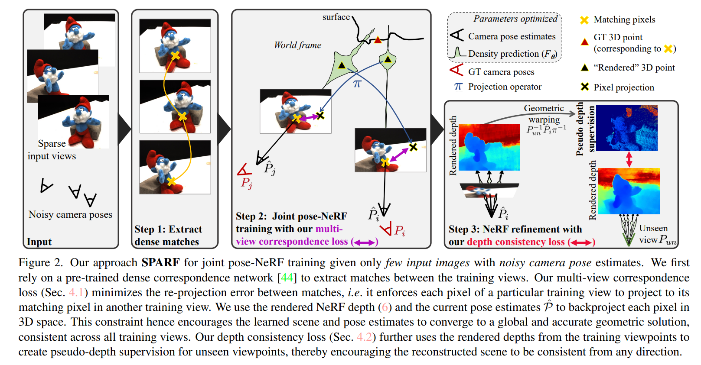

---

[30] EventNeRF: Neural Radiance Fields from a Single Colour Event Camera

- 题目：EventNeRF：单色事件相机的神经辐射场
- 分类：事件相机
- Project: https://4dqv.mpi-inf.mpg.de/EventNeRF/
- Code: https://github.com/r00tman/EventNeRF
- Paper: https://arxiv.org/pdf/2206.11896.pdf
- 摘要： 

> *Asynchronously operating event cameras find many applications due to their high dynamic range, vanishingly low motion blur, low latency and low data bandwidth. The field saw remarkable progress during the last few years, and existing event-based 3D reconstruction approaches recover sparse point clouds of the scene. However, such sparsity is a limiting factor in many cases, especially in computer vision and graphics, that has not been addressed satisfactorily so far. Accordingly, this paper proposes the first approach for 3D-consistent, dense and photorealistic novel view synthesis using just a single colour event stream as input. At its core is a neural radiance field trained entirely in a self-supervised manner from events while preserving the original resolution of the colour event channels. Next, our ray sampling strategy is tailored to events and allows for data-efficient training. At test, our method produces results in the RGB space at unprecedented quality. We evaluate our method qualitatively and numerically on several challenging synthetic and real scenes and show that it produces significantly denser and more visually appealing renderings than the existing methods. We also demonstrate robustness in challenging scenarios with fast motion and under low lighting conditions. We release the newly recorded dataset and our source code to facilitate the research field, see [this https URL](https://4dqv.mpi-inf.mpg.de/EventNeRF).*

- 图示：

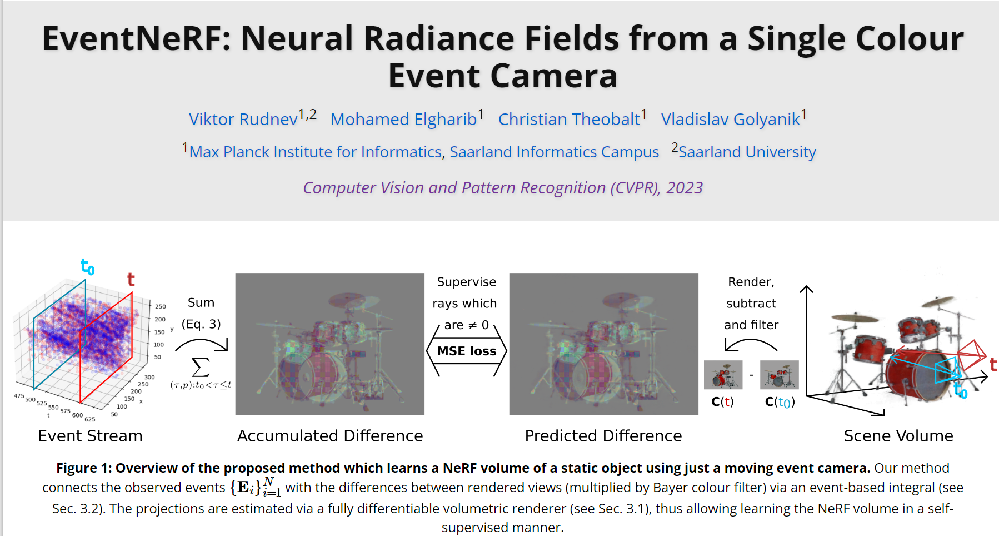

---

[31] Grid-guided Neural Radiance Fields for Large Urban Scenes

- 题目：基于网格引导的神经辐射场的大型城市场景重建
- 分类：
- Project: https://city-super.github.io/gridnerf/
- Code: None
- Paper: https://arxiv.org/pdf/2303.14001.pdf
- 摘要： 

> *Purely MLP-based neural radiance fields (NeRF-based methods) often suffer from underfitting with blurred renderings on large-scale scenes due to limited model capacity. Recent approaches propose to geographically divide the scene and adopt multiple sub-NeRFs to model each region individually, leading to linear scale-up in training costs and the number of sub-NeRFs as the scene expands. An alternative solution is to use a feature grid representation, which is computationally efficient and can naturally scale to a large scene with increased grid resolutions. However, the feature grid tends to be less constrained and often reaches suboptimal solutions, producing noisy artifacts in renderings, especially in regions with complex geometry and texture. In this work, we present a new framework that realizes high-fidelity rendering on large urban scenes while being computationally efficient. We propose to use a compact multiresolution ground feature plane representation to coarsely capture the scene, and complement it with positional encoding inputs through another NeRF branch for rendering in a joint learning fashion. We show that such an integration can utilize the advantages of two alternative solutions: a light-weighted NeRF is sufficient, under the guidance of the feature grid representation, to render photorealistic novel views with fine details; and the jointly optimized ground feature planes, can meanwhile gain further refinements, forming a more accurate and compact feature space and output much more natural rendering results.*

- 图示：

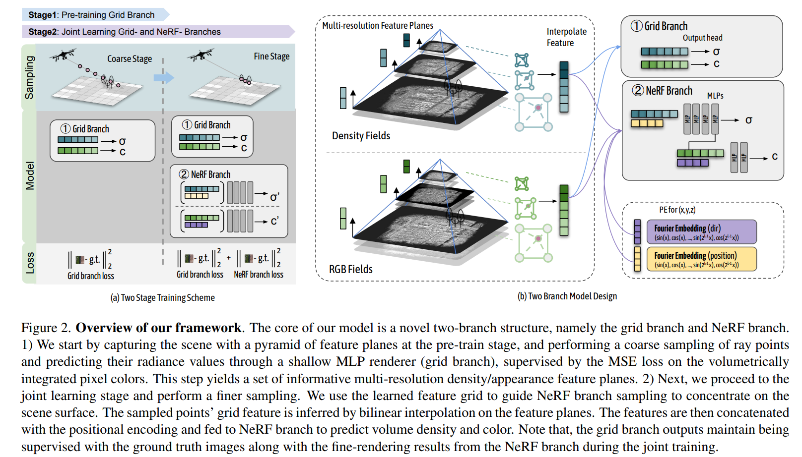

---

[32] HandNeRF: Neural Radiance Fields for Animatable Interacting Hands

- 题目：HandNeRF：可动画交互手的神经辐射场
- 分类：手部重建
- Code: none
- Paper: https://arxiv.org/pdf/2303.13825.pdf
- 摘要： 

> *We propose a novel framework to reconstruct accurate appearance and geometry with neural radiance fields (NeRF) for interacting hands, enabling the rendering of photo-realistic images and videos for gesture animation from arbitrary views. Given multi-view images of a single hand or interacting hands, an off-the-shelf skeleton estimator is first employed to parameterize the hand poses. Then we design a pose-driven deformation field to establish correspondence from those different poses to a shared canonical space, where a pose-disentangled NeRF for one hand is optimized. Such unified modeling efficiently complements the geometry and texture cues in rarely-observed areas for both hands. Meanwhile, we further leverage the pose priors to generate pseudo depth maps as guidance for occlusion-aware density learning. Moreover, a neural feature distillation method is proposed to achieve cross-domain alignment for color optimization. We conduct extensive experiments to verify the merits of our proposed HandNeRF and report a series of state-of-the-art results both qualitatively and quantitatively on the large-scale InterHand2.6M dataset.*

- 图示：

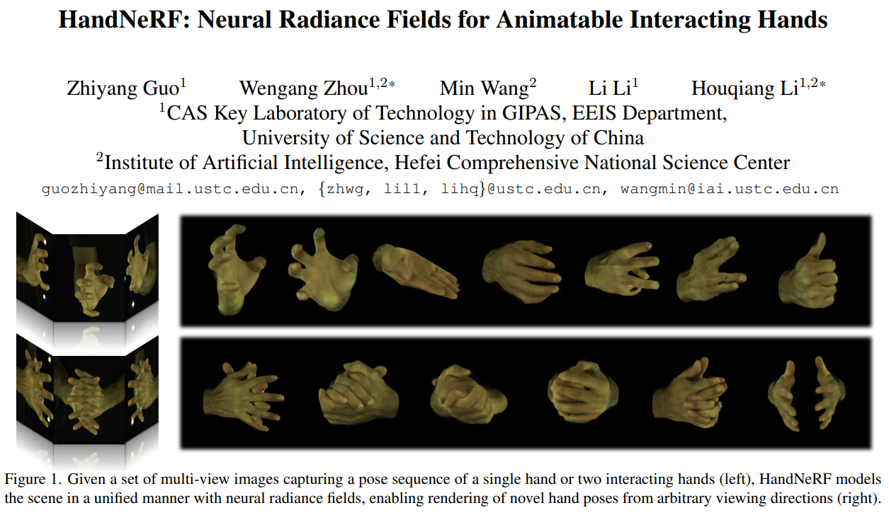

---

[33] Robust Dynamic Radiance Fields

- 题目：鲁棒动态辐射场
- 分类：动态场景
- Code: https://robust-dynrf.github.io/, soon
- Paper: https://robust-dynrf.github.io/
- 摘要： 

> *Dynamic radiance field reconstruction methods aim to model the time-varying structure and appearance of a dynamic scene. Existing methods, however, assume that accurate camera poses can be reliably estimated by Structure from Motion (SfM) algorithms. These methods, thus, are unreliable as SfM algorithms often fail or produce erroneous poses on challenging videos with highly dynamic objects, poorly textured surfaces, and rotating camera motion. We address this robustness issue by jointly estimating the static and dynamic radiance fields along with the camera parameters (poses and focal length). We demonstrate the robustness of our approach via extensive quantitative and qualitative experiments. Our results show favorable performance over the state-of-the-art dynamic view synthesis methods.*

- 图示：

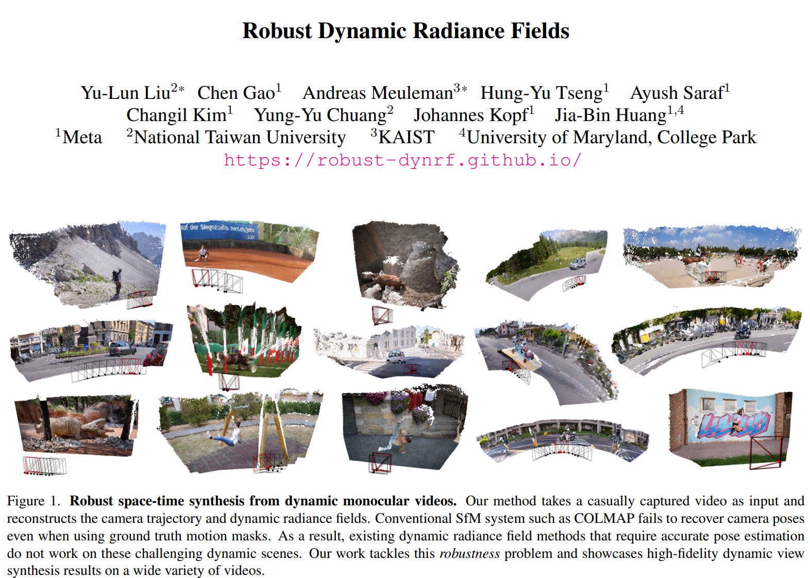

---

[34] MobileNeRF: Exploiting the Polygon Rasterization Pipeline for Efficient Neural Field Rendering on Mobile Architectures

- 题目：MobileNeRF：利用多边形光栅化管线在移动架构上实现高效的神经场渲染
- 分类：移动设备,快速渲染
- Project: https://mobile-nerf.github.io/
- Code: https://github.com/google-research/jax3d/tree/main/jax3d/projects/mobilenerf
- Paper: https://arxiv.org/pdf/2208.00277.pdf
- 摘要： 

> *Neural Radiance Fields (NeRFs) have demonstrated amazing ability to synthesize images of 3D scenes from novel views. However, they rely upon specialized volumetric rendering algorithms based on ray marching that are mismatched to the capabilities of widely deployed graphics hardware. This paper introduces a new NeRF representation based on textured polygons that can synthesize novel images efficiently with standard rendering pipelines. The NeRF is represented as a set of polygons with textures representing binary opacities and feature vectors. Traditional rendering of the polygons with a z-buffer yields an image with features at every pixel, which are interpreted by a small, view-dependent MLP running in a fragment shader to produce a final pixel color. This approach enables NeRFs to be rendered with the traditional polygon rasterization pipeline, which provides massive pixel-level parallelism, achieving interactive frame rates on a wide range of compute platforms, including mobile phones.*

- 图示：

---

[35] Semantic Ray: Learning a Generalizable Semantic Field with Cross-Reprojection Attention

- 题目：语义射线：学习具有交叉重投影注意的可泛化语义场
- 分类：可泛化语义分割
- Project: https://liuff19.github.io/S-Ray/
- Code: https://github.com/liuff19/Semantic-Ray
- Paper: https://arxiv.org/pdf/2303.13014.pdf
- 摘要： 

> *In this paper, we aim to learn a semantic radiance field from multiple scenes that is accurate, efficient and generalizable. While most existing NeRFs target at the tasks of neural scene rendering, image synthesis and multi-view reconstruction, there are a few attempts such as Semantic-NeRF that explore to learn high-level semantic understanding with the NeRF structure. However, Semantic-NeRF simultaneously learns color and semantic label from a single ray with multiple heads, where the single ray fails to provide rich semantic information. As a result, Semantic NeRF relies on positional encoding and needs to train one specific model for each scene. To address this, we propose Semantic Ray (S-Ray) to fully exploit semantic information along the ray direction from its multi-view reprojections. As directly performing dense attention over multi-view reprojected rays would suffer from heavy computational cost, we design a Cross-Reprojection Attention module with consecutive intra-view radial and cross-view sparse attentions, which decomposes contextual information along reprojected rays and cross multiple views and then collects dense connections by stacking the modules. Experiments show that our S-Ray is able to learn from multiple scenes, and it presents strong generalization ability to adapt to unseen scenes.*

- 图示：

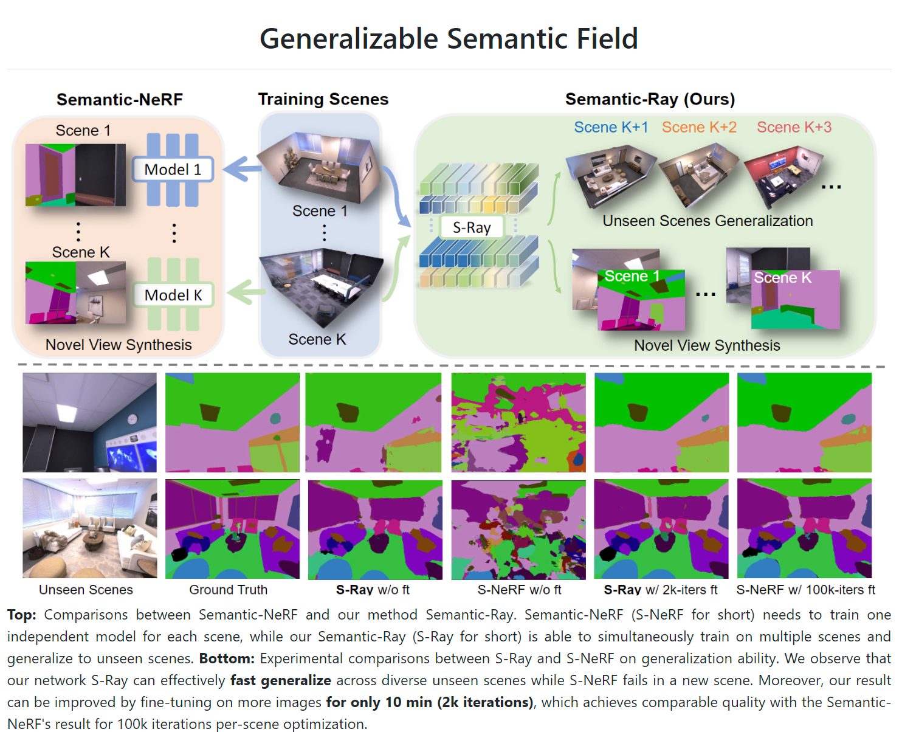

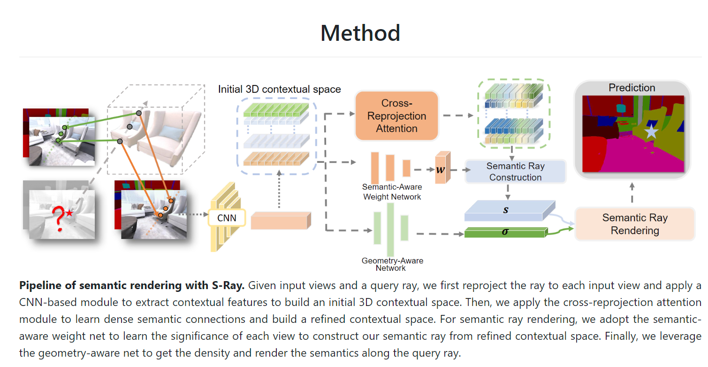

---

[36] Balanced Spherical Grid for Egocentric View Synthesis

- 题目：用于以自我为中心的视图合成的平衡球形网格
- 分类：自拍VR
- Project: https://changwoon.info/publications/EgoNeRF
- Code: https://github.com/changwoonchoi/EgoNeRF
- Paper: https://arxiv.org/pdf/2303.12408.pdf
- 摘要： 

> *We present EgoNeRF, a practical solution to reconstruct large-scale real-world environments for VR assets. Given a few seconds of casually captured 360 video, EgoNeRF can efficiently build neural radiance fields which enable high-quality rendering from novel viewpoints. Motivated by the recent acceleration of NeRF using feature grids, we adopt spherical coordinate instead of conventional Cartesian coordinate. Cartesian feature grid is inefficient to represent large-scale unbounded scenes because it has a spatially uniform resolution, regardless of distance from viewers. The spherical parameterization better aligns with the rays of egocentric images, and yet enables factorization for performance enhancement. However, the naïve spherical grid suffers from irregularities at two poles, and also cannot represent unbounded scenes. To avoid singularities near poles, we combine two balanced grids, which results in a quasi-uniform angular grid. We also partition the radial grid exponentially and place an environment map at infinity to represent unbounded scenes. Furthermore, with our resampling technique for grid-based methods, we can increase the number of valid samples to train NeRF volume. We extensively evaluate our method in our newly introduced synthetic and real-world egocentric 360 video datasets, and it consistently achieves state-of-the-art performance.*

- 图示：

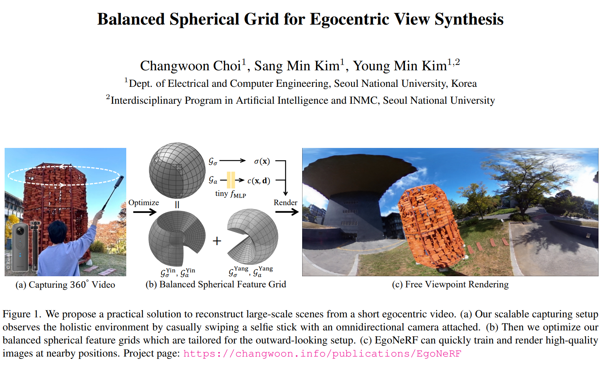

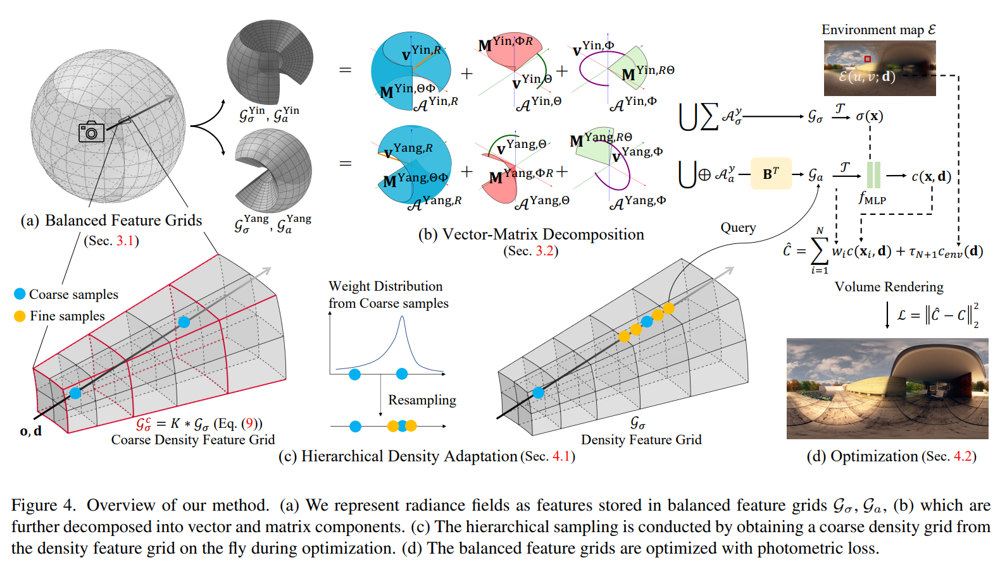

---

[37] ShadowNeuS: Neural SDF Reconstruction by Shadow Ray Supervision

- 题目：ShadowNeuS： 通过阴影射线监督进行神经SDF重建
- 分类：阴影射线监督
- Project: https://gerwang.github.io/shadowneus/
- Code: https://github.com/gerwang/ShadowNeuS, soon
- Paper: https://arxiv.org/pdf/2211.14086.pdf
- 摘要： 

> *By supervising camera rays between a scene and multi-view image planes, NeRF reconstructs a neural scene representation for the task of novel view synthesis. On the other hand, shadow rays between the light source and the scene have yet to be considered. Therefore, we propose a novel shadow ray supervision scheme that optimizes both the samples along the ray and the ray location. By supervising shadow rays, we successfully reconstruct a neural SDF of the scene from single-view images under multiple lighting conditions. Given single-view binary shadows, we train a neural network to reconstruct a complete scene not limited by the camera's line of sight. By further modeling the correlation between the image colors and the shadow rays, our technique can also be effectively extended to RGB inputs. We compare our method with previous works on challenging tasks of shape reconstruction from single-view binary shadow or RGB images and observe significant improvements. The code and data are available at [this https URL](https://github.com/gerwang/ShadowNeuS).*

- 图示：

---

[38] SPIn-NeRF: Multiview Segmentation and Perceptual Inpainting with Neural Radiance Fields

- 题目：SPIn-NeRF：用神经辐射场进行多视角分割和知觉绘画
- 分类：可编辑(三维绘画)，移除物体
- Project: https://spinnerf3d.github.io/
- Code: none
- Paper: https://arxiv.org/pdf/2211.12254.pdf
- 摘要： 

> *Neural Radiance Fields (NeRFs) have emerged as a popular approach for novel view synthesis. While NeRFs are quickly being adapted for a wider set of applications, intuitively editing NeRF scenes is still an open challenge. One important editing task is the removal of unwanted objects from a 3D scene, such that the replaced region is visually plausible and consistent with its context. We refer to this task as 3D inpainting. In 3D, solutions must be both consistent across multiple views and geometrically valid. In this paper, we propose a novel 3D inpainting method that addresses these challenges. Given a small set of posed images and sparse annotations in a single input image, our framework first rapidly obtains a 3D segmentation mask for a target object. Using the mask, a perceptual optimizationbased approach is then introduced that leverages learned 2D image inpainters, distilling their information into 3D space, while ensuring view consistency. We also address the lack of a diverse benchmark for evaluating 3D scene inpainting methods by introducing a dataset comprised of challenging real-world scenes. In particular, our dataset contains views of the same scene with and without a target object, enabling more principled benchmarking of the 3D inpainting task. We first demonstrate the superiority of our approach on multiview segmentation, comparing to NeRFbased methods and 2D segmentation approaches. We then evaluate on the task of 3D inpainting, establishing state-ofthe-art performance against other NeRF manipulation algorithms, as well as a strong 2D image inpainter baseline. Project Page: [this https URL](https://spinnerf3d.github.io/)*

- 图示：

---

[39] DP-NeRF: Deblurred Neural Radiance Field with Physical Scene Priors

- 题目：DP-NeRF：带有物理场景先验的去模糊的神经辐射场
- 分类：去模糊
- Project: https://dogyoonlee.github.io/dpnerf/
- Code: https://github.com/dogyoonlee/DP-NeRF
- Paper: https://arxiv.org/pdf/2211.12046.pdf
- 摘要： 

> *Neural Radiance Field (NeRF) has exhibited outstanding three-dimensional (3D) reconstruction quality via the novel view synthesis from multi-view images and paired calibrated camera parameters. However, previous NeRF-based systems have been demonstrated under strictly controlled settings, with little attention paid to less ideal scenarios, including with the presence of noise such as exposure, illumination changes, and blur. In particular, though blur frequently occurs in real situations, NeRF that can handle blurred images has received little attention. The few studies that have investigated NeRF for blurred images have not considered geometric and appearance consistency in 3D space, which is one of the most important factors in 3D reconstruction. This leads to inconsistency and the degradation of the perceptual quality of the constructed scene. Hence, this paper proposes a DP-NeRF, a novel clean NeRF framework for blurred images, which is constrained with two physical priors. These priors are derived from the actual blurring process during image acquisition by the camera. DP-NeRF proposes rigid blurring kernel to impose 3D consistency utilizing the physical priors and adaptive weight proposal to refine the color composition error in consideration of the relationship between depth and blur. We present extensive experimental results for synthetic and real scenes with two types of blur: camera motion blur and defocus blur. The results demonstrate that DP-NeRF successfully improves the perceptual quality of the constructed NeRF ensuring 3D geometric and appearance consistency. We further demonstrate the effectiveness of our model with comprehensive ablation analysis.*

- 图示：

---

[40] L2G-NeRF: Local-to-Global Registration for Bundle-Adjusting Neural Radiance Fields

- 题目：L2G-NeRF: 捆绑调整的神经辐射场的局部到整体注册
- 分类：Bundle-Adjusting
- Project: https://rover-xingyu.github.io/L2G-NeRF/
- Code: https://github.com/rover-xingyu/L2G-NeRF
- Paper: https://arxiv.org/pdf/2211.11505.pdf
- 摘要： 

> *Neural Radiance Fields (NeRF) have achieved photorealistic novel views synthesis; however, the requirement of accurate camera poses limits its application. Despite analysis-by-synthesis extensions for jointly learning neural 3D representations and registering camera frames exist, they are susceptible to suboptimal solutions if poorly initialized. We propose L2G-NeRF, a Local-to-Global registration method for bundle-adjusting Neural Radiance Fields: first, a pixel-wise flexible alignment, followed by a frame-wise constrained parametric alignment. Pixel-wise local alignment is learned in an unsupervised way via a deep network which optimizes photometric reconstruction errors. Frame-wise global alignment is performed using differentiable parameter estimation solvers on the pixel-wise correspondences to find a global transformation. Experiments on synthetic and real-world data show that our method outperforms the current state-of-the-art in terms of high-fidelity reconstruction and resolving large camera pose misalignment. Our module is an easy-to-use plugin that can be applied to NeRF variants and other neural field applications. The Code and supplementary materials are available at [this https URL](https://rover-xingyu.github.io/L2G-NeRF/).*

- 图示：

---

[41] Nerflets: Local Radiance Fields for Efficient Structure-Aware 3D Scene Representation from 2D Supervision

- 题目：Nerflets： 用于高效结构感知的三维场景的二维监督的局部辐射场
- 分类：高效和结构感知的三维场景表示, 大规模，室内室外，场景编辑，全景分割
- Project: https://jetd1.github.io/nerflets-web/
- Code: none
- Paper: https://arxiv.org/pdf/2303.03361.pdf
- 摘要： 

> *We address efficient and structure-aware 3D scene representation from images. Nerflets are our key contribution -- a set of local neural radiance fields that together represent a scene. Each nerflet maintains its own spatial position, orientation, and extent, within which it contributes to panoptic, density, and radiance reconstructions. By leveraging only photometric and inferred panoptic image supervision, we can directly and jointly optimize the parameters of a set of nerflets so as to form a decomposed representation of the scene, where each object instance is represented by a group of nerflets. During experiments with indoor and outdoor environments, we find that nerflets: (1) fit and approximate the scene more efficiently than traditional global NeRFs, (2) allow the extraction of panoptic and photometric renderings from arbitrary views, and (3) enable tasks rare for NeRFs, such as 3D panoptic segmentation and interactive editing.*

- 图示：

---

[42] Learning Detailed Radiance Manifolds for High-Fidelity and 3D-Consistent Portrait Synthesis from Monocular Image

- 题目：从单目图像中获取高保真和三维一致的人像合成的可学习细节辐射流形
- 分类：单视图人像合成
- Project: https://yudeng.github.io/GRAMInverter/
- Code: soon
- Paper: https://arxiv.org/pdf/2211.13901.pdf
- 摘要： 

> *A key challenge for novel view synthesis of monocular portrait images is 3D consistency under continuous pose variations. Most existing methods rely on 2D generative models which often leads to obvious 3D inconsistency artifacts. We present a 3D-consistent novel view synthesis approach for monocular portrait images based on a recent proposed 3D-aware GAN, namely Generative Radiance Manifolds (GRAM), which has shown strong 3D consistency at multiview image generation of virtual subjects via the radiance manifolds representation. However, simply learning an encoder to map a real image into the latent space of GRAM can only reconstruct coarse radiance manifolds without faithful fine details, while improving the reconstruction fidelity via instance-specific optimization is time-consuming. We introduce a novel detail manifolds reconstructor to learn 3D-consistent fine details on the radiance manifolds from monocular images, and combine them with the coarse radiance manifolds for high-fidelity reconstruction. The 3D priors derived from the coarse radiance manifolds are used to regulate the learned details to ensure reasonable synthesized results at novel views. Trained on in-the-wild 2D images, our method achieves high-fidelity and 3D-consistent portrait synthesis largely outperforming the prior art.*

- 图示：

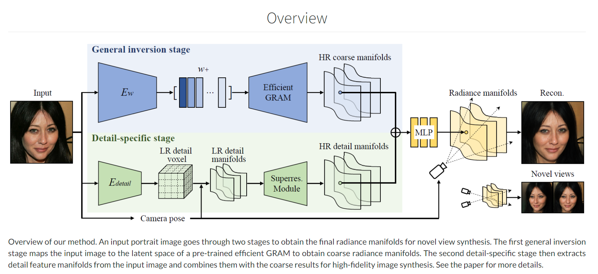

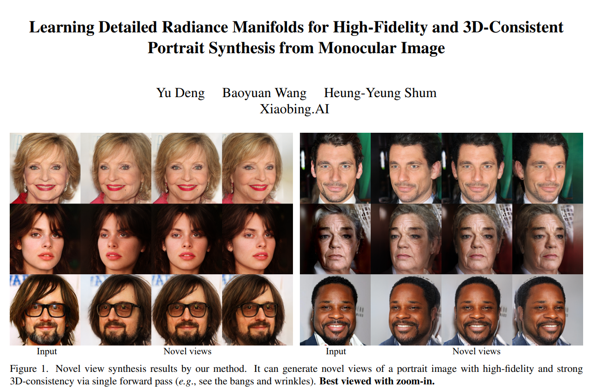

---

[43] $I^2$-SDF: Intrinsic Indoor Scene Reconstruction and Editing via Raytracing in Neural SDFs

- 题目：I2-SDF： 通过神经SDF中的光线追踪进行内在的室内场景重建和编辑
- 分类：室内重建,可编辑,重光照
- Project: https://jingsenzhu.github.io/i2-sdf/
- Code: https://github.com/jingsenzhu/i2-sdf
- Paper: https://arxiv.org/pdf/2303.07634.pdf
- 摘要： 

> *In this work, we present I2-SDF, a new method for intrinsic indoor scene reconstruction and editing using differentiable Monte Carlo raytracing on neural signed distance fields (SDFs). Our holistic neural SDF-based framework jointly recovers the underlying shapes, incident radiance and materials from multi-view images. We introduce a novel bubble loss for fine-grained small objects and error-guided adaptive sampling scheme to largely improve the reconstruction quality on large-scale indoor scenes. Further, we propose to decompose the neural radiance field into spatially-varying material of the scene as a neural field through surface-based, differentiable Monte Carlo raytracing and emitter semantic segmentations, which enables physically based and photorealistic scene relighting and editing applications. Through a number of qualitative and quantitative experiments, we demonstrate the superior quality of our method on indoor scene reconstruction, novel view synthesis, and scene editing compared to state-of-the-art baselines.*

- 图示：

---

[44] NoPe-NeRF: Optimising Neural Radiance Field with No Pose Prior

- 题目：NoPe-NeRF：优化无位姿先验的神经辐射场
- 分类：无位姿
- Project: https://nope-nerf.active.vision/
- Code: soon
- Paper: https://arxiv.org/pdf/2212.07388.pdf
- 摘要： 

> *Training a Neural Radiance Field (NeRF) without pre-computed camera poses is challenging. Recent advances in this direction demonstrate the possibility of jointly optimising a NeRF and camera poses in forward-facing scenes. However, these methods still face difficulties during dramatic camera movement. We tackle this challenging problem by incorporating undistorted monocular depth priors. These priors are generated by correcting scale and shift parameters during training, with which we are then able to constrain the relative poses between consecutive frames. This constraint is achieved using our proposed novel loss functions. Experiments on real-world indoor and outdoor scenes show that our method can handle challenging camera trajectories and outperforms existing methods in terms of novel view rendering quality and pose estimation accuracy. Our project page is https://nope-nerf.active.vision.*

- 图示：

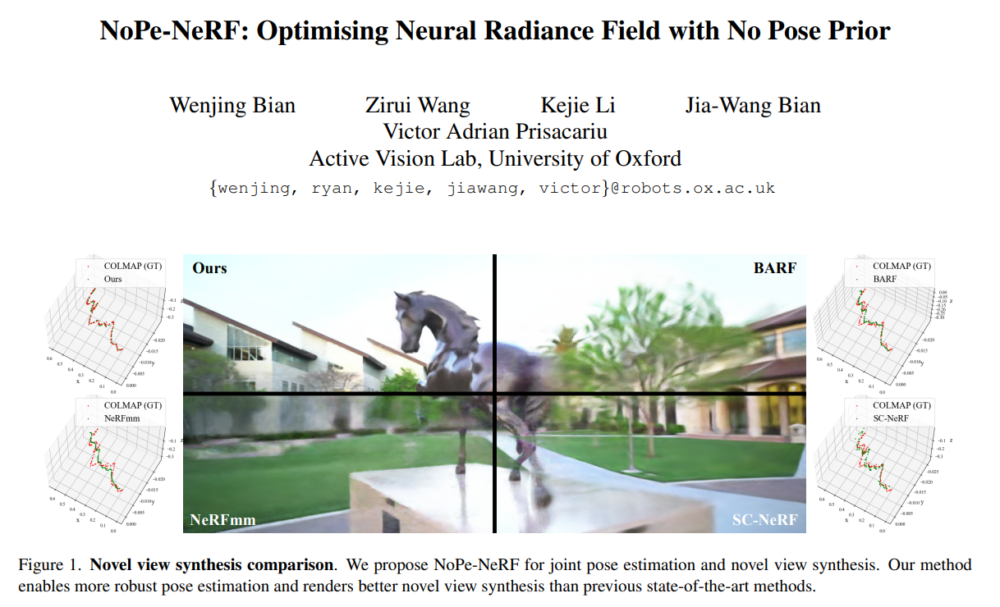

---

[45] Latent-NeRF for Shape-Guided Generation of 3D Shapes and Textures

- 题目：用于形状引导的三维形状和纹理生成的Latent-NeRF
- 分类：Text-to-3D
- Code: https://github.com/eladrich/latent-nerf
- Paper: https://arxiv.org/pdf/2211.07600.pdf
- 摘要： 

> *Text-guided image generation has progressed rapidly in recent years, inspiring major breakthroughs in text-guided shape generation. Recently, it has been shown that using score distillation, one can successfully text-guide a NeRF model to generate a 3D object. We adapt the score distillation to the publicly available, and computationally efficient, Latent Diffusion Models, which apply the entire diffusion process in a compact latent space of a pretrained autoencoder. As NeRFs operate in image space, a naive solution for guiding them with latent score distillation would require encoding to the latent space at each guidance step. Instead, we propose to bring the NeRF to the latent space, resulting in a Latent-NeRF. Analyzing our Latent-NeRF, we show that while Text-to-3D models can generate impressive results, they are inherently unconstrained and may lack the ability to guide or enforce a specific 3D structure. To assist and direct the 3D generation, we propose to guide our Latent-NeRF using a Sketch-Shape: an abstract geometry that defines the coarse structure of the desired object. Then, we present means to integrate such a constraint directly into a Latent-NeRF. This unique combination of text and shape guidance allows for increased control over the generation process. We also show that latent score distillation can be successfully applied directly on 3D meshes. This allows for generating high-quality textures on a given geometry. Our experiments validate the power of our different forms of guidance and the efficiency of using latent rendering. Implementation is available at [this https URL](https://github.com/eladrich/latent-nerf)*

- 图示：

---

[46] Real-Time Neural Light Field on Mobile Devices

- 题目：移动设备上的实时神经光场
- 分类：移动设备,实时
- Project: https://snap-research.github.io/MobileR2L/
- Code: https://github.com/snap-research/MobileR2L, soon
- Paper: https://arxiv.org/pdf/2212.08057.pdf
- 摘要： 

> *Recent efforts in Neural Rendering Fields (NeRF) have shown impressive results on novel view synthesis by utilizing implicit neural representation to represent 3D scenes. Due to the process of volumetric rendering, the inference speed for NeRF is extremely slow, limiting the application scenarios of utilizing NeRF on resource-constrained hardware, such as mobile devices. Many works have been conducted to reduce the latency of running NeRF models. However, most of them still require high-end GPU for acceleration or extra storage memory, which is all unavailable on mobile devices. Another emerging direction utilizes the neural light field (NeLF) for speedup, as only one forward pass is performed on a ray to predict the pixel color. Nevertheless, to reach a similar rendering quality as NeRF, the network in NeLF is designed with intensive computation, which is not mobile-friendly. In this work, we propose an efficient network that runs in real-time on mobile devices for neural rendering. We follow the setting of NeLF to train our network. Unlike existing works, we introduce a novel network architecture that runs efficiently on mobile devices with low latency and small size, i.e., saving 15×∼24× storage compared with MobileNeRF. Our model achieves high-resolution generation while maintaining real-time inference for both synthetic and real-world scenes on mobile devices, e.g., 18.04ms (iPhone 13) for rendering one 1008×756 image of real 3D scenes. Additionally, we achieve similar image quality as NeRF and better quality than MobileNeRF (PSNR 26.15 vs. 25.91 on the real-world forward-facing dataset).*

- 图示：

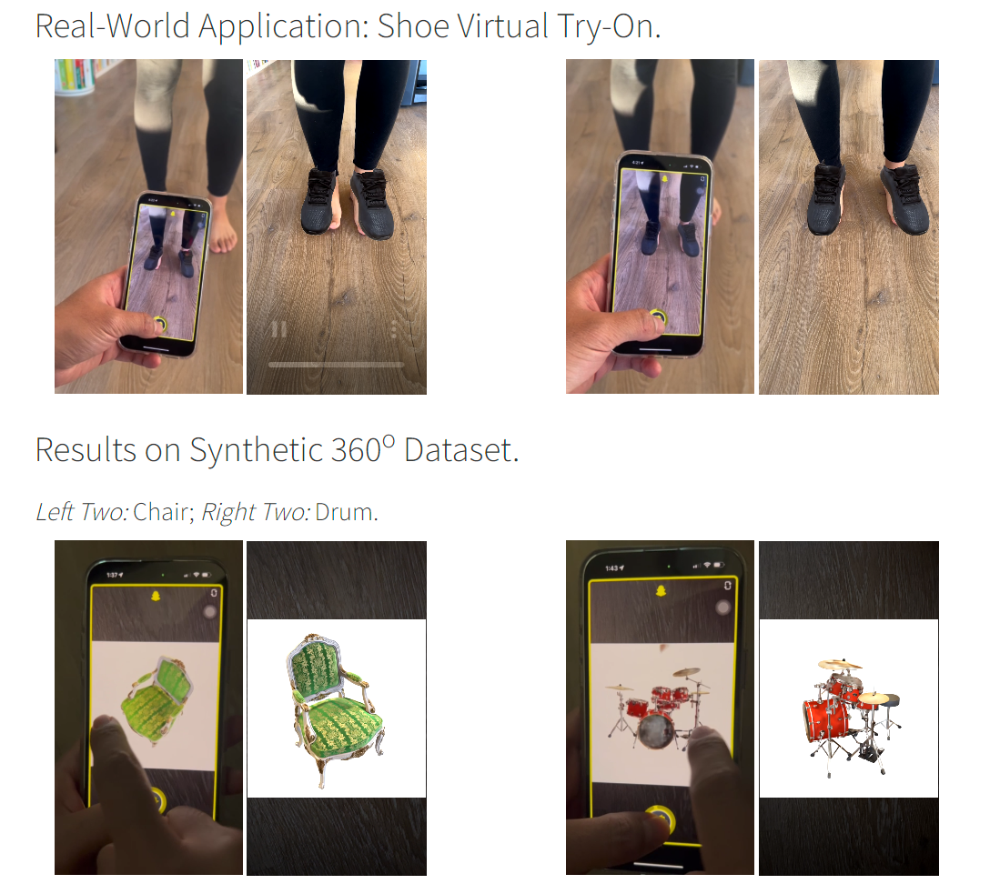

---

[47] Renderable Neural Radiance Map for Visual Navigation

- 题目：用于视觉导航的可渲染神经辐射图
- 分类：视觉导航
- Project: https://rllab-snu.github.io/projects/RNR-Map/
- Code: https://github.com/rllab-snu/RNR-Map, soon
- Paper: https://arxiv.org/pdf/2303.00304.pdf
- 摘要： 

> *We propose a novel type of map for visual navigation, a renderable neural radiance map (RNR-Map), which is designed to contain the overall visual information of a 3D environment. The RNR-Map has a grid form and consists of latent codes at each pixel. These latent codes are embedded from image observations, and can be converted to the neural radiance field which enables image rendering given a camera pose. The recorded latent codes implicitly contain visual information about the environment, which makes the RNR-Map visually descriptive. This visual information in RNR-Map can be a useful guideline for visual localization and navigation. We develop localization and navigation frameworks that can effectively utilize the RNR-Map. We evaluate the proposed frameworks on camera tracking, visual localization, and image-goal navigation. Experimental results show that the RNR-Map-based localization framework can find the target location based on a single query image with fast speed and competitive accuracy compared to other baselines. Also, this localization framework is robust to environmental changes, and even finds the most visually similar places when a query image from a different environment is given. The proposed navigation framework outperforms the existing image-goal navigation methods in difficult scenarios, under odometry and actuation noises. The navigation framework shows 65.7% success rate in curved scenarios of the NRNS dataset, which is an improvement of 18.6% over the current state-of-the-art. Project page: [this https URL](https://rllab-snu.github.io/projects/RNR-Map/)*

- 图示：

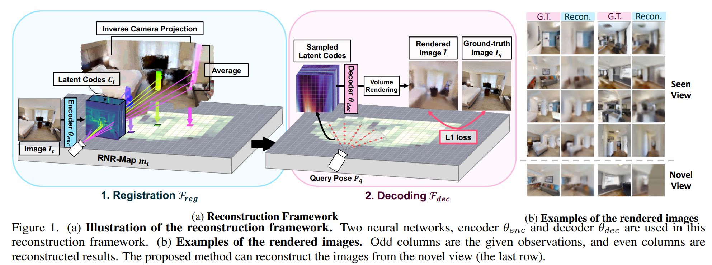

----

[48] NeRF-Gaze: A Head-Eye Redirection Parametric Model for Gaze Estimation

- 题目：NeRF-Gaze： 一个用于凝视估计的头眼重定向参数模型
- 分类：人脸建模
- Project: none
- Code: none
- Paper: https://arxiv.org/pdf/2212.14710.pdf
- 摘要： 

> *Gaze estimation is the fundamental basis for many visual tasks. Yet, the high cost of acquiring gaze datasets with 3D annotations hinders the optimization and application of gaze estimation models. In this work, we propose a novel Head-Eye redirection parametric model based on Neural Radiance Field, which allows dense gaze data generation with view consistency and accurate gaze direction. Moreover, our head-eye redirection parametric model can decouple the face and eyes for separate neural rendering, so it can achieve the purpose of separately controlling the attributes of the face, identity, illumination, and eye gaze direction. Thus diverse 3D-aware gaze datasets could be obtained by manipulating the latent code belonging to different face attributions in an unsupervised manner. Extensive experiments on several benchmarks demonstrate the effectiveness of our method in domain generalization and domain adaptation for gaze estimation tasks.*

- 图示：

----

[49] NeRFLiX: High-Quality Neural View Synthesis by Learning a Degradation-Driven Inter-viewpoint MiXer

- 题目：NeRFLiX：通过学习退化驱动的视点之间的MiXer来实现高质量的神经视图合成
- 分类：逼真合成
- Project: https://redrock303.github.io/nerflix/
- Code: soon
- Paper: https://arxiv.org/pdf/2303.06919.pdf
- 摘要： 

> *Neural radiance fields (NeRF) show great success in novel view synthesis. However, in real-world scenes, recovering high-quality details from the source images is still challenging for the existing NeRF-based approaches, due to the potential imperfect calibration information and scene representation inaccuracy. Even with high-quality training frames, the synthetic novel views produced by NeRF models still suffer from notable rendering artifacts, such as noise, blur, etc. Towards to improve the synthesis quality of NeRF-based approaches, we propose NeRFLiX, a general NeRF-agnostic restorer paradigm by learning a degradation-driven inter-viewpoint mixer. Specially, we design a NeRF-style degradation modeling approach and construct large-scale training data, enabling the possibility of effectively removing NeRF-native rendering artifacts for existing deep neural networks. Moreover, beyond the degradation removal, we propose an inter-viewpoint aggregation framework that is able to fuse highly related high-quality training images, pushing the performance of cutting-edge NeRF models to entirely new levels and producing highly photo-realistic synthetic views.*

- 图示：

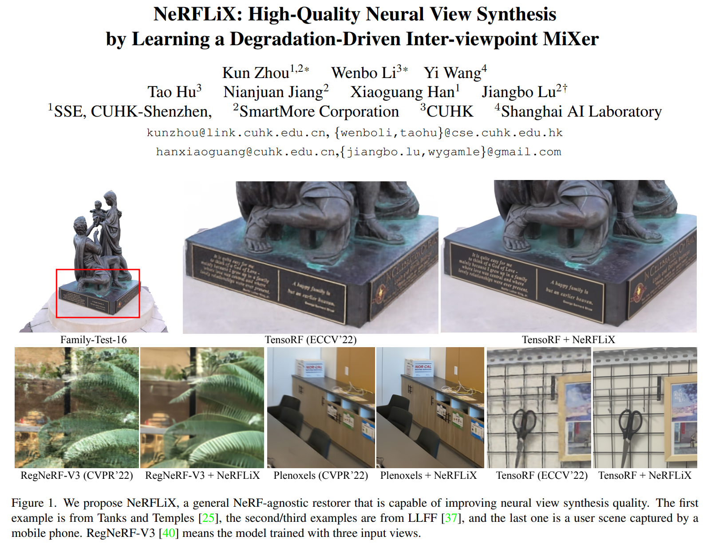

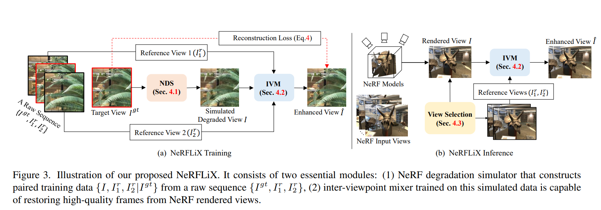

----

[50] 3D Video Loops from Asynchronous Input

- 题目：异步输入的3D视频循环
- 分类：动态场景
- Project: https://limacv.github.io/VideoLoop3D_web/
- Code: https://github.com/limacv/VideoLoop3D
- Paper: https://arxiv.org/pdf/2303.05312.pdf
- 摘要： 

> *Looping videos are short video clips that can be looped endlessly without visible seams or artifacts. They provide a very attractive way to capture the dynamism of natural scenes. Existing methods have been mostly limited to 2D representations. In this paper, we take a step forward and propose a practical solution that enables an immersive experience on dynamic 3D looping scenes. The key challenge is to consider the per-view looping conditions from asynchronous input while maintaining view consistency for the 3D representation. We propose a novel sparse 3D video representation, namely Multi-Tile Video (MTV), which not only provides a view-consistent prior, but also greatly reduces memory usage, making the optimization of a 4D volume tractable. Then, we introduce a two-stage pipeline to construct the 3D looping MTV from completely asynchronous multi-view videos with no time overlap. A novel looping loss based on video temporal retargeting algorithms is adopted during the optimization to loop the 3D scene. Experiments of our framework have shown promise in successfully generating and rendering photorealistic 3D looping videos in real time even on mobile devices. The code, dataset, and live demos are available in [this https URL](https://limacv.github.io/VideoLoop3D_web/).*

- 图示：

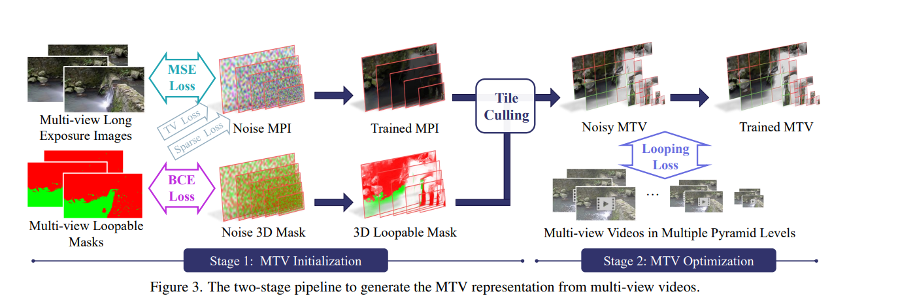

----

[51] 

- 题目：
- 分类：
- Project: 
- Code: 
- Paper: 
- 摘要： 

> 

- 图示：

----

[52] 

- 题目：
- 分类：
- Project: 
- Code: 
- Paper: 
- 摘要： 

> 

- 图示：

----

[53] 

- 题目：
- 分类：
- Project: 
- Code: 
- Paper: 
- 摘要： 

> 

- 图示：

----

[54] 

- 题目：
- 分类：
- Project: 
- Code: 
- Paper: 
- 摘要： 

> 

- 图示：

----

[55] 

- 题目：
- 分类：
- Project: 
- Code: 
- Paper: 
- 摘要： 

> 

- 图示：

----

[56] 

- 题目：
- 分类：
- Project: 
- Code: 
- Paper: 
- 摘要： 

> 

- 图示：

----

[57] 

- 题目：
- 分类：
- Project: 
- Code: 
- Paper: 
- 摘要： 

> 

- 图示：

----

[58] 

- 题目：
- 分类：
- Project: 
- Code: 
- Paper: 
- 摘要： 

> 

- 图示：

----

[59] 

- 题目：
- 分类：
- Project: 
- Code: 
- Paper: 
- 摘要： 

> 

- 图示：

----

[60] 

- 题目：
- 分类：
- Project: 
- Code: 
- Paper: 
- 摘要： 

> 

- 图示：

----

[61] 

- 题目：
- 分类：
- Project: 
- Code: 
- Paper: 
- 摘要： 

> 

- 图示：

----

[62] 

- 题目：
- 分类：
- Project: 
- Code: 
- Paper: 
- 摘要： 

> 

- 图示：

----

[63] 

- 题目：
- 分类：
- Project: 
- Code: 
- Paper: 
- 摘要： 

> 

- 图示：

----

[64] 

- 题目：
- 分类：
- Project: 
- Code: 
- Paper: 
- 摘要： 

> 

- 图示：

----

[65] 

- 题目：
- 分类：
- Project: 
- Code: 
- Paper: 
- 摘要： 

> 

- 图示：

----

[66] 

- 题目：
- 分类：
- Project: 
- Code: 
- Paper: 
- 摘要： 

> 

- 图示：

----

[67] 

- 题目：
- 分类：
- Project: 
- Code: 
- Paper: 
- 摘要： 

> 

- 图示：