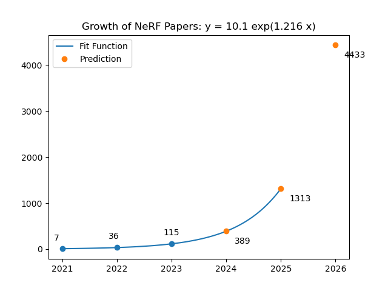

# All NeRF-related Papers on CVPR/ICCV/ECCV/ICML/NIPS/ICLR

## [NeRFs-CVPR2023: 115 :computer_mouse:](https://github.com/lif314/NeRFs-CVPR2023/blob/main/NeRFs-CVPR2023.md)

- NeRF on CVPR: 

  - [NeRFs-CVPR2021: 7](https://github.com/lif314/NeRFs-CVPR2023/blob/main/NeRFs-CVPR2021.md)
  - [NeRFs-CVPR2022: 37](https://github.com/lif314/NeRFs-CVPR2023/blob/main/NeRFs-CVPR2022.md)
  - [NeRFs-CVPR2023: 115](https://github.com/lif314/NeRFs-CVPR2023/blob/main/NeRFs-CVPR2023.md)

  

- NeRF on NIPS：[NeRFs-NIPS: 17](https://github.com/lif314/NeRFs-CVPR2023/blob/main/NeRFs-NIPS.md)

- NeRF on ICML: [NeRFs-ICML: 3](https://github.com/lif314/NeRFs-CVPR2023/blob/main/NeRFs-ICML.md)

- NeRF on ICLR: [NeRFs-ICLR: 2](https://github.com/lif314/NeRFs-CVPR2023/blob/main/NeRFs-ICLR.md)

- NeRF on ICCV: [NeRFs-ICCV2021: 23](https://github.com/lif314/NeRFs-CVPR2023/blob/main/NeRFs-ICCV2021.md)

- NeRF on ECCV: 

  - [NeRFs-ECCV2022: Comming soon](https://github.com/lif314/NeRFs-CVPR2023/blob/main/NeRFs-ECCV2022.md)
  - [NeRFs-ECCV2020: 1(开山之作)](https://github.com/lif314/NeRFs-CVPR2023/blob/main/NeRF-ECCV2020.md)

- 推荐Repo:

  - [awesome-NeRF](https://github.com/awesome-NeRF/awesome-NeRF/)

  - [CVPR2023-Papers-with-Code](https://github.com/amusi/CVPR2023-Papers-with-Code)

