# NeRFs-CVPR2023

> - 推荐Repo:
>   - [CVPR2023论文整理](https://github.com/extreme-assistant/CVPR2023-Paper-Code-Interpretation/blob/master/CVPR2023.md)

[1] NeRF-RPN: A general framework for object detection in NeRFs

- 题目：NeRF-RPN：NeRF中对象检测的通用框架
- 分类：目标检测

- Code: https://github.com/lyclyc52/NeRF_RPN

- Paper: https://arxiv.org/abs/2211.11646

- 摘要：

  > *This paper presents the first significant object detection framework, NeRF-RPN, which directly operates on NeRF. Given a pre-trained NeRF model, NeRF-RPN aims to detect all bounding boxes of objects in a scene. By exploiting a novel voxel representation that incorporates multi-scale 3D neural volumetric features, we demonstrate it is possible to regress the 3D bounding boxes of objects in NeRF directly without rendering the NeRF at any viewpoint. NeRF-RPN is a general framework and can be applied to detect objects without class labels. We experimented NeRF-RPN with various backbone architectures, RPN head designs and loss functions. All of them can be trained in an end-to-end manner to estimate high quality 3D bounding boxes. To facilitate future research in object detection for NeRF, we built a new benchmark dataset which consists of both synthetic and real-world data with careful labeling and clean up. Code and dataset are available at [this https URL](https://github.com/lyclyc52/NeRF_RPN).*

- 图示：

[2] SCADE: NeRFs from Space Carving with Ambiguity-Aware Depth Estimates

- 题目：SCADE：来自具有歧义感知深度估计的空间雕刻的 NeRF
- 分类：深度监督
- Project: https://scade-spacecarving-nerfs.github.io/
- Code: soon
- Paper: https://arxiv.org/pdf/2303.13582.pdf
- 摘要： 

> *Neural radiance fields (NeRFs) have enabled high fidelity 3D reconstruction from multiple 2D input views. However, a well-known drawback of NeRFs is the less-than-ideal performance under a small number of views, due to insufficient constraints enforced by volumetric rendering. To address this issue, we introduce SCADE, a novel technique that improves NeRF reconstruction quality on sparse, unconstrained input views for in-the-wild indoor scenes. To constrain NeRF reconstruction, we leverage geometric priors in the form of per-view depth estimates produced with state-of-the-art monocular depth estimation models, which can generalize across scenes. A key challenge is that monocular depth estimation is an ill-posed problem, with inherent ambiguities. To handle this issue, we propose a new method that learns to predict, for each view, a continuous, multimodal distribution of depth estimates using conditional Implicit Maximum Likelihood Estimation (cIMLE). In order to disambiguate exploiting multiple views, we introduce an original space carving loss that guides the NeRF representation to fuse multiple hypothesized depth maps from each view and distill from them a common geometry that is consistent with all views. Experiments show that our approach enables higher fidelity novel view synthesis from sparse views. Our project page can be found at scade-spacecarving-nerfs.github.io.*

- 图示：

[3] 3D-Aware Multi-Class Image-to-Image Translation with NeRFs

- 题目：使用 NeRF 进行3D感知的多类图像到图像转换
- 分类：3D风格迁移
- Code: https://github.com/sen-mao/3di2i-translation
- Paper: https://arxiv.org/pdf/2303.15012.pdf
- 摘要： 

> *Recent advances in 3D-aware generative models (3D-aware GANs) combined with Neural Radiance Fields (NeRF) have achieved impressive results for novel view synthesis. However no prior works investigate 3D-aware GANs for 3D consistent multi-class image-to-image (3D-aware I2I) translation. Naively using 2D-I2I translation methods suffers from unrealistic shape/identity change. To perform 3D-aware multi-class I2I translation, we decouple this learning process into a multi-class 3D-aware GAN step and a 3D-aware I2I translation step. In the first step, we propose two novel techniques: a new conditional architecture and a effective training strategy. In the second step, based on the well-trained multi-class 3D-aware GAN architecture that preserves view-consistency, we construct a 3D-aware I2I translation system. To further reduce the view-consistency problems, we propose several new techniques, including a U-net-like adaptor network design, a hierarchical representation constrain and a relative regularization loss. In extensive experiments on two datasets, quantitative and qualitative results demonstrate that we successfully perform 3D-aware I2I translation with multi-view consistency.*

- 图示：

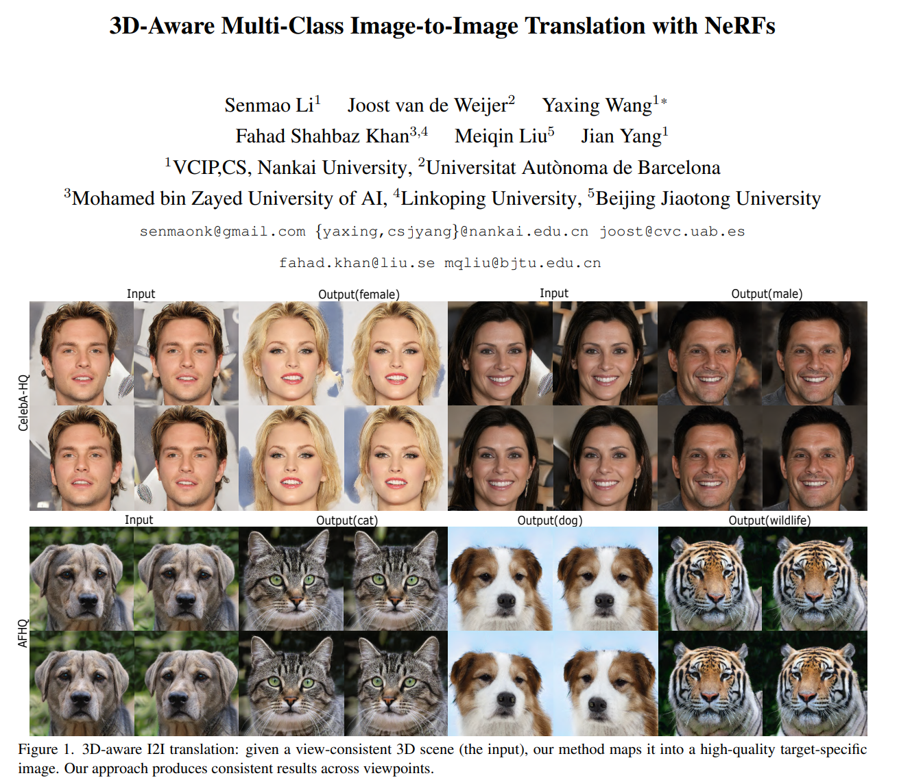

[4] StyleRF: Zero-shot 3D Style Transfer of Neural Radiance Fields

- 题目：StyleRF：神经辐射场的零样本 3D 风格迁移
- 分类：3D风格迁移
- Project: https://kunhao-liu.github.io/StyleRF/
- Code: https://github.com/Kunhao-Liu/StyleRF
- Paper: https://arxiv.org/pdf/2303.10598.pdf
- 摘要： 

> *3D style transfer aims to render stylized novel views of a 3D scene with multi-view consistency. However, most existing work suffers from a three-way dilemma over accurate geometry reconstruction, high-quality stylization, and being generalizable to arbitrary new styles. We propose StyleRF (Style Radiance Fields), an innovative 3D style transfer technique that resolves the three-way dilemma by performing style transformation within the feature space of a radiance field. StyleRF employs an explicit grid of high-level features to represent 3D scenes, with which high-fidelity geometry can be reliably restored via volume rendering. In addition, it transforms the grid features according to the reference style which directly leads to high-quality zero-shot style transfer. StyleRF consists of two innovative designs. The first is sampling-invariant content transformation that makes the transformation invariant to the holistic statistics of the sampled 3D points and accordingly ensures multi-view consistency. The second is deferred style transformation of 2D feature maps which is equivalent to the transformation of 3D points but greatly reduces memory footprint without degrading multi-view consistency. Extensive experiments show that StyleRF achieves superior 3D stylization quality with precise geometry reconstruction and it can generalize to various new styles in a zero-shot manner.*

- 图示：

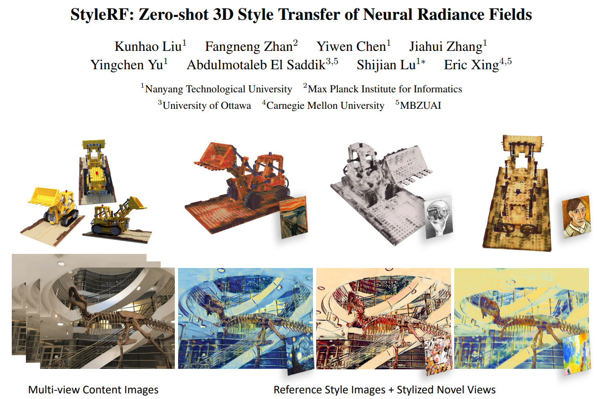

[5] NeuFace: Realistic 3D Neural Face Rendering from Multi-view Images

- 题目：NeuFace：来自多视图图像的逼真3D人脸神经渲染
- 分类：人脸渲染
- Code: https://github.com/aejion/NeuFace
- Paper: https://arxiv.org/pdf/2303.14092.pdf
- 摘要： 

> *Realistic face rendering from multi-view images is beneficial to various computer vision and graphics applications. Due to the complex spatially-varying reflectance properties and geometry characteristics of faces, however, it remains challenging to recover 3D facial representations both faithfully and efficiently in the current studies. This paper presents a novel 3D face rendering model, namely NeuFace, to learn accurate and physically-meaningful underlying 3D representations by neural rendering techniques. It naturally incorporates the neural BRDFs into physically based rendering, capturing sophisticated facial geometry and appearance clues in a collaborative manner. Specifically, we introduce an approximated BRDF integration and a simple yet new low-rank prior, which effectively lower the ambiguities and boost the performance of the facial BRDFs. Extensive experiments demonstrate the superiority of NeuFace in human face rendering, along with a decent generalization ability to common objects.*

- 图示：

[6] BundleSDF: Neural 6-DoF Tracking and 3D Reconstruction of Unknown Objects

- 题目：BundleSDF：未知对象的神经6-DoF跟踪和3D重建
- 分类：RGBD实时跟踪与3D重建
- Project: https://bundlesdf.github.io/
- Code:  Soon
- Paper: https://arxiv.org/abs/2303.14158 
- 摘要： 

> *We present a near real-time method for 6-DoF tracking of an unknown object from a monocular RGBD video sequence, while simultaneously performing neural 3D reconstruction of the object. Our method works for arbitrary rigid objects, even when visual texture is largely absent. The object is assumed to be segmented in the first frame only. No additional information is required, and no assumption is made about the interaction agent. Key to our method is a Neural Object Field that is learned concurrently with a pose graph optimization process in order to robustly accumulate information into a consistent 3D representation capturing both geometry and appearance. A dynamic pool of posed memory frames is automatically maintained to facilitate communication between these threads. Our approach handles challenging sequences with large pose changes, partial and full occlusion, untextured surfaces, and specular highlights. We show results on HO3D, YCBInEOAT, and BEHAVE datasets, demonstrating that our method significantly outperforms existing approaches. Project page: [this https URL](https://bundlesdf.github.io/)*

- 图示：

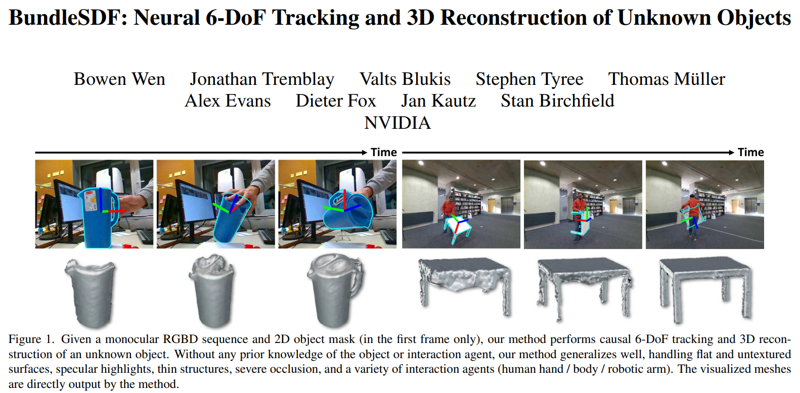

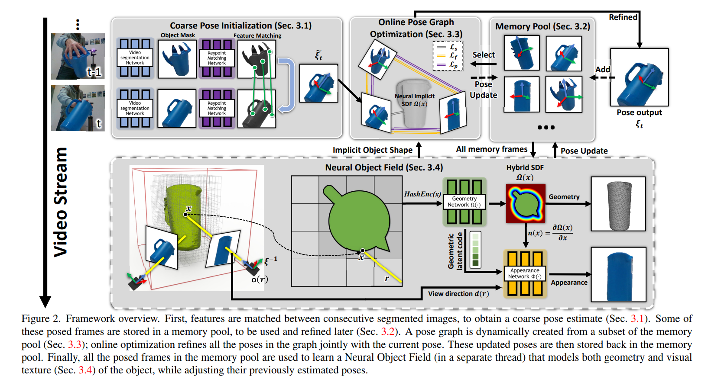

[7] Seeing Through the Glass: Neural 3D Reconstruction of Object Inside a Transparent Container

- 题目：透明容器内物体的神经 3D 重建
- 分类：3D重建
- Code: https://github.com/hirotong/ReNeuS，soon
- Paper: https://arxiv.org/pdf/2303.13805.pdf
- 摘要： 

> *In this paper, we define a new problem of recovering the 3D geometry of an object confined in a transparent enclosure. We also propose a novel method for solving this challenging problem. Transparent enclosures pose challenges of multiple light reflections and refractions at the interface between different propagation media e.g. air or glass. These multiple reflections and refractions cause serious image distortions which invalidate the single viewpoint assumption. Hence the 3D geometry of such objects cannot be reliably reconstructed using existing methods, such as traditional structure from motion or modern neural reconstruction methods. We solve this problem by explicitly modeling the scene as two distinct sub-spaces, inside and outside the transparent enclosure. We use an existing neural reconstruction method (NeuS) that implicitly represents the geometry and appearance of the inner subspace. In order to account for complex light interactions, we develop a hybrid rendering strategy that combines volume rendering with ray tracing. We then recover the underlying geometry and appearance of the model by minimizing the difference between the real and hybrid rendered images. We evaluate our method on both synthetic and real data. Experiment results show that our method outperforms the state-of-the-art (SOTA) methods. Codes and data will be available at [this https URL](https://github.com/hirotong/ReNeuS)*

- 图示：

[8] HexPlane: A Fast Representation for Dynamic Scenes

- 题目：HexPlane：动态场景的快速表示
- 分类：动态场景重建
- Project: https://caoang327.github.io/HexPlane/
- Code: https://github.com/Caoang327/HexPlane, soon
- Paper: https://arxiv.org/pdf/2301.09632.pdf
- 摘要： 

> *Modeling and re-rendering dynamic 3D scenes is a challenging task in 3D vision. Prior approaches build on NeRF and rely on implicit representations. This is slow since it requires many MLP evaluations, constraining real-world applications. We show that dynamic 3D scenes can be explicitly represented by six planes of learned features, leading to an elegant solution we call HexPlane. A HexPlane computes features for points in spacetime by fusing vectors extracted from each plane, which is highly efficient. Pairing a HexPlane with a tiny MLP to regress output colors and training via volume rendering gives impressive results for novel view synthesis on dynamic scenes, matching the image quality of prior work but reducing training time by more than 100×. Extensive ablations confirm our HexPlane design and show that it is robust to different feature fusion mechanisms, coordinate systems, and decoding mechanisms. HexPlane is a simple and effective solution for representing 4D volumes, and we hope they can broadly contribute to modeling spacetime for dynamic 3D scenes.*

- 图示：

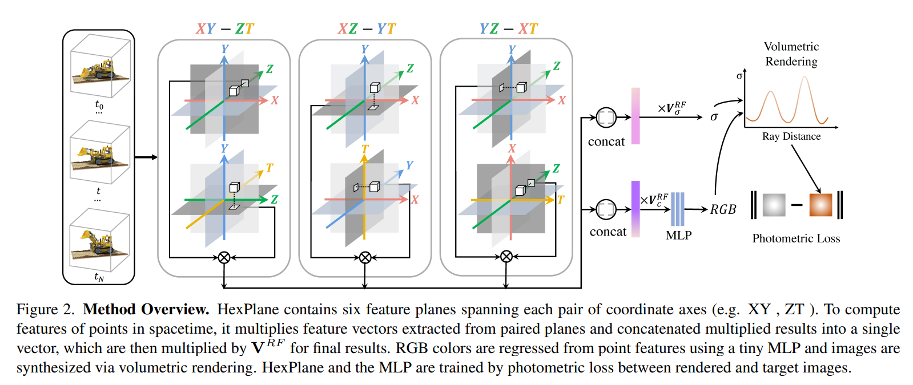

[9] Transforming Radiance Field with Lipschitz Network for Photorealistic 3D Scene Stylization

- 题目：使用Lipschitz网络转换辐射场以实现逼真的3D场景风格化
- 分类：逼真3D风格迁移
- Code: no
- Paper: https://arxiv.org/pdf/2303.13232.pdf
- 摘要： 

> *Recent advances in 3D scene representation and novel view synthesis have witnessed the rise of Neural Radiance Fields (NeRFs). Nevertheless, it is not trivial to exploit NeRF for the photorealistic 3D scene stylization task, which aims to generate visually consistent and photorealistic stylized scenes from novel views. Simply coupling NeRF with photorealistic style transfer (PST) will result in cross-view inconsistency and degradation of stylized view syntheses. Through a thorough analysis, we demonstrate that this non-trivial task can be simplified in a new light: When transforming the appearance representation of a pre-trained NeRF with Lipschitz mapping, the consistency and photorealism across source views will be seamlessly encoded into the syntheses. That motivates us to build a concise and flexible learning framework namely LipRF, which upgrades arbitrary 2D PST methods with Lipschitz mapping tailored for the 3D scene. Technically, LipRF first pre-trains a radiance field to reconstruct the 3D scene, and then emulates the style on each view by 2D PST as the prior to learn a Lipschitz network to stylize the pre-trained appearance. In view of that Lipschitz condition highly impacts the expressivity of the neural network, we devise an adaptive regularization to balance the reconstruction and stylization. A gradual gradient aggregation strategy is further introduced to optimize LipRF in a cost-efficient manner. We conduct extensive experiments to show the high quality and robust performance of LipRF on both photorealistic 3D stylization and object appearance editing.*

- 图示：

[10] PartNeRF: Generating Part-Aware Editable 3D Shapes without 3D Supervision

- 题目：PartNeRF：在没有3D监督的情况下生成部分感知可编辑的3D形状
- 分类：部分可编辑
- Project: https://ktertikas.github.io/part_nerf
- Code: https://github.com/ktertikas/part_nerf
- Paper: https://arxiv.org/pdf/2303.09554.pdf
- 摘要： 

> *Impressive progress in generative models and implicit representations gave rise to methods that can generate 3D shapes of high quality. However, being able to locally control and edit shapes is another essential property that can unlock several content creation applications. Local control can be achieved with part-aware models, but existing methods require 3D supervision and cannot produce textures. In this work, we devise PartNeRF, a novel part-aware generative model for editable 3D shape synthesis that does not require any explicit 3D supervision. Our model generates objects as a set of locally defined NeRFs, augmented with an affine transformation. This enables several editing operations such as applying transformations on parts, mixing parts from different objects etc. To ensure distinct, manipulable parts we enforce a hard assignment of rays to parts that makes sure that the color of each ray is only determined by a single NeRF. As a result, altering one part does not affect the appearance of the others. Evaluations on various ShapeNet categories demonstrate the ability of our model to generate editable 3D objects of improved fidelity, compared to previous part-based generative approaches that require 3D supervision or models relying on NeRFs.*

- 图示：

[11] Masked Wavelet Representation for Compact Neural Radiance Fields

- 题目：紧凑型神经辐射场的掩码小波表示
- 分类：节省内存
- Project: https://daniel03c1.github.io/masked_wavelet_nerf/
- Code: https://github.com/daniel03c1/masked_wavelet_nerf
- Paper: https://arxiv.org/pdf/2212.09069.pdf
- 摘要： 

> *Neural radiance fields (NeRF) have demonstrated the potential of coordinate-based neural representation (neural fields or implicit neural representation) in neural rendering. However, using a multi-layer perceptron (MLP) to represent a 3D scene or object requires enormous computational resources and time. There have been recent studies on how to reduce these computational inefficiencies by using additional data structures, such as grids or trees. Despite the promising performance, the explicit data structure necessitates a substantial amount of memory. In this work, we present a method to reduce the size without compromising the advantages of having additional data structures. In detail, we propose using the wavelet transform on grid-based neural fields. Grid-based neural fields are for fast convergence, and the wavelet transform, whose efficiency has been demonstrated in high-performance standard codecs, is to improve the parameter efficiency of grids. Furthermore, in order to achieve a higher sparsity of grid coefficients while maintaining reconstruction quality, we present a novel trainable masking approach. Experimental results demonstrate that non-spatial grid coefficients, such as wavelet coefficients, are capable of attaining a higher level of sparsity than spatial grid coefficients, resulting in a more compact representation. With our proposed mask and compression pipeline, we achieved state-of-the-art performance within a memory budget of 2 MB. Our code is available at [this https URL](https://github.com/daniel03c1/masked_wavelet_nerf).*

- 图示：

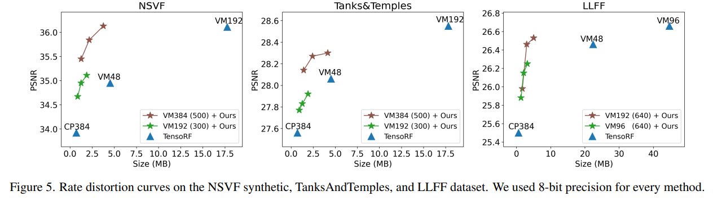

[12] Shape, Pose, and Appearance from a Single Image via Bootstrapped Radiance Field Inversion

- 题目：通过自举辐射场反演从单个图像中获取形状、姿势和外观
- 分类：单图3D重建
- Code: https://github.com/google-research/nerf-from-image
- Paper: https://arxiv.org/pdf/2211.11674.pdf
- 摘要： 

> *Neural Radiance Fields (NeRF) coupled with GANs represent a promising direction in the area of 3D reconstruction from a single view, owing to their ability to efficiently model arbitrary topologies. Recent work in this area, however, has mostly focused on synthetic datasets where exact ground-truth poses are known, and has overlooked pose estimation, which is important for certain downstream applications such as augmented reality (AR) and robotics. We introduce a principled end-to-end reconstruction framework for natural images, where accurate ground-truth poses are not available. Our approach recovers an SDF-parameterized 3D shape, pose, and appearance from a single image of an object, without exploiting multiple views during training. More specifically, we leverage an unconditional 3D-aware generator, to which we apply a hybrid inversion scheme where a model produces a first guess of the solution which is then refined via optimization. Our framework can de-render an image in as few as 10 steps, enabling its use in practical scenarios. We demonstrate state-of-the-art results on a variety of real and synthetic benchmarks.*

- 图示：

[13] NEF: Neural Edge Fields for 3D Parametric Curve Reconstruction from Multi-view Images

- 题目：NEF：用于从多视图图像重建3D参数曲线的神经边缘场
- 分类：3D边缘重建
- Project: https://yunfan1202.github.io/NEF/
- Code: https://github.com/yunfan1202/NEF_code
- Paper: https://arxiv.org/pdf/2303.07653.pdf
- 摘要： 

> *We study the problem of reconstructing 3D feature curves of an object from a set of calibrated multi-view images. To do so, we learn a neural implicit field representing the density distribution of 3D edges which we refer to as Neural Edge Field (NEF). Inspired by NeRF, NEF is optimized with a view-based rendering loss where a 2D edge map is rendered at a given view and is compared to the ground-truth edge map extracted from the image of that view. The rendering-based differentiable optimization of NEF fully exploits 2D edge detection, without needing a supervision of 3D edges, a 3D geometric operator or cross-view edge correspondence. Several technical designs are devised to ensure learning a range-limited and view-independent NEF for robust edge extraction. The final parametric 3D curves are extracted from NEF with an iterative optimization method. On our benchmark with synthetic data, we demonstrate that NEF outperforms existing state-of-the-art methods on all metrics. Project page: [this https URL](https://yunfan1202.github.io/NEF/).*

- 图示：

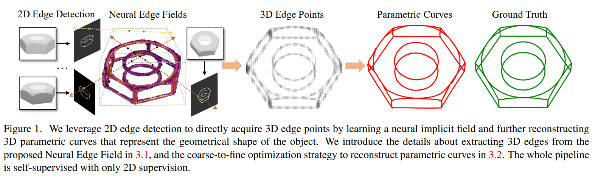

[14] NeuDA: Neural Deformable Anchor for High-Fidelity Implicit Surface Reconstruction

- 题目：NeuDA：用于高保真隐式表面重建的神经可变形锚
- 分类：保真表面重建
- Project: https://3d-front-future.github.io/neuda/
- Code: https://github.com/3D-FRONT-FUTURE/NeuDA, soon
- Paper: https://arxiv.org/pdf/2303.02375.pdf
- 摘要： 

> *This paper studies implicit surface reconstruction leveraging differentiable ray casting. Previous works such as IDR and NeuS overlook the spatial context in 3D space when predicting and rendering the surface, thereby may fail to capture sharp local topologies such as small holes and structures. To mitigate the limitation, we propose a flexible neural implicit representation leveraging hierarchical voxel grids, namely Neural Deformable Anchor (NeuDA), for high-fidelity surface reconstruction. NeuDA maintains the hierarchical anchor grids where each vertex stores a 3D position (or anchor) instead of the direct embedding (or feature). We optimize the anchor grids such that different local geometry structures can be adaptively encoded. Besides, we dig into the frequency encoding strategies and introduce a simple hierarchical positional encoding method for the hierarchical anchor structure to flexibly exploit the properties of high-frequency and low-frequency geometry and appearance. Experiments on both the DTU and BlendedMVS datasets demonstrate that NeuDA can produce promising mesh surfaces.*

- 图示：

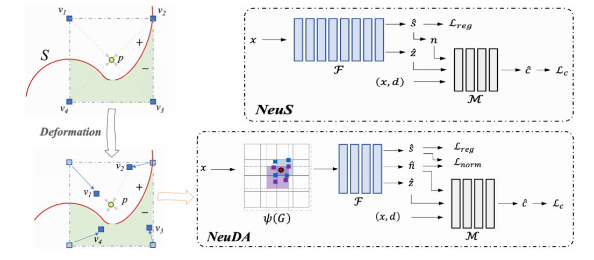

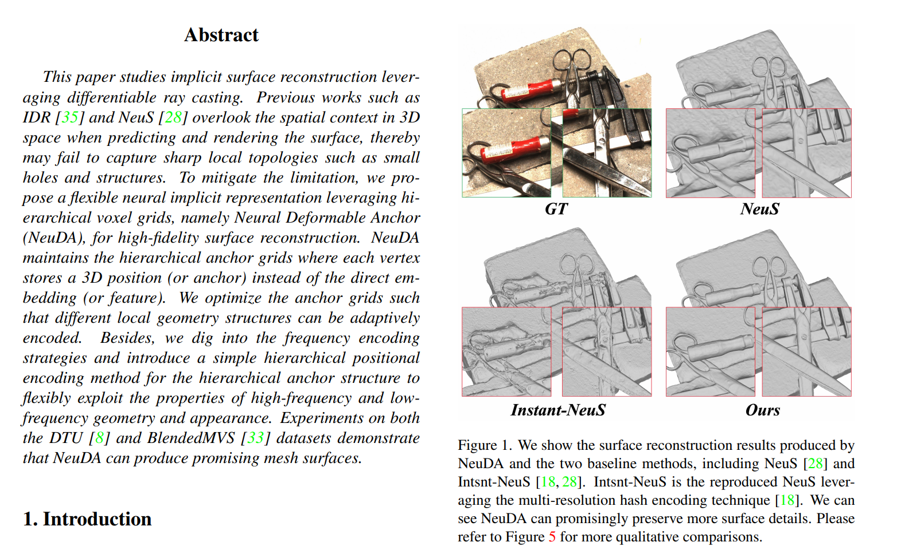

[15] FlexNeRF: Photorealistic Free-viewpoint Rendering of Moving Humans from Sparse Views

- 题目：FlexNeRF：从稀疏视图中移动人体的逼真自由视点渲染
- 分类：人物动态场景
- Project: https://flex-nerf.github.io/
- Code: no
- Paper: https://arxiv.org/pdf/2303.14368.pdf
- 摘要： 

> *We present FlexNeRF, a method for photorealistic freeviewpoint rendering of humans in motion from monocular videos. Our approach works well with sparse views, which is a challenging scenario when the subject is exhibiting fast/complex motions. We propose a novel approach which jointly optimizes a canonical time and pose configuration, with a pose-dependent motion field and pose-independent temporal deformations complementing each other. Thanks to our novel temporal and cyclic consistency constraints along with additional losses on intermediate representation such as segmentation, our approach provides high quality outputs as the observed views become sparser. We empirically demonstrate that our method significantly outperforms the state-of-the-art on public benchmark datasets as well as a self-captured fashion dataset. The project page is available at: [this https URL](https://flex-nerf.github.io/)*

- 图示：

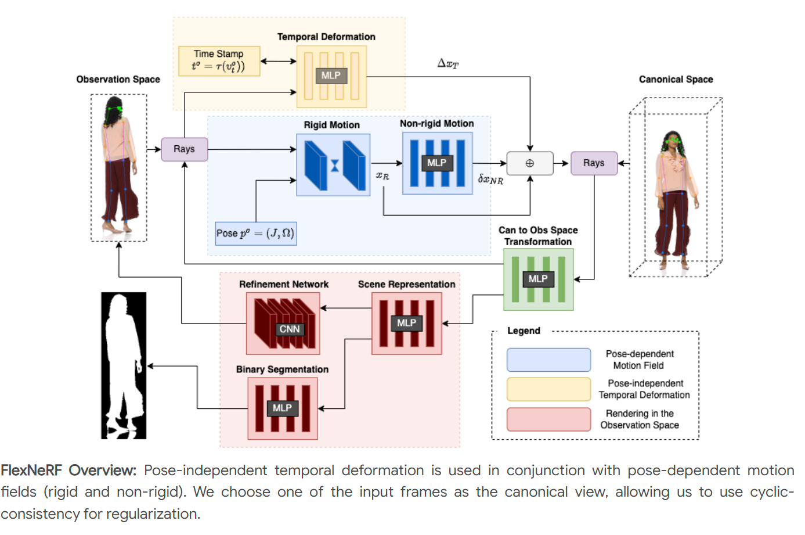

[16] DyLiN: Making Light Field Networks Dynamic

- 题目：DyLiN：使光场网络动态化
- 分类：动态场景
- Project: https://dylin2023.github.io/
- Code: https://github.com/Heng14/DyLiN
- Paper: https://arxiv.org/pdf/2303.14243.pdf
- 摘要： 

> *Light Field Networks, the re-formulations of radiance fields to oriented rays, are magnitudes faster than their coordinate network counterparts, and provide higher fidelity with respect to representing 3D structures from 2D observations. They would be well suited for generic scene representation and manipulation, but suffer from one problem: they are limited to holistic and static scenes. In this paper, we propose the Dynamic Light Field Network (DyLiN) method that can handle non-rigid deformations, including topological changes. We learn a deformation field from input rays to canonical rays, and lift them into a higher dimensional space to handle discontinuities. We further introduce CoDyLiN, which augments DyLiN with controllable attribute inputs. We train both models via knowledge distillation from pretrained dynamic radiance fields. We evaluated DyLiN using both synthetic and real world datasets that include various non-rigid deformations. DyLiN qualitatively outperformed and quantitatively matched state-of-the-art methods in terms of visual fidelity, while being 25 - 71x computationally faster. We also tested CoDyLiN on attribute annotated data and it surpassed its teacher model. Project page: [this https URL](https://dylin2023.github.io/) .*

- 图示：

[17] DiffRF: Rendering-Guided 3D Radiance Field Diffusion

- 题目：DiffRF：渲染引导的3D辐射场扩散
- 分类：扩散模型
- Project: https://sirwyver.github.io/DiffRF/
- Code: no
- Paper: https://arxiv.org/pdf/2212.01206.pdf
- 摘要： 

> *We introduce DiffRF, a novel approach for 3D radiance field synthesis based on denoising diffusion probabilistic models. While existing diffusion-based methods operate on images, latent codes, or point cloud data, we are the first to directly generate volumetric radiance fields. To this end, we propose a 3D denoising model which directly operates on an explicit voxel grid representation. However, as radiance fields generated from a set of posed images can be ambiguous and contain artifacts, obtaining ground truth radiance field samples is non-trivial. We address this challenge by pairing the denoising formulation with a rendering loss, enabling our model to learn a deviated prior that favours good image quality instead of trying to replicate fitting errors like floating artifacts. In contrast to 2D-diffusion models, our model learns multi-view consistent priors, enabling free-view synthesis and accurate shape generation. Compared to 3D GANs, our diffusion-based approach naturally enables conditional generation such as masked completion or single-view 3D synthesis at inference time.*

- 图示：

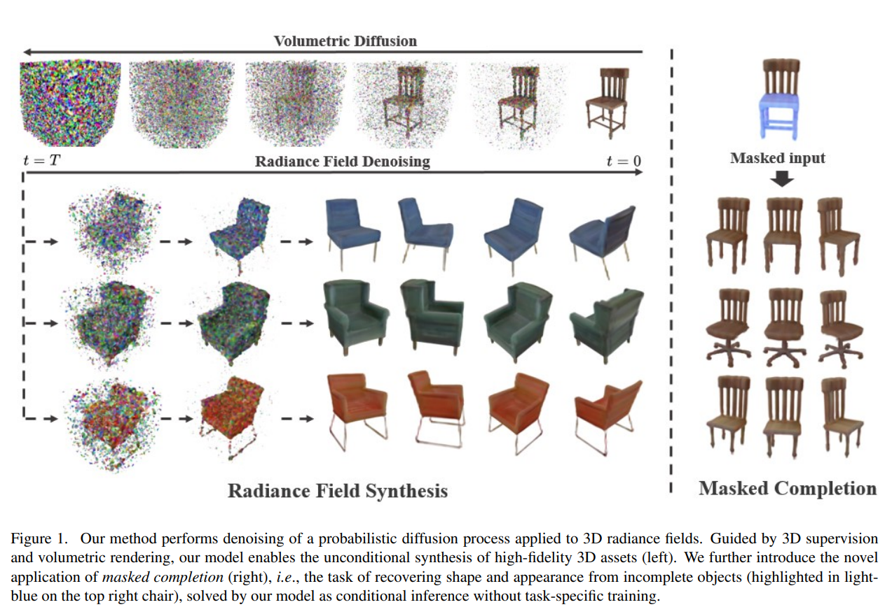

[18] JAWS: Just A Wild Shot for Cinematic Transfer in Neural Radiance Fields

- 题目：JAWS：只是神经辐射场中电影传输的疯狂镜头
- 分类：电影剪辑
- Project: https://www.lix.polytechnique.fr/vista/projects/2023_cvpr_wang/
- Code: https://github.com/robincourant/jaws, no
- Paper: https://arxiv.org/pdf/2303.15427.pdf
- 摘要： 

> *This paper presents JAWS, an optimization-driven approach that achieves the robust transfer of visual cinematic features from a reference in-the-wild video clip to a newly generated clip. To this end, we rely on an implicit-neural-representation (INR) in a way to compute a clip that shares the same cinematic features as the reference clip. We propose a general formulation of a camera optimization problem in an INR that computes extrinsic and intrinsic camera parameters as well as timing. By leveraging the differentiability of neural representations, we can back-propagate our designed cinematic losses measured on proxy estimators through a NeRF network to the proposed cinematic parameters directly. We also introduce specific enhancements such as guidance maps to improve the overall quality and efficiency. Results display the capacity of our system to replicate well known camera sequences from movies, adapting the framing, camera parameters and timing of the generated video clip to maximize the similarity with the reference clip.*

- 图示：

[19] Magic3D: High-Resolution Text-to-3D Content Creation

- 题目：Magic3D：高分辨率文本到3D内容创建
- 分类：Text-to-3D
- Project: https://research.nvidia.com/labs/dir/magic3d/
- Code: no
- Paper: https://arxiv.org/pdf/2211.10440.pdf
- 摘要： 

> *DreamFusion has recently demonstrated the utility of a pre-trained text-to-image diffusion model to optimize Neural Radiance Fields (NeRF), achieving remarkable text-to-3D synthesis results. However, the method has two inherent limitations: (a) extremely slow optimization of NeRF and (b) low-resolution image space supervision on NeRF, leading to low-quality 3D models with a long processing time. In this paper, we address these limitations by utilizing a two-stage optimization framework. First, we obtain a coarse model using a low-resolution diffusion prior and accelerate with a sparse 3D hash grid structure. Using the coarse representation as the initialization, we further optimize a textured 3D mesh model with an efficient differentiable renderer interacting with a high-resolution latent diffusion model. Our method, dubbed Magic3D, can create high quality 3D mesh models in 40 minutes, which is 2x faster than DreamFusion (reportedly taking 1.5 hours on average), while also achieving higher resolution. User studies show 61.7% raters to prefer our approach over DreamFusion. Together with the image-conditioned generation capabilities, we provide users with new ways to control 3D synthesis, opening up new avenues to various creative applications.*

- 图示：

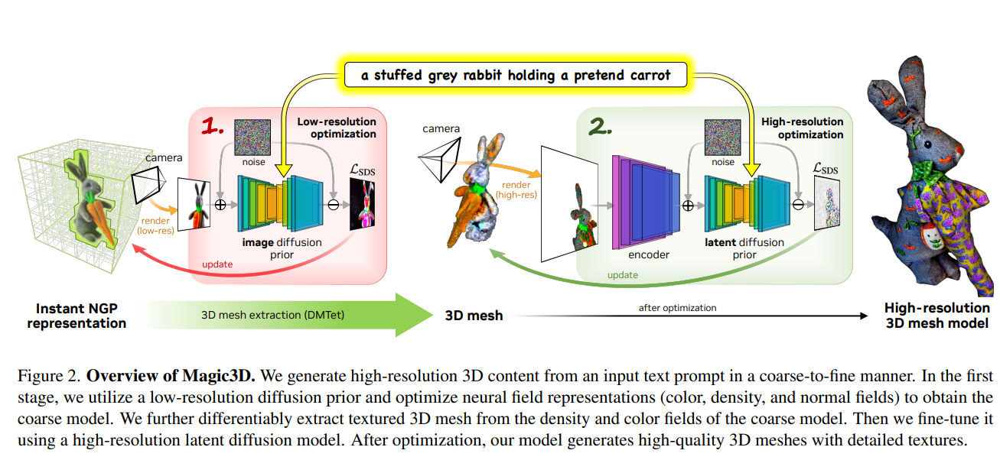

[20] SUDS: Scalable Urban Dynamic Scenes

- 题目：SUDS：可扩展的城市动态场景
- 分类：城市动态场景
- Project: https://haithemturki.com/suds/
- Code: https://github.com/hturki/suds
- Paper: https://arxiv.org/pdf/2303.14536.pdf
- 摘要： 

> *We extend neural radiance fields (NeRFs) to dynamic large-scale urban scenes. Prior work tends to reconstruct single video clips of short durations (up to 10 seconds). Two reasons are that such methods (a) tend to scale linearly with the number of moving objects and input videos because a separate model is built for each and (b) tend to require supervision via 3D bounding boxes and panoptic labels, obtained manually or via category-specific models. As a step towards truly open-world reconstructions of dynamic cities, we introduce two key innovations: (a) we factorize the scene into three separate hash table data structures to efficiently encode static, dynamic, and far-field radiance fields, and (b) we make use of unlabeled target signals consisting of RGB images, sparse LiDAR, off-the-shelf self-supervised 2D descriptors, and most importantly, 2D optical flow.
> Operationalizing such inputs via photometric, geometric, and feature-metric reconstruction losses enables SUDS to decompose dynamic scenes into the static background, individual objects, and their motions. When combined with our multi-branch table representation, such reconstructions can be scaled to tens of thousands of objects across 1.2 million frames from 1700 videos spanning geospatial footprints of hundreds of kilometers, (to our knowledge) the largest dynamic NeRF built to date.
> We present qualitative initial results on a variety of tasks enabled by our representations, including novel-view synthesis of dynamic urban scenes, unsupervised 3D instance segmentation, and unsupervised 3D cuboid detection. To compare to prior work, we also evaluate on KITTI and Virtual KITTI 2, surpassing state-of-the-art methods that rely on ground truth 3D bounding box annotations while being 10x quicker to train.*

- 图示：

[21] NeRF-DS: Neural Radiance Fields for Dynamic Specular Objects

- 题目：NeRF-DS：动态镜面物体的神经辐射场
- 分类：动态镜面物体
- Code: https://github.com/JokerYan/NeRF-DS
- Paper: https://arxiv.org/pdf/2303.14435.pdf
- 摘要： 

> *Dynamic Neural Radiance Field (NeRF) is a powerful algorithm capable of rendering photo-realistic novel view images from a monocular RGB video of a dynamic scene. Although it warps moving points across frames from the observation spaces to a common canonical space for rendering, dynamic NeRF does not model the change of the reflected color during the warping. As a result, this approach often fails drastically on challenging specular objects in motion. We address this limitation by reformulating the neural radiance field function to be conditioned on surface position and orientation in the observation space. This allows the specular surface at different poses to keep the different reflected colors when mapped to the common canonical space. Additionally, we add the mask of moving objects to guide the deformation field. As the specular surface changes color during motion, the mask mitigates the problem of failure to find temporal correspondences with only RGB supervision. We evaluate our model based on the novel view synthesis quality with a self-collected dataset of different moving specular objects in realistic environments. The experimental results demonstrate that our method significantly improves the reconstruction quality of moving specular objects from monocular RGB videos compared to the existing NeRF models. Our code and data are available at the project website [this https URL](https://github.com/JokerYan/NeRF-DS).*

- 图示：

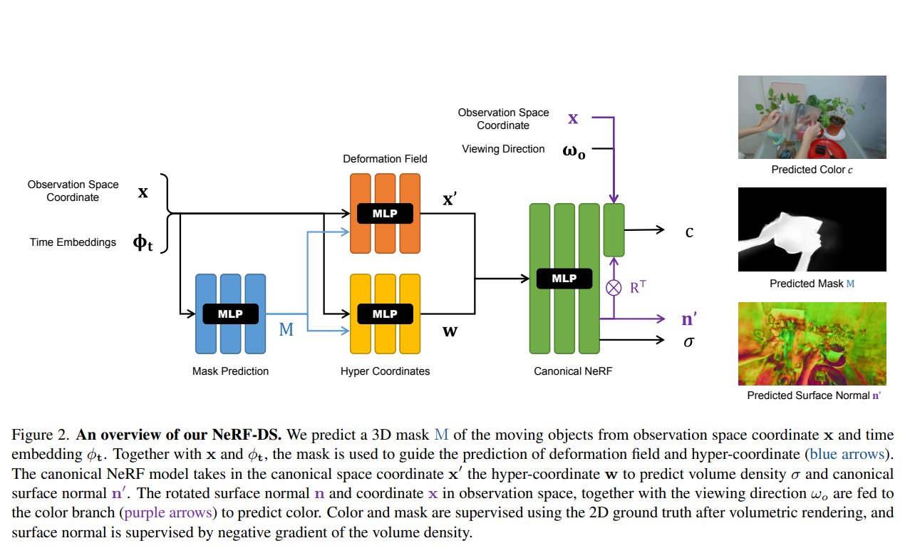

[22] Ref-NPR: Reference-Based Non-Photorealistic Radiance Fields for Controllable Scene Stylization

- 题目：Ref-NPR：用于可控场景风格化的基于参考的非真实感辐射场
- 分类：3D场景风格化
- Project: https://ref-npr.github.io/
- Code: https://github.com/dvlab-research/Ref-NPR
- Paper: https://arxiv.org/pdf/2212.02766.pdf
- 摘要： 

> *Current 3D scene stylization methods transfer textures and colors as styles using arbitrary style references, lacking meaningful semantic correspondences. We introduce Reference-Based Non-Photorealistic Radiance Fields (Ref-NPR) to address this limitation. This controllable method stylizes a 3D scene using radiance fields with a single stylized 2D view as a reference. We propose a ray registration process based on the stylized reference view to obtain pseudo-ray supervision in novel views. Then we exploit semantic correspondences in content images to fill occluded regions with perceptually similar styles, resulting in non-photorealistic and continuous novel view sequences. Our experimental results demonstrate that Ref-NPR outperforms existing scene and video stylization methods regarding visual quality and semantic correspondence. The code and data are publicly available on the project page at [this https URL](https://ref-npr.github.io/).*

- 图示：

[23] Interactive Segmentation of Radiance Fields

- 题目：辐射场的交互式分割
- 分类：交互式场景分割
- Project: https://rahul-goel.github.io/isrf/
- Code: https://github.com/rahul-goel/isrf_code
- Paper: https://arxiv.org/pdf/2212.13545.pdf
- 摘要： 

> *Radiance Fields (RF) are popular to represent casually-captured scenes for new view synthesis and several applications beyond it. Mixed reality on personal spaces needs understanding and manipulating scenes represented as RFs, with semantic segmentation of objects as an important step. Prior segmentation efforts show promise but don't scale to complex objects with diverse appearance. We present the ISRF method to interactively segment objects with fine structure and appearance. Nearest neighbor feature matching using distilled semantic features identifies high-confidence seed regions. Bilateral search in a joint spatio-semantic space grows the region to recover accurate segmentation. We show state-of-the-art results of segmenting objects from RFs and compositing them to another scene, changing appearance, etc., and an interactive segmentation tool that others can use.
> Project Page: [this https URL](https://rahul-goel.github.io/isrf/)*

- 图示：

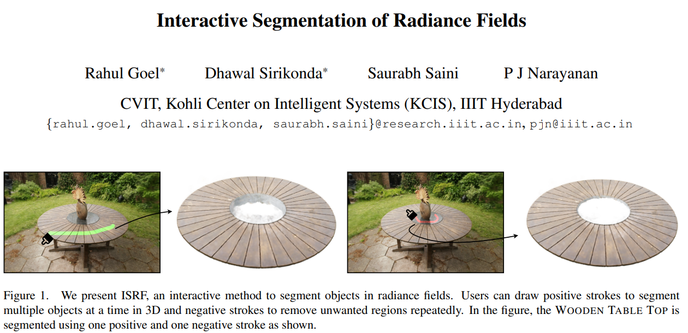

[24] 

- 题目：
- 分类：
- Code: 
- Paper: 
- 摘要： 

> 

- 图示：

[25] 

- 题目：
- 分类：
- Code: 
- Paper: 
- 摘要： 

> 

- 图示：

[26] 

- 题目：
- 分类：
- Code: 
- Paper: 
- 摘要： 

> 

- 图示：

[27] 

- 题目：
- 分类：
- Code: 
- Paper: 
- 摘要： 

> 

- 图示：

[28] 

- 题目：
- 分类：
- Code: 
- Paper: 
- 摘要： 

> 

- 图示：

[29] 

- 题目：
- 分类：
- Code: 
- Paper: 
- 摘要： 

> 

- 图示：

[30] 

- 题目：
- 分类：
- Code: 
- Paper: 
- 摘要： 

> 

- 图示：

[31] 

- 题目：
- 分类：
- Code: 
- Paper: 
- 摘要： 

> 

- 图示：

[32] 

- 题目：
- 分类：
- Code: 
- Paper: 
- 摘要： 

> 

- 图示：

[33] 

- 题目：
- 分类：
- Code: 
- Paper: 
- 摘要： 

> 

- 图示：

[34] 

- 题目：
- 分类：
- Code: 
- Paper: 
- 摘要： 

> 

- 图示：

[35] 

- 题目：
- 分类：
- Code: 
- Paper: 
- 摘要： 

> 

- 图示：

[36] 

- 题目：
- 分类：
- Code: 
- Paper: 
- 摘要： 

> 

- 图示：

[37] 

- 题目：
- 分类：
- Code: 
- Paper: 
- 摘要： 

> 

- 图示：

[38] 

- 题目：
- 分类：
- Code: 
- Paper: 
- 摘要： 

> 

- 图示：

[39] 

- 题目：
- 分类：
- Code: 
- Paper: 
- 摘要： 

> 

- 图示：

[40] 

- 题目：
- 分类：
- Code: 
- Paper: 
- 摘要： 

> 

- 图示：

[41] 

- 题目：
- 分类：
- Code: 
- Paper: 
- 摘要： 

> 

- 图示：

[42] 

- 题目：
- 分类：
- Code: 
- Paper: 
- 摘要： 

> 

- 图示：

[43] 

- 题目：
- 分类：
- Code: 
- Paper: 
- 摘要： 

> 

- 图示：

[44] 

- 题目：
- 分类：
- Code: 
- Paper: 
- 摘要： 

> 

- 图示：

[45] 

- 题目：
- 分类：
- Code: 
- Paper: 
- 摘要： 

> 

- 图示：

[46] 

- 题目：
- 分类：
- Code: 
- Paper: 
- 摘要： 

> 

- 图示：