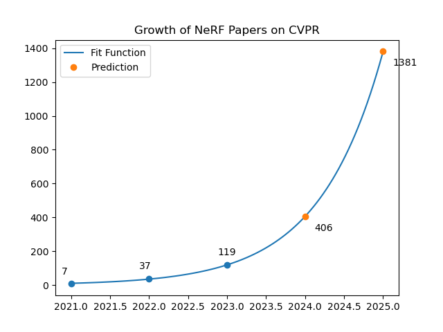

# All NeRF-related Papers on CVPR/ICCV/ECCV/ICML/NIPS/ICLR

## [NeRFs-CVPR2023: 121:computer_mouse:](https://github.com/lif314/NeRFs-CVPR2023/blob/main/NeRFs-CVPR2023.md)

## [NeRFs-ICLR2023: 15 :computer_mouse:  ](https://github.com/lif314/NeRFs-CVPR2023/blob/main/NeRFs-ICLR.md)

## [NeRFs-ICCV2023: 15+?:computer_mouse:  ](https://github.com/lif314/NeRFs-CVPR2023/blob/main/NeRFs-ICCV2023.md)

- NeRF at CVPR: 

  - [NeRFs-CVPR2021: 7](https://github.com/lif314/NeRFs-CVPR2023/blob/main/NeRFs-CVPR2021.md)
  - [NeRFs-CVPR2022: 37](https://github.com/lif314/NeRFs-CVPR2023/blob/main/NeRFs-CVPR2022.md)
  - [NeRFs-CVPR2023: 120](https://github.com/lif314/NeRFs-CVPR2023/blob/main/NeRFs-CVPR2023.md)

  

- NeRF at NIPS：[NeRFs-NIPS: 17](https://github.com/lif314/NeRFs-CVPR2023/blob/main/NeRFs-NIPS.md)

- NeRF at ICML: [NeRFs-ICML: 3](https://github.com/lif314/NeRFs-CVPR2023/blob/main/NeRFs-ICML.md)

- NeRF at ICLR: [NeRFs-ICLR: 17](https://github.com/lif314/NeRFs-CVPR2023/blob/main/NeRFs-ICLR.md)

- NeRF at ICCV: 

  - [NeRFs-ICCV2021: 23](https://github.com/lif314/NeRFs-CVPR2023/blob/main/NeRFs-ICCV2021.md)

  - [NeRFs-ICCV2023: ?](https://github.com/lif314/NeRFs-CVPR2023/blob/main/NeRFs-ICCV2023.md)

- NeRF at ECCV: 

  - [NeRFs-ECCV2022: 28](https://github.com/lif314/NeRFs-CVPR2023/blob/main/NeRFs-ECCV2022.md)
  - [NeRFs-ECCV2020: 1(开山之作)](https://github.com/lif314/NeRFs-CVPR2023/blob/main/NeRF-ECCV2020.md)

- Awesome summaries:

  - [NeRF Explosion 2020](https://dellaert.github.io/NeRF/)
  - [NeRF at ICCV 2021](https://dellaert.github.io/NeRF21/)
  - [NeRF at CVPR 2022](https://dellaert.github.io/NeRF22/)
  - [NeRF at NeurIPS 2022](https://markboss.me/post/nerf_at_neurips22/)
  - [NeRF at ECCV 2022](https://markboss.me/post/nerf_at_eccv22/)
  - [NeRF at CVPR 2023](https://markboss.me/post/nerf_at_cvpr23/)

## Stargazers over time

